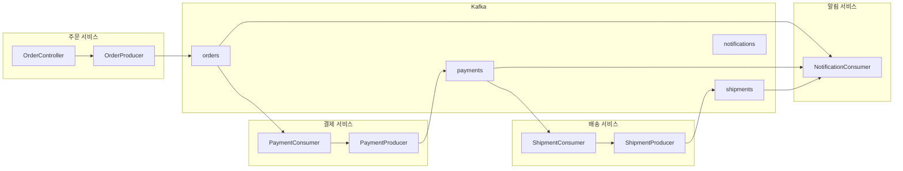

마이크로서비스 환경에서 Kafka를 활용한 이벤트 기반 통신을 구현합니다.


- **이벤트 체이닝**: 주문 -> 결제 -> 배송 -> 알림 순서로 이벤트 전파
- **Correlation ID**: 분산 추적을 위한 상관 ID 전파
- **Saga 패턴**: 보상 트랜잭션으로 분산 트랜잭션 처리
- **멱등성**: 중복 메시지 안전하게 처리


#### 대상 독자 및 선수 지식

| 항목 | 설명 |
|------|------|
| **대상 독자** | 마이크로서비스 아키텍처에서 이벤트 기반 통신을 구축하려는 개발자 |
| **선수 지식** | Kafka 기본, Spring Boot, [주문 시스템]() 예제 이해 |
| **필수 환경** | Docker, JDK 17+, 여러 서비스를 실행할 수 있는 환경 |
| **예상 소요 시간** | 약 60분 |

#### 시나리오: 주문 처리 시스템

이 예제에서는 주문 서비스, 결제 서비스, 배송 서비스, 알림 서비스가 Kafka를 통해 이벤트를 주고받습니다. 주문 서비스가 주문을 생성하면 orders Topic에 이벤트를 발행합니다. 결제 서비스가 이를 수신하여 결제를 처리하고 payments Topic에 결과를 발행합니다. 배송 서비스는 결제 완료 이벤트를 수신하여 배송을 생성합니다. 알림 서비스는 모든 Topic을 구독하여 고객에게 알림을 발송합니다.



*[다이어그램 설명: 주문 서비스가 orders Topic에 이벤트를 발행하면 결제 서비스가 수신합니다. 결제 서비스는 payments Topic에 결과를 발행하고, 배송 서비스가 이를 수신하여 shipments Topic에 발행합니다. 알림 서비스는 모든 Topic을 구독합니다.]*

#### 공통 이벤트 정의

**이벤트 스키마**

모든 이벤트는 BaseEvent를 상속합니다. eventId는 이벤트 고유 식별자, eventType은 이벤트 유형, occurredAt은 발생 시각, correlationId는 분산 추적을 위한 상관 ID입니다.

```java
public abstract class BaseEvent {
    private String eventId;
    private String eventType;
    private LocalDateTime occurredAt;
    private String correlationId;  // 추적용 ID
}

public class OrderCreatedEvent extends BaseEvent {
    private String orderId;
    private String customerId;
    private List<OrderItem> items;
    private BigDecimal totalAmount;
    private String shippingAddress;
}

public class PaymentCompletedEvent extends BaseEvent {
    private String paymentId;
    private String orderId;
    private BigDecimal amount;
    private PaymentMethod method;
    private PaymentStatus status;
}

public class ShipmentCreatedEvent extends BaseEvent {
    private String shipmentId;
    private String orderId;
    private String trackingNumber;
    private String carrier;
    private LocalDateTime estimatedDelivery;
}
```


- **BaseEvent 상속**: eventId, eventType, occurredAt, correlationId 공통 필드
- **correlationId**: 분산 추적을 위해 모든 이벤트에 전파
- **도메인별 이벤트**: OrderCreatedEvent, PaymentCompletedEvent, ShipmentCreatedEvent 등


#### 주문 서비스 (Order Service)

**application.yml**

주문 서비스는 acks=all과 enable.idempotence=true로 설정하여 메시지 전송의 신뢰성을 높입니다. spring.json.type.mapping은 이벤트 클래스 매핑을 정의합니다.

```yaml
spring:
  application:
    name: order-service
  kafka:
    bootstrap-servers: localhost:9092
    producer:
      key-serializer: org.apache.kafka.common.serialization.StringSerializer
      value-serializer: org.springframework.kafka.support.serializer.JsonSerializer
      acks: all
      properties:
        enable.idempotence: true
    properties:
      spring.json.type.mapping: >
        orderCreated:com.example.events.OrderCreatedEvent

kafka:
  topics:
    orders: orders
```

**OrderProducer**

OrderProducer는 주문 생성 시 OrderCreatedEvent를 발행합니다. orderId를 Key로 사용하여 같은 주문의 이벤트가 순서대로 처리되도록 보장합니다.

```java
@Service
@RequiredArgsConstructor
@Slf4j
public class OrderProducer {
    private final KafkaTemplate<String, Object> kafkaTemplate;

    @Value("${kafka.topics.orders}")
    private String ordersTopic;

    public CompletableFuture<SendResult<String, Object>> publishOrderCreated(Order order) {
        OrderCreatedEvent event = OrderCreatedEvent.builder()
            .eventId(UUID.randomUUID().toString())
            .eventType("ORDER_CREATED")
            .occurredAt(LocalDateTime.now())
            .correlationId(order.getCorrelationId())
            .orderId(order.getId())
            .customerId(order.getCustomerId())
            .items(order.getItems())
            .totalAmount(order.getTotalAmount())
            .shippingAddress(order.getShippingAddress())
            .build();

        return kafkaTemplate.send(ordersTopic, order.getId(), event)
            .whenComplete((result, ex) -> {
                if (ex != null) {
                    log.error("주문 이벤트 발행 실패: orderId={}", order.getId(), ex);
                } else {
                    log.info("주문 이벤트 발행: orderId={}, partition={}, offset={}",
                        order.getId(),
                        result.getRecordMetadata().partition(),
                        result.getRecordMetadata().offset());
                }
            });
    }
}
```

**OrderController**

OrderController는 REST API로 주문을 받아 로컬 DB에 저장하고, 이벤트를 비동기로 발행한 후 즉시 응답을 반환합니다.

```java
@RestController
@RequestMapping("/api/orders")
@RequiredArgsConstructor
public class OrderController {
    private final OrderService orderService;
    private final OrderProducer orderProducer;

    @PostMapping
    public ResponseEntity<OrderResponse> createOrder(@RequestBody CreateOrderRequest request) {
        // 1. 주문 생성 (로컬 DB 저장)
        Order order = orderService.createOrder(request);

        // 2. 이벤트 발행 (비동기)
        orderProducer.publishOrderCreated(order);

        // 3. 응답 반환
        return ResponseEntity.status(HttpStatus.CREATED)
            .body(OrderResponse.from(order));
    }
}
```


- **신뢰성 설정**: `acks: all`, `enable.idempotence: true`로 메시지 안정성 확보
- **비동기 발행**: 로컬 DB 저장 후 이벤트 발행, 즉시 응답 반환
- **orderId Key**: 같은 주문 이벤트의 순서 보장


#### 결제 서비스 (Payment Service)

**PaymentConsumer**

PaymentConsumer는 orders Topic을 구독하여 주문 이벤트를 수신합니다. 멱등성 체크로 중복 처리를 방지하고, 결제 성공 시 PaymentCompletedEvent를, 실패 시 PaymentFailedEvent를 발행합니다.

```java
@Service
@RequiredArgsConstructor
@Slf4j
public class PaymentConsumer {
    private final PaymentService paymentService;
    private final PaymentProducer paymentProducer;

    @KafkaListener(
        topics = "${kafka.topics.orders}",
        groupId = "payment-service-group",
        containerFactory = "kafkaListenerContainerFactory"
    )
    public void handleOrderCreated(
        @Payload OrderCreatedEvent event,
        @Header(KafkaHeaders.RECEIVED_KEY) String key,
        @Header(KafkaHeaders.RECEIVED_PARTITION) int partition,
        Acknowledgment ack
    ) {
        log.info("주문 이벤트 수신: orderId={}, partition={}", event.getOrderId(), partition);

        try {
            // 멱등성 체크
            if (paymentService.isAlreadyProcessed(event.getOrderId())) {
                log.warn("이미 처리된 주문: orderId={}", event.getOrderId());
                ack.acknowledge();
                return;
            }

            // 결제 처리
            Payment payment = paymentService.processPayment(
                event.getOrderId(),
                event.getCustomerId(),
                event.getTotalAmount(),
                event.getCorrelationId()
            );

            // 결제 완료 이벤트 발행
            paymentProducer.publishPaymentCompleted(payment, event.getCorrelationId());

            ack.acknowledge();
            log.info("결제 처리 완료: orderId={}, paymentId={}", event.getOrderId(), payment.getId());

        } catch (PaymentFailedException e) {
            log.error("결제 실패: orderId={}", event.getOrderId(), e);
            paymentProducer.publishPaymentFailed(event.getOrderId(), e.getMessage(), event.getCorrelationId());
            ack.acknowledge();

        } catch (Exception e) {
            log.error("결제 처리 중 오류: orderId={}", event.getOrderId(), e);
            throw e;  // 재시도
        }
    }
}
```

**PaymentProducer**

PaymentProducer는 결제 결과에 따라 PaymentCompletedEvent 또는 PaymentFailedEvent를 발행합니다.

```java
@Service
@RequiredArgsConstructor
@Slf4j
public class PaymentProducer {
    private final KafkaTemplate<String, Object> kafkaTemplate;

    @Value("${kafka.topics.payments}")
    private String paymentsTopic;

    public void publishPaymentCompleted(Payment payment, String correlationId) {
        PaymentCompletedEvent event = PaymentCompletedEvent.builder()
            .eventId(UUID.randomUUID().toString())
            .eventType("PAYMENT_COMPLETED")
            .occurredAt(LocalDateTime.now())
            .correlationId(correlationId)
            .paymentId(payment.getId())
            .orderId(payment.getOrderId())
            .amount(payment.getAmount())
            .method(payment.getMethod())
            .status(PaymentStatus.COMPLETED)
            .build();

        kafkaTemplate.send(paymentsTopic, payment.getOrderId(), event);
    }

    public void publishPaymentFailed(String orderId, String reason, String correlationId) {
        PaymentFailedEvent event = PaymentFailedEvent.builder()
            .eventId(UUID.randomUUID().toString())
            .eventType("PAYMENT_FAILED")
            .occurredAt(LocalDateTime.now())
            .correlationId(correlationId)
            .orderId(orderId)
            .reason(reason)
            .build();

        kafkaTemplate.send(paymentsTopic, orderId, event);
    }
}
```


- **멱등성 체크**: `isAlreadyProcessed()`로 중복 처리 방지
- **성공/실패 분기**: 결과에 따라 PaymentCompleted 또는 PaymentFailed 이벤트 발행
- **correlationId 전파**: 원본 이벤트의 correlationId를 새 이벤트에 포함


#### 배송 서비스 (Shipment Service)

**ShipmentConsumer**

ShipmentConsumer는 payments Topic을 구독하여 결제 완료 이벤트만 처리합니다. 결제 실패 이벤트는 무시합니다.

```java
@Service
@RequiredArgsConstructor
@Slf4j
public class ShipmentConsumer {
    private final ShipmentService shipmentService;
    private final ShipmentProducer shipmentProducer;

    @KafkaListener(
        topics = "${kafka.topics.payments}",
        groupId = "shipment-service-group"
    )
    public void handlePaymentCompleted(
        @Payload PaymentCompletedEvent event,
        Acknowledgment ack
    ) {
        // 결제 완료 이벤트만 처리
        if (event.getStatus() != PaymentStatus.COMPLETED) {
            ack.acknowledge();
            return;
        }

        log.info("결제 완료 이벤트 수신: orderId={}", event.getOrderId());

        try {
            // 배송 생성
            Shipment shipment = shipmentService.createShipment(
                event.getOrderId(),
                event.getCorrelationId()
            );

            // 배송 생성 이벤트 발행
            shipmentProducer.publishShipmentCreated(shipment, event.getCorrelationId());

            ack.acknowledge();
            log.info("배송 생성 완료: orderId={}, shipmentId={}", event.getOrderId(), shipment.getId());

        } catch (Exception e) {
            log.error("배송 생성 실패: orderId={}", event.getOrderId(), e);
            throw e;
        }
    }
}
```


- **이벤트 필터링**: PaymentStatus.COMPLETED인 경우만 처리
- **체이닝**: 결제 완료 이벤트 수신 -> 배송 생성 -> 배송 이벤트 발행
- **에러 전파**: 예외 발생 시 throw하여 재시도 유도


#### 알림 서비스 (Notification Service)

**NotificationConsumer**

알림 서비스는 여러 Topic을 동시에 구독하여 모든 이벤트에 대해 고객 알림을 발송합니다. eventType 헤더로 이벤트 유형을 구분합니다.

```java
@Service
@RequiredArgsConstructor
@Slf4j
public class NotificationConsumer {
    private final NotificationService notificationService;

    @KafkaListener(
        topics = {"${kafka.topics.orders}", "${kafka.topics.payments}", "${kafka.topics.shipments}"},
        groupId = "notification-service-group"
    )
    public void handleEvent(
        @Payload String payload,
        @Header(KafkaHeaders.RECEIVED_TOPIC) String topic,
        @Header("eventType") String eventType,
        Acknowledgment ack
    ) {
        log.info("이벤트 수신: topic={}, type={}", topic, eventType);

        try {
            NotificationRequest notification = switch (eventType) {
                case "ORDER_CREATED" -> createOrderNotification(payload);
                case "PAYMENT_COMPLETED" -> createPaymentNotification(payload);
                case "PAYMENT_FAILED" -> createPaymentFailedNotification(payload);
                case "SHIPMENT_CREATED" -> createShipmentNotification(payload);
                default -> {
                    log.warn("알 수 없는 이벤트 타입: {}", eventType);
                    yield null;
                }
            };

            if (notification != null) {
                notificationService.send(notification);
            }

            ack.acknowledge();

        } catch (Exception e) {
            log.error("알림 처리 실패: topic={}, type={}", topic, eventType, e);
            ack.acknowledge();  // 알림 실패는 재시도하지 않음
        }
    }
}
```


- **다중 Topic 구독**: orders, payments, shipments Topic 동시 구독
- **eventType 헤더**: 이벤트 유형별 알림 내용 분기
- **실패 허용**: 알림 실패는 acknowledge 후 재시도하지 않음 (비핵심 기능)


#### Saga 패턴: 분산 트랜잭션

마이크로서비스 환경에서는 여러 서비스에 걸친 트랜잭션을 처리해야 합니다. Saga 패턴은 각 서비스가 자체 트랜잭션을 관리하고, 실패 시 보상 트랜잭션을 실행하여 일관성을 유지합니다.

**보상 트랜잭션 구현**

OrderSagaOrchestrator는 결제 실패나 배송 실패 이벤트를 수신하여 주문을 취소하고 필요한 경우 환불을 요청합니다.

```java
@Service
@RequiredArgsConstructor
@Slf4j
public class OrderSagaOrchestrator {
    private final OrderRepository orderRepository;
    private final KafkaTemplate<String, Object> kafkaTemplate;

    @KafkaListener(topics = "${kafka.topics.payments}", groupId = "order-saga-group")
    public void handlePaymentEvent(@Payload String payload, @Header("eventType") String eventType) {
        if ("PAYMENT_FAILED".equals(eventType)) {
            PaymentFailedEvent event = parseEvent(payload, PaymentFailedEvent.class);
            compensateOrder(event.getOrderId(), event.getReason());
        }
    }

    @KafkaListener(topics = "${kafka.topics.shipments}", groupId = "order-saga-group")
    public void handleShipmentEvent(@Payload String payload, @Header("eventType") String eventType) {
        if ("SHIPMENT_FAILED".equals(eventType)) {
            ShipmentFailedEvent event = parseEvent(payload, ShipmentFailedEvent.class);
            compensateOrderAndPayment(event.getOrderId(), event.getReason());
        }
    }

    private void compensateOrder(String orderId, String reason) {
        log.info("주문 보상 트랜잭션 실행: orderId={}, reason={}", orderId, reason);

        Order order = orderRepository.findById(orderId).orElseThrow();
        order.cancel(reason);
        orderRepository.save(order);

        kafkaTemplate.send("orders", orderId, OrderCancelledEvent.builder()
            .orderId(orderId)
            .reason(reason)
            .build());
    }

    private void compensateOrderAndPayment(String orderId, String reason) {
        compensateOrder(orderId, reason);

        kafkaTemplate.send("refunds", orderId, RefundRequestedEvent.builder()
            .orderId(orderId)
            .reason(reason)
            .build());
    }
}
```


- **보상 트랜잭션**: 실패 이벤트 수신 시 이전 작업 취소 (주문 취소, 환불 요청)
- **이벤트 리스닝**: 결제 실패, 배송 실패 이벤트 구독하여 보상 처리
- **데이터 일관성**: 분산 환경에서 최종 일관성(Eventual Consistency) 유지


#### 모니터링: 분산 추적

**Correlation ID 전파**

분산 환경에서 요청을 추적하려면 Correlation ID를 모든 이벤트에 전파해야 합니다. ProducerInterceptor를 사용하면 모든 메시지에 자동으로 추적 헤더를 추가할 수 있습니다.

```java
public class TracingProducerInterceptor implements ProducerInterceptor<String, Object> {

    @Override
    public ProducerRecord<String, Object> onSend(ProducerRecord<String, Object> record) {
        String correlationId = MDC.get("correlationId");
        if (correlationId == null) {
            correlationId = UUID.randomUUID().toString();
        }

        record.headers().add("correlationId", correlationId.getBytes(StandardCharsets.UTF_8));
        record.headers().add("serviceName", "order-service".getBytes(StandardCharsets.UTF_8));
        record.headers().add("timestamp", Instant.now().toString().getBytes(StandardCharsets.UTF_8));

        return record;
    }
}
```

**Consumer Lag 모니터링**

Consumer Lag은 마이크로서비스 상태를 파악하는 중요한 지표입니다. Lag이 증가하면 Consumer가 메시지를 제때 처리하지 못하고 있음을 의미합니다.

```java
@Component
@RequiredArgsConstructor
@Slf4j
public class ConsumerLagMonitor {
    private final KafkaAdmin kafkaAdmin;
    private final MeterRegistry meterRegistry;

    @Scheduled(fixedRate = 30000)
    public void checkConsumerLag() {
        try (AdminClient adminClient = AdminClient.create(kafkaAdmin.getConfigurationProperties())) {
            ListConsumerGroupOffsetsResult offsetsResult =
                adminClient.listConsumerGroupOffsets("payment-service-group");

            Map<TopicPartition, OffsetAndMetadata> offsets =
                offsetsResult.partitionsToOffsetAndMetadata().get();

            offsets.forEach((tp, offset) -> {
                long currentOffset = offset.offset();
                long endOffset = getEndOffset(adminClient, tp);
                long lag = endOffset - currentOffset;

                meterRegistry.gauge("kafka.consumer.lag",
                    Tags.of("topic", tp.topic(), "partition", String.valueOf(tp.partition())),
                    lag);

                if (lag > 1000) {
                    log.warn("Consumer lag 경고: topic={}, partition={}, lag={}",
                        tp.topic(), tp.partition(), lag);
                }
            });
        } catch (Exception e) {
            log.error("Consumer lag 조회 실패", e);
        }
    }
}
```


- **Correlation ID**: ProducerInterceptor로 모든 메시지에 추적 ID 자동 추가
- **Consumer Lag**: 처리 지연 지표, 1000 이상이면 경고
- **Micrometer 연동**: `meterRegistry.gauge()`로 Prometheus 등에 메트릭 노출


#### 테스트

**통합 테스트 (Testcontainers)**

Testcontainers를 사용하면 실제 Kafka 컨테이너에서 통합 테스트를 실행할 수 있습니다.

```java
@SpringBootTest
@Testcontainers
class OrderServiceIntegrationTest {

    @Container
    static KafkaContainer kafka = new KafkaContainer(
        DockerImageName.parse("confluentinc/cp-kafka:7.5.0")
    );

    @DynamicPropertySource
    static void kafkaProperties(DynamicPropertyRegistry registry) {
        registry.add("spring.kafka.bootstrap-servers", kafka::getBootstrapServers);
    }

    @Autowired
    private OrderController orderController;

    @Autowired
    private KafkaTemplate<String, Object> kafkaTemplate;

    @Test
    void 주문_생성_시_이벤트가_발행된다() throws Exception {
        CreateOrderRequest request = new CreateOrderRequest(
            "customer-1",
            List.of(new OrderItem("product-1", 2, BigDecimal.valueOf(10000))),
            "서울시 강남구"
        );

        ResponseEntity<OrderResponse> response = orderController.createOrder(request);

        assertThat(response.getStatusCode()).isEqualTo(HttpStatus.CREATED);

        ConsumerRecords<String, String> records = consumeRecords("orders", 5000);
        assertThat(records.count()).isEqualTo(1);

        ConsumerRecord<String, String> record = records.iterator().next();
        assertThat(record.key()).isEqualTo(response.getBody().orderId());
    }
}
```


- **Testcontainers**: 실제 Kafka 컨테이너로 통합 테스트
- **DynamicPropertySource**: 테스트용 bootstrap-servers 동적 설정
- **메시지 검증**: Topic에서 메시지를 소비하여 Key, Value 검증


#### 체크리스트

마이크로서비스 Kafka 연동 시 확인해야 할 사항입니다. 모든 이벤트에 correlationId를 포함하여 분산 추적을 가능하게 합니다. Consumer에서 멱등성 처리를 구현하여 중복 메시지를 안전하게 처리합니다. Dead Letter Topic을 설정하여 처리 실패 메시지를 관리합니다. Saga 패턴으로 보상 트랜잭션을 구현합니다. Consumer Lag을 모니터링하여 처리 지연을 감지합니다. 재시도 정책을 설정하여 일시적 오류를 처리합니다. 이벤트 스키마 버전을 관리하여 하위 호환성을 유지합니다.

#### 다음 단계

- [에러 처리]() - DLT, 재시도 전략
- [모니터링]() - 메트릭 수집과 알림
