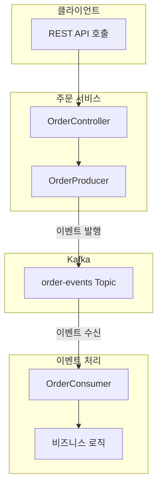
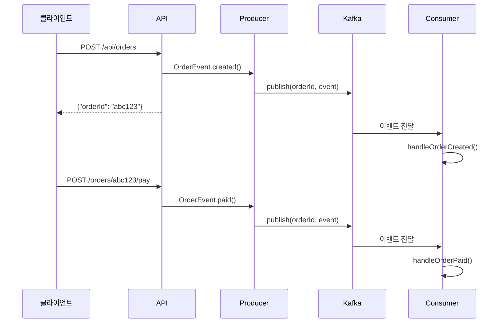
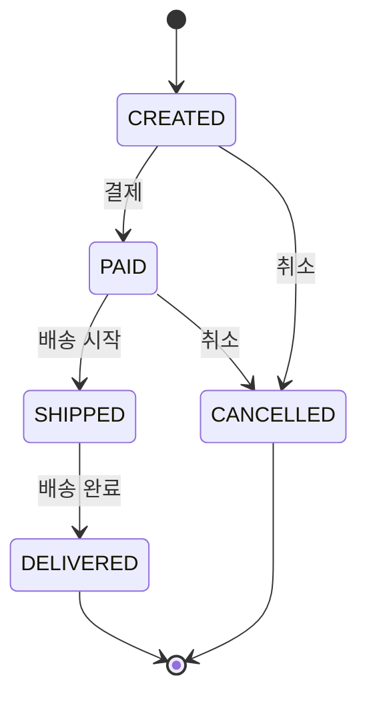
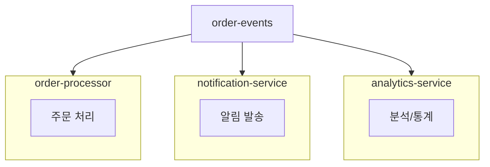

실무에 가까운 이벤트 기반 주문 시스템을 구현합니다. 이 예제에서는 주문 생성부터 배송 완료까지의 전체 흐름을 Kafka 이벤트로 처리하며, Message Key를 활용한 순서 보장과 여러 Consumer Group을 활용한 확장 패턴을 학습합니다.


- **이벤트 기반 아키텍처**: REST API 요청을 Kafka 이벤트로 변환하여 비동기 처리
- **Message Key**: orderId를 Key로 사용하여 같은 주문 이벤트의 순서 보장
- **상태 머신**: CREATED -> PAID -> SHIPPED -> DELIVERED 순서로 상태 전이
- **확장 패턴**: 여러 Consumer Group이 동일 Topic 독립적으로 구독


#### 대상 독자 및 선수 지식

| 항목 | 설명 |
|------|------|
| **대상 독자** | 이벤트 기반 시스템을 구축하려는 백엔드 개발자 |
| **선수 지식** | Spring Boot 기초, Kafka 기본 개념, [기본 예제](basic/) 완료 |
| **필수 환경** | Docker로 Kafka 실행 중, JDK 17+, Gradle |
| **예상 소요 시간** | 약 45분 |

이 페이지의 모든 코드 예제에서는 다음 import가 공통으로 사용됩니다. Spring Kafka의 KafkaTemplate과 @KafkaListener를 중심으로 구현하며, Jackson ObjectMapper를 통해 JSON 직렬화를 처리합니다.

```java
import org.springframework.kafka.core.KafkaTemplate;
import org.springframework.kafka.annotation.KafkaListener;
import org.springframework.kafka.support.KafkaHeaders;
import org.apache.kafka.clients.consumer.ConsumerRecord;
import com.fasterxml.jackson.databind.ObjectMapper;
```

#### 시스템 아키텍처

주문 시스템은 REST API를 통해 클라이언트 요청을 받고, 이를 Kafka 이벤트로 변환하여 비동기적으로 처리하는 구조입니다. 클라이언트가 REST API를 호출하면 OrderController가 요청을 받아 OrderProducer에게 전달하고, OrderProducer는 order-events Topic에 이벤트를 발행합니다. OrderConsumer는 이 Topic을 구독하여 이벤트를 수신하고 비즈니스 로직을 실행합니다.



*[다이어그램 설명: 클라이언트가 REST API를 호출하면 OrderController가 요청을 받아 OrderProducer에 전달합니다. Producer는 order-events Topic에 이벤트를 발행하고, OrderConsumer가 이를 수신하여 비즈니스 로직을 실행합니다.]*

이 아키텍처의 핵심은 동기식 HTTP 요청과 비동기식 이벤트 처리를 분리한다는 점입니다. 클라이언트는 주문 생성 요청에 대해 즉시 응답을 받고, 실제 주문 처리는 Kafka를 통해 비동기적으로 진행됩니다. 이렇게 하면 응답 시간이 빨라지고 시스템 간 결합도가 낮아집니다.

#### 이벤트 흐름

주문 생성부터 결제까지의 이벤트 흐름을 살펴보면 다음과 같습니다. 클라이언트가 POST /api/orders 요청을 보내면 API 계층에서 OrderEvent.created() 이벤트를 생성합니다. Producer는 orderId를 Key로 사용하여 이벤트를 Kafka에 발행하고, API는 클라이언트에게 orderId를 포함한 응답을 반환합니다. 이후 Consumer가 이벤트를 수신하여 handleOrderCreated() 메서드로 처리합니다.



*[다이어그램 설명: 클라이언트가 POST /api/orders 요청을 보내면 API가 이벤트를 생성하고 Producer가 Kafka에 발행합니다. API는 즉시 orderId를 반환하고, Consumer는 비동기로 이벤트를 처리합니다. 결제 요청도 동일한 패턴으로 처리됩니다.]*

결제 요청도 동일한 패턴으로 처리됩니다. POST /orders/{orderId}/pay 요청이 들어오면 OrderEvent.paid() 이벤트가 생성되어 동일한 orderId Key로 Kafka에 발행됩니다. 같은 Key를 사용하기 때문에 이 이벤트는 주문 생성 이벤트와 동일한 Partition으로 전송되어 순서가 보장됩니다.

#### 이벤트 타입

**OrderEvent**

OrderEvent는 주문과 관련된 모든 이벤트를 표현하는 레코드입니다. orderId는 주문의 고유 식별자이며 Kafka Message Key로도 사용됩니다. customerId는 주문한 고객의 식별자, status는 현재 주문 상태, description은 상태 변경에 대한 설명, timestamp는 이벤트 발생 시각을 나타냅니다.

```java
public record OrderEvent(
    String orderId,
    String customerId,
    OrderStatus status,
    String description,
    LocalDateTime timestamp
) {}
```

**OrderStatus**

주문 상태는 다섯 가지로 정의됩니다. CREATED는 주문이 생성된 초기 상태로, 이후 결제가 완료되면 PAID 상태로 전환되거나 취소되면 CANCELLED 상태가 됩니다. PAID 상태에서는 배송이 시작되면 SHIPPED 상태로 전환되거나 취소될 수 있습니다. SHIPPED 상태에서 배송이 완료되면 최종 DELIVERED 상태가 됩니다. DELIVERED와 CANCELLED는 더 이상 상태가 변경되지 않는 종료 상태입니다.



*[다이어그램 설명: 주문은 CREATED 상태에서 시작합니다. 결제 시 PAID로, 취소 시 CANCELLED로 전이됩니다. PAID 상태에서 배송 시작 시 SHIPPED로, 배송 완료 시 DELIVERED로 전이됩니다. DELIVERED와 CANCELLED는 최종 상태입니다.]*

이 상태 머신은 이벤트 소싱 패턴의 기초가 됩니다. 각 상태 전이가 별도의 이벤트로 기록되므로 주문의 전체 히스토리를 추적할 수 있습니다.


- **OrderEvent**: orderId, customerId, status, timestamp 등 주문 정보 포함
- **상태 전이**: CREATED -> PAID -> SHIPPED -> DELIVERED (또는 CANCELLED)
- **이벤트 소싱**: 각 상태 전이가 이벤트로 기록되어 히스토리 추적 가능


#### Message Key 사용

**왜 orderId를 Key로 사용하나요?**

Kafka에서 Message Key를 지정하면 동일한 Key를 가진 메시지들이 항상 같은 Partition으로 전송됩니다. 주문 시스템에서 orderId를 Key로 사용하는 이유는 같은 주문에 대한 이벤트들의 순서를 보장하기 위해서입니다.

```java
kafkaTemplate.send(TOPIC, event.orderId(), event);
//                 topic  key           value
```

Key를 사용하면 주문 "abc123"의 CREATED, PAID, SHIPPED 이벤트가 모두 같은 Partition으로 전송되어 하나의 Consumer가 순서대로 처리합니다. 반면 Key를 사용하지 않으면 각 이벤트가 라운드 로빈 방식으로 여러 Partition에 분산되어 서로 다른 Consumer가 처리할 수 있습니다. 이 경우 PAID 이벤트가 CREATED 이벤트보다 먼저 처리되는 상황이 발생할 수 있어 비즈니스 로직에 문제가 생깁니다.

**같은 주문의 이벤트 순서**

실제로 같은 orderId를 Key로 사용하면 해당 주문의 모든 이벤트가 하나의 Partition에 순차적으로 저장됩니다. Consumer는 이 Partition에서 이벤트를 순서대로 읽어 처리합니다. 예를 들어 주문 "abc123"의 경우 Partition 2에 CREATED, PAID, SHIPPED, DELIVERED 순서로 저장되고 Consumer는 이 순서를 보장받아 처리 1, 처리 2, 처리 3, 처리 4를 순차적으로 수행합니다.


- **Key 지정 시**: 동일 Key는 항상 동일 Partition으로 전송 -> 순서 보장
- **Key 미지정 시**: 라운드 로빈으로 분산 -> 순서 보장 안됨
- **주문 시스템**: orderId를 Key로 사용하여 같은 주문의 이벤트 순서 보장


#### Producer 구현

OrderProducer는 주문 이벤트를 Kafka에 발행하는 역할을 담당합니다. publish 메서드에서 event.orderId()를 Key로 지정하여 같은 주문의 이벤트들이 동일한 Partition으로 전송되도록 합니다. whenComplete 콜백을 통해 발행 성공 여부를 확인하고 로그를 기록합니다. 성공 시에는 Partition과 Offset 정보를 출력하고, 실패 시에는 에러 로그를 남깁니다.

```java
@Component
public class OrderProducer {

    private static final String TOPIC = "order-events";
    private final KafkaTemplate<String, OrderEvent> kafkaTemplate;

    public void publish(OrderEvent event) {
        // orderId를 Key로 사용하여 순서 보장
        kafkaTemplate.send(TOPIC, event.orderId(), event)
                .whenComplete((result, ex) -> {
                    if (ex == null) {
                        log.info("발행 성공 - Partition: {}, Offset: {}",
                                result.getRecordMetadata().partition(),
                                result.getRecordMetadata().offset());
                    } else {
                        log.error("발행 실패", ex);
                    }
                });
    }
}
```

실무에서는 발행 실패 시 재시도 로직이나 보상 트랜잭션을 구현해야 합니다. 이 예제에서는 단순히 로그만 남기지만, 프로덕션 환경에서는 실패한 이벤트를 별도 저장소에 기록하거나 알림을 발송하는 것이 좋습니다.


- **Key 설정**: `kafkaTemplate.send(TOPIC, event.orderId(), event)`로 orderId를 Key로 사용
- **비동기 처리**: `whenComplete()` 콜백으로 발행 결과 처리
- **실패 처리**: 프로덕션에서는 재시도 또는 별도 저장소 기록 필요


#### Consumer 구현

OrderConsumer는 order-events Topic을 구독하여 이벤트를 수신하고 처리합니다. @KafkaListener 어노테이션으로 Topic과 Consumer Group을 지정하며, ConsumerRecord를 통해 Key(orderId)와 Value(OrderEvent)를 함께 받습니다. switch 표현식을 사용하여 이벤트 상태에 따라 적절한 핸들러 메서드를 호출합니다.

```java
@Component
public class OrderConsumer {

    @KafkaListener(topics = "order-events", groupId = "order-processor")
    public void consume(ConsumerRecord<String, OrderEvent> record) {
        OrderEvent event = record.value();

        // Key(orderId)로 같은 주문 이벤트가 순서대로 도착
        log.info("수신 - OrderId: {}, Status: {}",
                record.key(), event.status());

        switch (event.status()) {
            case CREATED -> handleOrderCreated(event);
            case PAID -> handleOrderPaid(event);
            case SHIPPED -> handleOrderShipped(event);
            case DELIVERED -> handleOrderDelivered(event);
            case CANCELLED -> handleOrderCancelled(event);
        }
    }
}
```

각 핸들러 메서드에서는 해당 상태에 맞는 비즈니스 로직을 수행합니다. handleOrderCreated에서는 재고 확인과 결제 대기 처리를, handleOrderPaid에서는 배송 준비 시작을, handleOrderShipped에서는 배송 추적 시작을, handleOrderDelivered에서는 주문 완료 처리를, handleOrderCancelled에서는 재고 복원과 환불 처리를 수행합니다.


- **Topic/Group 지정**: `@KafkaListener(topics, groupId)`로 구독 설정
- **ConsumerRecord**: Key와 Value를 함께 수신하여 orderId 확인
- **상태별 처리**: switch 표현식으로 상태에 따른 핸들러 분기


#### 실행 방법

**1. Kafka 시작**

먼저 docker 디렉토리에서 Docker Compose를 사용하여 Kafka를 시작합니다. KRaft 모드로 설정된 단일 Broker가 실행됩니다.

```bash
cd docker
docker-compose up -d
```

**2. 애플리케이션 실행**

예제 프로젝트 디렉토리에서 Spring Boot 애플리케이션을 실행합니다. Gradle Wrapper를 사용하여 의존성 다운로드와 빌드, 실행을 한 번에 수행합니다.

```bash
cd examples/order-system
./gradlew bootRun
```

**3. 주문 생성**

새 터미널에서 curl을 사용하여 주문 생성 API를 호출합니다. customerId를 포함한 JSON 요청을 보내면 새로운 orderId가 생성되어 반환됩니다.

```bash
curl -X POST http://localhost:8080/api/orders \
  -H "Content-Type: application/json" \
  -d '{"customerId": "customer-123"}'
```

응답으로 생성된 주문 ID와 확인 메시지가 반환됩니다.

```json
{"orderId": "abc12345", "message": "주문이 생성되었습니다"}
```

**4. 주문 진행**

생성된 주문 ID를 사용하여 결제, 배송 시작, 배송 완료를 순차적으로 진행합니다. 각 API 호출마다 새로운 이벤트가 Kafka에 발행되고 Consumer가 처리합니다.

```bash
# 결제
curl -X POST "http://localhost:8080/api/orders/abc12345/pay?customerId=customer-123"

# 배송
curl -X POST "http://localhost:8080/api/orders/abc12345/ship?customerId=customer-123"

# 배송 완료
curl -X POST "http://localhost:8080/api/orders/abc12345/deliver?customerId=customer-123"
```

**5. 로그 확인**

Spring Boot 애플리케이션이 실행 중인 터미널에서 Consumer가 이벤트를 수신하고 처리하는 로그를 확인할 수 있습니다. 각 이벤트의 Partition, Offset, Key, Status 정보와 처리 결과가 출력됩니다.

```
========================================
이벤트 수신
  Partition: 0, Offset: 0
  Key (OrderId): abc12345
  Status: CREATED
========================================
[처리] 주문 생성 - 재고 확인 및 결제 대기

========================================
이벤트 수신
  Partition: 0, Offset: 1
  Key (OrderId): abc12345
  Status: PAID
========================================
[처리] 결제 완료 - 배송 준비 시작
```

동일한 orderId를 Key로 사용했기 때문에 모든 이벤트가 같은 Partition 0에 순차적으로 저장되고 처리되는 것을 확인할 수 있습니다.

#### 확장 포인트

**여러 Consumer Group**

하나의 Topic을 여러 Consumer Group이 독립적으로 구독할 수 있습니다. order-events Topic을 order-processor 그룹은 주문 처리를 위해, notification-service 그룹은 알림 발송을 위해, analytics-service 그룹은 분석과 통계를 위해 각각 구독합니다. 각 그룹은 동일한 이벤트를 독립적으로 수신하여 자신만의 비즈니스 로직을 수행합니다.



*[다이어그램 설명: order-events Topic을 세 개의 Consumer Group이 독립적으로 구독합니다. order-processor는 주문 처리, notification-service는 알림 발송, analytics-service는 분석/통계를 담당합니다.]*

이 패턴을 사용하면 새로운 기능을 추가할 때 기존 시스템을 수정하지 않고 새로운 Consumer Group만 추가하면 됩니다. 예를 들어 주문 이벤트를 활용한 추천 시스템을 추가하려면 recommendation-service 그룹을 새로 만들어 같은 Topic을 구독하면 됩니다.

**에러 처리 추가**

실무에서는 @RetryableTopic 어노테이션을 사용하여 재시도와 Dead Letter Topic 처리를 구현합니다. attempts 속성으로 최대 재시도 횟수를 지정하면, 모든 재시도가 실패했을 때 메시지가 자동으로 DLT로 이동합니다.

```java
@RetryableTopic(attempts = "3")
@KafkaListener(topics = "order-events")
public void consume(OrderEvent event) {
    // 3회 재시도 후 실패 시 DLT로 이동
}
```


- **다중 Consumer Group**: 동일 Topic을 여러 서비스가 독립적으로 구독
- **느슨한 결합**: 새 기능 추가 시 기존 시스템 수정 불필요
- **@RetryableTopic**: 재시도 실패 시 자동 DLT 이동


#### 정리

이 예제에서는 이벤트 발행에 KafkaTemplate과 JSON Serializer를 사용하고, 이벤트 소비에 @KafkaListener와 JSON Deserializer를 사용했습니다. 순서 보장을 위해 orderId를 Message Key로 활용했으며, 상태 전이는 이벤트 기반 상태 머신으로 구현했습니다. 이 패턴들은 실무에서 이벤트 기반 시스템을 구축할 때 기본이 되는 패턴들입니다.

#### 전체 소스코드

이 예제의 전체 소스코드는 아래 링크에서 확인할 수 있습니다. Producer, Consumer, Controller 및 도메인 객체의 전체 구현을 살펴보세요.

- [**`examples/order-system`**](https://github.com/advanced-beginner/advanced-beginner.github.io/tree/main/examples/order-system)

#### 다음 단계

- [부록](../appendix/) - 용어 사전 및 참고 자료
