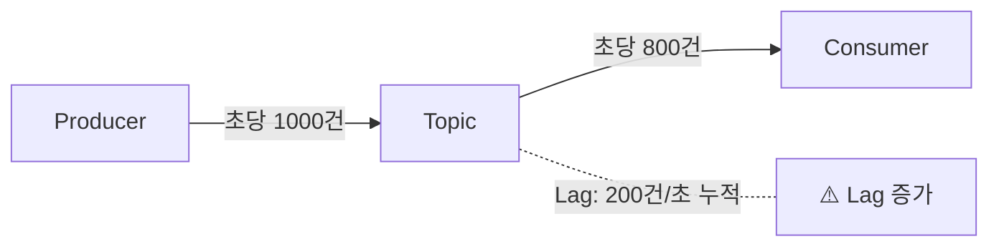

Consumer Lag가 발생했을 때 원인을 진단하고 해결하는 방법을 단계별로 안내합니다.


- **Consumer Lag**: Consumer가 읽지 못한 메시지 수 (Producer 속도 > Consumer 처리 속도)
- **진단**: `kafka-consumer-groups.sh`로 Lag 확인, 모니터링 도구로 추이 분석
- **해결**: Consumer 수 증가, 처리 로직 최적화, Partition 수 조정, 배치 설정 튜닝


## Consumer Lag란?

Consumer Lag는 Producer가 발행한 메시지 중 Consumer가 아직 읽지 못한 메시지의 수입니다. Lag가 지속적으로 증가하면 메시지 처리 지연이 발생하고, 최악의 경우 메시지가 보관 기간을 초과하여 삭제될 수 있습니다.



*다이어그램: Producer가 초당 1000건을 발행하는데 Consumer가 초당 800건만 처리하면, 초당 200건씩 Lag가 누적됩니다.*

---

## 1단계: Lag 현황 확인하기

### 1.1 kafka-consumer-groups.sh로 확인

Kafka CLI 도구로 Consumer Group의 현재 Lag를 확인하세요:

```bash
kafka-consumer-groups.sh --bootstrap-server localhost:9092 \
  --describe --group order-service-group
```

**예상 출력:**
```
GROUP              TOPIC           PARTITION  CURRENT-OFFSET  LOG-END-OFFSET  LAG
order-service-group orders         0          1000            1500            500
order-service-group orders         1          950             1480            530
order-service-group orders         2          980             1490            510
```

| 컬럼 | 설명 |
|------|------|
| `CURRENT-OFFSET` | Consumer가 마지막으로 읽은 위치 |
| `LOG-END-OFFSET` | Partition에 쓰여진 마지막 메시지 위치 |
| `LAG` | 읽지 못한 메시지 수 (LOG-END-OFFSET - CURRENT-OFFSET) |

### 1.2 Lag 심각도 판단

| Lag 상태 | 기준 | 조치 |
|----------|------|------|
| 정상 | Lag < 100, 일시적 | 모니터링 유지 |
| 주의 | Lag 100~1000, 지속 | 원인 분석 시작 |
| 경고 | Lag > 1000, 증가 추세 | 즉시 조치 필요 |
| 심각 | Lag 급증, 처리 불가 | 긴급 대응 |


Lag 숫자만으로 판단하지 마세요. <strong>증가 추세</strong>가 더 중요합니다. Lag가 1000이어도 감소 중이면 괜찮지만, Lag가 100이어도 계속 증가하면 문제입니다.


### 1.3 Spring Boot에서 Lag 확인

`kafka-clients` 라이브러리의 `AdminClient`를 사용하면 애플리케이션 내에서 Lag를 확인할 수 있습니다:

```java
@Service
@RequiredArgsConstructor
public class LagMonitorService {

    private final AdminClient adminClient;

    public Map<TopicPartition, Long> getConsumerLag(String groupId) {
        Map<TopicPartition, Long> lagMap = new HashMap<>();

        try {
            // Consumer Group의 현재 Offset 조회
            Map<TopicPartition, OffsetAndMetadata> offsets =
                adminClient.listConsumerGroupOffsets(groupId)
                    .partitionsToOffsetAndMetadata()
                    .get();

            // Topic의 끝 Offset 조회
            Map<TopicPartition, ListOffsetsResult.ListOffsetsResultInfo> endOffsets =
                adminClient.listOffsets(offsets.keySet().stream()
                    .collect(Collectors.toMap(tp -> tp, tp -> OffsetSpec.latest())))
                    .all()
                    .get();

            // Lag 계산
            offsets.forEach((tp, offsetMeta) -> {
                long endOffset = endOffsets.get(tp).offset();
                long currentOffset = offsetMeta.offset();
                lagMap.put(tp, endOffset - currentOffset);
            });

        } catch (Exception e) {
            log.error("Lag 조회 실패", e);
        }

        return lagMap;
    }
}
```

---

## 2단계: 원인 진단하기

Lag가 발생하는 원인은 크게 네 가지로 분류됩니다. 각 원인을 체계적으로 점검하세요.

### 2.1 Consumer 처리 속도 부족

**증상:**
- 모든 Partition에서 Lag가 균등하게 증가
- Consumer CPU 사용률이 높음

**진단 명령:**
```bash
# Consumer 프로세스 CPU 확인 (Linux)
top -p $(pgrep -f "your-consumer-app")
```

**확인 포인트:**
- 비즈니스 로직에 병목이 있는가?
- 외부 API 호출이 느린가?
- DB 쿼리가 느린가?

### 2.2 Consumer 수 부족

**증상:**
- Consumer 수가 Partition 수보다 적음
- 일부 Consumer만 과부하 상태

**진단:**
```bash
# Consumer Group 멤버 확인
kafka-consumer-groups.sh --bootstrap-server localhost:9092 \
  --describe --group order-service-group --members

# 출력 예시
GROUP              CONSUMER-ID                          HOST          CLIENT-ID  #PARTITIONS
order-service-group consumer-1-abc123                  /192.168.1.10 consumer-1 3
order-service-group consumer-2-def456                  /192.168.1.11 consumer-2 3
```


Consumer 수 = Partition 수일 때 가장 효율적입니다. Consumer가 더 많아도 유휴 상태가 됩니다.


### 2.3 Partition 불균형

**증상:**
- 특정 Partition에만 Lag 집중
- Key 분배가 불균형

**진단:**
```bash
# Partition별 메시지 수 확인
kafka-run-class.sh kafka.tools.GetOffsetShell \
  --broker-list localhost:9092 \
  --topic orders \
  --time -1
```

**원인:** 특정 Key에 메시지가 집중되면 해당 Key가 할당된 Partition에만 부하가 발생합니다.

### 2.4 Rebalancing 빈번 발생

**증상:**
- Consumer Lag가 주기적으로 급증했다가 감소
- Consumer 로그에 Rebalancing 메시지 다수

**진단:**
Consumer 로그에서 Rebalancing 관련 메시지를 확인하세요:
```
INFO  o.a.k.c.c.i.ConsumerCoordinator : [Consumer clientId=consumer-1] Revoke partitions
INFO  o.a.k.c.c.i.ConsumerCoordinator : [Consumer clientId=consumer-1] Assigned partitions
```

**원인:**
- `session.timeout.ms` 초과 (Consumer가 heartbeat를 보내지 못함)
- `max.poll.interval.ms` 초과 (poll() 호출 간격이 너무 김)

---

## 3단계: 해결 방법 적용하기

### 3.1 Consumer 수 증가 (가장 빠른 해결책)

Spring Boot에서 Consumer 스레드 수를 늘리세요:

```java
@KafkaListener(
    topics = "orders",
    groupId = "order-service-group",
    concurrency = "6"  // 기존 3 → 6으로 증가
)
public void consume(String message) {
    processMessage(message);
}
```

또는 애플리케이션 인스턴스를 추가로 배포하세요:
```bash
# Kubernetes에서 replica 증가
kubectl scale deployment order-consumer --replicas=6
```


Consumer 수를 Partition 수 이상으로 늘려도 효과가 없습니다. Partition 수 이상의 Consumer가 필요하면 먼저 Partition을 늘리세요.


### 3.2 처리 로직 최적화

**비동기 처리 적용:**
```java
@KafkaListener(topics = "orders")
public void consume(String message) {
    // 동기 처리 (느림)
    // processMessage(message);

    // 비동기 처리 (빠름)
    CompletableFuture.runAsync(() -> processMessage(message), executor);
    ack.acknowledge();
}
```

**배치 처리 적용:**
```java
@KafkaListener(topics = "orders", batch = "true")
public void consumeBatch(List<String> messages) {
    // 개별 처리 대신 배치 처리
    batchProcessor.processAll(messages);
}
```

### 3.3 Consumer 설정 튜닝

`application.yml` 설정을 최적화하세요:

```yaml
spring:
  kafka:
    consumer:
      # 한 번에 가져오는 최대 레코드 수 증가
      max-poll-records: 500  # 기본값: 500

      # poll 간격 제한 시간 증가 (처리가 오래 걸리는 경우)
      properties:
        max.poll.interval.ms: 300000  # 5분

        # 한 번에 가져오는 데이터 크기 증가
        fetch.min.bytes: 1048576  # 1MB
        fetch.max.wait.ms: 500

        # session timeout 조정 (Rebalancing 방지)
        session.timeout.ms: 30000
        heartbeat.interval.ms: 10000
```

| 설정 | 기본값 | 권장값 | 설명 |
|------|--------|--------|------|
| `max.poll.records` | 500 | 500-1000 | 배치 크기 증가로 처리량 향상 |
| `fetch.min.bytes` | 1 | 1MB | 작은 요청 빈도 감소 |
| `max.poll.interval.ms` | 5분 | 처리시간+여유 | Rebalancing 방지 |

### 3.4 Partition 수 증가

Partition 수가 부족하면 병렬 처리에 한계가 있습니다:

```bash
# 현재 Partition 수 확인
kafka-topics.sh --bootstrap-server localhost:9092 \
  --describe --topic orders

# Partition 수 증가 (6 → 12)
kafka-topics.sh --bootstrap-server localhost:9092 \
  --alter --topic orders \
  --partitions 12
```


Partition 수를 늘리면 기존 Key 기반 라우팅이 변경됩니다. 순서 보장이 중요한 경우 신중하게 결정하세요.


---

## 4단계: 모니터링 설정하기

### 4.1 Prometheus + Grafana 설정

Spring Boot Actuator와 Micrometer를 사용하여 Lag 메트릭을 수집하세요:

```yaml
# application.yml
management:
  endpoints:
    web:
      exposure:
        include: prometheus, health
  metrics:
    tags:
      application: order-consumer
```

```groovy
// build.gradle.kts
dependencies {
    implementation("org.springframework.boot:spring-boot-starter-actuator")
    implementation("io.micrometer:micrometer-registry-prometheus")
}
```

### 4.2 알림 설정

Prometheus AlertManager 또는 Grafana Alert를 설정하세요:

```yaml
# Prometheus alert rule 예시
groups:
  - name: kafka-consumer-alerts
    rules:
      - alert: HighConsumerLag
        expr: kafka_consumer_lag > 1000
        for: 5m
        labels:
          severity: warning
        annotations:
          summary: "Consumer Lag가 1000을 초과했습니다"
          description: "{{ $labels.group }} 그룹의 {{ $labels.topic }} Lag: {{ $value }}"
```

---

## 체크리스트

Lag 문제 해결 시 다음 순서로 점검하세요:

- [ ] **1. Lag 현황 확인**: `kafka-consumer-groups.sh --describe`
- [ ] **2. 추세 분석**: Lag가 증가 중인지, 안정적인지 확인
- [ ] **3. Consumer 상태 확인**: 멤버 수, CPU 사용률
- [ ] **4. 원인 진단**: 처리 속도, Consumer 수, Partition 균형, Rebalancing
- [ ] **5. 해결책 적용**: Consumer 증가, 로직 최적화, 설정 튜닝
- [ ] **6. 모니터링 설정**: 지속적인 Lag 추적

---

## 관련 문서

- [Consumer 고급 설정](../concepts/consumer-tuning/) - Consumer 튜닝 상세 가이드
- [핵심 구성요소](../concepts/core-components/) - Consumer Group과 Partition 이해
- [Producer 성능 최적화](producer-performance-tuning/) - Producer 측 최적화
