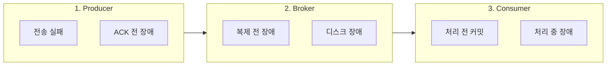
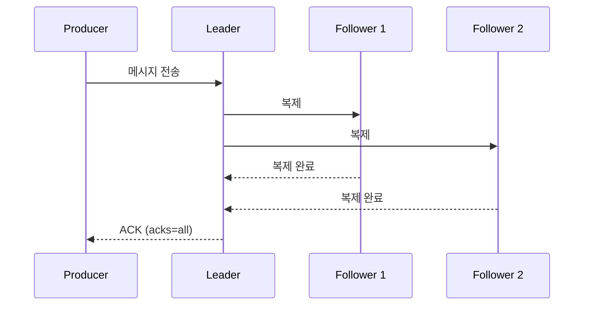
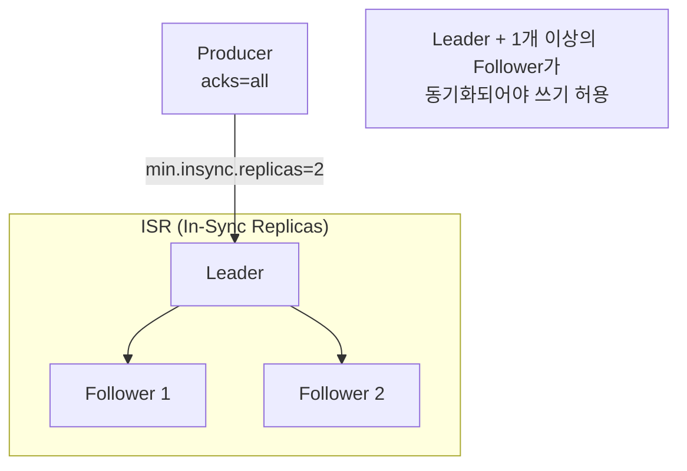
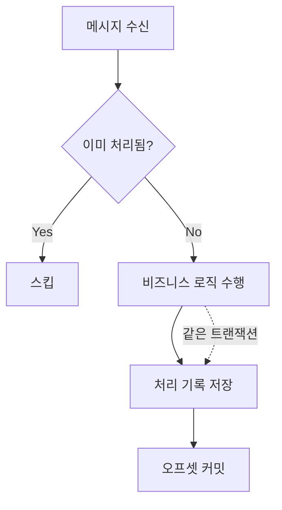

Kafka에서 메시지 손실을 방지하고 안정적인 메시징을 보장하는 방법을 단계별로 안내합니다.

**소요 시간**: 약 30분 (설정 적용 기준)


- **Producer 측**: `acks=all`, `enable.idempotence=true`, 적절한 재시도 설정
- **Broker 측**: `min.insync.replicas=2`, `unclean.leader.election.enable=false`
- **Consumer 측**: 수동 커밋, 처리 후 커밋, 재시도 메커니즘 구현
- **End-to-End**: 메시지 추적 ID 활용, 모니터링 및 알림 설정


---

## 시작하기 전에

이 가이드를 따라하기 위해 다음 환경이 필요합니다.

### 필수 요구사항

| 항목 | 최소 버전 | 확인 명령어 |
|------|----------|------------|
| Apache Kafka | 2.8+ | `kafka-topics.sh --version` |
| Java | 17+ | `java -version` |
| Spring Boot | 3.0+ | `./gradlew dependencies \| grep spring-boot` |
| Spring Kafka | 3.0+ | `./gradlew dependencies \| grep spring-kafka` |

### 환경 확인

Kafka 클러스터에 접근 가능한지 확인하세요:

```bash
# Kafka 연결 테스트
kafka-broker-api-versions.sh --bootstrap-server localhost:9092
```

**성공 시 출력 예시:**
```
localhost:9092 (id: 0 rack: null) -> (
  ...API versions...
)
```

### 이 가이드가 다루지 않는 것

- Kafka Streams 트랜잭션 (별도 문서 참조)
- Schema Registry 설정
- 멀티 클러스터 복제 (MirrorMaker)

---

## 메시지 손실이 발생하는 지점

Kafka 파이프라인에서 메시지 손실은 세 가지 지점에서 발생할 수 있습니다:



*다이어그램: 메시지 손실은 Producer, Broker, Consumer 각 단계에서 발생할 수 있습니다.*

| 단계 | 손실 원인 | 해결 방법 |
|------|----------|----------|
| Producer | 네트워크 오류, ACK 미수신 | `acks=all`, 재시도 설정 |
| Broker | Leader 장애, 복제 지연 | ISR 설정, 복제 팩터 |
| Consumer | 처리 전 커밋, 장애 | 수동 커밋, 재시도 로직 |

---

## 1단계: Producer 설정 강화

### 1.1 acks=all 설정

모든 ISR(In-Sync Replicas)이 메시지를 받아야 ACK를 반환하도록 설정하세요:

```yaml
spring:
  kafka:
    producer:
      acks: all  # 모든 ISR이 메시지 수신 확인
```



*다이어그램: acks=all은 모든 ISR이 메시지를 복제한 후에만 ACK를 반환합니다.*

### 1.2 Idempotent Producer 활성화

네트워크 재시도로 인한 중복을 방지하면서 안전하게 재전송하세요:

```yaml
spring:
  kafka:
    producer:
      properties:
        enable.idempotence: true
        max.in.flight.requests.per.connection: 5  # idempotence 사용 시 최대 5
```

**Idempotent Producer가 보장하는 것:**
- 동일 파티션 내 메시지 순서 보장
- 중복 메시지 자동 제거
- 재시도 시에도 Exactly-Once 의미론

### 1.3 재시도 설정 최적화

일시적 오류에 대응하는 재시도 설정을 추가하세요:

```yaml
spring:
  kafka:
    producer:
      retries: 2147483647          # 무한 재시도 (실제로는 delivery.timeout.ms까지)
      properties:
        retry.backoff.ms: 100      # 재시도 간격
        delivery.timeout.ms: 120000 # 전체 전송 타임아웃 (2분)
        request.timeout.ms: 30000   # 단일 요청 타임아웃
```


`delivery.timeout.ms` ≥ `linger.ms` + `request.timeout.ms`가 되어야 합니다.
재시도는 `delivery.timeout.ms` 내에서만 수행됩니다.


### 1.4 전송 실패 처리

전송 실패 시 적절한 폴백 로직을 구현하세요:

```java
@Component
@RequiredArgsConstructor
@Slf4j
public class ReliableProducer {

    private final KafkaTemplate<String, String> kafkaTemplate;
    private final FailedMessageRepository failedMessageRepository;

    public void send(String topic, String key, String message) {
        kafkaTemplate.send(topic, key, message)
            .whenComplete((result, ex) -> {
                if (ex != null) {
                    handleSendFailure(topic, key, message, ex);
                } else {
                    log.debug("전송 성공: topic={}, partition={}, offset={}",
                        topic,
                        result.getRecordMetadata().partition(),
                        result.getRecordMetadata().offset());
                }
            });
    }

    private void handleSendFailure(String topic, String key, String message, Throwable ex) {
        log.error("전송 실패: topic={}, key={}", topic, key, ex);

        // 실패한 메시지를 DB에 저장 (나중에 재처리)
        FailedMessage failedMessage = FailedMessage.builder()
            .topic(topic)
            .messageKey(key)
            .payload(message)
            .errorMessage(ex.getMessage())
            .createdAt(Instant.now())
            .build();

        failedMessageRepository.save(failedMessage);

        // 알림 발송 (선택)
        alertService.sendAlert("Kafka 전송 실패: " + topic);
    }
}
```

---

## 2단계: Broker 설정 강화

### 2.1 복제 팩터 설정

토픽 생성 시 충분한 복제 팩터를 설정하세요:

```bash
kafka-topics.sh --bootstrap-server localhost:9092 \
  --create --topic orders \
  --partitions 6 \
  --replication-factor 3
```

| 복제 팩터 | 허용 장애 | 권장 환경 |
|----------|----------|----------|
| 1 | 0 (장애 불허) | 개발 환경 |
| 2 | 1 Broker 장애 | 테스트 환경 |
| 3 | 2 Broker 장애 | **프로덕션 권장** |

### 2.2 min.insync.replicas 설정

최소한 N개의 복제본이 동기화되어야 쓰기를 허용하도록 설정하세요:

```bash
# 토픽 레벨 설정
kafka-configs.sh --bootstrap-server localhost:9092 \
  --entity-type topics --entity-name orders \
  --alter --add-config min.insync.replicas=2
```

또는 `server.properties`에서 전역 설정:

```properties
# Broker 전역 설정
min.insync.replicas=2
```



*다이어그램: min.insync.replicas=2는 최소 2개의 복제본이 동기화되어야 메시지를 수락합니다.*


`min.insync.replicas` > `replication.factor`이면 쓰기가 불가능합니다.
권장: `replication.factor=3`, `min.insync.replicas=2`


### 2.3 Unclean Leader Election 비활성화

동기화되지 않은 복제본이 Leader가 되어 데이터가 손실되는 것을 방지하세요:

```properties
# server.properties
unclean.leader.election.enable=false  # 기본값: false (Kafka 0.11+)
```

| 설정 | 동작 | 영향 |
|------|------|------|
| `true` | 동기화되지 않은 Follower도 Leader 가능 | 데이터 손실 가능, 가용성 우선 |
| `false` | ISR 내 Follower만 Leader 가능 | **데이터 안전, 권장** |

---

## 3단계: Consumer 설정 강화

### 3.1 수동 커밋 사용

자동 커밋 대신 수동 커밋으로 처리 완료 후에만 오프셋을 커밋하세요:

```yaml
spring:
  kafka:
    consumer:
      enable-auto-commit: false  # 자동 커밋 비활성화
    listener:
      ack-mode: manual          # 수동 ACK 모드
```

```java
@KafkaListener(topics = "orders", groupId = "order-processor-group")
public void consume(ConsumerRecord<String, String> record, Acknowledgment ack) {
    try {
        // 1. 메시지 처리
        processOrder(record.value());

        // 2. 처리 성공 후에만 커밋
        ack.acknowledge();

    } catch (Exception e) {
        log.error("처리 실패: key={}", record.key(), e);
        // 커밋하지 않음 → 재처리됨
    }
}
```

### 3.2 처리 실패 시 재시도 로직

Spring Kafka의 `DefaultErrorHandler`를 사용하여 재시도를 구현하세요:

```java
@Configuration
public class KafkaConsumerConfig {

    @Bean
    public DefaultErrorHandler errorHandler(DeadLetterPublishingRecoverer recoverer) {
        // 최대 3회 재시도, 1초 간격
        BackOff backOff = new FixedBackOff(1000L, 3);

        DefaultErrorHandler errorHandler = new DefaultErrorHandler(recoverer, backOff);

        // 재시도하지 않을 예외 지정
        errorHandler.addNotRetryableExceptions(
            IllegalArgumentException.class,
            JsonParseException.class
        );

        return errorHandler;
    }

    @Bean
    public DeadLetterPublishingRecoverer recoverer(KafkaTemplate<String, String> template) {
        // 재시도 실패 시 DLT(Dead Letter Topic)로 전송
        return new DeadLetterPublishingRecoverer(template,
            (record, ex) -> new TopicPartition(record.topic() + ".DLT", record.partition())
        );
    }
}
```

### 3.3 Exactly-Once 처리 패턴

비즈니스 로직과 커밋을 트랜잭션으로 묶어 Exactly-Once를 구현하세요:

```java
@Service
@RequiredArgsConstructor
@Slf4j
public class IdempotentOrderProcessor {

    private final OrderRepository orderRepository;
    private final ProcessedMessageRepository processedMessageRepository;

    @Transactional
    public void process(String messageId, OrderEvent event) {
        // 1. 이미 처리된 메시지인지 확인 (멱등성 체크)
        if (processedMessageRepository.existsById(messageId)) {
            log.info("이미 처리된 메시지, 스킵: messageId={}", messageId);
            return;
        }

        // 2. 비즈니스 로직 수행
        Order order = Order.from(event);
        orderRepository.save(order);

        // 3. 처리 완료 기록 (같은 트랜잭션)
        processedMessageRepository.save(new ProcessedMessage(messageId, Instant.now()));

        log.info("주문 처리 완료: orderId={}", order.getId());
    }
}
```



*다이어그램: 멱등성 패턴으로 중복 메시지를 안전하게 처리합니다.*

---

## 4단계: End-to-End 추적 설정

### 4.1 메시지 추적 ID 활용

메시지에 고유 ID를 부여하여 전체 파이프라인을 추적하세요:

```java
// Producer
public void sendWithTraceId(String orderId, OrderEvent event) {
    String traceId = UUID.randomUUID().toString();

    ProducerRecord<String, String> record = new ProducerRecord<>("orders", orderId, toJson(event));
    record.headers().add("X-Trace-Id", traceId.getBytes(StandardCharsets.UTF_8));
    record.headers().add("X-Timestamp", String.valueOf(System.currentTimeMillis()).getBytes());

    kafkaTemplate.send(record);
    log.info("메시지 전송: traceId={}, orderId={}", traceId, orderId);
}

// Consumer
@KafkaListener(topics = "orders")
public void consume(ConsumerRecord<String, String> record, Acknowledgment ack) {
    String traceId = new String(record.headers().lastHeader("X-Trace-Id").value());
    log.info("메시지 수신: traceId={}", traceId);

    MDC.put("traceId", traceId);
    try {
        process(record.value());
        ack.acknowledge();
        log.info("메시지 처리 완료: traceId={}", traceId);
    } finally {
        MDC.remove("traceId");
    }
}
```

### 4.2 모니터링 알림 설정

메시지 손실 징후를 감지하는 알림을 설정하세요:

```yaml
# Prometheus Alert Rules
groups:
  - name: kafka-data-loss-alerts
    rules:
      # Producer 전송 실패율
      - alert: HighProducerErrorRate
        expr: rate(kafka_producer_record_error_total[5m]) > 0.01
        for: 5m
        labels:
          severity: critical
        annotations:
          summary: "Producer 전송 실패율이 1%를 초과했습니다"

      # ISR 부족
      - alert: InsufficientISR
        expr: kafka_topic_partition_under_replicated > 0
        for: 5m
        labels:
          severity: warning
        annotations:
          summary: "복제가 부족한 파티션이 있습니다"

      # Consumer Lag 급증
      - alert: ConsumerLagSpike
        expr: delta(kafka_consumer_lag[5m]) > 10000
        for: 5m
        labels:
          severity: warning
        annotations:
          summary: "Consumer Lag가 급증하고 있습니다"
```

---

## 자주 발생하는 오류

### NotEnoughReplicasException

**오류 메시지:**
```
org.apache.kafka.common.errors.NotEnoughReplicasException:
Messages are rejected since there are fewer in-sync replicas than required.
```

**원인:** `min.insync.replicas` 설정보다 동기화된 복제본 수가 적음

**해결 방법:**
1. Broker 상태 확인:
   ```bash
   kafka-metadata.sh --snapshot /var/kafka-logs/__cluster_metadata-0/00000000000000000000.log --command "broker"
   ```
2. ISR 상태 확인:
   ```bash
   kafka-topics.sh --bootstrap-server localhost:9092 --describe --topic orders
   ```
3. 문제 Broker 복구 또는 일시적으로 `min.insync.replicas` 낮춤 (비권장)

### TimeoutException (Producer)

**오류 메시지:**
```
org.apache.kafka.common.errors.TimeoutException:
Expiring 1 record(s) for orders-0:120000 ms has passed since batch creation
```

**원인:** `delivery.timeout.ms` 내에 전송 완료하지 못함

**해결 방법:**
1. 네트워크 연결 확인
2. Broker 부하 확인
3. `delivery.timeout.ms` 증가 (임시 조치)
4. `batch.size` 감소하여 배치 크기 줄이기

### CommitFailedException (Consumer)

**오류 메시지:**
```
org.apache.kafka.clients.consumer.CommitFailedException:
Commit cannot be completed since the group has already rebalanced
```

**원인:** 처리 시간이 `max.poll.interval.ms`를 초과하여 리밸런싱 발생

**해결 방법:**
```yaml
spring:
  kafka:
    consumer:
      properties:
        max.poll.interval.ms: 600000  # 10분으로 증가
        max.poll.records: 100         # 한 번에 가져오는 레코드 수 감소
```

### RecordTooLargeException

**오류 메시지:**
```
org.apache.kafka.common.errors.RecordTooLargeException:
The message is 1048577 bytes when serialized which is larger than 1048576
```

**원인:** 메시지 크기가 `max.request.size` (기본 1MB) 초과

**해결 방법:**
```yaml
spring:
  kafka:
    producer:
      properties:
        max.request.size: 5242880  # 5MB로 증가
```

Broker 측도 설정 필요:
```properties
# server.properties
message.max.bytes=5242880
```

---

## 체크리스트

메시지 손실 방지 설정을 점검하세요:

### Producer
- [ ] `acks=all` 설정됨
- [ ] `enable.idempotence=true` 설정됨
- [ ] 적절한 `retries` 및 `delivery.timeout.ms` 설정됨
- [ ] 전송 실패 시 폴백 로직 구현됨

### Broker
- [ ] `replication.factor=3` (프로덕션)
- [ ] `min.insync.replicas=2` 설정됨
- [ ] `unclean.leader.election.enable=false` 확인됨

### Consumer
- [ ] `enable-auto-commit=false` 설정됨
- [ ] 수동 커밋(처리 후 커밋) 구현됨
- [ ] 재시도 및 DLT 설정됨
- [ ] 멱등성 처리 구현됨

### 모니터링
- [ ] 전송 실패율 알림 설정됨
- [ ] ISR 부족 알림 설정됨
- [ ] Consumer Lag 알림 설정됨

---

## 설정 요약표

| 구분 | 설정 | 권장값 | 목적 |
|------|------|--------|------|
| **Producer** | `acks` | `all` | 모든 복제본 확인 |
| | `enable.idempotence` | `true` | 중복 방지 |
| | `retries` | 무한 | 일시적 오류 대응 |
| **Broker** | `replication.factor` | `3` | 복제 여유 확보 |
| | `min.insync.replicas` | `2` | 최소 복제 보장 |
| | `unclean.leader.election` | `false` | 데이터 보호 |
| **Consumer** | `enable-auto-commit` | `false` | 처리 후 커밋 |
| | `ack-mode` | `manual` | 명시적 ACK |

---

## 관련 문서

- [Producer 성능 최적화](producer-performance-tuning/) - 안정성과 성능의 균형
- [Consumer Lag 트러블슈팅](consumer-lag-troubleshooting/) - Consumer 측 문제 해결
- [트랜잭션]() - Exactly-Once 의미론 상세
- [에러 처리 패턴]() - 프로덕션 에러 처리 전략
- [로그 수집과 중앙화]() - 메시지 손실 추적을 위한 중앙 집중식 로그 관리
