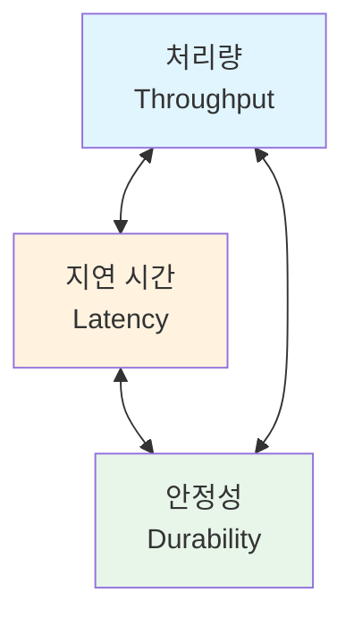
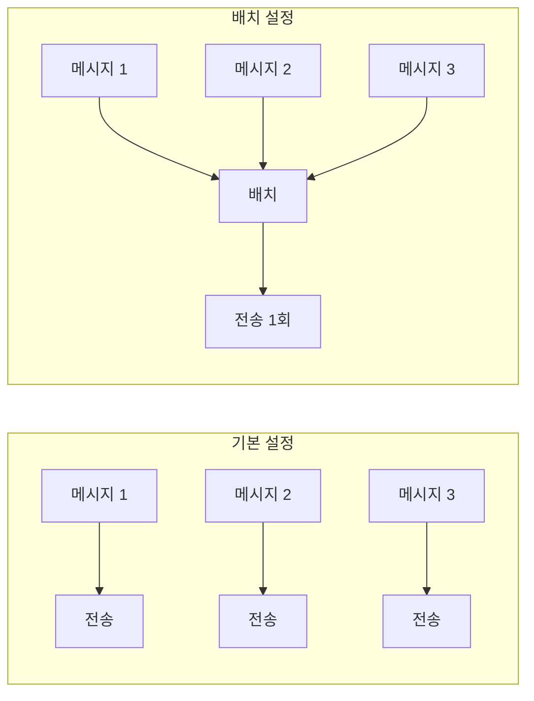
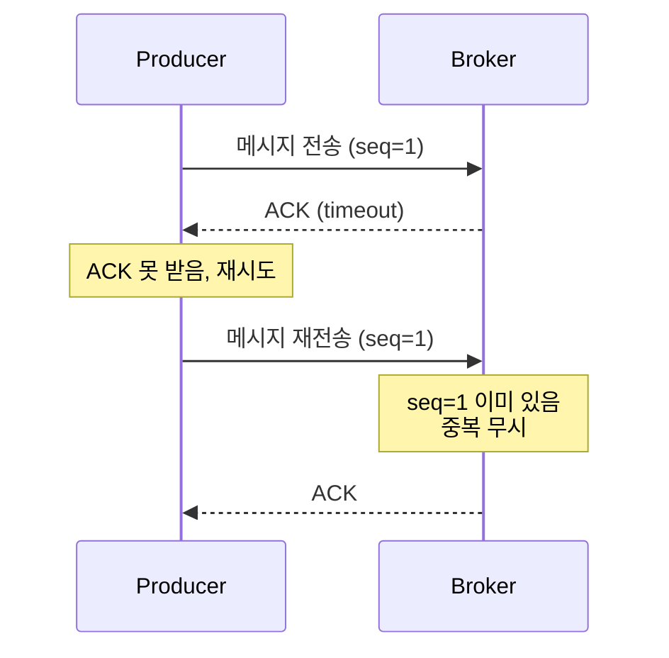

Producer의 처리량을 높이고 지연 시간을 줄이는 방법을 단계별로 안내합니다.


- **처리량 우선**: `batch.size` 증가, `linger.ms` 설정, 압축 활성화
- **지연 우선**: `linger.ms=0`, `acks=1`, 작은 배치 크기
- **안정성 우선**: `acks=all`, `enable.idempotence=true`, 재시도 설정
- **트레이드오프**: 처리량 ↔ 지연 시간 ↔ 안정성은 상충 관계


## 성능 최적화의 세 가지 축

Producer 성능 최적화는 세 가지 요소의 균형을 맞추는 작업입니다:



| 요소 | 설명 | 최적화 방향 |
|------|------|-------------|
| **처리량** | 초당 전송 메시지 수 | 배치 크기 증가, 압축 활성화 |
| **지연 시간** | 메시지 전송~확인까지 시간 | 배치 대기 시간 감소 |
| **안정성** | 메시지 유실 방지 | acks=all, 복제 대기 |

---

## 1단계: 현재 성능 측정하기

최적화 전에 현재 성능을 측정하세요. 기준선 없이는 개선 효과를 알 수 없습니다.

### 1.1 kafka-producer-perf-test.sh 사용

Kafka에 내장된 성능 테스트 도구로 기준 성능을 측정하세요:

```bash
kafka-producer-perf-test.sh \
  --topic perf-test \
  --num-records 100000 \
  --record-size 1024 \
  --throughput -1 \
  --producer-props bootstrap.servers=localhost:9092
```

**예상 출력:**
```
100000 records sent, 45678.9 records/sec (44.61 MB/sec), 12.34 ms avg latency, 89.12 ms max latency
```

| 지표 | 설명 | 양호 기준 (참고) |
|------|------|------------------|
| `records/sec` | 초당 전송 레코드 수 | 요구사항에 따라 다름 |
| `MB/sec` | 초당 전송 데이터량 | 10MB/sec 이상 |
| `avg latency` | 평균 지연 시간 | 50ms 이하 |
| `max latency` | 최대 지연 시간 | 200ms 이하 |

### 1.2 Spring Boot 메트릭 확인

Spring Boot Actuator로 Producer 메트릭을 확인하세요:

```bash
curl http://localhost:8080/actuator/metrics/kafka.producer.record.send.total
```

**주요 메트릭:**
- `kafka.producer.record.send.total` - 전송한 레코드 수
- `kafka.producer.record.error.total` - 전송 실패 레코드 수
- `kafka.producer.request.latency.avg` - 평균 요청 지연 시간

---

## 2단계: 처리량 최적화

### 2.1 배치 크기 증가

Producer는 메시지를 즉시 보내지 않고 배치로 모아서 전송합니다. 배치 크기를 늘리면 네트워크 효율이 향상됩니다.

```yaml
spring:
  kafka:
    producer:
      properties:
        # 배치 크기 (기본: 16KB → 권장: 64KB~128KB)
        batch.size: 65536

        # 배치가 찰 때까지 대기하는 시간 (기본: 0ms → 권장: 5~20ms)
        linger.ms: 10
```



| 설정 | 기본값 | 권장값 | 효과 |
|------|--------|--------|------|
| `batch.size` | 16KB | 64-128KB | 네트워크 오버헤드 감소 |
| `linger.ms` | 0ms | 5-20ms | 배치가 찰 시간 확보 |


`linger.ms`를 높이면 처리량은 증가하지만 지연 시간도 증가합니다. 실시간성이 중요하면 낮게, 처리량이 중요하면 높게 설정하세요.


### 2.2 압축 활성화

압축을 사용하면 네트워크 대역폭을 절약하고 처리량을 높일 수 있습니다:

```yaml
spring:
  kafka:
    producer:
      properties:
        compression.type: lz4  # 또는 snappy, gzip, zstd
```

| 압축 방식 | 압축률 | CPU 사용량 | 권장 용도 |
|----------|--------|------------|----------|
| `none` | 없음 | 낮음 | CPU 제한 환경 |
| `lz4` | 중간 | 낮음 | **일반 권장** |
| `snappy` | 중간 | 낮음 | 범용 |
| `gzip` | 높음 | 높음 | 대역폭 제한 환경 |
| `zstd` | 매우 높음 | 중간 | Kafka 2.1+ |

### 2.3 버퍼 메모리 증가

Producer 내부 버퍼가 가득 차면 `send()` 호출이 블로킹됩니다:

```yaml
spring:
  kafka:
    producer:
      properties:
        # 버퍼 메모리 (기본: 32MB → 권장: 64-128MB)
        buffer.memory: 67108864

        # 버퍼 대기 최대 시간 (기본: 60초)
        max.block.ms: 60000
```

---

## 3단계: 지연 시간 최적화

### 3.1 배치 대기 시간 제거

실시간성이 중요하면 `linger.ms`를 0으로 설정하세요:

```yaml
spring:
  kafka:
    producer:
      properties:
        linger.ms: 0
        batch.size: 16384  # 작은 배치
```

### 3.2 acks 설정 조정

`acks` 값을 낮추면 응답 대기 시간이 줄어듭니다:

```yaml
spring:
  kafka:
    producer:
      acks: 1  # Leader만 확인 (기본: all)
```

| acks 값 | 동작 | 지연 시간 | 안정성 |
|---------|------|----------|--------|
| `0` | 확인 없이 전송 | 최소 | 낮음 (유실 가능) |
| `1` | Leader만 확인 | 낮음 | 중간 |
| `all` | 모든 ISR 확인 | 높음 | **높음 (권장)** |


`acks=0`이나 `acks=1`은 메시지 유실 가능성이 있습니다. 프로덕션에서는 `acks=all`을 권장합니다.


### 3.3 비동기 전송 활용

동기 전송 대신 비동기 전송을 사용하면 애플리케이션 응답 시간이 개선됩니다:

```java
// 동기 전송 (느림)
public void sendSync(String message) {
    kafkaTemplate.send(TOPIC, message).get();  // 블로킹
}

// 비동기 전송 (빠름)
public void sendAsync(String message) {
    kafkaTemplate.send(TOPIC, message)
        .whenComplete((result, ex) -> {
            if (ex != null) {
                log.error("전송 실패", ex);
            }
        });
}
```

---

## 4단계: 안정성 최적화

### 4.1 Idempotent Producer 활성화

네트워크 오류로 인한 중복 전송을 방지하세요:

```yaml
spring:
  kafka:
    producer:
      properties:
        enable.idempotence: true  # Kafka 3.0+에서 기본 활성화
        acks: all                 # idempotence 사용 시 필수
        max.in.flight.requests.per.connection: 5  # 최대 5
```



*다이어그램: Idempotent Producer는 시퀀스 번호로 중복을 감지하여 한 번만 저장합니다.*

### 4.2 재시도 설정

일시적 오류에 대한 재시도를 설정하세요:

```yaml
spring:
  kafka:
    producer:
      retries: 3                    # 재시도 횟수
      properties:
        retry.backoff.ms: 100       # 재시도 간격
        delivery.timeout.ms: 120000 # 전체 전송 타임아웃 (2분)
```

### 4.3 오류 처리

전송 실패 시 적절한 오류 처리를 구현하세요:

```java
@Component
@RequiredArgsConstructor
public class OrderProducer {

    private final KafkaTemplate<String, String> kafkaTemplate;

    public void send(String orderId, String message) {
        kafkaTemplate.send("orders", orderId, message)
            .whenComplete((result, ex) -> {
                if (ex != null) {
                    handleFailure(orderId, message, ex);
                } else {
                    handleSuccess(result);
                }
            });
    }

    private void handleFailure(String orderId, String message, Throwable ex) {
        log.error("전송 실패: orderId={}", orderId, ex);

        // 재시도 큐에 저장 또는 알림 발송
        retryQueue.add(new RetryMessage(orderId, message));
    }

    private void handleSuccess(SendResult<String, String> result) {
        log.debug("전송 성공: partition={}, offset={}",
            result.getRecordMetadata().partition(),
            result.getRecordMetadata().offset());
    }
}
```

---

## 5단계: 종합 설정 예시

### 5.1 처리량 우선 설정

대용량 로그 수집, 이벤트 스트리밍에 적합:

```yaml
spring:
  kafka:
    producer:
      acks: all
      properties:
        batch.size: 131072        # 128KB
        linger.ms: 20             # 20ms 대기
        compression.type: lz4
        buffer.memory: 134217728  # 128MB
        enable.idempotence: true
```

**예상 성능:** 50,000+ records/sec, 평균 지연 30-50ms

### 5.2 지연 시간 우선 설정

실시간 알림, 결제 처리에 적합:

```yaml
spring:
  kafka:
    producer:
      acks: 1
      properties:
        batch.size: 16384   # 16KB (기본값)
        linger.ms: 0        # 즉시 전송
        buffer.memory: 33554432  # 32MB
```

**예상 성능:** 10,000-20,000 records/sec, 평균 지연 5-10ms

### 5.3 안정성 우선 설정

금융 거래, 주문 처리에 적합:

```yaml
spring:
  kafka:
    producer:
      acks: all
      properties:
        batch.size: 65536         # 64KB
        linger.ms: 5
        enable.idempotence: true
        max.in.flight.requests.per.connection: 1  # 순서 보장
        retries: 2147483647       # 무한 재시도
        delivery.timeout.ms: 300000  # 5분
```

**예상 성능:** 20,000-30,000 records/sec, 평균 지연 20-30ms

---

## 설정 요약표

| 설정 | 기본값 | 처리량 우선 | 지연 우선 | 안정성 우선 |
|------|--------|------------|----------|------------|
| `batch.size` | 16KB | 128KB | 16KB | 64KB |
| `linger.ms` | 0 | 20 | 0 | 5 |
| `acks` | all | all | 1 | all |
| `compression.type` | none | lz4 | none | lz4 |
| `enable.idempotence` | true | true | - | true |
| `buffer.memory` | 32MB | 128MB | 32MB | 64MB |

---

## 체크리스트

성능 최적화 시 다음 순서로 진행하세요:

- [ ] **1. 현재 성능 측정**: kafka-producer-perf-test.sh 실행
- [ ] **2. 목표 설정**: 처리량, 지연 시간, 안정성 우선순위 결정
- [ ] **3. 배치 설정 조정**: batch.size, linger.ms
- [ ] **4. 압축 테스트**: lz4 또는 snappy 적용
- [ ] **5. acks 설정 검토**: 요구사항에 맞는 값 선택
- [ ] **6. 재시도 설정**: retries, delivery.timeout.ms
- [ ] **7. 성능 재측정**: 개선 효과 확인
- [ ] **8. 모니터링 설정**: 지속적인 성능 추적

---

## 관련 문서

- [핵심 구성요소 - Producer](../concepts/core-components/#producer의-역할과-동작-원리) - Producer 동작 원리
- [Consumer Lag 트러블슈팅](consumer-lag-troubleshooting/) - Consumer 측 최적화
- [에러 처리 패턴](../concepts/error-handling/) - 프로덕션 에러 처리 전략
