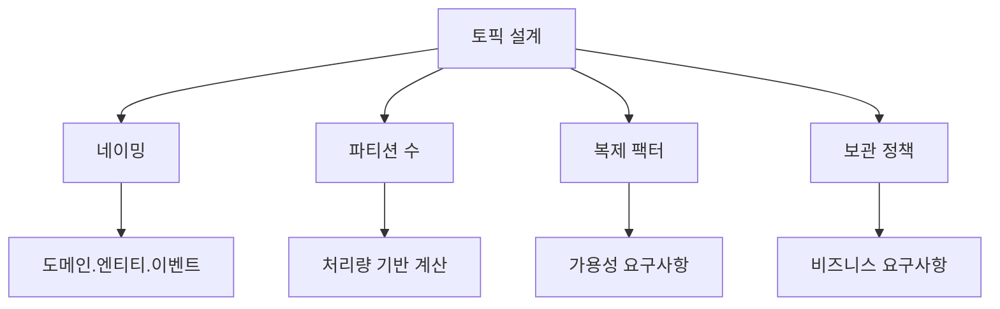
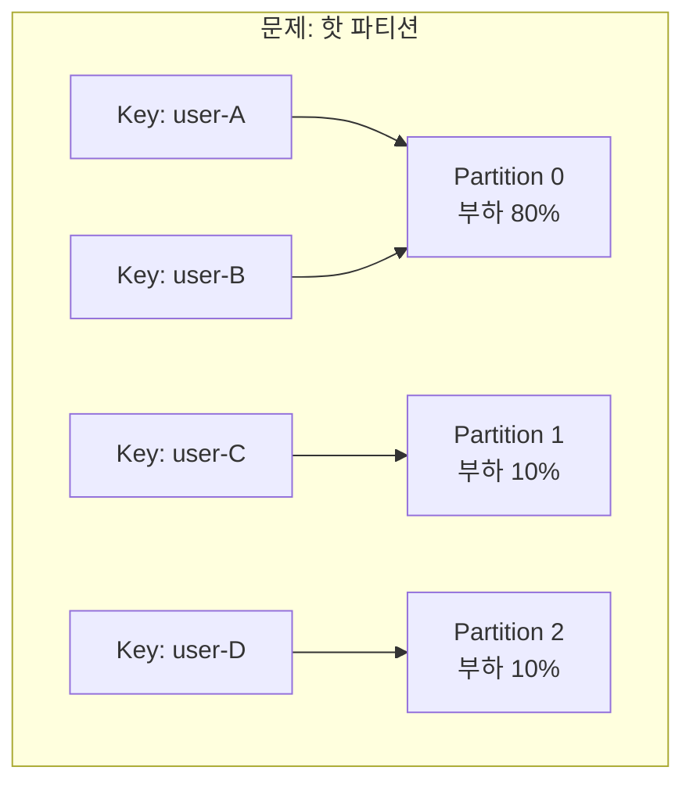
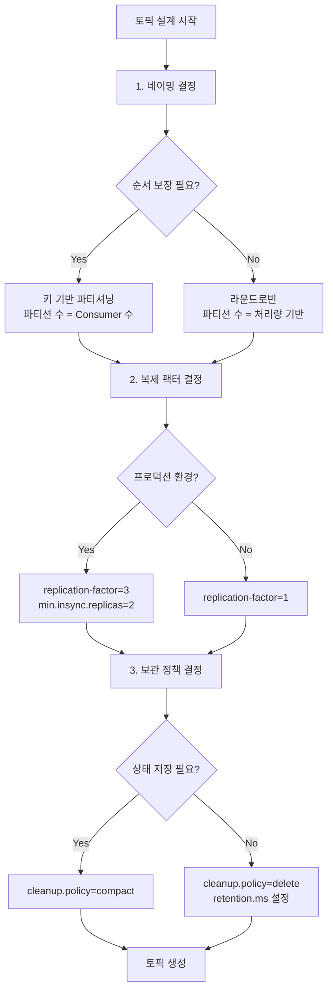

새로운 Kafka 토픽을 생성할 때 적절한 파티션 수, 복제 팩터, 보관 정책을 결정하는 방법을 안내합니다.

**소요 시간**: 약 15분


- **파티션 수**: 예상 처리량 / Consumer당 처리량, 최소 6개 권장
- **복제 팩터**: 프로덕션은 3, 개발은 1
- **보관 기간**: 비즈니스 요구사항 + 재처리 여유 시간
- **네이밍**: `{domain}.{entity}.{event-type}` 패턴 사용


---

## 시작하기 전에

### 필수 요구사항

| 항목 | 요구사항 | 확인 명령어 |
|------|---------|------------|
| Kafka CLI | 설치 및 PATH 등록 | `kafka-topics.sh --version` |
| Broker 접근 | 관리자 권한 | `kafka-acls.sh --list` |
| 클러스터 정보 | Broker 수 파악 | `kafka-broker-api-versions.sh` |

### 환경 확인

토픽 생성 권한과 클러스터 상태를 확인하세요:

```bash
# 클러스터 Broker 수 확인
kafka-metadata.sh --snapshot /var/kafka-logs/__cluster_metadata-0/00000000000000000000.log --command "broker" | wc -l

# 또는 기존 토픽으로 Broker 수 추정
kafka-topics.sh --bootstrap-server localhost:9092 --describe --topic __consumer_offsets | head -5
```

### Docker/Kubernetes 환경

컨테이너 환경에서는 다음과 같이 실행하세요:

```bash
# Docker
docker exec -it kafka kafka-topics.sh --bootstrap-server localhost:9092 --list

# Kubernetes
kubectl exec -it kafka-0 -- kafka-topics.sh --bootstrap-server localhost:9092 --list
```

---

## 토픽 설계의 핵심 요소

토픽 설계 시 결정해야 할 네 가지 핵심 요소:



*위 다이어그램은 토픽 설계 시 결정해야 할 네 가지 핵심 요소(네이밍, 파티션 수, 복제 팩터, 보관 정책)를 보여줍니다.*

---

## 1단계: 토픽 네이밍 규칙 정하기

### 1.1 권장 네이밍 패턴

일관된 네이밍 규칙은 관리와 모니터링을 용이하게 합니다:

```
{domain}.{entity}.{event-type}
```

**예시:**
| 토픽 이름 | 설명 |
|----------|------|
| `order.order.created` | 주문 도메인, 주문 엔티티, 생성 이벤트 |
| `order.payment.completed` | 주문 도메인, 결제 엔티티, 완료 이벤트 |
| `inventory.stock.updated` | 재고 도메인, 재고 엔티티, 변경 이벤트 |
| `user.profile.changed` | 사용자 도메인, 프로필 엔티티, 변경 이벤트 |

### 1.2 네이밍 시 피해야 할 것

- 공백, 특수문자 (밑줄 `_`과 하이픈 `-`만 허용)
- 너무 일반적인 이름 (`events`, `messages`, `data`)
- 버전을 이름에 포함 (`orders-v2` 대신 스키마 버전 관리 사용)

```bash
# 좋은 예
kafka-topics.sh --create --topic order.order.created

# 피해야 할 예
kafka-topics.sh --create --topic orders        # 너무 일반적
kafka-topics.sh --create --topic orders_v2     # 버전 포함
kafka-topics.sh --create --topic order-events  # 이벤트 타입 불명확
```

---

## 2단계: 파티션 수 결정하기

### 2.1 기본 공식

파티션 수는 예상 처리량과 Consumer 처리 능력을 기반으로 결정합니다:

```
파티션 수 = 목표 처리량(msg/sec) / Consumer당 처리량(msg/sec)
```

**계산 예시:**
- 목표 처리량: 10,000 msg/sec
- Consumer당 처리량: 2,000 msg/sec
- 필요 파티션 수: 10,000 / 2,000 = **5개** → 여유분 포함 **6개** 권장

### 2.2 파티션 수 결정 체크리스트

| 고려 사항 | 질문 | 영향 |
|----------|------|------|
| **처리량** | 피크 시 초당 메시지 수는? | 파티션 수 증가 필요 |
| **병렬성** | 동시 Consumer 수는? | 파티션 ≥ Consumer 수 |
| **순서 보장** | 키 기반 순서가 필요한가? | 핫 파티션 고려 |
| **확장 계획** | 향후 확장 가능성은? | 여유분 미리 확보 |

### 2.3 권장 파티션 수

| 환경 | 권장 파티션 수 | 이유 |
|------|---------------|------|
| 개발/테스트 | 3 | 최소한의 병렬 테스트 가능 |
| 소규모 프로덕션 | 6 | 기본 확장성 확보 |
| 중규모 프로덕션 | 12-24 | 충분한 병렬 처리 |
| 대규모 프로덕션 | 50-100+ | 요구사항에 따라 결정 |


한번 생성된 토픽의 파티션 수는 <strong>증가만 가능</strong>합니다. 줄이려면 토픽을 재생성해야 합니다.
파티션을 늘리면 키 기반 라우팅이 변경되어 순서 보장이 깨질 수 있습니다.


### 2.4 핫 파티션 문제 피하기

특정 키에 메시지가 집중되면 해당 파티션만 과부하됩니다:



*위 다이어그램은 특정 Key에 메시지가 집중되어 하나의 Partition에 부하가 편중되는 핫 파티션 문제를 보여줍니다.*

**해결 방법:**

1. **복합 키 사용**: 분포가 고른 필드 추가
   ```java
   String key = userId + "-" + orderId;
   ```

2. **랜덤 접미사 추가**: 순서 보장이 불필요한 경우
   ```java
   String key = userId + "-" + (System.currentTimeMillis() % 10);
   ```

3. **커스텀 파티셔너**: 비즈니스 로직에 맞는 분배
   ```java
   public class BalancedPartitioner implements Partitioner {
       @Override
       public int partition(String topic, Object key, byte[] keyBytes,
                           Object value, byte[] valueBytes, Cluster cluster) {
           // 커스텀 파티션 로직
           return customHash(key) % cluster.partitionCountForTopic(topic);
       }
   }
   ```

---

## 3단계: 복제 팩터 결정하기

### 3.1 복제 팩터 선택 기준

| 복제 팩터 | 허용 장애 | 권장 환경 | 디스크 사용량 |
|----------|----------|----------|--------------|
| 1 | 0 Broker | 개발, 테스트 | 1x |
| 2 | 1 Broker | 비-크리티컬 서비스 | 2x |
| 3 | 2 Broker | **프로덕션 권장** | 3x |

### 3.2 복제 팩터와 min.insync.replicas 조합

안전한 설정 조합:

```bash
# 프로덕션 권장 설정
kafka-topics.sh --bootstrap-server localhost:9092 \
  --create --topic order.order.created \
  --partitions 12 \
  --replication-factor 3 \
  --config min.insync.replicas=2
```

| 복제 팩터 | min.insync.replicas | 의미 |
|----------|---------------------|------|
| 3 | 2 | 1 Broker 장애 시에도 쓰기 가능 |
| 3 | 3 | 모든 Broker 필요 (비권장) |
| 2 | 1 | 장애 허용 X |

---

## 4단계: 보관 정책 설정하기

### 4.1 보관 정책 유형

| 정책 | 설정 | 설명 |
|------|------|------|
| **시간 기반** | `retention.ms` | 지정 시간 후 삭제 |
| **크기 기반** | `retention.bytes` | 지정 크기 초과 시 삭제 |
| **압축** | `cleanup.policy=compact` | 키별 최신 값만 유지 |

### 4.2 보관 기간 결정 기준

```
보관 기간 = 비즈니스 요구사항 + 재처리 여유 시간 + 장애 대응 시간
```

| 사용 사례 | 권장 보관 기간 | 이유 |
|----------|---------------|------|
| 실시간 로그 | 1-3일 | 디버깅 및 모니터링 |
| 이벤트 소싱 | 7-30일 | 재처리 및 분석 |
| 감사 로그 | 90일-1년 | 규정 준수 |
| CDC (Change Data Capture) | 영구 (compact) | 현재 상태 유지 |

### 4.3 보관 정책 설정 명령어

```bash
# 시간 기반: 7일 보관
kafka-configs.sh --bootstrap-server localhost:9092 \
  --entity-type topics --entity-name order.order.created \
  --alter --add-config retention.ms=604800000

# 크기 기반: 파티션당 10GB
kafka-configs.sh --bootstrap-server localhost:9092 \
  --entity-type topics --entity-name order.order.created \
  --alter --add-config retention.bytes=10737418240

# 압축 정책 (키별 최신 값만 유지)
kafka-configs.sh --bootstrap-server localhost:9092 \
  --entity-type topics --entity-name user.profile.current \
  --alter --add-config cleanup.policy=compact
```

---

## 5단계: 토픽 생성 및 검증

### 5.1 토픽 생성 스크립트

프로덕션 토픽 생성 예시:

```bash
#!/bin/bash

BOOTSTRAP_SERVER="localhost:9092"

# 주문 이벤트 토픽
kafka-topics.sh --bootstrap-server $BOOTSTRAP_SERVER \
  --create --if-not-exists \
  --topic order.order.created \
  --partitions 12 \
  --replication-factor 3 \
  --config min.insync.replicas=2 \
  --config retention.ms=604800000 \
  --config cleanup.policy=delete

# 사용자 프로필 토픽 (압축)
kafka-topics.sh --bootstrap-server $BOOTSTRAP_SERVER \
  --create --if-not-exists \
  --topic user.profile.current \
  --partitions 6 \
  --replication-factor 3 \
  --config min.insync.replicas=2 \
  --config cleanup.policy=compact \
  --config min.cleanable.dirty.ratio=0.5
```

### 5.2 토픽 설정 검증

생성된 토픽의 설정을 확인하세요:

```bash
# 토픽 상세 정보 확인
kafka-topics.sh --bootstrap-server localhost:9092 \
  --describe --topic order.order.created
```

**예상 출력:**
```
Topic: order.order.created  PartitionCount: 12  ReplicationFactor: 3  Configs: min.insync.replicas=2,retention.ms=604800000
    Topic: order.order.created  Partition: 0   Leader: 1   Replicas: 1,2,3   Isr: 1,2,3
    Topic: order.order.created  Partition: 1   Leader: 2   Replicas: 2,3,1   Isr: 2,3,1
    ...
```

확인할 포인트:
- [ ] PartitionCount가 예상대로인가?
- [ ] ReplicationFactor가 예상대로인가?
- [ ] 모든 파티션의 ISR이 ReplicationFactor와 같은가?
- [ ] min.insync.replicas가 설정되어 있는가?

---

## 설계 결정 플로우차트

새로운 토픽을 설계할 때 다음 순서로 결정하세요:



*위 다이어그램은 새 토픽 설계 시 네이밍 → 파티셔닝 전략 → 복제 팩터 → 보관 정책 순서로 의사결정하는 플로우를 보여줍니다.*

---

## 자주 발생하는 오류

### TopicExistsException

**오류 메시지:**
```
org.apache.kafka.common.errors.TopicExistsException:
Topic 'orders' already exists.
```

**해결 방법:**
```bash
# --if-not-exists 플래그 사용
kafka-topics.sh --bootstrap-server localhost:9092 \
  --create --if-not-exists --topic orders
```

### InvalidReplicationFactorException

**오류 메시지:**
```
org.apache.kafka.common.errors.InvalidReplicationFactorException:
Replication factor: 3 larger than available brokers: 1.
```

**원인:** 복제 팩터가 Broker 수보다 큼

**해결 방법:**
1. Broker 수 확인:
   ```bash
   kafka-broker-api-versions.sh --bootstrap-server localhost:9092 | grep "id:" | wc -l
   ```
2. 복제 팩터를 Broker 수 이하로 조정

### InvalidPartitionsException

**오류 메시지:**
```
org.apache.kafka.common.errors.InvalidPartitionsException:
Number of partitions must be at least 1.
```

**원인:** 파티션 수가 0 이하

**해결 방법:** 최소 1개 이상의 파티션 지정

### TopicDeletionDisabledException

**오류 메시지:**
```
org.apache.kafka.common.errors.TopicDeletionDisabledException:
Topic deletion is disabled.
```

**해결 방법:**
`server.properties`에서 토픽 삭제 활성화:
```properties
delete.topic.enable=true
```

---

## 체크리스트

토픽 생성 전 다음을 점검하세요:

### 네이밍
- [ ] `{domain}.{entity}.{event-type}` 형식을 따르는가?
- [ ] 특수문자 없이 소문자만 사용했는가?
- [ ] 다른 토픽과 충돌하지 않는가?

### 파티션
- [ ] 예상 처리량을 기반으로 계산했는가?
- [ ] 향후 확장을 위한 여유분을 포함했는가?
- [ ] 키 분포가 균등한지 확인했는가?

### 복제
- [ ] 환경에 맞는 복제 팩터를 설정했는가?
- [ ] min.insync.replicas를 설정했는가?
- [ ] Broker 수가 복제 팩터 이상인가?

### 보관
- [ ] 비즈니스 요구사항에 맞는 보관 기간을 설정했는가?
- [ ] 디스크 용량을 고려했는가?
- [ ] 상태 저장 토픽은 compact 정책을 사용하는가?

---

## 관련 문서

- [핵심 구성요소 - Topic과 Partition](../concepts/core-components/) - 토픽과 파티션 개념
- [복제와 내결함성](../concepts/replication/) - 복제 메커니즘 상세
- [메시지 손실 방지](message-loss-prevention/) - 안정적인 메시징 설정
- [Bounded Context 식별 가이드](../../ddd/howto/bounded-context-identification/) - 토픽 네이밍의 도메인 경계를 DDD로 식별하는 방법
