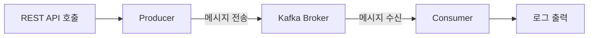
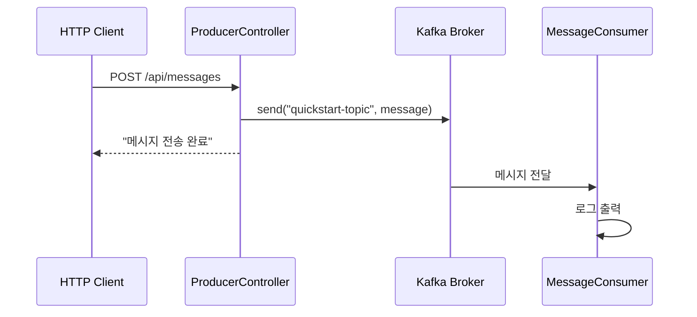

> **대상 독자**: Kafka를 처음 접하는 백엔드 개발자
> **선수 지식**: Java 기본 문법, REST API 개념, Docker 기초
> **이 문서를 읽으면**: Spring Boot에서 Kafka로 메시지를 전송하고 수신하는 전체 과정을 직접 실행할 수 있습니다


- Docker로 Kafka를 실행하고, Spring Boot 예제로 메시지 송수신을 테스트합니다
- `KafkaTemplate.send()`로 메시지를 발행하고, `@KafkaListener`로 수신합니다
- 전체 과정은 약 5분 소요됩니다


5분 만에 Kafka 메시지 송수신을 경험해보세요.

## 전체 흐름

Quick Start에서는 REST API 요청을 받아 Kafka로 메시지를 전송하고, Consumer가 이를 수신하여 로그로 출력하는 과정을 구현합니다.



*위 다이어그램은 REST API 호출부터 Consumer의 로그 출력까지 Quick Start의 전체 메시지 흐름을 보여줍니다.*

## 시작 전 확인

시작하기 전에 다음 도구들이 설치되어 있는지 확인하세요.

| 항목 | 확인 명령어 | 예상 결과 |
|------|-------------|-----------|
| Docker | `docker --version` | `Docker version 24.x.x` 이상 |
| Java | `java -version` | `openjdk version "17.x.x"` 이상 |
| Git | `git --version` | `git version 2.x.x` |



```bash
# Homebrew로 설치
brew install --cask docker
brew install openjdk@17
brew install git
```


```bash
# Docker 설치
curl -fsSL https://get.docker.com -o get-docker.sh
sudo sh get-docker.sh

# Java 17 설치
sudo apt update
sudo apt install openjdk-17-jdk

# Git 설치
sudo apt install git
```


```powershell
# Chocolatey로 설치 (관리자 권한 PowerShell)
choco install docker-desktop
choco install openjdk17
choco install git

# 또는 수동 설치
# - Docker Desktop: https://www.docker.com/products/docker-desktop
# - Java 17: https://adoptium.net/
# - Git: https://git-scm.com/download/win
```

**Windows 추가 설정:**
- Docker Desktop 설치 후 WSL 2 백엔드를 활성화하세요
- PowerShell 또는 Git Bash를 사용하세요



---

## Step 1/4: Kafka 시작하기 (~1분)

이 저장소의 루트 디렉토리에서 Docker Compose로 Kafka를 실행합니다.



```bash
# 저장소 루트의 docker 디렉토리로 이동
cd docker
docker-compose up -d
```


```powershell
# 저장소 루트의 docker 디렉토리로 이동
cd docker
docker-compose up -d
```


```bash
# 저장소 루트의 docker 디렉토리로 이동
cd docker
docker-compose up -d
```



`docker-compose.yml` 파일이 없다면 [환경 구성 가이드](../examples/setup/)에서 내용을 확인하고 `docker/docker-compose.yml`로 저장하세요.

### 실행 확인

정상 실행 여부를 확인하세요:

```bash
docker-compose ps
```

**예상 출력:**
```
NAME      COMMAND                  STATUS
kafka     "/etc/kafka/docker..."   Up
```


Kafka가 완전히 시작되기까지 10-20초 정도 걸릴 수 있습니다. `STATUS`가 `Up`이 될 때까지 기다리세요.


---

## Step 2/4: 예제 프로젝트 실행하기 (~2분)

새 터미널에서 Quick Start 예제를 실행합니다.



```bash
# 저장소 루트에서 예제 디렉토리로 이동
cd examples/quick-start

# Gradle Wrapper 실행 권한 부여 (최초 1회)
chmod +x gradlew

# Spring Boot 애플리케이션 실행
./gradlew bootRun
```


```powershell
# 저장소 루트에서 예제 디렉토리로 이동
cd examples\quick-start

# Spring Boot 애플리케이션 실행
.\gradlew.bat bootRun
```


```bash
# 저장소 루트에서 예제 디렉토리로 이동
cd examples/quick-start

# Spring Boot 애플리케이션 실행
./gradlew.bat bootRun
```



**예상 출력:**
```
Started QuickStartApplication in X.XXX seconds
```


`./gradlew` 명령이 실행되지 않으면 `gradlew.bat bootRun`을 사용하세요.


---

## Step 3/4: 메시지 전송하기 (~1분)

새 터미널에서 REST API로 메시지를 전송합니다.



```bash
curl -X POST http://localhost:8080/api/messages \
  -H "Content-Type: text/plain" \
  -d "Hello Kafka!"
```


```powershell
Invoke-WebRequest -Uri "http://localhost:8080/api/messages" `
  -Method POST `
  -ContentType "text/plain" `
  -Body "Hello Kafka!"
```

또는 curl이 설치되어 있다면:
```powershell
curl.exe -X POST http://localhost:8080/api/messages -H "Content-Type: text/plain" -d "Hello Kafka!"
```


```bash
curl -X POST http://localhost:8080/api/messages \
  -H "Content-Type: text/plain" \
  -d "Hello Kafka!"
```



**예상 출력:**
```
메시지 전송 완료: Hello Kafka!
```

---

## Step 4/4: 메시지 수신 확인하기 (~1분)

Spring Boot 애플리케이션이 실행 중인 터미널에서 Consumer가 메시지를 수신한 로그를 확인하세요.

**예상 출력:**
```
INFO  c.e.quickstart.MessageConsumer : 메시지 수신: Hello Kafka!
```

---

## 축하합니다!

Kafka를 통한 메시지 송수신에 성공했습니다.


- [ ] Kafka 컨테이너가 실행 중입니다 (`docker-compose ps`로 확인)
- [ ] Spring Boot 애플리케이션이 시작되었습니다
- [ ] curl 요청이 `메시지 전송 완료: Hello Kafka!`를 반환했습니다
- [ ] Consumer 로그에서 `메시지 수신: Hello Kafka!`를 확인했습니다


---

## 종료

실행 중인 애플리케이션과 Kafka를 종료합니다.



```bash
# Spring Boot 애플리케이션: Ctrl+C

# Kafka 종료 (docker 디렉토리에서)
cd docker
docker-compose down
```


```powershell
# Spring Boot 애플리케이션: Ctrl+C

# Kafka 종료 (docker 디렉토리에서)
cd docker
docker-compose down
```



---

## 무엇이 일어났나요?

방금 실행한 과정을 단계별로 살펴봅니다.



*위 다이어그램은 HTTP Client → ProducerController → Kafka Broker → MessageConsumer 순서로 메시지가 전달되는 상세 시퀀스를 보여줍니다.*

| 순서 | 컴포넌트 | 동작 |
|------|----------|------|
| 1 | HTTP Client | curl로 HTTP 요청을 보냅니다 |
| 2 | ProducerController | 요청을 받아 메시지를 Kafka에 발행합니다 |
| 3 | Kafka Broker | 메시지를 `quickstart-topic`에 저장합니다 |
| 4 | MessageConsumer | Topic을 구독하여 메시지를 수신하고 로그로 출력합니다 |


Kafka는 기본적으로 존재하지 않는 Topic에 메시지를 보내면 자동으로 Topic을 생성합니다. 이는 `auto.create.topics.enable=true` 설정 때문입니다.


---

## 코드 살펴보기

Quick Start 예제가 어떻게 구성되어 있는지 살펴봅니다.

### Producer (메시지 전송)

`ProducerController`는 REST 요청을 받아 Kafka로 메시지를 전송합니다.

```java
// ProducerController.java
@RestController
@RequestMapping("/api/messages")
public class ProducerController {

    private static final String TOPIC = "quickstart-topic";
    private final KafkaTemplate<String, String> kafkaTemplate;

    public ProducerController(KafkaTemplate<String, String> kafkaTemplate) {
        this.kafkaTemplate = kafkaTemplate;
    }

    @PostMapping
    public String sendMessage(@RequestBody String message) {
        kafkaTemplate.send(TOPIC, message);
        return "메시지 전송 완료: " + message;
    }
}
```

- `KafkaTemplate`: Spring Kafka가 제공하는 메시지 전송 클래스입니다
- `send(topic, message)`: 지정한 Topic에 메시지를 전송합니다

### Consumer (메시지 수신)

`MessageConsumer`는 `@KafkaListener` 어노테이션으로 특정 Topic의 메시지를 자동으로 수신합니다.

```java
// MessageConsumer.java
@Component
public class MessageConsumer {

    private static final Logger log = LoggerFactory.getLogger(MessageConsumer.class);

    @KafkaListener(topics = "quickstart-topic", groupId = "quickstart-group")
    public void consume(String message) {
        log.info("메시지 수신: {}", message);
    }
}
```

- `@KafkaListener`: 지정한 Topic의 메시지를 자동으로 수신하는 어노테이션입니다
- `groupId`: Consumer Group ID로, 같은 그룹의 Consumer들은 메시지를 분배받아 처리합니다

### 설정 (application.yml)

```yaml
spring:
  kafka:
    bootstrap-servers: localhost:9092
    consumer:
      group-id: quickstart-group
      auto-offset-reset: earliest
    producer:
      key-serializer: org.apache.kafka.common.serialization.StringSerializer
      value-serializer: org.apache.kafka.common.serialization.StringSerializer
```

| 설정 | 설명 |
|------|------|
| `bootstrap-servers` | Kafka 브로커 주소 |
| `auto-offset-reset: earliest` | Consumer 시작 시 가장 오래된 메시지부터 읽음 |
| `key-serializer` / `value-serializer` | 메시지 직렬화 방식 |

---

## 트러블슈팅

### Kafka 연결 실패

`Connection to node -1 could not be established` 오류가 발생하면:

1. Docker가 실행 중인지 확인하세요:
   ```bash
   docker ps
   ```

2. Kafka 컨테이너 상태를 확인하세요:
   ```bash
   docker-compose ps
   ```

3. Kafka가 완전히 시작될 때까지 최대 30초 기다리세요

4. 문제가 지속되면 Kafka를 재시작하세요:
   ```bash
   docker-compose restart
   ```

### 포트 충돌

`Port 9092 is already in use` 오류가 발생하면:

1. 기존 Kafka 프로세스가 실행 중인지 확인하세요:
   ```bash
   lsof -i :9092    # macOS/Linux
   netstat -ano | findstr :9092    # Windows
   ```

2. 기존 프로세스를 종료하거나 `docker-compose.yml`에서 포트를 변경하세요

### Gradle 빌드 실패

`Could not resolve dependencies` 오류가 발생하면:

1. Java 17 이상이 설치되어 있는지 확인하세요:
   ```bash
   java -version
   ```

2. Gradle 캐시를 정리하세요:
   
   
   ```bash
   ./gradlew clean
   ```
   
   
   ```powershell
   .\gradlew.bat clean
   ```
   
   

### Consumer 로그가 안 보여요

메시지를 전송했는데 Consumer 로그가 출력되지 않는다면:

1. Spring Boot가 실행 중인 터미널을 확인하세요 (curl을 실행한 터미널이 아닙니다)

2. 애플리케이션 시작 로그에서 `KafkaMessageListenerContainer` 관련 로그가 있는지 확인하세요. 없다면 Kafka 연결에 문제가 있을 수 있습니다

3. Kafka 브로커가 정상 동작하는지 확인하세요:
   ```bash
   docker-compose logs kafka
   ```

---

## 다음 단계

Quick Start를 완료했다면 다음 단계로 진행하세요:

| 목표 | 추천 문서 |
|------|----------|
| Kafka 개념 이해하기 | [핵심 구성요소](../concepts/core-components/) |
| 더 복잡한 예제 실습하기 | [Spring Kafka로 Producer/Consumer 구현하기](../examples/basic/) |
| 프로덕션 설정 알아보기 | [환경 구성](../examples/setup/) |
