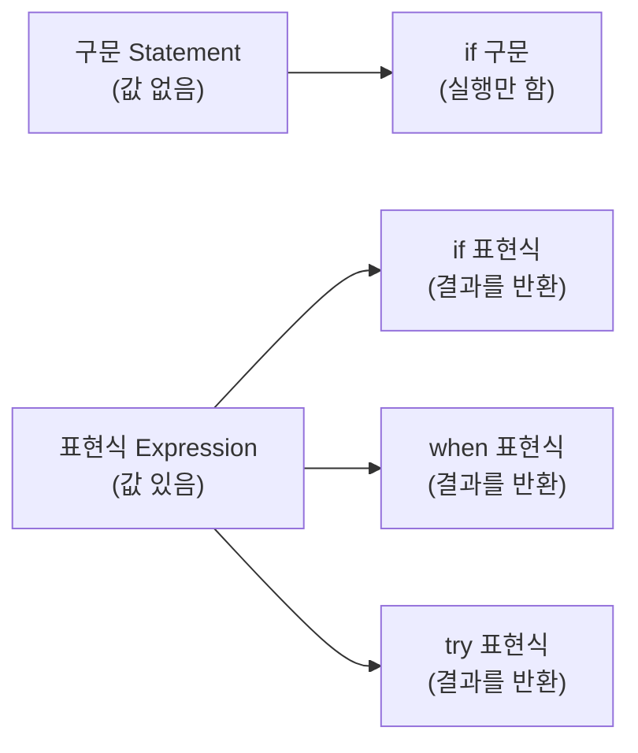

## 전체 비유: 악보와 연주

Kotlin의 기본 문법을 **악보와 연주** 에 비유하면 이해하기 쉽습니다. 악보는 규칙이 있지만, 좋은 악보는 불필요한 기호를 과감히 생략합니다. Kotlin도 마찬가지입니다. 세미콜론을 생략하고, 표현식 하나로 결과를 바로 돌려주며, 코드의 의도가 전면에 드러납니다.

| 악보 비유 | Kotlin 개념 | 역할 |
|-----------|------------|------|
| 악보의 시작 기호 | `package` 선언 | 파일이 속한 네임스페이스 정의 |
| 악기 배치표 | `import` | 사용할 외부 기호 불러오기 |
| 연주 시작 지시 | `fun main` | 프로그램 진입점 |
| 소절 구분선 생략 | 세미콜론 생략 | 줄바꿈이 문장 끝을 의미 |
| 음악적 표현(한 음표로 선율) | 표현식 본문 | 단일 표현식으로 결과 반환 |

---

> **대상 독자**: 프로그래밍 기초 개념(변수, 함수)을 알고 있는 학습자
> **선수 지식**: 변수와 함수의 기본 개념
> **소요 시간**: 약 20분
> **이 문서를 읽으면**: Kotlin 소스 파일의 구조를 이해하고, 세미콜론 없이 코드를 작성하며, `fun main`으로 프로그램을 시작할 수 있습니다.


- **세미콜론 불필요** — 줄바꿈이 문장의 끝 역할을 합니다
- **표현식 기반** — `if`, `when`, `try`가 모두 값을 반환합니다
- **진입점은 `fun main`** — 클래스 없이 최상위 함수로 작성합니다
- **`package`와 `import`** — 디렉토리 구조와 독립적으로 선언할 수 있습니다


#### 왜 기본 문법부터 시작하는가?

Kotlin을 처음 접하면 "Java랑 비슷하지 않나?"라고 느낄 수 있습니다. 문법의 외형은 친숙하지만, Kotlin은 몇 가지 핵심 철학에서 다릅니다. 그 중 가장 중요한 것이 **표현식 기반 언어** 라는 점입니다.

표현식(expression)은 **값을 만들어 내는 코드** 입니다. 구문(statement)과 달리 표현식은 어디서든 값으로 쓸 수 있습니다.



*그림: 구문(Statement)과 표현식(Expression)의 차이 — Kotlin에서 if·when·try는 값을 반환하는 표현식으로 사용됩니다.*

Kotlin에서 `if`, `when`, `try` 모두 표현식입니다. 이 차이가 코드 스타일 전체에 영향을 줍니다.

---

#### 패키지와 import

**패키지 선언**

모든 Kotlin 소스 파일은 `package` 선언으로 시작할 수 있습니다. 파일 맨 위에 위치하며, 해당 파일의 모든 클래스와 함수가 이 패키지에 속합니다.

```kotlin
package com.example.myapp

// 이 파일의 모든 선언은 com.example.myapp 패키지에 속합니다
fun greet(name: String) = "안녕하세요, $name!"
```


Kotlin 패키지 선언은 **디렉토리 구조와 일치하지 않아도 됩니다.** 어느 디렉토리에 파일을 두든 `package` 선언이 실제 패키지를 결정합니다. 다만 관례적으로 디렉토리 구조와 일치시키는 것이 좋습니다.


**import 선언**

다른 패키지의 클래스나 함수를 사용하려면 `import`로 가져옵니다.

```kotlin
package com.example.myapp

import java.time.LocalDate           // 특정 클래스 import
import java.time.format.DateTimeFormatter
import kotlin.math.*                  // 와일드카드 import

fun today(): String {
    val formatter = DateTimeFormatter.ofPattern("yyyy-MM-dd")
    return LocalDate.now().format(formatter)
}
```

| import 형태 | 예시 | 설명 |
|-------------|------|------|
| 특정 클래스 | `import java.util.Date` | 해당 클래스만 가져옴 |
| 와일드카드 | `import kotlin.math.*` | 패키지 전체 가져옴 |
| 별칭(as) | `import java.util.Date as JDate` | 이름 충돌 시 별칭 사용 |
| 최상위 함수 | `import com.example.greet` | 최상위 함수도 import 가능 |

---

#### 주석

Kotlin은 세 가지 주석 형식을 지원합니다.

```kotlin
// 단일 줄 주석 — 줄 끝까지

/* 
   여러 줄 주석 — C 스타일
   여러 줄에 걸쳐 작성 가능
*/

/**
 * KDoc 주석 — 문서화용
 * @param name 인사할 대상의 이름
 * @return 인사 문자열
 */
fun greet(name: String): String = "안녕하세요, $name!"
```


Kotlin의 블록 주석(`/* */`)은 **중첩이 가능합니다.** `/* 이것은 /* 중첩된 */ 주석입니다 */`와 같이 쓸 수 있습니다. 주석 처리된 코드 안에 이미 주석이 있어도 안전하게 처리됩니다.


---

#### 진입점: fun main

Kotlin 프로그램은 `main` 함수에서 시작합니다. 클래스 안에 넣을 필요 없이 최상위 함수로 선언합니다.

```kotlin
// 가장 간단한 형태 — 인자 없음
fun main() {
    println("Hello, Kotlin!")
}

// 커맨드라인 인자를 받는 형태
fun main(args: Array<String>) {
    if (args.isNotEmpty()) {
        println("첫 번째 인자: ${args[0]}")
    } else {
        println("인자가 없습니다.")
    }
}
```

`println`은 Kotlin 표준 라이브러리가 제공하는 함수입니다. `import` 없이 바로 사용할 수 있습니다.

**표준 입출력 함수**

| 함수 | 설명 | 예시 |
|------|------|------|
| `println(value)` | 값 출력 후 줄바꿈 | `println("Hello")` |
| `print(value)` | 값 출력 (줄바꿈 없음) | `print("Hello")` |
| `readLine()` | 표준 입력 한 줄 읽기 | `val line = readLine()` |
| `readln()` | 표준 입력 한 줄 읽기 (non-null) | `val line = readln()` |

---

#### 세미콜론 생략 규칙

Kotlin에서 세미콜론(`;`)은 **선택 사항** 입니다. 줄바꿈이 문장의 끝을 나타내므로 대부분의 경우 세미콜론 없이 코드를 작성합니다.

```kotlin
// 세미콜론 없이 — Kotlin 스타일
val name = "Kotlin"
val version = 2
println("$name $version")

// 세미콜론 있어도 오류는 아니지만 비관용적
val name = "Kotlin"; val version = 2; println("$name $version")
```

**세미콜론이 필요한 경우는?**

한 줄에 여러 문장을 쓸 때만 필요합니다. 하지만 이 방식은 가독성을 해치므로 권장하지 않습니다.

```kotlin
// 비권장 — 가독성이 낮음
val x = 1; val y = 2; val z = x + y

// 권장 — 각각 한 줄씩
val x = 1
val y = 2
val z = x + y
```

---

#### 표현식 기반 문법

Kotlin에서 `if`, `when`, `try`는 **표현식** 이므로 값을 직접 반환합니다.

**if 표현식**

```kotlin
// 표현식으로 사용 — 값을 반환
val max = if (a > b) a else b

// 블록도 표현식 — 마지막 값이 결과
val description = if (score >= 90) {
    println("우수")
    "A 등급"         // 이 값이 반환됨
} else {
    println("보통")
    "B 등급"         // 이 값이 반환됨
}
```

**when 표현식**

`when`은 Kotlin의 강력한 분기 표현식입니다. 값을 반환하므로 변수에 바로 할당할 수 있습니다.

```kotlin
val dayName = when (dayOfWeek) {
    1 -> "월요일"
    2 -> "화요일"
    3 -> "수요일"
    4 -> "목요일"
    5 -> "금요일"
    6 -> "토요일"
    7 -> "일요일"
    else -> "알 수 없음"
}

// 조건 기반 when — 여러 조건을 한 번에
val grade = when {
    score >= 90 -> "A"
    score >= 80 -> "B"
    score >= 70 -> "C"
    else        -> "F"
}
```

**try 표현식**

`try-catch`도 값을 반환합니다.

```kotlin
val number: Int = try {
    "42".toInt()      // 성공 시 이 값이 반환
} catch (e: NumberFormatException) {
    -1                // 실패 시 이 값이 반환
}
```

---

#### 코드 예제: 전부 합쳐보기

아래 예제는 패키지 선언, import, 주석, `fun main`, 표현식 문법을 모두 포함한 실행 가능한 Kotlin 파일입니다.

```kotlin
package com.example.basics

import kotlin.math.abs

/**
 * 두 정수 중 절대값이 더 큰 수를 반환합니다.
 * @param a 첫 번째 정수
 * @param b 두 번째 정수
 * @return 절대값이 더 큰 수
 */
fun largerAbsolute(a: Int, b: Int): Int =
    if (abs(a) > abs(b)) a else b

fun main() {
    // 변수 선언
    val x = -10
    val y = 7

    // if 표현식으로 값 계산
    val result = largerAbsolute(x, y)
    println("절대값이 더 큰 수: $result")

    // when 표현식으로 범주 분류
    val category = when {
        abs(result) >= 10 -> "큰 수"
        abs(result) >= 5  -> "중간 수"
        else              -> "작은 수"
    }
    println("범주: $category")

    // try 표현식으로 안전한 파싱
    val parsed: Int = try {
        "123".toInt()
    } catch (e: NumberFormatException) {
        0
    }
    println("파싱된 값: $parsed")
}
```

---

#### 핵심 포인트


- **패키지 선언** 은 디렉토리 구조와 독립적이며, 파일 맨 위에 위치합니다
- **import 별칭** (`as`)으로 이름 충돌을 해결할 수 있습니다
- **세미콜론 불필요** — 줄바꿈이 문장의 끝을 나타냅니다
- **`fun main`** 은 클래스 없이 최상위에 선언하는 프로그램 진입점입니다
- **`if`, `when`, `try`** 는 모두 값을 반환하는 표현식입니다


#### 다음 단계

- [변수와 타입](../variables-types/) - `val`/`var`, 기본 타입, 타입 추론을 학습합니다
- [함수](../functions/) - 함수 정의와 람다의 기초를 배웁니다
