## 전체 비유: 창고, 목록, 지도

Kotlin 컬렉션을 **창고·목록·지도** 에 비유하면 이해하기 쉽습니다. `List`는 순서 있는 목록(번호표 대기줄), `Set`은 중복 없는 창고(고유 입장객 명단), `Map`은 이름표가 붙은 보관함(키→값 지도)입니다. 불변(read-only) 창고는 열람만 가능하고, 가변(mutable) 창고는 물건을 넣고 뺄 수 있습니다.

| 비유 | Kotlin 개념 | 역할 |
|------|------------|------|
| 번호표 대기줄 | `List` | 순서 있고 중복 허용 |
| 고유 입장객 명단 | `Set` | 순서 무관, 중복 불허 |
| 이름표 보관함 | `Map` | 키→값 쌍 저장 |
| 열람 전용 창고 | read-only 컬렉션 | 수정 불가, 기본 선택 |
| 물건 넣고 빼는 창고 | mutable 컬렉션 | 수정 가능 |
| 주문 들어올 때 조리 | `Sequence` | 지연(lazy) 평가 |

---

> **대상 독자**: [Data/Sealed Class](../data-sealed-classes/)를 읽은 학습자
> **선수 지식**: Kotlin 기본 타입, 람다와 고차 함수
> **소요 시간**: 약 30분
> **이 문서를 읽으면**: Kotlin 컬렉션을 생성하고 변환하며, map/filter/fold 등 핵심 연산을 활용하고, Sequence로 대용량 데이터를 효율적으로 처리할 수 있습니다.


- **read-only** 컬렉션이 기본 (`listOf`, `setOf`, `mapOf`)
- **mutable** 이 필요하면 `mutableListOf`, `mutableMapOf` 등을 사용합니다
- **`map`/`filter`/`fold`** 로 함수형 변환, **`groupBy`** 로 분류합니다
- **`Sequence`** 는 중간 컬렉션 없이 요소를 하나씩 처리해 대용량에 효율적입니다


#### 왜 read-only와 mutable을 구분하는가?

컬렉션을 어디서 수정했는지 추적하는 것은 버그 원인 분석에서 가장 어려운 일 중 하나입니다. Kotlin은 **read-only 뷰** 를 기본으로 하여 의도치 않은 수정을 방지합니다. 수정이 필요할 때만 mutable 컬렉션을 명시적으로 선택합니다.

---

#### List

순서가 있고 중복을 허용하는 컬렉션입니다.

```kotlin
// read-only List — 수정 불가
val fruits = listOf("사과", "배", "감", "사과")
println(fruits.size)      // 4
println(fruits[0])        // 사과
println(fruits.first())   // 사과
println(fruits.last())    // 사과
println(fruits.contains("배"))   // true
println(fruits.count { it == "사과" })  // 2

// mutable List — 수정 가능
val mutableFruits = mutableListOf("사과", "배")
mutableFruits.add("감")
mutableFruits.remove("배")
mutableFruits[0] = "포도"
println(mutableFruits)   // [포도, 감]

// buildList — 빌더 패턴으로 read-only 생성
val numbers = buildList {
    add(1)
    addAll(listOf(2, 3, 4))
    add(5)
}
println(numbers)   // [1, 2, 3, 4, 5]
```

---

#### Set

중복을 허용하지 않는 컬렉션입니다. 순서는 보장되지 않습니다 (단, `LinkedHashSet`은 삽입 순서 유지).

```kotlin
// read-only Set
val tags = setOf("kotlin", "jvm", "backend", "kotlin")
println(tags.size)   // 3 (kotlin 중복 제거)
println("jvm" in tags)   // true

// mutable Set
val mutableTags = mutableSetOf("kotlin", "jvm")
mutableTags.add("backend")
mutableTags.add("kotlin")   // 중복 추가 — 무시됨
println(mutableTags.size)   // 3

// 집합 연산
val a = setOf(1, 2, 3, 4)
val b = setOf(3, 4, 5, 6)
println(a union b)        // [1, 2, 3, 4, 5, 6] — 합집합
println(a intersect b)    // [3, 4] — 교집합
println(a subtract b)     // [1, 2] — 차집합
```

---

#### Map

키-값 쌍을 저장하는 컬렉션입니다. 키는 고유합니다.

```kotlin
// read-only Map
val capitals = mapOf(
    "한국" to "서울",
    "일본" to "도쿄",
    "중국" to "베이징"
)

println(capitals["한국"])         // 서울
println(capitals.getValue("일본")) // 도쿄 (키 없으면 예외)
println(capitals.getOrDefault("미국", "모름"))  // 모름
println(capitals.containsKey("중국"))   // true

// mutable Map
val scores = mutableMapOf("Alice" to 85, "Bob" to 92)
scores["Charlie"] = 78
scores["Alice"] = 90   // 기존 값 업데이트
println(scores)   // {Alice=90, Bob=92, Charlie=78}

// Map 순회
for ((country, capital) in capitals) {
    println("$country의 수도는 $capital")
}
```

---

#### 생성 함수 요약

| 함수 | 결과 | 특징 |
|------|------|------|
| `listOf(...)` | `List<T>` | read-only |
| `mutableListOf(...)` | `MutableList<T>` | 수정 가능 |
| `arrayListOf(...)` | `ArrayList<T>` | ArrayList 구현체 |
| `emptyList()` | `List<T>` | 빈 read-only 리스트 |
| `setOf(...)` | `Set<T>` | read-only, 중복 제거 |
| `mutableSetOf(...)` | `MutableSet<T>` | 수정 가능 |
| `linkedSetOf(...)` | `LinkedHashSet<T>` | 삽입 순서 유지 |
| `mapOf(...)` | `Map<K, V>` | read-only |
| `mutableMapOf(...)` | `MutableMap<K, V>` | 수정 가능 |
| `hashMapOf(...)` | `HashMap<K, V>` | HashMap 구현체 |

---

#### 핵심 변환 연산

**map — 각 요소를 변환**

```kotlin
val numbers = listOf(1, 2, 3, 4, 5)

val doubled = numbers.map { it * 2 }
println(doubled)   // [2, 4, 6, 8, 10]

val strings = numbers.map { "item$it" }
println(strings)   // [item1, item2, item3, item4, item5]

// mapNotNull — 변환 결과 null 제거
val parsed = listOf("1", "abc", "3", "xyz").mapNotNull { it.toIntOrNull() }
println(parsed)   // [1, 3]

// flatMap — 중첩 컬렉션 펼치기
val nested = listOf(listOf(1, 2), listOf(3, 4), listOf(5))
val flat = nested.flatMap { it }
println(flat)   // [1, 2, 3, 4, 5]
```

**filter — 조건에 맞는 요소만 선택**

```kotlin
val numbers = listOf(1, 2, 3, 4, 5, 6, 7, 8, 9, 10)

val evens = numbers.filter { it % 2 == 0 }
println(evens)   // [2, 4, 6, 8, 10]

val largeOdds = numbers.filter { it % 2 != 0 && it > 5 }
println(largeOdds)   // [7, 9]

// filterNot — 조건에 맞지 않는 요소
val odds = numbers.filterNot { it % 2 == 0 }
println(odds)   // [1, 3, 5, 7, 9]

// filterIsInstance — 타입으로 필터링
val mixed: List<Any> = listOf(1, "hello", 2.0, "world", 3)
val strings = mixed.filterIsInstance<String>()
println(strings)   // [hello, world]
```

**reduce와 fold — 집계**

```kotlin
val numbers = listOf(1, 2, 3, 4, 5)

// reduce — 초기값 없이 첫 요소부터
val sum = numbers.reduce { acc, n -> acc + n }
println(sum)   // 15

// fold — 초기값 지정
val sumFrom10 = numbers.fold(10) { acc, n -> acc + n }
println(sumFrom10)   // 25

val product = numbers.fold(1) { acc, n -> acc * n }
println(product)   // 120

// 유용한 집계 함수들
println(numbers.sum())          // 15
println(numbers.average())      // 3.0
println(numbers.minOrNull())    // 1  (Kotlin 1.7+: min/max는 minOrNull/maxOrNull로 대체)
println(numbers.maxOrNull())    // 5
println(numbers.count { it > 3 })   // 2
```

**groupBy — 분류**

```kotlin
data class Student(val name: String, val grade: String, val score: Int)

val students = listOf(
    Student("김민준", "A", 95),
    Student("이서연", "B", 82),
    Student("박도윤", "A", 91),
    Student("최지우", "C", 65),
    Student("정하은", "B", 78)
)

// 등급별 분류
val byGrade: Map<String, List<Student>> = students.groupBy { it.grade }
byGrade.forEach { (grade, students) ->
    println("$grade 등급: ${students.map { it.name }}")
}
// A 등급: [김민준, 박도윤]
// B 등급: [이서연, 정하은]
// C 등급: [최지우]

// groupingBy + eachCount — 카운트
val gradeCount = students.groupingBy { it.grade }.eachCount()
println(gradeCount)   // {A=2, B=2, C=1}
```

**associateBy — 키로 변환**

```kotlin
data class Product(val id: String, val name: String, val price: Int)

val products = listOf(
    Product("P001", "사과", 1000),
    Product("P002", "배", 2000),
    Product("P003", "감", 1500)
)

// ID를 키로 하는 Map 생성
val productById: Map<String, Product> = products.associateBy { it.id }
println(productById["P002"]?.name)   // 배

// associate — 키-값 쌍 직접 지정
val priceByName = products.associate { it.name to it.price }
println(priceByName)   // {사과=1000, 배=2000, 감=1500}
```

---

#### 추가 유용한 연산

```kotlin
val numbers = listOf(3, 1, 4, 1, 5, 9, 2, 6)

// 정렬
println(numbers.sorted())           // [1, 1, 2, 3, 4, 5, 6, 9]
println(numbers.sortedDescending()) // [9, 6, 5, 4, 3, 2, 1, 1]

// 슬라이싱
println(numbers.take(3))     // [3, 1, 4]
println(numbers.drop(5))     // [9, 2, 6]
println(numbers.takeLast(2)) // [2, 6]
println(numbers.slice(1..3)) // [1, 4, 1]

// 존재 확인
println(numbers.any { it > 8 })    // true
println(numbers.all { it > 0 })    // true
println(numbers.none { it > 10 })  // true
println(numbers.find { it > 4 })   // 5 (첫 번째 일치)

// 평탄화
println(numbers.distinct())   // [3, 1, 4, 5, 9, 2, 6] (중복 제거)
println(numbers.chunked(3))   // [[3, 1, 4], [1, 5, 9], [2, 6]]
println(numbers.windowed(3))  // [[3,1,4], [1,4,1], [4,1,5], ...]
```

---

#### Sequence — 지연 평가

`Sequence`는 연산을 **즉시 실행하지 않고** 최종 연산이 호출될 때까지 미룹니다. 중간 컬렉션을 만들지 않아 대용량 데이터 처리에 효율적입니다.

**Sequence vs 일반 컬렉션 비교**

```kotlin
val numbers = (1..1_000_000).toList()

// 일반 컬렉션 — 각 단계마다 전체 컬렉션 생성
val result1 = numbers
    .filter { it % 2 == 0 }     // 500_000개 중간 컬렉션
    .map { it * 3 }             // 500_000개 중간 컬렉션
    .take(5)                    // 최종 5개
println(result1)

// Sequence — 요소 하나씩 파이프라인 통과
val result2 = numbers.asSequence()
    .filter { it % 2 == 0 }    // 지연
    .map { it * 3 }            // 지연
    .take(5)                   // 지연
    .toList()                  // 여기서 실제 실행 — 10개만 처리
println(result2)
// [6, 12, 18, 24, 30]
```

**Sequence 처리 흐름**

```mermaid
graph LR
    A["1, 2, 3, 4, 5, ..."]
    B["filter {짝수}"]
    C["map {*3}"]
    D["take(3)"]
    E["결과: &#91;6, 12, 18&#93;"]

    A -->|"2"| B
    B -->|"통과"| C
    C -->|"6"| D
    D -->|"1개"| E

    A -->|"4"| B
    B -->|"통과"| C
    C -->|"12"| D
    D -->|"2개"| E
```



**언제 Sequence를 쓰는가?**

| 상황 | 권장 |
|------|------|
| 요소가 적고 연산 단계가 적음 | 일반 컬렉션 |
| 요소가 많고 중간에 `take`/`find` 있음 | `Sequence` |
| 파일 라인, 무한 시퀀스 | `Sequence` |
| 여러 연산 단계가 있고 전체 결과가 필요 | 일반 컬렉션 (단계별 병렬화 가능) |

```kotlin
// generateSequence — 무한 Sequence
val fibonacci = generateSequence(Pair(0, 1)) { (a, b) -> Pair(b, a + b) }
    .map { it.first }
    .take(10)
    .toList()
println(fibonacci)   // [0, 1, 1, 2, 3, 5, 8, 13, 21, 34]
```

---

#### 코드 예제: 실전 컬렉션 활용

```kotlin
package com.example.collections

data class Order(
    val id: String,
    val customerId: String,
    val amount: Double,
    val status: String
)

fun main() {
    val orders = listOf(
        Order("O001", "C001", 15000.0, "완료"),
        Order("O002", "C002", 8000.0, "취소"),
        Order("O003", "C001", 22000.0, "완료"),
        Order("O004", "C003", 5000.0, "진행중"),
        Order("O005", "C002", 12000.0, "완료"),
        Order("O006", "C001", 3000.0, "취소")
    )

    // 완료된 주문만 필터링
    val completed = orders.filter { it.status == "완료" }
    println("완료된 주문 수: ${completed.size}")

    // 고객별 주문 합계
    val totalByCustomer = completed
        .groupBy { it.customerId }
        .mapValues { (_, orders) -> orders.sumOf { it.amount } }
    println("고객별 합계: $totalByCustomer")

    // 상위 2개 주문
    val top2 = orders
        .filter { it.status == "완료" }
        .sortedByDescending { it.amount }
        .take(2)
    println("상위 2개 주문: ${top2.map { it.id }}")

    // ID로 빠른 조회
    val orderById = orders.associateBy { it.id }
    println("O003 상태: ${orderById["O003"]?.status}")

    // 전체 매출 (완료 기준)
    val totalRevenue = orders
        .asSequence()
        .filter { it.status == "완료" }
        .sumOf { it.amount }
    println("총 매출: $totalRevenue 원")
}
```

---

#### 핵심 포인트


- **read-only 컬렉션** (`listOf` 등)이 기본, 수정이 필요하면 `mutableListOf` 등을 사용합니다
- **`map`/`filter`** 로 변환·필터링, **`fold`/`reduce`** 로 집계합니다
- **`groupBy`** 로 분류, **`associateBy`** 로 Map을 빠르게 생성합니다
- **`Sequence`** 는 대용량 데이터나 중간에 조기 종료가 있을 때 사용합니다
- **`any`/`all`/`none`/`find`** 로 조건 확인과 검색을 간결하게 처리합니다


#### 다음 단계

- [확장 함수](../extension-functions/) - 컬렉션에 커스텀 연산을 추가하는 방법을 배웁니다
- [스코프 함수](../scope-functions/) - 컬렉션과 함께 자주 쓰이는 let, apply, also를 학습합니다
