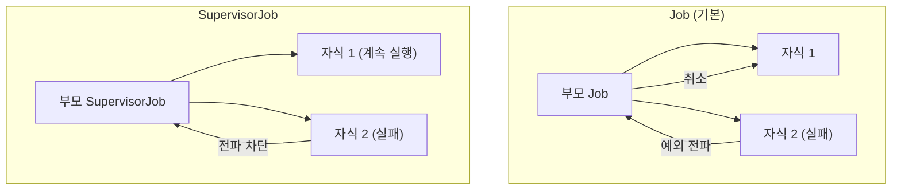
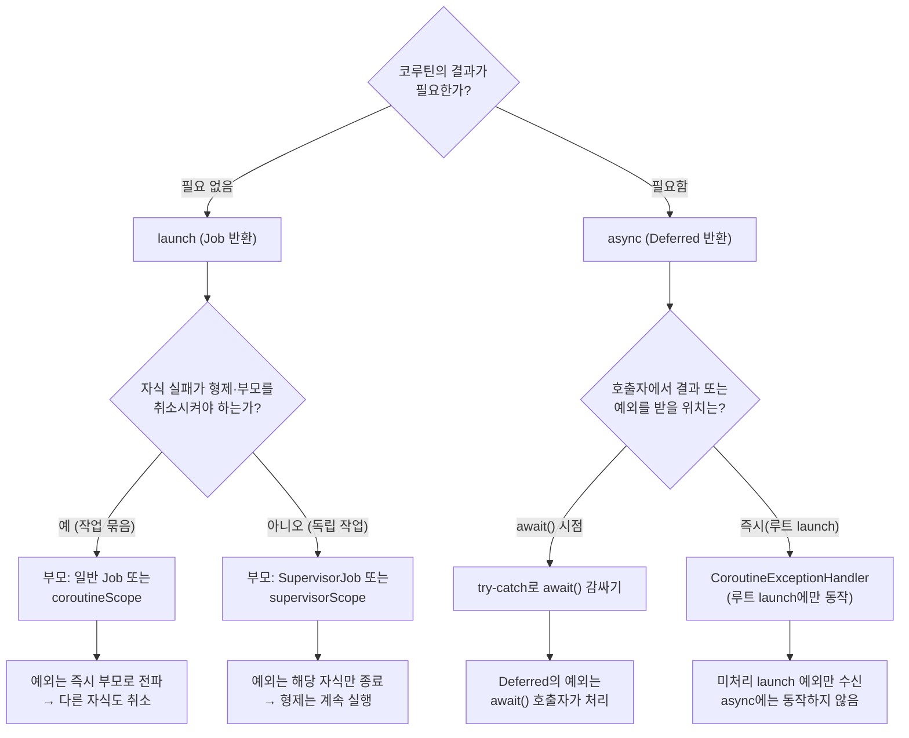

## 전체 비유: 항공사 운항 시스템

항공사 운항 시스템에서 하나의 편 지연이 전체 스케줄에 영향을 줄 수 있지만, `SupervisorJob`처럼 각 노선을 독립적으로 관리하면 한 편의 결항이 다른 편에 영향을 주지 않습니다.

| 항공사 비유 | Kotlin 코루틴 | 역할 |
|------------|-------------|------|
| 항공 관제 데이터 | `CoroutineContext` | 코루틴 실행 정보 묶음 |
| 편명 식별자 | `CoroutineName` | 코루틴 이름 지정 |
| 노선별 독립 스케줄 | `SupervisorJob` | 자식 실패가 형제에 영향 없음 |
| 항공편 탑승구 채널 | `Channel<T>` | 코루틴 간 안전한 데이터 전달 |
| 먼저 도착한 편 처리 | `select { }` | 여러 채널 중 먼저 도착한 것 처리 |

---

> **대상 독자**: 코루틴 기초와 Flow를 이해한 개발자
> **선수 지식**: [코루틴 기초](../coroutines-basics/), [Flow와 비동기 스트림](../flow-async-streams/)
> **소요 시간**: 약 45~55분
> **이 문서를 읽으면**: CoroutineContext를 직접 조합하고, 예외 전파 구조를 제어하며, Channel과 select로 복잡한 비동기 통신을 설계할 수 있습니다.


- `CoroutineContext`는 Dispatcher, Job, CoroutineName 등의 요소를 `+`로 조합합니다.
- `SupervisorJob`/`supervisorScope`를 쓰면 자식 코루틴의 실패가 다른 자식에 전파되지 않습니다.
- `CoroutineExceptionHandler`는 `launch`에서 잡히지 않은 예외를 처리합니다.
- `Channel`은 코루틴 간 안전한 큐로, Rendezvous/Buffered/Unlimited 세 가지 모드가 있습니다.
- `select { }`는 여러 채널 중 먼저 준비된 것을 선택합니다.


---

#### CoroutineContext — 코루틴의 DNA

`CoroutineContext`는 코루틴 실행에 필요한 정보를 담는 불변 컨테이너입니다. `+` 연산자로 요소를 조합합니다.

```kotlin
import kotlinx.coroutines.*

fun main() = runBlocking {
    // 여러 컨텍스트 요소를 + 로 조합
    val context = Dispatchers.IO +
                  CoroutineName("DataLoader") +
                  CoroutineExceptionHandler { _, e -> println("예외: $e") }

    launch(context) {
        println("실행 중 스레드: ${Thread.currentThread().name}")
        println("코루틴 이름: ${coroutineContext[CoroutineName]?.name}")
    }
}
// 실행 중 스레드: DefaultDispatcher-worker-1
// 코루틴 이름: DataLoader
```

**주요 CoroutineContext 요소:**

| 요소 | 타입 | 역할 |
|------|------|------|
| `Dispatchers.IO` | `CoroutineDispatcher` | 실행 스레드 풀 지정 |
| `Job()` | `Job` | 생명주기 관리, 취소 전파 |
| `CoroutineName("name")` | `CoroutineName` | 디버깅용 이름 |
| `CoroutineExceptionHandler` | `CoroutineExceptionHandler` | 미처리 예외 핸들러 |

---

#### CoroutineScope — 생명주기 관리의 핵심

`CoroutineScope`는 `CoroutineContext`를 감싸고, 해당 스코프 내 모든 코루틴의 생명주기를 관리합니다.

```kotlin
import kotlinx.coroutines.*

class UserRepository {
    // 이 Repository와 생명주기를 같이 하는 스코프
    private val scope = CoroutineScope(Dispatchers.IO + SupervisorJob())

    fun loadUser(id: Int) {
        scope.launch {
            // DB 조회
            delay(100)
            println("사용자 $id 로드 완료")
        }
    }

    fun close() {
        scope.cancel()  // 모든 자식 코루틴 취소
    }
}

fun main() = runBlocking {
    val repo = UserRepository()
    repo.loadUser(1)
    repo.loadUser(2)
    delay(200)
    repo.close()
}
```

**커스텀 스코프 생성:**

```kotlin
import kotlinx.coroutines.*

// Job()을 직접 넘기면 해당 Job으로 취소를 제어할 수 있음
val myScope = CoroutineScope(Dispatchers.Default + Job())

// supervisorScope는 자식 실패가 독립적
val supervisorScopeExample = CoroutineScope(Dispatchers.Default + SupervisorJob())
```

---

#### 예외 전파 구조

코루틴의 예외 전파는 `launch`와 `async`에서 다르게 동작합니다.

**launch에서의 예외:**

`launch`로 시작한 코루틴에서 예외가 발생하면, 예외는 **즉시** 부모 Job으로 전파됩니다. 부모는 취소되고, 다른 자식도 모두 취소됩니다.

```kotlin
import kotlinx.coroutines.*

fun main() = runBlocking {
    try {
        coroutineScope {
            launch {
                delay(100)
                println("자식 1: 정상 완료")
            }
            launch {
                delay(50)
                throw RuntimeException("자식 2 실패!")
            }
        }
    } catch (e: Exception) {
        println("부모가 받은 예외: ${e.message}")
    }
    // 자식 2가 실패하면 자식 1도 취소됨
}
// 부모가 받은 예외: 자식 2 실패!
```

**async에서의 예외:**

`async`의 예외는 `await()` 호출 시점에 전파됩니다.

```kotlin
import kotlinx.coroutines.*

fun main() = runBlocking {
    val deferred = async {
        delay(100)
        throw RuntimeException("async 실패!")
    }

    try {
        deferred.await()  // 여기서 예외 발생
    } catch (e: Exception) {
        println("await에서 잡힌 예외: ${e.message}")
    }
}
```

---

#### SupervisorJob과 supervisorScope

`SupervisorJob`을 사용하면 자식 코루틴의 실패가 **형제나 부모에게 전파되지 않습니다.** 독립적인 작업들(예: 여러 사용자 데이터 로드, 다수 API 병렬 호출)에 적합합니다.

```kotlin
import kotlinx.coroutines.*

fun main() = runBlocking {
    // supervisorScope: 자식 실패가 다른 자식에 영향 없음
    supervisorScope {
        val child1 = launch {
            delay(100)
            println("자식 1: 정상 완료")
        }

        val child2 = launch {
            delay(50)
            throw RuntimeException("자식 2 실패!")
            // 자식 1은 영향 없이 계속 실행됨
        }

        // child2 실패를 개별적으로 처리
        child2.join()
        println("child2 상태: ${child2.isCancelled}")
    }
    println("supervisorScope 종료")
}
// 자식 2 실패!
// 자식 1: 정상 완료
// child2 상태: true  (예외로 종료된 launch 코루틴은 isCancelled가 true)
// supervisorScope 종료
```

**Job vs SupervisorJob 비교:**



*그림: Job과 SupervisorJob 예외 전파 비교 — 기본 Job은 자식 실패가 부모와 형제 코루틴까지 취소시키는 반면, SupervisorJob은 실패한 자식만 독립적으로 종료됨을 보여줍니다.*

---

#### CoroutineExceptionHandler

`launch` 코루틴에서 잡히지 않은 예외를 처리하는 마지막 수단입니다. `async`에서는 동작하지 않습니다. `CoroutineExceptionHandler`는 구조화된 동시성에서 **루트 코루틴의 미처리(uncaught) 예외**만 받는 핸들러인데, `async`의 예외는 `Deferred` 안에 캡슐화되어 `await()`를 통해서만 노출되기 때문에 `Deferred`를 직접 받는 호출자가 `try-catch`로 처리해야 합니다.

```kotlin
import kotlinx.coroutines.*

fun main() = runBlocking {
    val handler = CoroutineExceptionHandler { context, exception ->
        val name = context[CoroutineName]?.name ?: "이름없음"
        println("[$name] 예외 처리: ${exception.message}")
    }

    val scope = CoroutineScope(
        Dispatchers.Default + SupervisorJob() + handler
    )

    scope.launch(CoroutineName("작업A")) {
        delay(100)
        throw IllegalStateException("작업A 실패")
    }

    scope.launch(CoroutineName("작업B")) {
        delay(200)
        println("작업B: 정상 완료")
    }

    delay(300)
    scope.cancel()
}
// [작업A] 예외 처리: 작업A 실패
// 작업B: 정상 완료
```


`CoroutineExceptionHandler`는 **루트 코루틴** 에서만 동작합니다. 자식 코루틴에 핸들러를 달아도 예외가 부모로 먼저 전파되므로 핸들러는 호출되지 않습니다. 또한 `async`의 예외는 `Deferred`에 캡슐화되어 `await()`로만 노출되므로 호출자가 `try-catch`로 처리해야 합니다.

추가로, `coroutineScope` 안에서 자식 `async`가 실패하면 다른 자식의 `await()`가 호출되기 전이라도 스코프 전체가 취소되어 부모로 예외가 올라갑니다. 자식 실패를 격리하려면 `supervisorScope` 또는 `SupervisorJob`을 사용해야 합니다.


---

#### 예외 처리 결정 트리

지금까지 살펴본 `launch`/`async`, `Job`/`SupervisorJob`, `try-catch`/`CoroutineExceptionHandler`의 선택지를 한눈에 정리합니다. 새로운 코드를 작성할 때 다음 흐름에 따라 결정하세요.



*그림: 코루틴 빌더·Job 유형·예외 처리 도구를 단계별로 선택하는 결정 트리. 결과 필요 여부 → 자식 격리 필요 여부 → 예외 수신 위치 순서로 묻습니다.*

자주 만나는 시나리오 3가지를 매핑하면 다음과 같습니다.

| 시나리오 | 빌더 | 부모 Job | 예외 처리 |
|---------|------|---------|---------|
| 백그라운드 작업 묶음(하나 실패 시 전체 취소) | `launch` | 일반 Job / `coroutineScope` | 루트에 `CoroutineExceptionHandler` |
| 여러 API 병렬 호출 후 결과 합치기 | `async` + `awaitAll` | `coroutineScope` | `try-catch`로 `awaitAll()` 감싸기 |
| 사용자별 알림 발송(한 사용자 실패가 다른 사용자에 영향 X) | `launch` | `SupervisorJob` / `supervisorScope` | 각 자식 내부 `try-catch` |


- **묶음 vs 독립**: 함께 망해야 하면 Job, 격리해야 하면 SupervisorJob.
- **결과 vs 통보**: 결과가 필요하면 `async + try-catch(await)`, 결과 없으면 `launch + CoroutineExceptionHandler`.
- `CoroutineExceptionHandler`는 **루트 `launch`에만** 동작합니다. 자식이나 `async`에서는 동작하지 않습니다.


---

#### Channel — 코루틴 간 통신

`Channel`은 코루틴 간에 데이터를 주고받는 **안전한 큐** 입니다. 여러 생산자-소비자 패턴을 구현할 수 있습니다.

**Channel 종류:**

| 종류 | 생성 방법 | 특징 |
|------|---------|------|
| Rendezvous | `Channel()` | 버퍼 없음. 송신자·수신자가 동시에 준비되어야 함 |
| Buffered | `Channel(capacity)` | 지정 크기의 버퍼. 버퍼 가득 차면 송신 suspend |
| Unlimited | `Channel(UNLIMITED)` | 버퍼 무한. 수신자 없어도 즉시 전달 |
| Conflated | `Channel(CONFLATED)` | 최신 값만 유지. 버퍼 크기 1 + 덮어쓰기 |

**기본 사용:**

```kotlin
import kotlinx.coroutines.*
import kotlinx.coroutines.channels.*

fun main() = runBlocking {
    val channel = Channel<Int>()

    // 생산자
    launch {
        for (i in 1..5) {
            println("전송: $i")
            channel.send(i)
        }
        channel.close()  // 전송 완료 신호
    }

    // 소비자
    for (value in channel) {  // channel.close() 시 반복 종료
        println("수신: $value")
    }
    println("채널 소비 완료")
}
```

**Buffered Channel:**

```kotlin
import kotlinx.coroutines.*
import kotlinx.coroutines.channels.*

fun main() = runBlocking {
    val channel = Channel<Int>(capacity = 3)  // 버퍼 3개

    launch {
        for (i in 1..5) {
            channel.send(i)
            println("전송 완료: $i")  // 버퍼 가득 차면 3번에서 suspend
        }
        channel.close()
    }

    delay(100)  // 생산자가 버퍼를 채울 시간
    for (value in channel) {
        delay(50)  // 소비를 느리게
        println("수신: $value")
    }
}
```

---

#### produce와 consumeEach

코루틴 스코프를 활용한 채널 생산자/소비자 패턴입니다.

```kotlin
import kotlinx.coroutines.*
import kotlinx.coroutines.channels.*

// produce: CoroutineScope 내에서 채널 생산자 정의
fun CoroutineScope.numbersProducer(from: Int, to: Int): ReceiveChannel<Int> = produce {
    for (i in from..to) {
        delay(100)
        send(i)
    }
}

fun main() = runBlocking {
    val channel = numbersProducer(1, 5)

    channel.consumeEach { value ->
        println("처리: $value")
    }
}
```

---

#### 팬아웃과 팬인 패턴

```kotlin
import kotlinx.coroutines.*
import kotlinx.coroutines.channels.*

// 팬아웃: 하나의 채널을 여러 소비자가 나눠 처리
fun main() = runBlocking {
    val channel = Channel<Int>(capacity = 10)

    // 생산자
    launch {
        for (i in 1..10) {
            channel.send(i)
        }
        channel.close()
    }

    // 소비자 3명 (팬아웃)
    repeat(3) { workerId ->
        launch {
            for (value in channel) {
                delay(100)
                println("워커 $workerId: $value 처리")
            }
        }
    }

    delay(2000)
}
```

---

#### select 표현식

`select`는 여러 채널 중 **먼저 준비된 것** 을 선택해서 처리합니다.

```kotlin
import kotlinx.coroutines.*
import kotlinx.coroutines.channels.*
import kotlinx.coroutines.selects.*

fun CoroutineScope.fastChannel(): ReceiveChannel<String> = produce {
    delay(50)
    send("빠른 서버 응답")
}

fun CoroutineScope.slowChannel(): ReceiveChannel<String> = produce {
    delay(200)
    send("느린 서버 응답")
}

fun main() = runBlocking {
    val fast = fastChannel()
    val slow = slowChannel()

    repeat(2) {
        val result = select<String> {
            fast.onReceive { it }
            slow.onReceive { it }
        }
        println("선택됨: $result")
    }

    fast.cancel()
    slow.cancel()
}
// 선택됨: 빠른 서버 응답
// 선택됨: 느린 서버 응답
```

**select with onSend:**

```kotlin
import kotlinx.coroutines.*
import kotlinx.coroutines.channels.*
import kotlinx.coroutines.selects.*

fun main() = runBlocking {
    val ch1 = Channel<String>(1)
    val ch2 = Channel<String>(1)

    launch {
        // 먼저 받을 수 있는 채널로 보내기
        select<Unit> {
            ch1.onSend("채널1로 전달") { println("ch1으로 보냄") }
            ch2.onSend("채널2로 전달") { println("ch2로 보냄") }
        }
    }

    delay(100)
    println(ch1.tryReceive().getOrNull() ?: ch2.tryReceive().getOrNull())
}
```

---

#### 코루틴 누수 방지 패턴

코루틴 누수는 취소되지 않은 코루틴이 계속 실행되는 상태입니다.

**누수가 발생하는 패턴:**

```kotlin
import kotlinx.coroutines.*

// 잘못된 예: GlobalScope 사용
// GlobalScope는 앱 전체 생명주기와 연결 → 취소 불가
fun badPattern() {
    GlobalScope.launch {   // 절대 사용하지 마세요!
        delay(10_000)
        println("이 코루틴은 언제 끝날까?")
    }
}
```

**올바른 패턴:**

```kotlin
import kotlinx.coroutines.*

class MyService {
    // SupervisorJob: 자식 실패가 스코프 전체를 취소하지 않음
    private val serviceScope = CoroutineScope(
        Dispatchers.IO + SupervisorJob() + CoroutineName("MyService")
    )

    fun start() {
        serviceScope.launch {
            // 서비스 작업
        }
    }

    fun stop() {
        serviceScope.cancel()  // 모든 작업 취소 + 자원 해제
    }
}
```

**Kotlin 공식 권고: `currentCoroutineContext()` 전달:**

```kotlin
import kotlinx.coroutines.*

// 콜백 기반 API를 코루틴으로 래핑할 때
suspend fun <T> awaitCallback(block: (callback: (T) -> Unit) -> Unit): T =
    suspendCancellableCoroutine { continuation ->
        block { result ->
            continuation.resume(result)
        }
        // 취소 시 자원 정리
        continuation.invokeOnCancellation {
            println("코루틴 취소 → 콜백 정리")
        }
    }
```

---

#### suspendCancellableCoroutine — 콜백 래핑

기존 콜백 기반 API를 suspend 함수로 변환할 때 사용합니다.

```kotlin
import kotlinx.coroutines.*

// 예: 콜백 기반 라이브러리 래핑
interface NetworkCallback {
    fun onSuccess(data: String)
    fun onError(error: Exception)
}

fun fetchDataWithCallback(url: String, callback: NetworkCallback) {
    Thread {
        Thread.sleep(200)
        callback.onSuccess("데이터: $url")
    }.start()
}

// suspend 함수로 변환
suspend fun fetchData(url: String): String = suspendCancellableCoroutine { cont ->
    fetchDataWithCallback(url, object : NetworkCallback {
        override fun onSuccess(data: String) {
            if (cont.isActive) cont.resume(data)
        }

        override fun onError(error: Exception) {
            if (cont.isActive) cont.resumeWithException(error)
        }
    })

    cont.invokeOnCancellation {
        println("요청 취소됨: $url")
    }
}

fun main() = runBlocking {
    val result = fetchData("https://example.com/api")
    println(result)
}
```

---

#### 핵심 포인트


- `CoroutineContext`는 `+`로 Dispatcher, Job, Name, Handler를 조합합니다.
- 기본 `Job`은 자식 실패 → 부모 취소 → 형제 취소 순으로 전파됩니다.
- `SupervisorJob`/`supervisorScope`는 자식 실패를 격리합니다.
- `CoroutineExceptionHandler`는 루트 `launch` 코루틴의 미처리 예외를 처리합니다.
- `Channel`은 타입별로 Rendezvous/Buffered/Unlimited를 선택해서 사용합니다.
- `select { }`로 여러 채널 중 먼저 준비된 것을 처리합니다.
- `GlobalScope` 사용을 피하고 명시적 스코프로 누수를 방지합니다.


---

#### 다음 단계

- [코루틴 디버깅](../../howto/coroutine-debugging/) — 디버깅 도구, 누수 진단
- [DSL 빌더](../dsl-builders/) — 코루틴 스코프를 활용한 DSL 설계
- [Flow와 비동기 스트림](../flow-async-streams/) — Channel과 SharedFlow 비교

> 💡 **함께 읽기**: 코루틴이 여러 서비스에 걸쳐 컨텍스트를 전파할 때는 [분산 추적]() 관점이 필요합니다. `CoroutineContext`를 트레이스 ID와 결합하면 비동기 호출 흐름을 끊김 없이 관찰할 수 있습니다.
