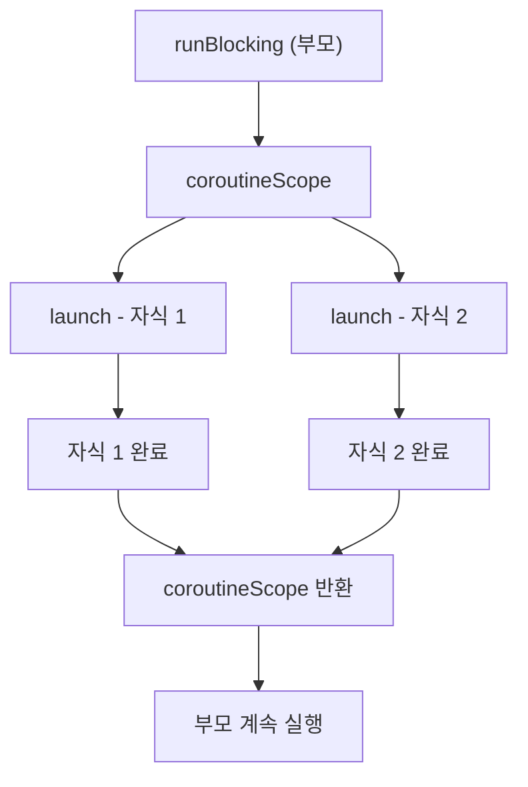

## 전체 비유: 카페 직원과 번호표

카페에서 음료를 주문받은 직원이 음료가 완성될 때까지 계산대를 비우지 않고, 번호표를 뽑아 다음 손님을 받는 모습에 비유할 수 있습니다.

| 카페 비유 | Kotlin 코루틴 | 역할 |
|----------|--------------|------|
| 음료 제조 요청 | `launch { }` | 비동기 작업 시작 (결과 불필요) |
| 음료 완성 후 수령 | `async { }.await()` | 비동기 작업 + 결과 수신 |
| 직원 (일시 정지/재개) | `suspend` 함수 | 스레드를 점유하지 않고 대기 |
| 제조 구역 | `Dispatcher` | 작업을 처리할 스레드 풀 |
| 카페 매니저 | `CoroutineScope` | 코루틴 전체 생명주기 관리 |

직원이 한 명이어도 여러 주문을 동시에 처리하듯, 코루틴은 적은 스레드로 많은 비동기 작업을 효율적으로 처리합니다.

---

> **대상 독자**: Kotlin 중급 이상, 비동기 프로그래밍 개념을 접한 적 있는 개발자
> **선수 지식**: Kotlin 함수, 람다, 기본 OOP
> **소요 시간**: 약 35~45분
> **이 문서를 읽으면**: `launch`, `async`, `suspend` 함수를 직접 작성하고, Dispatcher를 올바르게 선택할 수 있습니다.


- `suspend` 함수는 스레드를 블로킹하지 않고 일시 정지/재개됩니다.
- `launch`는 결과가 필요 없는 병렬 작업, `async`/`await`는 결과가 필요한 작업에 사용합니다.
- `Dispatchers.IO`는 I/O 작업, `Dispatchers.Default`는 CPU 집약적 작업에 적합합니다.
- `CoroutineScope`(구조화된 동시성)를 통해 자식 코루틴이 부모와 함께 취소됩니다.


---

#### 왜 코루틴이 필요한가?

전통적인 스레드 기반 비동기 프로그래밍에는 두 가지 문제가 있습니다.

첫째, **스레드 비용** 입니다. 하나의 스레드는 보통 1MB 내외의 스택을 차지합니다. DB 쿼리나 HTTP 요청 대기 중 스레드를 잡고 있으면, 동시 사용자가 수천 명만 돼도 서버가 부담을 받습니다.

둘째, **콜백 지옥** 입니다. 비동기 작업을 콜백으로 연결하면 코드가 중첩되고, 에러 처리가 여러 곳에 흩어집니다.

코루틴은 **경량 스레드(lightweight thread)** 로 불립니다. 수십만 개의 코루틴을 동시에 실행해도 스레드 풀은 CPU 코어 수 또는 I/O 용도의 작은 크기로 유지됩니다. 또한 비동기 코드를 순차 코드처럼 읽히도록 표현할 수 있어 가독성이 높습니다.

**전화 통화 보류(hold) 비유**: 콜센터 직원이 고객 문의를 처리하다가 잠깐 데이터를 조회해야 한다고 가정합니다. 직원이 보류 버튼을 누르면 회선은 그대로 유지되지만, 그 사이 직원은 다른 업무를 처리할 수 있습니다. 데이터가 준비되면 다시 회선으로 돌아와 응답합니다. `suspend` 함수도 똑같이 동작합니다. 함수가 일시 정지되는 동안 회선(코루틴 상태)은 보존되지만, 스레드는 풀려나 다른 작업을 처리합니다. 결과가 준비되면 그 함수가 정확히 멈췄던 지점에서 재개됩니다.

**스레드 1만 개 vs 코루틴 1만 개 자원 점유 비교**:

| 구분 | 스레드 1만 개 | 코루틴 1만 개 |
|------|--------------|---------------|
| 스택 메모리 | 약 10GB (1MB × 10,000) | 약 1MB 미만 (수십~수백 바이트 × 10,000) |
| 컨텍스트 스위칭 | 커널 모드 전환 비용 | 함수 호출 수준 (사용자 모드) |
| OS 자원 | 커널 스레드 1만 개 (현실적으로 불가) | JVM 스레드 풀의 코어 수만 사용 |
| 실현 가능성 | OS 한계로 사실상 불가능 | 일반 노트북에서도 여유 |

`Thread.sleep(1000)`은 스레드를 1초 동안 통째로 점유합니다. 반면 `delay(1000)`은 코루틴만 일시 정지하고 스레드는 즉시 다른 작업에 재할당됩니다.

**`suspend` 함수의 내부 동작**: 컴파일러는 `suspend` 함수를 **재개 가능한 상태 객체**(state machine)로 변환합니다. 이를 CPS(Continuation-Passing Style)라고 부르는데, 함수가 일시 정지될 때마다 "다음에 어디서부터 실행할지"를 담은 `Continuation` 객체를 만들어 보존합니다. 덕분에 함수는 멈췄던 지점부터 정확히 이어 실행됩니다.

---

#### suspend 함수

`suspend` 키워드는 함수가 **일시 정지 가능** 함을 선언합니다. suspend 함수는 코루틴 안에서만 호출할 수 있습니다.

```kotlin
import kotlinx.coroutines.*

// suspend 함수는 대기 중에는 스레드를 점유하지 않습니다
suspend fun fetchUserName(userId: Int): String {
    delay(500)  // Thread.sleep 대신 delay (스레드 비블로킹)
    return "User_$userId"
}

suspend fun fetchUserScore(userId: Int): Int {
    delay(300)
    return userId * 10
}
```

`delay()`는 `Thread.sleep()`과 달리 스레드를 블로킹하지 않습니다. 지정 시간 후에 코루틴을 재개합니다.

---

#### runBlocking — 코루틴 진입점

`runBlocking`은 현재 스레드를 블로킹하면서 코루틴 세계로 진입합니다. 테스트나 `main()` 함수에서 코루틴을 시작할 때 사용합니다. 프로덕션 서비스 코드에서는 사용하지 않습니다.


`runBlocking`은 main 스레드를 막고 코루틴을 실행하는 빌더입니다. 테스트와 `main` 함수에서만 쓰고, 실제 비동기 처리에는 `launch`/`async`를 씁니다. 이름 그대로 "블록(block)"하기 때문에 서버 요청 핸들러 안에서 호출하면 스레드가 통째로 멈춥니다.


```kotlin
import kotlinx.coroutines.*

fun main() = runBlocking {
    // 여기부터 코루틴 컨텍스트
    val name = fetchUserName(1)
    println("이름: $name")
}
```

---

#### launch — 결과가 필요 없는 비동기 작업

`launch`는 현재 코루틴을 블로킹하지 않고 새 코루틴을 시작합니다. 반환값은 `Job`으로, 작업의 생명주기를 관리하는 핸들입니다.

```kotlin
import kotlinx.coroutines.*

fun main() = runBlocking {
    val job: Job = launch {
        delay(1000)
        println("백그라운드 작업 완료")
    }

    println("launch 이후 즉시 실행됨")
    job.join()  // job이 완료될 때까지 대기 (선택적)
    println("모든 작업 완료")
}
// 출력:
// launch 이후 즉시 실행됨
// 백그라운드 작업 완료
// 모든 작업 완료
```

**여러 작업 동시 실행:**

```kotlin
import kotlinx.coroutines.*

fun main() = runBlocking {
    val startTime = System.currentTimeMillis()

    val job1 = launch { delay(1000); println("작업 1 완료") }
    val job2 = launch { delay(800); println("작업 2 완료") }
    val job3 = launch { delay(600); println("작업 3 완료") }

    job1.join()
    job2.join()
    job3.join()

    val elapsed = System.currentTimeMillis() - startTime
    println("총 소요 시간: ${elapsed}ms")
    // 약 1000ms (순차 실행이라면 2400ms)
}
```

---

#### async / await — 결과가 필요한 비동기 작업

`async`는 코루틴을 시작하고 `Deferred<T>`를 반환합니다. `.await()`를 호출하면 결과가 준비될 때까지 일시 정지합니다.

```kotlin
import kotlinx.coroutines.*

fun main() = runBlocking {
    val startTime = System.currentTimeMillis()

    // 두 작업을 동시에 시작
    val deferred1: Deferred<String> = async { fetchUserName(1) }
    val deferred2: Deferred<Int>    = async { fetchUserScore(1) }

    // 각각 완료될 때까지 대기 후 결과 수신
    val name  = deferred1.await()
    val score = deferred2.await()

    val elapsed = System.currentTimeMillis() - startTime
    println("이름: $name, 점수: $score (${elapsed}ms)")
    // 약 500ms (순차라면 800ms)
}
```

`async`를 호출하는 즉시 코루틴이 시작됩니다. `await()`는 결과를 기다리기만 합니다.


```kotlin
// 잘못된 예: await()를 즉시 호출하면 순차 실행과 동일
val name  = async { fetchUserName(1) }.await()   // 여기서 500ms 대기
val score = async { fetchUserScore(1) }.await()  // 여기서 300ms 대기
// 총 800ms — 병렬화 효과 없음
```
`async` 블록을 먼저 모두 시작한 뒤, 마지막에 `await()`를 호출하세요.


---

#### Dispatchers — 어느 스레드에서 실행할까?

`Dispatcher`는 코루틴이 어떤 스레드 풀에서 실행될지 결정합니다.

| Dispatcher | 스레드 풀 | 적합한 작업 |
|-----------|----------|------------|
| `Dispatchers.Default` | CPU 코어 수만큼 | 계산, JSON 파싱, 정렬 |
| `Dispatchers.IO` | 최대 64개 (확장 가능) | DB 쿼리, HTTP 호출, 파일 I/O |
| `Dispatchers.Main` | UI 스레드 1개 | Android/JavaFX UI 업데이트 |
| `Dispatchers.Unconfined` | 호출자 스레드 | 테스트, 특수 목적 |

```kotlin
import kotlinx.coroutines.*

fun main() = runBlocking {
    // CPU 집약적 작업 → Default
    val result = withContext(Dispatchers.Default) {
        (1..1_000_000).sum()
    }
    println("합계: $result")

    // I/O 작업 → IO
    val data = withContext(Dispatchers.IO) {
        delay(100) // DB 쿼리 시뮬레이션
        "DB 데이터"
    }
    println("데이터: $data")
}
```

---

#### withContext — 디스패처 전환

`withContext`는 지정된 컨텍스트(Dispatcher)로 전환하여 블록을 실행하고 결과를 반환합니다. 내부적으로 `suspend`되므로 현재 스레드를 블로킹하지 않습니다.

```kotlin
import kotlinx.coroutines.*

suspend fun loadFromDatabase(id: Int): String = withContext(Dispatchers.IO) {
    delay(200)  // DB 쿼리 시뮬레이션
    "Record_$id"
}

suspend fun processData(raw: String): String = withContext(Dispatchers.Default) {
    // CPU 집약적 처리
    raw.uppercase().reversed()
}

fun main() = runBlocking {
    val raw = loadFromDatabase(42)
    val processed = processData(raw)
    println(processed)  // 42_DROCER
}
```

---

#### 구조화된 동시성 (Structured Concurrency)

구조화된 동시성은 코루틴 관리의 핵심 원칙입니다. 부모 코루틴이 취소되면 모든 자식 코루틴도 함께 취소됩니다. 자식이 모두 완료돼야 부모가 완료됩니다.

`coroutineScope`는 자식 코루틴이 모두 끝날 때까지 기다리는 영역입니다. 영역 안에서 예외가 발생하면 모든 자식이 함께 취소됩니다.

```kotlin
import kotlinx.coroutines.*

fun main() = runBlocking {
    // coroutineScope는 모든 자식이 완료될 때까지 대기
    coroutineScope {
        val job1 = launch {
            delay(1000)
            println("자식 1 완료")
        }
        val job2 = launch {
            delay(500)
            println("자식 2 완료")
        }
        // 이 블록은 job1, job2 모두 완료된 후 반환됨
    }
    println("모든 자식 완료 후 이 라인 실행")
}
```



---

#### 협력적 취소 — isActive / yield

코루틴은 **협력적** 으로 취소됩니다. 취소 신호를 받으면 다음 `suspend` 지점에서 `CancellationException`을 던집니다. CPU 집약적 루프처럼 suspend 지점이 없는 코드에서는 명시적으로 취소 여부를 확인해야 합니다.

```kotlin
import kotlinx.coroutines.*

fun main() = runBlocking {
    val job = launch(Dispatchers.Default) {
        var count = 0
        while (isActive) {  // 취소 신호 확인
            count++
            if (count % 100_000 == 0) {
                yield()  // 다른 코루틴에게 실행 기회를 주고, 취소 확인
            }
        }
        println("루프 종료 (count=$count)")
    }

    delay(50)   // 50ms 후 취소
    job.cancel()
    job.join()
    println("완료")
}
```

`isActive`: 현재 코루틴이 활성 상태인지 확인합니다.
`yield()`: 다른 코루틴에게 실행 기회를 넘기고, 취소 신호도 처리합니다.

---

#### 취소와 자원 정리

취소 시 `finally` 블록은 반드시 실행됩니다. 파일, DB 연결 등의 자원을 안전하게 닫을 수 있습니다.

```kotlin
import kotlinx.coroutines.*

fun main() = runBlocking {
    val job = launch {
        try {
            println("작업 시작")
            delay(5000)
            println("작업 완료 (취소되면 이 줄은 실행 안 됨)")
        } finally {
            println("정리 중 (취소돼도 실행됨)")
            // withContext(NonCancellable) { ... }  ← 정리 중 추가 suspend 필요 시
        }
    }

    delay(200)
    println("취소 요청")
    job.cancelAndJoin()  // cancel() + join()
    println("완료")
}
// 출력:
// 작업 시작
// 취소 요청
// 정리 중 (취소돼도 실행됨)
// 완료
```

---

#### launch vs async 비교

```kotlin
import kotlinx.coroutines.*

fun main() = runBlocking {
    // launch: 부수 효과, 결과 불필요
    launch {
        delay(100)
        println("로그 기록 완료")  // 결과를 반환할 필요 없음
    }

    // async: 결과 필요
    val price: Deferred<Double> = async {
        delay(200)
        9900.0
    }

    val totalPrice = price.await() * 1.1
    println("최종 가격: $totalPrice")
}
```

| 구분 | `launch` | `async` |
|------|---------|---------|
| 반환 타입 | `Job` | `Deferred<T>` |
| 결과 수신 | 불가 | `.await()`로 수신 |
| 주 용도 | 부수 효과, 로깅 | 결과가 필요한 비동기 계산 |
| 예외 동작 | 즉시 부모로 전파 | `await()` 호출 또는 스코프 종료 시 전파 |

---

#### 실전 예제: 여러 API 병렬 호출

```kotlin
import kotlinx.coroutines.*

data class UserProfile(
    val name: String,
    val score: Int,
    val badges: List<String>
)

suspend fun fetchName(id: Int): String = withContext(Dispatchers.IO) {
    delay(300)
    "Alice"
}

suspend fun fetchScore(id: Int): Int = withContext(Dispatchers.IO) {
    delay(200)
    1500
}

suspend fun fetchBadges(id: Int): List<String> = withContext(Dispatchers.IO) {
    delay(250)
    listOf("신규 가입", "첫 결제", "VIP")
}

suspend fun buildUserProfile(userId: Int): UserProfile = coroutineScope {
    val nameDeferred   = async { fetchName(userId) }
    val scoreDeferred  = async { fetchScore(userId) }
    val badgesDeferred = async { fetchBadges(userId) }

    UserProfile(
        name   = nameDeferred.await(),
        score  = scoreDeferred.await(),
        badges = badgesDeferred.await()
    )
    // 총 ~300ms (순차라면 750ms)
}

fun main() = runBlocking {
    val profile = buildUserProfile(1)
    println(profile)
}
```

---

#### 핵심 포인트


- `suspend` 함수는 코루틴 안에서만 호출 가능하며, 스레드를 블로킹하지 않습니다.
- `launch` → `Job` (결과 없음), `async` → `Deferred<T>` (결과 있음).
- `Dispatchers.IO`는 I/O 블로킹 작업, `Dispatchers.Default`는 CPU 작업에 사용합니다.
- `withContext`는 지정된 디스패처로 전환해 블록을 실행하고 결과를 반환하는 suspend 함수입니다.
- 구조화된 동시성: 부모가 취소되면 자식도 취소됩니다.
- `isActive` / `yield()`로 CPU 집약적 코드에서 협력적 취소를 구현합니다.


---

#### 다음 단계

- [Flow와 비동기 스트림](../flow-async-streams/) — 코루틴 기반 반응형 스트림
- [코루틴 고급](../coroutines-advanced/) — CoroutineContext, Channel, SupervisorJob
- [코루틴 디버깅](../../howto/coroutine-debugging/) — 디버깅 도구와 누수 진단
