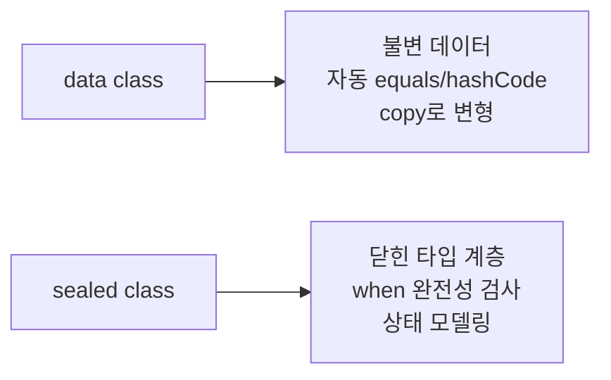

## 전체 비유: 도장 찍힌 서류와 닫힌 메뉴판

`data class`를 **도장 찍힌 공식 서류** 에, `sealed class`를 **항목이 고정된 메뉴판** 에 비유하면 이해하기 쉽습니다. 공식 서류는 내용이 같으면 동일한 서류로 취급하고(equals), 빠른 분류를 위해 해시 코드가 붙습니다(hashCode). 고정 메뉴판은 등록된 항목만 주문할 수 있어 "모든 경우를 처리했는가"를 컴파일러가 검증합니다.

| 비유 | Kotlin 개념 | 역할 |
|------|------------|------|
| 공식 서류 (내용으로 동일성 판단) | `data class` | equals/hashCode 자동 생성 |
| 복사본 발급 | `copy()` | 일부 변경한 새 인스턴스 생성 |
| 서류 항목 분리 접수 | 구조 분해 | `componentN()`으로 분해 |
| 고정 메뉴판 | `sealed class` | 하위 타입을 한 파일에 제한 |
| 메뉴 완전 처리 보증 | `when` + sealed | 누락 분기를 컴파일러가 경고 |

---

> **대상 독자**: [클래스와 객체](../classes-objects/)를 읽은 학습자
> **선수 지식**: Kotlin 클래스, primary 생성자, when 표현식
> **소요 시간**: 약 25분
> **이 문서를 읽으면**: 불변 데이터 모델을 `data class`로 정의하고, `sealed class`로 닫힌 타입 계층을 만들어 `when`으로 완전하게 처리할 수 있습니다.


- **`data class`** 는 equals/hashCode/toString/copy/componentN을 자동 생성합니다
- **`copy()`** 로 일부 필드만 바꾼 새 인스턴스를 만듭니다
- **`sealed class`** 는 하위 타입을 제한하여 `when`의 완전성 검사를 가능하게 합니다
- **구조 분해** 로 `data class` 인스턴스를 여러 변수에 한 번에 분리합니다


#### 왜 data class와 sealed class가 중요한가?

현대 애플리케이션 코드의 많은 부분은 **데이터를 표현하고 상태를 처리** 합니다. `data class`는 불변 데이터 표현을 간결하게 만들고, `sealed class`는 유한한 상태 집합을 타입 안전하게 모델링합니다.



---

#### data class — 자동 생성 메서드

`data class`를 선언하면 primary 생성자의 프로퍼티를 기반으로 다음 메서드가 자동 생성됩니다.

| 메서드 | 설명 |
|--------|------|
| `equals()` | 프로퍼티 값으로 동등성 비교 |
| `hashCode()` | 프로퍼티 기반 해시 코드 |
| `toString()` | `ClassName(prop1=val1, ...)` 형식 |
| `copy()` | 일부 프로퍼티를 변경한 새 인스턴스 |
| `componentN()` | 구조 분해를 위한 함수들 |

```kotlin
data class Point(val x: Int, val y: Int)

val p1 = Point(3, 4)
val p2 = Point(3, 4)
val p3 = Point(1, 2)

// equals — 값 기반 비교
println(p1 == p2)   // true (내용이 같으면 같음)
println(p1 == p3)   // false

// hashCode — 값 기반 해시
println(p1.hashCode() == p2.hashCode())   // true

// toString — 읽기 쉬운 형식
println(p1)   // Point(x=3, y=4)
```

---

#### copy() — 불변 변형

`copy()`는 인스턴스의 일부 필드만 변경한 새 인스턴스를 반환합니다. 불변 데이터를 "변경"하는 주요 패턴입니다.

```kotlin
data class User(
    val name: String,
    val age: Int,
    val email: String,
    val isActive: Boolean = true
)

val original = User("홍길동", 30, "hong@example.com")

// 이메일만 변경한 새 인스턴스
val updated = original.copy(email = "newhong@example.com")
println(updated)
// User(name=홍길동, age=30, email=newhong@example.com, isActive=true)

// 여러 필드 변경
val deactivated = original.copy(age = 31, isActive = false)
println(deactivated)
// User(name=홍길동, age=31, email=hong@example.com, isActive=false)

// 원본은 변경되지 않음
println(original)
// User(name=홍길동, age=30, email=hong@example.com, isActive=true)
```

---

#### 구조 분해 (Destructuring)

`data class`는 `component1()`, `component2()` 등의 함수가 자동 생성되어 구조 분해가 가능합니다.

```kotlin
data class Coordinate(val lat: Double, val lng: Double)

val seoul = Coordinate(37.5665, 126.9780)

// 구조 분해 선언
val (latitude, longitude) = seoul
println("위도: $latitude, 경도: $longitude")

// 불필요한 값은 _ 로 무시
val (lat, _) = seoul
println("위도만: $lat")
```

**반복문에서의 구조 분해**

```kotlin
data class Product(val name: String, val price: Int, val stock: Int)

val products = listOf(
    Product("사과", 1000, 50),
    Product("배", 2000, 30),
    Product("감", 1500, 20)
)

for ((name, price, stock) in products) {
    println("$name: $price원 (재고 $stock개)")
}

// Map.Entry도 구조 분해 가능
val prices = mapOf("사과" to 1000, "배" to 2000)
for ((item, price) in prices) {
    println("$item: ${price}원")
}
```

---

#### data class 주의사항

```kotlin
data class Config(
    val host: String,
    val port: Int,
    val tags: List<String>   // 가변 리스트라면 방어적 복사 고려
)

// primary 생성자 이외의 프로퍼티는 equals/hashCode에 포함 안 됨
data class Event(val id: Int, val name: String) {
    var processed: Boolean = false   // 이 필드는 equals에 포함되지 않음!
}

val e1 = Event(1, "click")
e1.processed = true
val e2 = Event(1, "click")
println(e1 == e2)   // true — processed는 비교하지 않음
```


`data class`를 JPA Entity에 사용할 때는 주의가 필요합니다. JPA는 인수 없는 생성자를 요구하고, equals/hashCode 구현이 프록시 객체와 충돌할 수 있습니다. JPA Entity에는 일반 `class`를 사용하고, DTO/값 객체에 `data class`를 활용하는 것이 일반적인 권장 사항입니다.


---

#### sealed class — 닫힌 타입 계층

`sealed class`는 하위 타입을 **같은 모듈·같은 패키지** 안에서만 정의할 수 있도록 제한합니다 (Kotlin 1.5+; 그 이전에는 같은 파일로 더 엄격하게 제한). 이 제한 덕분에 컴파일러가 모든 하위 타입을 파악할 수 있어, `when` 표현식의 완전성 검사가 가능합니다.

```kotlin
sealed class Result<out T> {
    data class Success<T>(val value: T) : Result<T>()
    data class Failure(val error: Throwable) : Result<Nothing>()
    object Loading : Result<Nothing>()
}

// when 표현식 — 모든 경우를 처리해야 함
fun <T> handleResult(result: Result<T>): String = when (result) {
    is Result.Success -> "성공: ${result.value}"
    is Result.Failure -> "실패: ${result.error.message}"
    is Result.Loading -> "로딩 중..."
    // else 불필요 — 컴파일러가 모든 케이스를 알고 있음
}
```

---

#### sealed interface

Kotlin 1.5부터 `sealed interface`도 사용할 수 있습니다. 클래스와 달리 `sealed interface`는 여러 개를 구현할 수 있습니다.

```kotlin
sealed interface Shape {
    fun area(): Double
}

data class Circle(val radius: Double) : Shape {
    override fun area() = Math.PI * radius * radius
}

data class Rectangle(val width: Double, val height: Double) : Shape {
    override fun area() = width * height
}

data class Triangle(val base: Double, val height: Double) : Shape {
    override fun area() = 0.5 * base * height
}

fun describeShape(shape: Shape): String = when (shape) {
    is Circle    -> "원 (반지름: ${shape.radius}, 넓이: ${"%.2f".format(shape.area())})"
    is Rectangle -> "직사각형 (${shape.width} x ${shape.height}, 넓이: ${shape.area()})"
    is Triangle  -> "삼각형 (밑변: ${shape.base}, 높이: ${shape.height})"
}
```

---

#### sealed class로 상태 모델링

`sealed class`는 **유한한 상태 집합** 을 표현하는 데 탁월합니다. UI 상태, API 응답, 도메인 이벤트 등에 자주 활용됩니다.

```kotlin
// UI 상태 모델링
sealed class UiState<out T> {
    object Idle : UiState<Nothing>()
    object Loading : UiState<Nothing>()
    data class Success<T>(val data: T) : UiState<T>()
    data class Error(val message: String, val cause: Throwable? = null) : UiState<Nothing>()
}

// 도메인 이벤트
sealed class OrderEvent {
    data class OrderPlaced(val orderId: String, val amount: Double) : OrderEvent()
    data class OrderShipped(val orderId: String, val trackingNumber: String) : OrderEvent()
    data class OrderDelivered(val orderId: String) : OrderEvent()
    data class OrderCancelled(val orderId: String, val reason: String) : OrderEvent()
}

fun processOrderEvent(event: OrderEvent): String = when (event) {
    is OrderEvent.OrderPlaced    -> "주문 접수: ${event.orderId} (${event.amount}원)"
    is OrderEvent.OrderShipped   -> "배송 시작: ${event.orderId} (운송장: ${event.trackingNumber})"
    is OrderEvent.OrderDelivered -> "배송 완료: ${event.orderId}"
    is OrderEvent.OrderCancelled -> "주문 취소: ${event.orderId} (사유: ${event.reason})"
}
```

---

#### 코드 예제: 전부 합쳐보기

```kotlin
package com.example.dataclasses

// data class — 불변 도메인 모델
data class Money(val amount: Long, val currency: String = "KRW") {
    operator fun plus(other: Money): Money {
        require(currency == other.currency) { "통화가 다릅니다" }
        return copy(amount = amount + other.amount)
    }

    override fun toString() = "%,d %s".format(amount, currency)
}

// sealed class — 결제 결과 상태
sealed class PaymentResult {
    data class Approved(val transactionId: String, val amount: Money) : PaymentResult()
    data class Declined(val reason: String) : PaymentResult()
    data class Pending(val referenceId: String) : PaymentResult()
}

fun handlePayment(result: PaymentResult): String = when (result) {
    is PaymentResult.Approved -> "결제 승인: ${result.transactionId} (${result.amount})"
    is PaymentResult.Declined -> "결제 거절: ${result.reason}"
    is PaymentResult.Pending  -> "결제 대기 중: ${result.referenceId}"
}

fun main() {
    // data class 활용
    val price = Money(10000)
    val tax = Money(1000)
    val total = price + tax
    println("총액: $total")   // 총액: 11,000 KRW

    // copy
    val discounted = price.copy(amount = 8000)
    println("할인가: $discounted")   // 할인가: 8,000 KRW

    // 구조 분해
    val (amount, currency) = total
    println("금액=$amount, 통화=$currency")

    // sealed class + when
    val results = listOf(
        PaymentResult.Approved("TXN-001", Money(11000)),
        PaymentResult.Declined("잔액 부족"),
        PaymentResult.Pending("REF-123")
    )

    results.forEach { result ->
        println(handlePayment(result))
    }
}
```

---

#### 핵심 포인트


- **`data class`** 는 equals/hashCode/toString/copy/componentN을 자동 생성합니다
- **`copy()`** 로 일부만 변경한 새 인스턴스를 만들어 불변성을 유지합니다
- **구조 분해** `val (a, b) = obj`로 프로퍼티를 한 번에 꺼낼 수 있습니다
- **`sealed class`** 는 하위 타입을 제한하여 `when` 완전성 검사를 가능하게 합니다
- **`sealed class`** 는 UI 상태, API 응답, 도메인 이벤트 모델링에 적합합니다


#### 다음 단계

- [컬렉션](../collections/) - data class 인스턴스를 컬렉션으로 처리하는 방법을 학습합니다
