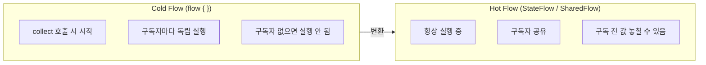

## 전체 비유: 수도관과 수도꼭지

`Flow`는 수도관에 비유할 수 있습니다. 파이프(Flow)는 수도꼭지를 열기 전(`collect`)까지 물이 흐르지 않고, 꼭지를 열면 데이터가 하나씩 흘러나옵니다.

| 수도 비유 | Kotlin Flow | 역할 |
|---------|------------|------|
| 수도관 | `Flow<T>` | 데이터 스트림 정의 |
| 수도꼭지를 열다 | `collect { }` | 수집 시작 (Cold 흐름) |
| 필터 / 정수기 | `filter`, `map`, `transform` | 데이터 변환·필터링 |
| 저수조 (언제나 최신 수위) | `StateFlow` | 항상 최신 값 보유 (Hot) |
| 방송 스피커 | `SharedFlow` | 다수 구독자에게 동시 전달 (Hot) |
| 파이프 막힘 방지 밸브 | `buffer`, `conflate` | 백프레셔 조절 |

---

> **대상 독자**: 코루틴 기초(launch/async/suspend)를 이해한 개발자
> **선수 지식**: [코루틴 기초](../coroutines-basics/) 완료
> **소요 시간**: 약 40~50분
> **이 문서를 읽으면**: Flow를 만들고 수집하며, 연산자를 조합하고, StateFlow/SharedFlow를 안드로이드·백엔드에서 활용할 수 있습니다.


- `Flow<T>`는 순차적·비동기적으로 값을 방출하는 Cold 스트림입니다.
- `collect`가 호출돼야 Flow가 실행됩니다.
- `StateFlow`는 항상 최신 값을 가진 Hot 스트림, `SharedFlow`는 다수 구독자 지원 Hot 스트림입니다.
- `buffer` / `conflate`로 생산자-소비자 속도 차를 조절합니다.
- `catch` / `onCompletion`으로 예외와 완료를 안전하게 처리합니다.


---

#### 왜 Flow가 필요한가?

`suspend` 함수는 값 하나를 반환합니다. 그러나 실무에서는 **여러 값을 시간 순서대로** 받아야 하는 경우가 많습니다.

- DB 쿼리 결과 행을 하나씩 처리
- WebSocket 메시지를 실시간으로 수신
- 센서 데이터, 이벤트 로그를 연속 처리

`Flow<T>`는 이런 상황을 위한 비동기 스트림입니다. RxJava의 `Observable`이나 Reactor의 `Flux`와 비슷한 역할을 하지만, Kotlin 코루틴과 자연스럽게 통합됩니다.

---

#### Flow 정의와 수집

**기본 빌더: `flow { }`**

```kotlin
import kotlinx.coroutines.*
import kotlinx.coroutines.flow.*

fun numbersFlow(): Flow<Int> = flow {
    for (i in 1..5) {
        delay(100)     // 비동기 작업 시뮬레이션
        emit(i)        // 값 방출
    }
}

fun main() = runBlocking {
    numbersFlow().collect { value ->
        println("수신: $value")
    }
}
// 수신: 1
// 수신: 2
// ...
// 수신: 5
```

`emit()`은 `suspend` 함수입니다. `flow { }` 블록 안에서만 호출할 수 있습니다.

**다른 빌더:**

```kotlin
import kotlinx.coroutines.flow.*

// 고정 값 목록
val fixed: Flow<Int> = flowOf(1, 2, 3, 4, 5)

// 컬렉션을 Flow로 변환
val fromList: Flow<String> = listOf("A", "B", "C").asFlow()

// 범위를 Flow로 변환
val range: Flow<Int> = (1..10).asFlow()
```

---

#### Cold Flow: collect가 핵심

Flow는 **Cold** 스트림입니다. `collect`를 호출해야만 Flow 블록이 실행됩니다. 두 번 수집하면 블록이 두 번 실행됩니다.

```kotlin
import kotlinx.coroutines.*
import kotlinx.coroutines.flow.*

fun main() = runBlocking {
    val flow = flow {
        println("Flow 블록 시작")
        emit(1)
        emit(2)
    }

    println("첫 번째 collect:")
    flow.collect { println(it) }

    println("두 번째 collect:")
    flow.collect { println(it) }
}
// 첫 번째 collect:
// Flow 블록 시작
// 1
// 2
// 두 번째 collect:
// Flow 블록 시작
// 1
// 2
```

---

#### 주요 연산자

**map — 변환**

```kotlin
import kotlinx.coroutines.*
import kotlinx.coroutines.flow.*

fun main() = runBlocking {
    (1..5).asFlow()
        .map { it * it }           // 제곱
        .collect { print("$it ") }
    // 1 4 9 16 25
}
```

**filter — 필터링**

```kotlin
import kotlinx.coroutines.*
import kotlinx.coroutines.flow.*

fun main() = runBlocking {
    (1..10).asFlow()
        .filter { it % 2 == 0 }   // 짝수만
        .collect { print("$it ") }
    // 2 4 6 8 10
}
```

**transform — 유연한 변환**

`transform`은 `map`보다 유연하게 여러 값을 방출하거나 조건부로 방출할 수 있습니다.

```kotlin
import kotlinx.coroutines.*
import kotlinx.coroutines.flow.*

fun main() = runBlocking {
    (1..3).asFlow()
        .transform { value ->
            emit("요청: $value")
            delay(100)
            emit("응답: ${value * 10}")
        }
        .collect { println(it) }
}
// 요청: 1
// 응답: 10
// 요청: 2
// 응답: 20
// 요청: 3
// 응답: 30
```

**take / drop — 개수 제한**

```kotlin
import kotlinx.coroutines.*
import kotlinx.coroutines.flow.*

fun main() = runBlocking {
    (1..100).asFlow()
        .drop(3)      // 앞 3개 건너뜀
        .take(5)      // 5개만 수집
        .collect { print("$it ") }
    // 4 5 6 7 8
}
```

**flatMapConcat / flatMapMerge**

```kotlin
import kotlinx.coroutines.*
import kotlinx.coroutines.flow.*

fun requestFlow(id: Int): Flow<String> = flow {
    emit("요청 $id 시작")
    delay(200)
    emit("요청 $id 완료")
}

fun main() = runBlocking {
    // flatMapConcat: 순서 보장 (이전 완료 후 다음 시작)
    (1..3).asFlow()
        .flatMapConcat { requestFlow(it) }
        .collect { println(it) }
}
```

---

#### 터미널 연산자

Flow를 시작하고 값을 수집하는 연산자입니다.

```kotlin
import kotlinx.coroutines.*
import kotlinx.coroutines.flow.*

fun main() = runBlocking {
    val flow = (1..5).asFlow()

    // collect: 기본 수집
    flow.collect { println(it) }

    // toList: 리스트로 변환
    val list: List<Int> = flow.toList()

    // first: 첫 번째 값
    val first: Int = flow.first()

    // single: 정확히 하나의 값 (아니면 예외)
    val single: Int = flowOf(42).single()

    // reduce: 누적 계산
    val sum: Int = flow.reduce { acc, value -> acc + value }
    println("합계: $sum")  // 15

    // fold: 초기값과 함께 누적
    val result: String = flow.fold("값:") { acc, v -> "$acc $v" }
    println(result)  // 값: 1 2 3 4 5
}
```

---

#### 백프레셔: buffer와 conflate

생산자(emit)가 소비자(collect)보다 빠를 때 속도 차를 조절합니다.

**buffer — 버퍼링**

```kotlin
import kotlinx.coroutines.*
import kotlinx.coroutines.flow.*
import kotlin.system.measureTimeMillis

fun producer(): Flow<Int> = flow {
    for (i in 1..5) {
        delay(100)   // 생산: 100ms
        emit(i)
    }
}

fun main() = runBlocking {
    val timeWithoutBuffer = measureTimeMillis {
        producer().collect {
            delay(300)   // 소비: 300ms
        }
    }
    println("버퍼 없음: ${timeWithoutBuffer}ms")  // 약 2000ms

    val timeWithBuffer = measureTimeMillis {
        producer()
            .buffer()    // 생산자를 별도 코루틴에서 실행
            .collect {
                delay(300)
            }
    }
    println("버퍼 있음: ${timeWithBuffer}ms")    // 약 1600ms
}
```

**conflate — 최신값만 유지**

소비자가 처리 중일 때 들어온 값을 버리고 가장 최신 값만 처리합니다. UI 업데이트처럼 최신 상태만 중요한 경우에 적합합니다.

```kotlin
import kotlinx.coroutines.*
import kotlinx.coroutines.flow.*

fun main() = runBlocking {
    (1..10).asFlow()
        .onEach { delay(100) }    // 생산: 100ms 간격
        .conflate()               // 소비 중에 쌓인 값은 버림
        .collect { value ->
            delay(300)            // 소비: 300ms
            println("처리: $value")
        }
    // 1, 4, 7, 10 (중간 값 스킵)
}
```

---

#### Cold Flow vs Hot Flow



*그림: Cold Flow와 Hot Flow 특성 비교 — Cold Flow는 구독 시점에 독립 실행되고, Hot Flow(StateFlow/SharedFlow)는 항상 실행 중이며 구독자가 값을 공유함을 보여줍니다.*

---

#### StateFlow — 상태 보유 Hot 스트림

`StateFlow`는 항상 최신 값(상태)을 보유합니다. 구독자가 없어도 실행됩니다. Android ViewModel의 UI 상태 관리에 많이 사용됩니다.

```kotlin
import kotlinx.coroutines.*
import kotlinx.coroutines.flow.*

fun main() = runBlocking {
    // MutableStateFlow: 값 변경 가능
    val stateFlow = MutableStateFlow(0)

    // 구독자 1
    val job = launch {
        stateFlow.collect { value ->
            println("구독자 수신: $value")
        }
    }

    delay(100)
    stateFlow.value = 1
    delay(100)
    stateFlow.value = 2
    delay(100)
    stateFlow.value = 2  // 같은 값은 방출 안 함 (중복 제거)
    delay(100)
    stateFlow.value = 3

    delay(100)
    job.cancel()
}
// 구독자 수신: 0  (초기값)
// 구독자 수신: 1
// 구독자 수신: 2
// 구독자 수신: 3  (2는 중복이므로 생략)
```

**StateFlow 주요 특징:**

- 초기값 필수
- 같은 값 연속 방출 시 구독자에게 전달하지 않음 (equals 기준)
- `.value`로 현재 값을 동기적으로 읽을 수 있음

---

#### SharedFlow — 다수 구독자 Hot 스트림

`SharedFlow`는 여러 구독자에게 값을 동시에 방출합니다. 이벤트 버스나 채팅 메시지처럼 **이벤트** 를 전달할 때 적합합니다.

```kotlin
import kotlinx.coroutines.*
import kotlinx.coroutines.flow.*

fun main() = runBlocking {
    val sharedFlow = MutableSharedFlow<String>()

    // 구독자 2명 동시에 구독
    val job1 = launch {
        sharedFlow.collect { println("구독자A: $it") }
    }
    val job2 = launch {
        sharedFlow.collect { println("구독자B: $it") }
    }

    delay(100)
    sharedFlow.emit("첫 번째 이벤트")
    delay(100)
    sharedFlow.emit("두 번째 이벤트")
    delay(100)

    job1.cancel()
    job2.cancel()
}
// 구독자A: 첫 번째 이벤트
// 구독자B: 첫 번째 이벤트
// 구독자A: 두 번째 이벤트
// 구독자B: 두 번째 이벤트
```

**replay 파라미터:**

```kotlin
// 최근 3개의 이벤트를 새 구독자에게 다시 전달
val replayFlow = MutableSharedFlow<Int>(replay = 3)
```

---

#### StateFlow vs SharedFlow 비교

| 특성 | `StateFlow` | `SharedFlow` |
|------|------------|-------------|
| 초기값 | 필수 | 없음 |
| 현재 값 | `.value`로 동기 접근 | 없음 |
| 중복 방출 | 같은 값 무시 | 모두 방출 |
| replay 기본값 | 1 (항상 최신 1개) | 0 (설정 가능) |
| 주 용도 | UI 상태, 단일 값 | 이벤트, 다수 값 |

---

#### 예외 처리: catch와 onCompletion

**catch — 상류 예외 잡기**

```kotlin
import kotlinx.coroutines.*
import kotlinx.coroutines.flow.*

fun riskyFlow(): Flow<Int> = flow {
    emit(1)
    emit(2)
    throw RuntimeException("스트림 오류 발생!")
    emit(3)  // 도달 안 됨
}

fun main() = runBlocking {
    riskyFlow()
        .catch { e ->
            println("예외 처리: ${e.message}")
            emit(-1)  // 대체값 방출 가능
        }
        .collect { println("수신: $it") }
}
// 수신: 1
// 수신: 2
// 예외 처리: 스트림 오류 발생!
// 수신: -1
```


`catch`는 **상류(upstream)** 예외만 잡습니다. `collect { }` 블록 내부에서 발생한 예외는 잡지 않습니다. 하류 예외를 처리하려면 다음 두 가지 방법 중 하나를 쓰세요.

1. `collect { try { ... } catch (e: Exception) { ... } }` 처럼 collect 람다 안에서 직접 `try-catch`로 감싸기.
2. 수신 로직을 `onEach { ... }` 같은 상류 연산자로 옮긴 뒤 마지막에 `.catch { ... }.collect()` 형태로 연결하기. 이 경우 `onEach` 안의 예외는 상류 예외가 되어 `catch`가 잡습니다.


**onCompletion — 완료/취소/예외 시 처리**

```kotlin
import kotlinx.coroutines.*
import kotlinx.coroutines.flow.*

fun main() = runBlocking {
    (1..3).asFlow()
        .onCompletion { cause ->
            if (cause != null) println("비정상 종료: $cause")
            else println("정상 완료")
        }
        .collect { println("수신: $it") }
}
// 수신: 1
// 수신: 2
// 수신: 3
// 정상 완료
```

**onEach — 각 값에 부수 효과**

```kotlin
import kotlinx.coroutines.*
import kotlinx.coroutines.flow.*

fun main() = runBlocking {
    (1..3).asFlow()
        .onEach { println("방출 전 로그: $it") }
        .map { it * 2 }
        .collect { println("수신: $it") }
}
```

---

#### 실전 예제: 검색 자동완성 Flow

```kotlin
import kotlinx.coroutines.*
import kotlinx.coroutines.flow.*

// 사용자 입력을 받아 검색하는 패턴
fun searchQuery(queries: Flow<String>): Flow<List<String>> = queries
    .debounce(300)           // 300ms 동안 입력 없으면 실행 (타이핑 중 불필요한 요청 방지)
    .distinctUntilChanged()  // 같은 쿼리 연속 입력 무시
    .filter { it.isNotBlank() }
    .flatMapLatest { query ->  // 새 쿼리가 오면 이전 검색 취소
        flow {
            emit(performSearch(query))
        }
    }
    .catch { e ->
        println("검색 오류: ${e.message}")
        emit(emptyList())
    }

suspend fun performSearch(query: String): List<String> {
    delay(200)  // 네트워크 요청 시뮬레이션
    return listOf("$query 결과1", "$query 결과2")
}

fun main() = runBlocking {
    val queryFlow = flow {
        emit("k")
        delay(100)
        emit("ko")
        delay(100)
        emit("kot")
        delay(400)   // 300ms 이상 지나야 검색 실행
        emit("kotlin")
        delay(500)
    }

    searchQuery(queryFlow).collect { results ->
        println("결과: $results")
    }
}
```

---

#### 핵심 포인트


- `Flow<T>`는 Cold 스트림: `collect` 호출 시에만 실행됩니다.
- `flowOf`, `asFlow`, `flow { }` 세 가지 주요 빌더를 상황에 맞게 사용합니다.
- `map`/`filter`/`transform`으로 데이터를 변환하고, `buffer`/`conflate`로 속도 차를 조절합니다.
- `StateFlow`는 상태 보유(초기값 필수), `SharedFlow`는 이벤트 전달(다수 구독자)에 적합합니다.
- `catch`는 상류 예외만 잡고, `onCompletion`으로 완료/취소를 처리합니다.


---

#### 다음 단계

- [코루틴 고급](../coroutines-advanced/) — Channel, SupervisorJob, CoroutineContext 심화
- [코루틴 디버깅](../../howto/coroutine-debugging/) — Flow 디버깅과 누수 진단
- [성능 프로파일링](../../howto/performance-profiling/) — Flow 연산자 선택과 성능 측정
