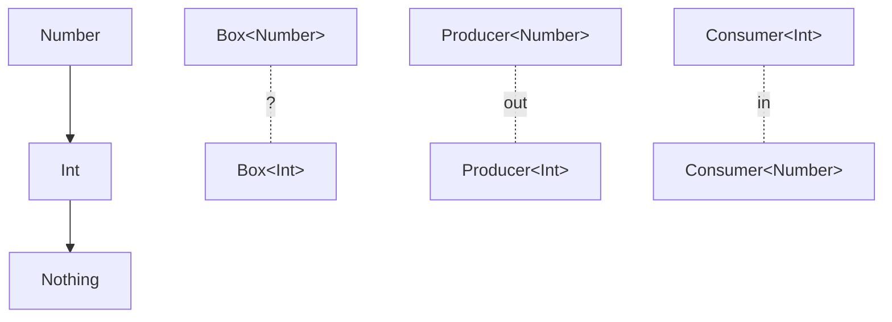

## 전체 비유: 전용 상자와 분류 규칙

제네릭을 **용도별 전용 상자**에 비유하면 이해하기 쉽습니다.

| 상자 비유 | Kotlin 개념 | 역할 |
|----------|-----------|------|
| 과일 전용 상자 | `Box<Fruit>` | 특정 타입만 담는 컨테이너 |
| "사과도 과일 상자에 OK" 규칙 | 공변(`out`) | 하위 타입으로 대체 허용 |
| "모든 과일을 받아야 해" 규칙 | 반공변(`in`) | 상위 타입으로 대체 허용 |
| "어떤 과일이든 상관없어" | 스타 프로젝션(`*`) | 타입 미지정, 읽기만 가능 |
| "최소 과일은 되어야 해" 규칙 | 타입 경계(`<T : Fruit>`) | 허용 타입 범위 제한 |

---

> **대상 독자**: Kotlin 기초 문법을 익힌 개발자
> **선수 지식**: 클래스, 인터페이스, 상속 기초
> **소요 시간**: 약 35분
> **이 문서를 읽으면**: 제네릭 클래스와 함수를 직접 작성하고, `in`/`out` 변성을 이해하여 컬렉션 API를 올바르게 사용할 수 있습니다.


- `class Box<T>` — 타입 매개변수로 재사용 가능한 컨테이너 정의
- `<T : Comparable<T>>` — 타입 경계로 T의 범위를 제한
- `out T` — 공변(읽기 전용, 상위 타입 변수에 대입 가능)
- `in T` — 반공변(쓰기 전용, 하위 타입 변수에 대입 가능)
- `*` — 스타 프로젝션(타입 모를 때 안전하게 읽기)


#### 왜 제네릭이 필요한가?

타입별로 같은 구조의 클래스를 반복 작성하는 것은 비효율적입니다.

```kotlin
// 제네릭 없이 — 타입마다 클래스 필요
class IntBox(val value: Int)
class StringBox(val value: String)

// 제네릭 사용 — 하나로 해결
class Box<T>(val value: T)

val intBox = Box(42)
val stringBox = Box("hello")
```

#### 제네릭 클래스

클래스 이름 뒤에 `<T>`를 붙여 타입 매개변수를 선언합니다. `T`는 관례적인 이름이며, 의미 있는 이름을 써도 됩니다.

```kotlin
class Stack<T> {
    private val elements = mutableListOf<T>()

    fun push(element: T) {
        elements.add(element)
    }

    fun pop(): T? {
        return if (elements.isEmpty()) null
        else elements.removeLast()
    }

    fun peek(): T? = elements.lastOrNull()

    val size: Int get() = elements.size
    val isEmpty: Boolean get() = elements.isEmpty()
}

// 사용
val stack = Stack<Int>()
stack.push(1)
stack.push(2)
stack.push(3)
println(stack.pop())    // 3
println(stack.peek())   // 2
```

#### 제네릭 함수

함수 이름 앞에 `<T>`를 붙여 제네릭 함수를 선언합니다.

```kotlin
// 제네릭 함수
fun <T> singletonList(element: T): List<T> = listOf(element)

fun <T> swap(list: MutableList<T>, i: Int, j: Int) {
    val temp = list[i]
    list[i] = list[j]
    list[j] = temp
}

// 타입 추론 — 명시하지 않아도 됩니다
val list = singletonList(1)         // List<Int>
val strList = singletonList("hi")   // List<String>

// 여러 타입 매개변수
fun <K, V> mapOf(key: K, value: V): Map<K, V> = kotlin.collections.mapOf(key to value)
```

#### 타입 경계

`<T : 상위타입>`으로 T의 범위를 제한합니다. 이 선언은 "T는 반드시 상위타입의 하위 타입이어야 한다"는 의미입니다.

```kotlin
// Comparable을 구현한 타입만 허용
fun <T : Comparable<T>> max(a: T, b: T): T {
    return if (a > b) a else b
}

println(max(3, 5))          // 5
println(max("apple", "banana"))  // banana
// max(listOf(1), listOf(2))  // 컴파일 에러 — List는 Comparable 미구현

// 복수 제약 — where 키워드 사용
fun <T> copyIfBothValid(source: T, dest: T): Boolean
        where T : Cloneable, T : Comparable<T> {
    return source <= dest
}

// 상위 타입 제약으로 멤버 접근
abstract class Animal(val name: String)
class Dog(name: String) : Animal(name)

fun <T : Animal> greet(animal: T): String {
    return "안녕, ${animal.name}!"   // Animal의 name에 접근 가능
}
```

#### 변성(Variance): in과 out

변성은 **타입 매개변수의 상하위 관계가 제네릭 타입에 어떻게 전파되는지**를 결정합니다.



**기본: 무공변(Invariant)**

아무것도 붙이지 않으면 무공변입니다. `Box<Int>`와 `Box<Number>`는 서로 대입 불가능합니다.

```kotlin
class Box<T>(var value: T)

val intBox: Box<Int> = Box(1)
// val numBox: Box<Number> = intBox  // 컴파일 에러
```

**공변(out) — 읽기 전용 생산자**

`out T`는 "T를 생산(반환)만 하고 소비(매개변수)하지 않는다"는 의미입니다. `Producer<Int>`를 `Producer<Number>` 변수에 대입할 수 있습니다.

```kotlin
// out T — T를 반환만 할 수 있습니다
interface Producer<out T> {
    fun produce(): T
}

class IntProducer : Producer<Int> {
    override fun produce(): Int = 42
}

// 공변 덕분에 가능
val producer: Producer<Number> = IntProducer()
println(producer.produce())   // 42

// Kotlin List는 out T로 선언되어 있습니다
val ints: List<Int> = listOf(1, 2, 3)
val numbers: List<Number> = ints   // 가능!
```

**반공변(in) — 쓰기 전용 소비자**

`in T`는 "T를 소비(매개변수)만 하고 생산(반환)하지 않는다"는 의미입니다. `Consumer<Number>`를 `Consumer<Int>` 변수에 대입할 수 있습니다.

```kotlin
// in T — T를 매개변수로만 받을 수 있습니다
interface Consumer<in T> {
    fun consume(item: T)
}

class NumberConsumer : Consumer<Number> {
    override fun consume(item: Number) {
        println("소비: $item")
    }
}

// 반공변 덕분에 가능
val consumer: Consumer<Int> = NumberConsumer()
consumer.consume(42)    // 가능

// Kotlin Comparator는 in T로 선언되어 있습니다
val numberComp: Comparator<Number> = compareBy { it.toDouble() }
val intComp: Comparator<Int> = numberComp   // 가능!
```

#### 사용 지점 변성 (Use-site variance)

클래스 선언에 변성을 두는 것이 **선언 지점 변성**, 사용 시점에 변성을 지정하는 것이 **사용 지점 변성**입니다.

```kotlin
// MutableList는 무공변 — 선언 지점에서 in/out 불가
// 하지만 사용 시점에 변성 지정 가능

fun copyFrom(source: MutableList<out Number>, dest: MutableList<Number>) {
    dest.addAll(source)   // source에서 읽기만 — out 덕분에 MutableList<Int>도 OK
}

fun addNumbers(list: MutableList<in Int>) {
    list.add(1)
    list.add(2)           // list에 쓰기만 — in 덕분에 MutableList<Number>도 OK
}
```

#### 스타 프로젝션(*)

타입 매개변수를 모르거나 중요하지 않을 때 `*`를 사용합니다. `out Any?`처럼 동작하여 읽기는 가능하지만 쓰기는 불가능합니다.

```kotlin
fun printAll(list: List<*>) {
    for (element in list) {
        println(element)    // Any? 타입으로 읽힘
    }
}

printAll(listOf(1, 2, 3))
printAll(listOf("a", "b"))

// 타입 체크와 함께 사용
fun processAnything(container: Box<*>) {
    val value = container.value   // Any? 타입
    if (value is String) {
        println(value.uppercase())
    }
}
```

#### 실무 패턴: 제네릭 리포지토리

```kotlin
// 제네릭 리포지토리 인터페이스
interface Repository<T, ID> {
    fun findById(id: ID): T?
    fun findAll(): List<T>
    fun save(entity: T): T
    fun delete(id: ID)
}

data class User(val id: Long, val name: String)
data class Product(val id: Long, val name: String, val price: Long)

// 구현 — 각 엔티티에 대해 별도 리포지토리
class UserRepository : Repository<User, Long> {
    private val store = mutableMapOf<Long, User>()

    override fun findById(id: Long): User? = store[id]
    override fun findAll(): List<User> = store.values.toList()
    override fun save(entity: User) = entity.also { store[it.id] = it }
    override fun delete(id: Long) { store.remove(id) }
}

// 제네릭 서비스 — 타입 경계 활용
abstract class CrudService<T, ID>(private val repository: Repository<T, ID>) {
    fun getOrThrow(id: ID): T {
        return repository.findById(id)
            ?: throw NoSuchElementException("ID $id 에 해당하는 항목이 없습니다")
    }

    fun saveAll(entities: List<T>): List<T> {
        return entities.map { repository.save(it) }
    }
}
```


`inline` 함수에 `reified T`를 사용하면 런타임에 T의 실제 타입 정보를 사용할 수 있습니다. `filterIsInstance<String>()`이 대표적인 예입니다. 자세한 내용은 [인라인/Reified](inline-reified/) 문서에서 다룹니다.



- `<T>` 선언으로 클래스와 함수를 재사용 가능하게 만듭니다
- `<T : 상위타입>`으로 허용 타입 범위를 제한합니다
- `out T` — 공변, 생산자, List처럼 읽기 전용
- `in T` — 반공변, 소비자, Comparator처럼 쓰기 전용
- `*` — 스타 프로젝션, 타입 불명 시 안전한 읽기


#### 다음 단계

- [위임](delegation/) — `by` 키워드를 활용한 위임 패턴
- [인라인/Reified](inline-reified/) — 제네릭과 `reified` 타입 매개변수
