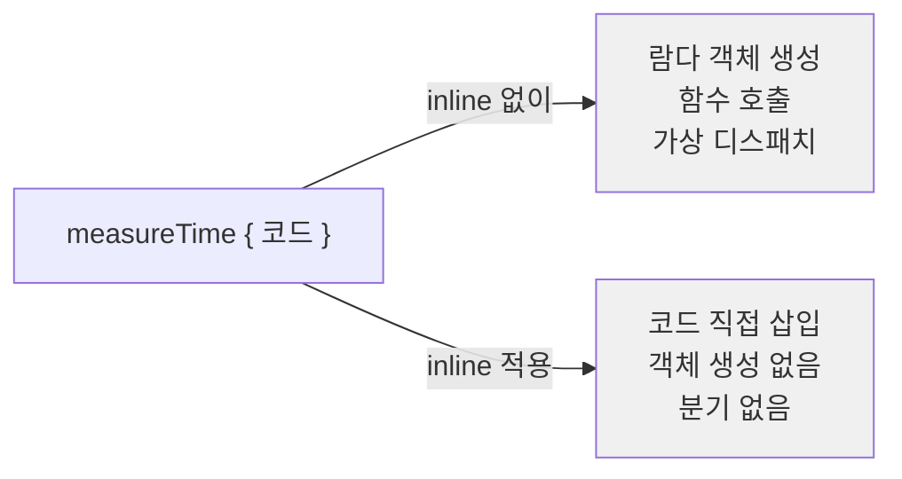

## 전체 비유: 요리법 복사 vs 식당에 주문

`inline` 함수를 **요리법을 직접 복사하는 것**에 비유하면 이해하기 쉽습니다.

| 비유 | Kotlin 개념 | 효과 |
|------|-----------|------|
| 레시피 책에서 요리법 복사 | `inline` 함수 | 호출 비용 없이 코드 삽입 |
| 매번 식당에 주문 | 일반 함수 호출 | 호출 오버헤드 발생 |
| 재료 목록(타입) 그대로 복사됨 | `reified T` | 런타임에 타입 정보 유지 |
| "이 재료만 빼고" 복사 | `noinline` | 특정 람다만 인라인 제외 |
| "다른 쉐프에게 넘겨도 OK" | `crossinline` | 람다를 다른 스코프에서 호출 허용 |

---

> **대상 독자**: 제네릭과 람다를 이해한 Kotlin 개발자
> **선수 지식**: 제네릭, 람다, 제네릭과 변성
> **소요 시간**: 약 30분
> **이 문서를 읽으면**: `inline`/`reified`를 적절히 사용하여 타입 안전한 유틸리티 함수를 작성할 수 있습니다.


- `inline fun` — 함수 본문이 호출 지점에 삽입, 람다 객체 생성 비용 없음
- `reified T` — `inline` 함수에서만 사용, 런타임에 `T is String` 같은 타입 체크 가능
- `noinline` — 특정 람다 파라미터를 인라인 제외
- `crossinline` — 인라인 람다에서 `return` 허용 안 함 (다른 스코프 전달 시)


#### 왜 inline 함수가 필요한가?

람다를 매개변수로 받는 함수는 호출할 때마다 람다 객체가 생성됩니다. 성능이 중요한 코드(특히 반복문 안)에서는 이 비용이 쌓입니다.

```kotlin
// 일반 고차 함수 — 매번 람다 객체 생성
fun <T> measureTime(block: () -> T): T {
    val start = System.currentTimeMillis()
    val result = block()
    println("소요 시간: ${System.currentTimeMillis() - start}ms")
    return result
}

// 컴파일 후 (개념적으로)
// block이 Function0 인터페이스 객체로 전달됨
```

`inline`을 붙이면 컴파일러가 함수 본문을 호출 지점에 직접 삽입합니다.

```kotlin
inline fun <T> measureTime(block: () -> T): T {
    val start = System.currentTimeMillis()
    val result = block()
    println("소요 시간: ${System.currentTimeMillis() - start}ms")
    return result
}

// 사용
val result = measureTime {
    heavyComputation()
}

// 컴파일 후 (개념적으로 — 함수 본문이 삽입됨)
val start = System.currentTimeMillis()
val result = heavyComputation()
println("소요 시간: ${System.currentTimeMillis() - start}ms")
```



#### inline 함수에서 non-local return

`inline` 함수 안의 람다에서는 **바깥 함수까지 return**하는 non-local return이 가능합니다.

```kotlin
inline fun findFirst(list: List<Int>, predicate: (Int) -> Boolean): Int? {
    for (element in list) {
        if (predicate(element)) return element
    }
    return null
}

fun search(numbers: List<Int>): Int? {
    numbers.forEach {           // forEach는 inline
        if (it > 10) return it  // 이 return은 search() 함수에서 반환
    }
    return null
}

// Kotlin의 forEach, filter, map 등이 모두 inline이므로
// 이런 패턴이 자연스럽게 동작합니다
```

#### noinline

인라인 함수의 특정 람다 파라미터를 인라인하지 않으려면 `noinline`을 붙입니다. 람다를 변수에 저장하거나 다른 함수에 전달할 때 필요합니다.

```kotlin
inline fun performAction(
    inlineAction: () -> Unit,
    noinline storedAction: () -> Unit   // 람다 객체로 유지
) {
    inlineAction()                       // 인라인 삽입
    val saved = storedAction             // 변수에 저장 가능
    scheduleForLater(saved)              // 다른 함수에 전달 가능
}

fun scheduleForLater(action: () -> Unit) {
    // 나중에 실행
}
```

#### crossinline

인라인 람다에서 non-local return을 허용하지 않으려면 `crossinline`을 사용합니다. 람다를 다른 스코프(예: 다른 스레드, 다른 클래스)에서 호출할 때 필요합니다.

```kotlin
inline fun runAsync(crossinline block: () -> Unit) {
    Thread {
        block()   // 다른 스레드에서 실행 — non-local return 불가
    }.start()
}

fun example() {
    runAsync {
        println("비동기 실행")
        // return  // 컴파일 에러 — crossinline 람다에서 non-local return 금지
    }
}
```

| 키워드 | 인라인 여부 | 변수 저장 | non-local return |
|--------|-----------|---------|-----------------|
| (기본) | O | X | O |
| `noinline` | X | O | X |
| `crossinline` | O | X | X |

#### reified 타입 매개변수

제네릭 타입은 런타임에 소거(type erasure)되어 타입 정보를 알 수 없습니다. `inline` 함수에서 `reified`를 사용하면 이 제약을 우회할 수 있습니다.

```kotlin
// reified 없이 — 런타임 타입 체크 불가
fun <T> isType(value: Any): Boolean {
    // return value is T   // 컴파일 에러: T는 런타임에 소거됨
    return false
}

// reified 사용 — 런타임 타입 체크 가능
inline fun <reified T> isType(value: Any): Boolean {
    return value is T
}

println(isType<String>("hello"))   // true
println(isType<Int>("hello"))      // false
println(isType<List<*>>(listOf())) // true
```

**실무에서 reified 활용**

```kotlin
// 1. 타입 캐스팅
inline fun <reified T> Any.castOrNull(): T? = this as? T

val obj: Any = "hello"
val str: String? = obj.castOrNull<String>()   // "hello"
val num: Int? = obj.castOrNull<Int>()         // null

// 2. 컬렉션 필터링
inline fun <reified T> List<*>.filterIsInstance(): List<T> {
    return filterIsInstance<T>()
}

val mixed: List<Any> = listOf(1, "hello", 2, "world", 3.14)
val strings: List<String> = mixed.filterIsInstance<String>()
// ["hello", "world"]

// 3. JSON/설정 파싱 (Jackson 예시 패턴)
inline fun <reified T> String.fromJson(): T {
    return objectMapper.readValue(this, T::class.java)
}

val user: User = jsonString.fromJson<User>()
// T::class.java — reified 덕분에 런타임에 User.class 전달 가능

// 4. Android/Spring에서 findView, getBean 패턴
inline fun <reified T : Any> ApplicationContext.getBean(): T {
    return getBean(T::class.java)
}
// val service: UserService = context.getBean()
```

#### 표준 라이브러리의 reified 활용

```kotlin
// filterIsInstance — 가장 대표적인 reified 활용
val mixed: List<Any> = listOf(1, "a", 2, "b", 3.0)
val ints: List<Int> = mixed.filterIsInstance<Int>()         // [1, 2]
val strings: List<String> = mixed.filterIsInstance<String>() // ["a", "b"]

// let, run, apply, also, with — 모두 inline
// T::class 접근
inline fun <reified T> typeNameOf(): String = T::class.simpleName ?: "Unknown"
println(typeNameOf<String>())   // String
println(typeNameOf<List<*>>())  // List
```

#### inline의 비용과 주의사항

`inline`이 항상 더 빠른 것은 아닙니다. 함수 본문이 크면 코드 크기(bytecode)가 커집니다.

```kotlin
// ✅ inline이 적합한 경우 — 람다를 매개변수로 받는 작은 함수
inline fun <T> withLock(lock: Lock, block: () -> T): T {
    lock.lock()
    try { return block() }
    finally { lock.unlock() }
}

// ❌ inline이 부적합한 경우 — 람다 없는 일반 함수
// inline fun add(a: Int, b: Int) = a + b   // 의미 없음, 경고 발생

// ❌ 매우 큰 함수 — 코드 팽창
// inline fun complexProcess(block: () -> Unit) {
//     // 수백 줄의 코드...
//     block()
// }
```

**inline 적합 여부 판단표**

| 조건 | inline 권장 여부 |
|------|----------------|
| 람다 파라미터가 있는 작은 함수 | 권장 |
| 성능 측정 결과 병목 | 권장 |
| reified 타입 매개변수 필요 | 필수 |
| 람다가 없는 일반 함수 | 비권장 (컴파일러 경고) |
| 100줄 이상의 큰 함수 | 비권장 |
| public API (라이브러리) | 신중하게 — 바이너리 호환성 영향 |


- `inline` 함수는 호출 지점에 본문이 삽입 → 람다 객체 생성 비용 제거
- `reified T` — `inline` 함수에서만 사용 가능, 런타임 타입 체크·캐스팅 허용
- `noinline` — 특정 람다를 인라인 제외, 변수 저장/전달 가능
- `crossinline` — 다른 스코프에서 실행되는 람다에서 non-local return 금지
- 람다 없는 일반 함수에 `inline`을 붙이면 불필요한 코드 팽창이 발생합니다


#### 다음 단계

- [스코프 함수](scope-functions/) — `let`, `apply` 등이 `inline`으로 구현된 이유
- [확장 함수](extension-functions/) — 확장 함수와 `inline`의 조합
