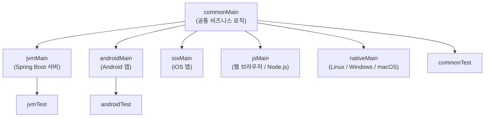
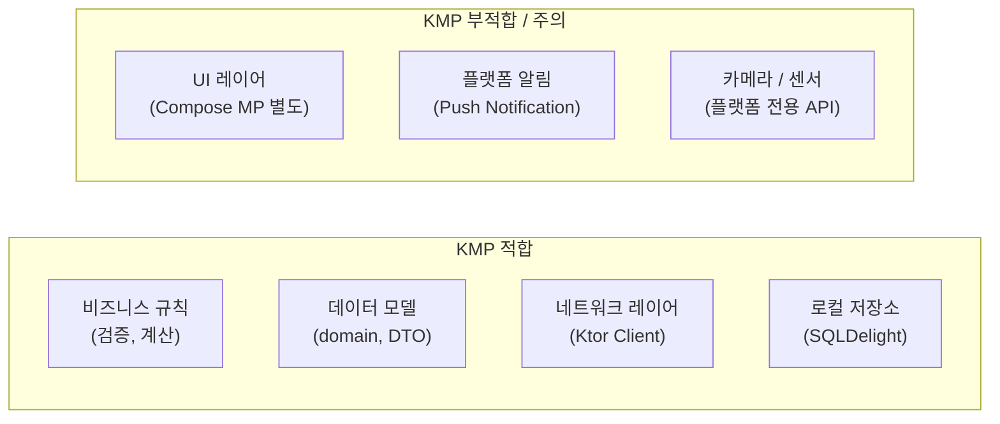

## 전체 비유: 프랜차이즈 레스토랑

프랜차이즈 레스토랑은 **공통 메뉴와 조리법**(common)을 전 세계 매장이 공유하지만, **식재료 공급업체**(플랫폼)는 지역마다 다릅니다. 뉴욕 매장(JVM)과 서울 매장(iOS/Android)은 같은 레시피로 다른 재료를 씁니다.

| 프랜차이즈 비유 | Kotlin Multiplatform | 역할 |
|--------------|---------------------|------|
| 공통 레시피 (메뉴판) | `commonMain` | 모든 플랫폼에서 공유하는 코드 |
| 지역별 재료 | `jvmMain` / `iosMain` / `jsMain` | 플랫폼별 구체 구현 |
| 레시피 상의 "현지 재료 사용" 표시 | `expect` 선언 | 플랫폼 구현을 요구하는 계약 |
| 지역 매장의 실제 재료 준비 | `actual` 구현 | 플랫폼별 실제 코드 |

---

> **대상 독자**: Kotlin 중급 이상, 멀티플랫폼 개발에 관심 있는 개발자
> **선수 지식**: Kotlin 기본 문법, Gradle 기초
> **소요 시간**: 약 30~40분
> **이 문서를 읽으면**: KMP 프로젝트 구조를 이해하고, expect/actual로 플랫폼별 코드를 분리하며, 어떤 상황에서 KMP가 적합한지 판단할 수 있습니다.


- KMP는 **비즈니스 로직** 을 Kotlin으로 한 번 작성하고, UI는 각 플랫폼 네이티브로 유지합니다.
- `expect`로 인터페이스를 선언하고, 각 플랫폼의 `actual`로 구현합니다.
- `commonMain` → `jvmMain`/`iosMain`/`jsMain` 소스 셋 계층 구조를 사용합니다.
- kotlinx-coroutines, kotlinx-serialization, kotlinx-datetime은 멀티플랫폼을 지원합니다.
- KMP는 UI 공유보다 **비즈니스 로직 공유** 에 적합합니다.


---

#### 왜 Kotlin Multiplatform인가?

모바일, 웹, 서버가 각각 같은 비즈니스 로직을 Swift, TypeScript, Java로 중복 구현하면 세 가지 문제가 생깁니다.

1. **동기화 비용**: 로직 변경 시 세 곳을 모두 수정해야 합니다.
2. **버그 불일치**: 플랫폼마다 구현 세부사항이 달라 동작이 달라질 수 있습니다.
3. **테스트 중복**: 같은 테스트를 각 언어로 작성해야 합니다.

KMP는 **공통 비즈니스 로직을 Kotlin으로 한 번 작성** 하고, UI와 플랫폼 API만 각 플랫폼 언어로 구현합니다. React Native나 Flutter처럼 UI까지 통합하는 방식이 아니라, 네이티브 UI를 유지하면서 로직만 공유합니다.

---

#### KMP 아키텍처 — 소스 셋 계층



각 소스 셋은 독립적인 디렉토리를 가집니다:

```text
src/
├── commonMain/kotlin/          # 공통 코드 (모든 플랫폼에서 실행)
│   └── com/example/
│       ├── domain/             # 도메인 모델
│       └── repository/         # 추상 Repository
├── commonTest/kotlin/          # 공통 테스트
├── jvmMain/kotlin/             # JVM 전용 구현
├── androidMain/kotlin/         # Android 전용 구현
├── iosMain/kotlin/             # iOS 전용 구현 (Kotlin/Native)
└── jsMain/kotlin/              # JavaScript 전용 구현
```

---

#### expect / actual 메커니즘

`expect`는 공통 코드에서 "이 기능이 필요한데, 구현은 플랫폼에서 제공해 줘"라고 선언합니다. `actual`은 각 플랫폼에서 그 구현을 제공합니다.

**expect 선언 (commonMain):**

```kotlin
// commonMain/kotlin/com/example/Platform.kt

// 플랫폼 이름을 반환하는 함수 — 구현은 각 플랫폼에서 제공
expect fun currentPlatform(): String

// 플랫폼별 UUID 생성기
expect class UuidGenerator() {
    fun generate(): String
}

// 플랫폼별 로거
expect object Logger {
    fun log(message: String)
    fun error(message: String, throwable: Throwable? = null)
}
```

**actual 구현 (jvmMain):**

```kotlin
// jvmMain/kotlin/com/example/Platform.jvm.kt

actual fun currentPlatform(): String = "JVM ${System.getProperty("java.version")}"

actual class UuidGenerator actual constructor() {
    actual fun generate(): String = java.util.UUID.randomUUID().toString()
}

actual object Logger {
    actual fun log(message: String) {
        println("[INFO] $message")
    }
    actual fun error(message: String, throwable: Throwable?) {
        System.err.println("[ERROR] $message")
        throwable?.printStackTrace()
    }
}
```

**actual 구현 (iosMain):**

```kotlin
// iosMain/kotlin/com/example/Platform.ios.kt
import platform.UIKit.UIDevice
import platform.Foundation.NSUUID

actual fun currentPlatform(): String =
    UIDevice.currentDevice.systemName() + " " + UIDevice.currentDevice.systemVersion

actual class UuidGenerator actual constructor() {
    actual fun generate(): String = NSUUID().UUIDString
}

actual object Logger {
    actual fun log(message: String) {
        println("[iOS INFO] $message")
    }
    actual fun error(message: String, throwable: Throwable?) {
        println("[iOS ERROR] $message ${throwable?.message ?: ""}")
    }
}
```

---

#### 공통 코드 작성 예제

비즈니스 로직을 `commonMain`에 작성합니다.

```kotlin
// commonMain/kotlin/com/example/domain/User.kt
data class User(
    val id: String,
    val name: String,
    val email: String
)

// commonMain/kotlin/com/example/domain/UserRepository.kt
interface UserRepository {
    suspend fun findById(id: String): User?
    suspend fun save(user: User): User
    suspend fun findAll(): List<User>
}

// commonMain/kotlin/com/example/usecase/UserUseCase.kt
class UserUseCase(private val repository: UserRepository) {

    suspend fun getUser(id: String): Result<User> = runCatching {
        repository.findById(id) ?: throw NoSuchElementException("사용자 없음: $id")
    }

    suspend fun createUser(name: String, email: String): Result<User> = runCatching {
        val user = User(
            id = UuidGenerator().generate(),  // expect/actual
            name = name,
            email = email
        )
        repository.save(user)
    }
}
```

---

#### Gradle 설정 (kotlin-multiplatform)

```kotlin
// build.gradle.kts
plugins {
    kotlin("multiplatform") version "2.0.0"
    kotlin("plugin.serialization") version "2.0.0"
}

kotlin {
    // 타깃 플랫폼 지정
    jvm()
    androidTarget()
    iosArm64()
    iosSimulatorArm64()
    js(IR) { browser() }

    sourceSets {
        commonMain.dependencies {
            // 멀티플랫폼 지원 라이브러리
            implementation("org.jetbrains.kotlinx:kotlinx-coroutines-core:1.8.1")
            implementation("org.jetbrains.kotlinx:kotlinx-serialization-json:1.6.3")
            implementation("org.jetbrains.kotlinx:kotlinx-datetime:0.6.0")
        }
        jvmMain.dependencies {
            implementation("io.ktor:ktor-client-okhttp:2.3.10")
        }
        iosMain.dependencies {
            implementation("io.ktor:ktor-client-darwin:2.3.10")
        }
        jsMain.dependencies {
            implementation("io.ktor:ktor-client-js:2.3.10")
        }
    }
}
```

---

#### 멀티플랫폼 지원 라이브러리

| 라이브러리 | 지원 플랫폼 | 주요 기능 |
|-----------|----------|---------|
| `kotlinx-coroutines` | JVM, Android, iOS, JS, Native | 코루틴, Flow |
| `kotlinx-serialization` | JVM, Android, iOS, JS, Native | JSON, Protobuf 직렬화 |
| `kotlinx-datetime` | JVM, Android, iOS, JS, Native | 날짜/시간 처리 |
| `Ktor Client` | JVM, Android, iOS, JS, Native | HTTP 클라이언트 |
| `SQLDelight` | JVM, Android, iOS, JS, Native | SQLite ORM |
| `Koin` | JVM, Android, iOS, JS | 의존성 주입 |

**kotlinx-serialization 예제:**

```kotlin
// commonMain에서 사용 가능
import kotlinx.serialization.*
import kotlinx.serialization.json.*

@Serializable
data class ApiResponse<T>(
    val data: T,
    val success: Boolean,
    val message: String = ""
)

@Serializable
data class UserDto(
    val id: String,
    val name: String,
    val email: String
)

// 직렬화/역직렬화 (모든 플랫폼 공통)
val json = Json { prettyPrint = true }

val response = ApiResponse(
    data = UserDto("1", "Alice", "alice@example.com"),
    success = true
)
val jsonStr = json.encodeToString(response)
println(jsonStr)

val decoded = json.decodeFromString<ApiResponse<UserDto>>(jsonStr)
println(decoded.data.name)  // Alice
```

---

#### KMP의 한계

KMP가 모든 문제를 해결하지는 않습니다. 다음 한계를 인식하고 선택하세요.

| 한계 | 설명 |
|------|------|
| **UI 공유 불가** | KMP는 로직만 공유합니다. UI는 각 플랫폼 네이티브 또는 Compose Multiplatform을 별도로 사용해야 합니다. |
| **빌드 복잡성** | 여러 타깃을 빌드하므로 설정이 복잡하고 빌드 시간이 늘어납니다. |
| **iOS 빌드 환경** | iOS 타깃은 macOS 빌드 환경이 필요합니다. |
| **플랫폼 API 직접 접근** | `iosMain`에서 iOS 프레임워크를 사용할 수 있지만, Objective-C/Swift 브리지에 대한 이해가 필요합니다. |
| **라이브러리 생태계** | 모든 JVM 라이브러리가 KMP를 지원하지 않습니다. 멀티플랫폼 대안을 찾아야 할 수 있습니다. |

---

#### KMP가 적합한 사용 사례



**KMP가 빛나는 시나리오:**

1. **모바일 + 백엔드** — iOS 앱, Android 앱, Spring Boot 서버가 같은 도메인 모델과 유효성 검사 로직을 공유합니다.
2. **클라이언트 SDK** — 여러 플랫폼에서 동일한 API를 제공하는 SDK를 만들 때 코드 중복을 줄입니다.
3. **오프라인 우선 앱** — SQLDelight + kotlinx-coroutines를 공통으로 사용하여 동기화 로직을 단일 구현합니다.

---

#### Compose Multiplatform

UI도 공유하려면 **Compose Multiplatform** 을 별도로 사용합니다. KMP의 상위 개념이 아니라 별개의 레이어입니다.

| 레이어 | 기술 | 지원 플랫폼 |
|--------|------|-----------|
| 비즈니스 로직 | Kotlin Multiplatform | JVM, Android, iOS, JS, Native |
| UI (선택) | Compose Multiplatform | Android, iOS, Desktop, Web |
| UI (네이티브) | SwiftUI / XML / React | 각 플랫폼 전용 |

---

#### 핵심 포인트


- KMP는 **UI는 네이티브, 비즈니스 로직은 Kotlin 공통** 으로 설계합니다.
- `expect`는 공통 코드의 "플랫폼 계약", `actual`은 플랫폼별 구현입니다.
- 소스 셋은 `commonMain` → `jvmMain`/`iosMain`/`jsMain` 계층 구조입니다.
- kotlinx-coroutines, serialization, datetime, Ktor Client는 모든 플랫폼을 지원합니다.
- iOS 빌드는 macOS 환경이 필요하고, 빌드 복잡성이 늘어나는 점을 고려해야 합니다.


---

#### 다음 단계

- [Gradle Kotlin DSL 팁](../../howto/gradle-kotlin-dsl-tips/) — KMP Gradle 설정 실전 노하우
- [DSL 빌더](../dsl-builders/) — expect/actual과 DSL 조합 패턴
- [KMP 공식 문서](https://kotlinlang.org/docs/multiplatform.html) — 최신 타깃 지원 현황
