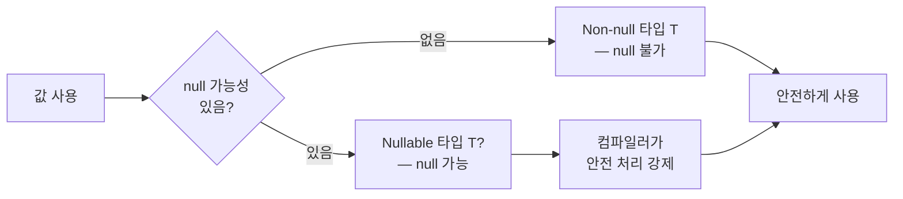

## 전체 비유: 택배 수령과 부재 처리

Kotlin의 Null Safety를 **택배 수령과 부재 처리** 에 비유하면 이해하기 쉽습니다. 택배 상자 안에 물건이 있을 수도, 없을 수도 있습니다. Kotlin은 "물건이 없을 수 있다"는 사실을 타입 시스템에 명시합니다. 없는 물건을 꺼내려 할 때 미리 안전하게 처리하도록 강제합니다.

| 비유 | Kotlin 개념 | 역할 |
|------|------------|------|
| 물건이 있거나 없는 상자 | nullable 타입 (`T?`) | null이 될 수 있음을 타입에 표시 |
| 상자 열기 전 확인 | 안전 호출 (`?.`) | null이면 null 반환, 아니면 계속 |
| "없으면 대신 이것" | Elvis 연산자 (`?:`) | null이면 기본값 사용 |
| 강제로 상자 열기 | 비-null 단언 (`!!`) | null이면 NullPointerException |
| 용도 맞는 상자인지 확인 | 안전 캐스팅 (`as?`) | 변환 실패 시 null 반환 |

---

> **대상 독자**: [함수](../functions/)를 읽은 학습자
> **선수 지식**: Kotlin 기본 타입, 함수 선언
> **소요 시간**: 약 25분
> **이 문서를 읽으면**: nullable 타입을 올바르게 다루고, `?.`, `?:`, `!!`를 상황에 맞게 사용하며, Java API와 안전하게 상호운용할 수 있습니다.


- **`T?`** 는 null이 될 수 있는 타입, **`T`** 는 null이 될 수 없는 타입입니다
- **`?.`** (안전 호출) — null이면 null 반환, 연쇄 호출에 사용합니다
- **`?:`** (Elvis) — null이면 기본값 또는 예외 처리에 사용합니다
- **`!!`** — null이면 예외 발생, 꼭 필요한 경우 외에는 지양합니다


#### 왜 Null Safety가 필요한가?

`NullPointerException`은 수십 년간 개발자를 괴롭혀 온 오류입니다. 발생 시점이 컴파일이 아닌 런타임이기 때문에 테스트에서 놓치기 쉽고, 프로덕션에서 갑작스러운 장애로 이어집니다.

Kotlin은 null이 될 수 있는 타입과 그렇지 않은 타입을 **타입 시스템 수준에서 구분** 합니다. null 관련 오류 대부분을 컴파일 타임에 잡아낼 수 있습니다.



---

#### Nullable 타입 선언

타입 뒤에 `?`를 붙이면 null이 될 수 있는 타입입니다.

```kotlin
// Non-null — null 불가
val name: String = "Kotlin"
// name = null   // 컴파일 오류!

// Nullable — null 가능
val nickname: String? = null
val email: String? = "user@example.com"

// 함수 매개변수와 반환값에도 적용
fun findUser(id: Int): String? {     // 사용자가 없으면 null 반환
    return if (id == 1) "홍길동" else null
}
```

null이 될 수 없는 타입에는 null을 할당할 수 없으므로, null 검사 없이도 모든 멤버를 안전하게 호출할 수 있습니다.

---

#### 안전 호출 연산자 ?.

`?.`는 수신 객체가 null이면 전체 표현식이 null을 반환하고, null이 아니면 정상적으로 멤버에 접근합니다.

```kotlin
val name: String? = getName()

// 안전 호출
val length = name?.length      // name이 null이면 null, 아니면 Int

// 연쇄 안전 호출
val city = user?.address?.city  // user나 address가 null이면 null
```

**연쇄 호출과의 비교**

```kotlin
// null 체크 없이 직접 호출 — 컴파일 오류
val len = name.length   // 오류: String? 타입에 직접 접근 불가

// 명시적 null 체크
val len = if (name != null) name.length else null

// 안전 호출 — 더 간결
val len = name?.length
```

**안전 호출과 let 조합**

null이 아닐 때만 블록을 실행하고 싶다면 `?.let { }`을 씁니다.

```kotlin
val email: String? = getEmail()

email?.let { addr ->
    println("이메일 전송: $addr")
    sendEmail(addr)
}
// email이 null이면 블록 전체를 건너뜁니다
```

---

#### Elvis 연산자 ?:

`?:`는 좌변이 null이면 우변 값을 반환합니다. null일 때의 기본값을 간결하게 표현합니다.

```kotlin
val name: String? = getUserName()

// 기본값 제공
val displayName = name ?: "익명"

// 함수 반환값에 적용
fun getLength(s: String?): Int = s?.length ?: 0

// 예외 발생으로 조기 탈출
fun requireName(s: String?): String =
    s ?: throw IllegalArgumentException("이름은 필수입니다")

// 함수에서 조기 리턴
fun processUser(id: Int) {
    val user = findUser(id) ?: return   // null이면 함수 종료
    println("처리 중: ${user.name}")
}
```

**Elvis 연산자 활용 패턴**

| 패턴 | 코드 | 설명 |
|------|------|------|
| 기본값 | `value ?: "기본"` | null이면 기본값 반환 |
| 예외 | `value ?: throw Exception("필수")` | null이면 예외 던짐 |
| 조기 리턴 | `value ?: return` | null이면 함수 종료 |
| 0/빈값 | `list?.size ?: 0` | null이면 0 반환 |

---

#### 비-null 단언 연산자 !!

`!!`는 nullable 타입을 강제로 non-null로 취급합니다. 값이 null이면 `NullPointerException`을 던집니다.

```kotlin
val name: String? = "Kotlin"
val length = name!!.length   // name이 null이면 NullPointerException!
```


`!!`는 Kotlin의 Null Safety를 우회합니다. 코드에 `!!`가 보인다면 컴파일러의 안전 보장을 포기하는 것입니다.

**`!!`가 적합한 경우:**
- 논리적으로 절대 null이 될 수 없음을 개발자가 확신하는 경우
- 테스트 코드에서 빠른 실패(fail-fast)가 목적인 경우

**`!!` 대신 사용하는 패턴:**
```kotlin
// !! 대신 Elvis로 기본값
val len = name?.length ?: 0

// !! 대신 requireNotNull로 명확한 메시지
val name = requireNotNull(rawName) { "name은 null이 될 수 없습니다" }

// !! 대신 checkNotNull
val config = checkNotNull(loadConfig()) { "설정 파일을 불러올 수 없습니다" }
```


---

#### 안전 캐스팅 as?

`as?`는 타입 변환을 시도하고 실패하면 null을 반환합니다.

```kotlin
val obj: Any = "Hello"

// 안전 캐스팅
val str = obj as? String        // "Hello"
val num = obj as? Int           // null (변환 실패)

// Elvis와 조합
val length = (obj as? String)?.length ?: 0
```

**일반 캐스팅 `as`와 비교**

```kotlin
val obj: Any = 42

// 일반 캐스팅 — 실패 시 ClassCastException
val str = obj as String   // 예외 발생!

// 안전 캐스팅 — 실패 시 null
val str = obj as? String  // null 반환
```

---

#### Null Safety와 스마트 캐스트

Kotlin 컴파일러는 null 체크 이후 자동으로 non-null 타입으로 추론합니다.

```kotlin
fun printLength(s: String?) {
    if (s != null) {
        // 이 블록 안에서 s는 String (non-null) 으로 추론됨
        println(s.length)   // 안전하게 호출 가능
    }
}

// is 체크도 스마트 캐스트 적용
fun describe(obj: Any) {
    if (obj is String) {
        println(obj.length)  // obj가 String으로 스마트 캐스트
    }
    if (obj is Int) {
        println(obj + 1)     // obj가 Int로 스마트 캐스트
    }
}
```

---

#### 플랫폼 타입과 Java 상호운용

Java에서 온 타입은 **플랫폼 타입** 이라고 부릅니다. Java 코드는 null 어노테이션이 없으면 null 가능 여부를 알 수 없습니다. Kotlin 컴파일러는 이를 `T!`(플랫폼 타입)로 표시합니다.


`T!`는 컴파일러와 IDE가 "이 타입은 null일 수도 있고 아닐 수도 있다"는 의미로 보여주는 **표시 기호**입니다. Kotlin 소스 코드에 `String!`이라고 직접 입력하면 컴파일 에러가 발생합니다.

IntelliJ에서 Java 메서드 위에 마우스를 올리면 반환 타입이 `String!`로 표시되는 것을 볼 수 있습니다. 이는 "당신이 `String`으로 받으면 NPE가 날 수 있고, `String?`로 받으면 안전하다"는 안내입니다. 즉, 개발자가 직접 `T` 또는 `T?` 중 하나를 선택해 명시해야 합니다.


```kotlin
// Java 메서드 호출 — 반환값이 null일 수 있음
val name: String = System.getenv("APP_NAME")   // 위험! null일 수 있음
val safeName: String? = System.getenv("APP_NAME")  // 안전
val result = System.getenv("APP_NAME") ?: "기본값"  // Elvis로 방어
```


Java 라이브러리 메서드의 반환값은 기본적으로 nullable로 취급하는 것이 안전합니다. `@NonNull`, `@NotNull`, `@Nullable` 등의 어노테이션이 있는 Java 메서드는 Kotlin이 이를 인식해 타입을 올바르게 처리합니다.


---

#### 코드 예제: 실전 Null Safety 패턴

```kotlin
package com.example.nullsafety

data class Address(val city: String?, val zipCode: String?)
data class User(val name: String, val email: String?, val address: Address?)

fun main() {
    val user: User? = User(
        name = "홍길동",
        email = null,
        address = Address(city = "서울", zipCode = null)
    )

    // 연쇄 안전 호출
    val city = user?.address?.city
    println("도시: $city")   // 도시: 서울

    // Elvis로 기본값
    val email = user?.email ?: "이메일 없음"
    println("이메일: $email")   // 이메일: 이메일 없음

    // 우편번호 — null이 여러 단계
    val zip = user?.address?.zipCode ?: "우편번호 없음"
    println("우편번호: $zip")   // 우편번호: 우편번호 없음

    // let으로 null이 아닐 때만 실행
    user?.email?.let { addr ->
        println("이메일 전송: $addr")
    }
    // 아무것도 출력하지 않음 (email이 null)

    // 안전 캐스팅
    val values: List<Any> = listOf(1, "hello", 3.14, null)
    val strings = values.filterIsInstance<String>()
    println("문자열만: $strings")   // 문자열만: [hello]

    // requireNotNull 패턴
    try {
        val name = requireNotNull(user?.name) { "사용자 이름 필수" }
        println("이름: $name")
    } catch (e: IllegalArgumentException) {
        println("오류: ${e.message}")
    }
}
```

---

#### 핵심 포인트


- **`T?`** 로 null 가능성을 타입에 명시합니다
- **`?.`** (안전 호출) — null이면 null, 아니면 멤버 접근합니다
- **`?:`** (Elvis) — null이면 기본값이나 예외·리턴을 처리합니다
- **`!!`** 는 null이면 NPE, 꼭 필요한 경우에만 사용하고 일반적으로 지양합니다
- **`as?`** — 안전 캐스팅, 실패 시 null 반환합니다
- **Java API** 반환값은 nullable로 방어적으로 처리합니다


#### 다음 단계

- [클래스와 객체](../classes-objects/) - 클래스에서 null 안전 프로퍼티를 다루는 방법을 배웁니다
- [Data/Sealed Class](../data-sealed-classes/) - 안전한 데이터 모델링을 학습합니다
