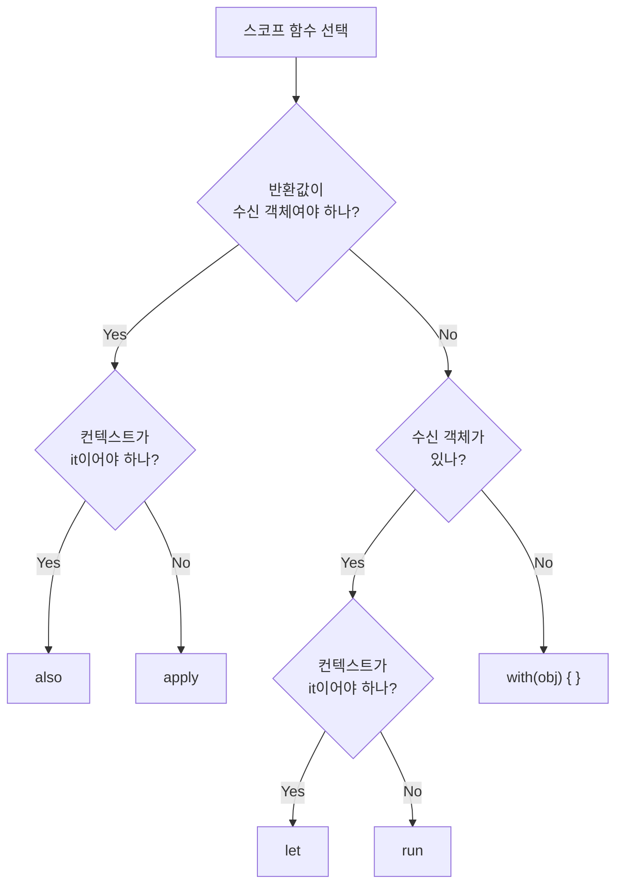

## 전체 비유: 주방에서 재료를 다루는 방식

스코프 함수를 **주방 조리 동작** 에 비유하면 이해하기 쉽습니다. 같은 재료(객체)라도 목적에 따라 다른 방식으로 다룹니다.

| 주방 비유 | 스코프 함수 | 컨텍스트 | 반환값 |
|----------|-----------|---------|--------|
| 재료를 가져와서 결과물 반환 | `let` | `it` | 람다 결과 |
| 냄비 안에서 여러 작업 후 결과 | `run` | `this` | 람다 결과 |
| 계량대에 놓고 여러 작업 | `with` | `this` | 람다 결과 |
| 재료 세팅(설정) 후 그대로 | `apply` | `this` | 수신 객체 |
| 재료 사용하고 부가 작업 후 그대로 | `also` | `it` | 수신 객체 |

5개 모두 **람다 블록 안에서 객체를 다루는 방법** 을 제공하지만, 컨텍스트 객체 참조 방식(it vs this)과 반환값이 다릅니다.

---

> **대상 독자**: Kotlin 기초 문법을 익힌 개발자
> **선수 지식**: 람다, 확장 함수 기초
> **소요 시간**: 약 30분
> **이 문서를 읽으면**: 5가지 스코프 함수를 상황에 맞게 선택하고, 체이닝을 올바르게 작성할 수 있습니다.


- `apply` / `also` → 수신 객체 반환 (설정·부가작업용)
- `let` / `run` / `with` → 람다 결과 반환 (변환·계산용)
- `it` 사용: `let`, `also` / `this` 사용: `run`, `with`, `apply`
- 스코프 함수는 코드 간결화 도구이지 만병통치약이 아닙니다


#### 왜 스코프 함수가 필요한가?

같은 객체를 반복해서 참조하거나, null 체크 후 작업을 이어가야 할 때 코드가 지저분해집니다.

```kotlin
// 스코프 함수 없이
val user = findUser(id)
if (user != null) {
    user.name = "홍길동"
    user.email = "hong@example.com"
    userRepository.save(user)
}

// apply + let으로 간결하게
findUser(id)?.apply {
    name = "홍길동"
    email = "hong@example.com"
}?.let { userRepository.save(it) }
```

#### 5개 스코프 함수 상세 비교



#### let

`let`은 **null 안전 처리** 와 **변환** 에 가장 많이 쓰입니다. 컨텍스트 객체를 `it`으로 참조하고, 람다의 마지막 표현식을 반환합니다.

```kotlin
// 기본 사용
val name = "  kotlin  "
val upper = name.let {
    val trimmed = it.trim()
    trimmed.uppercase()         // 람다 결과 반환
}
println(upper)                  // KOTLIN

// null 안전 체크 (가장 많이 쓰이는 패턴)
val user: User? = findUser(id)
user?.let {
    sendEmail(it.email)         // user가 null이 아닐 때만 실행
    println("이메일 전송: ${it.name}")
}

// 결과를 다른 타입으로 변환
val length: Int = "hello".let { it.length }
```


- nullable 값을 non-null 컨텍스트로 가져올 때 (`?.let { }`)
- 표현식 결과에 연속 변환이 필요할 때
- 로컬 스코프에서 임시 변수 이름이 필요할 때


#### run

`run`은 **객체 초기화와 결과 계산을 함께** 할 때 사용합니다. 컨텍스트 객체를 `this`로 참조(멤버에 직접 접근 가능)하고 람다 결과를 반환합니다.

```kotlin
// 객체 멤버에 직접 접근하면서 결과 계산
data class Config(var host: String = "", var port: Int = 0, var timeout: Int = 0)

val config = Config()
val connectionString = config.run {
    host = "localhost"
    port = 5432
    timeout = 30
    "$host:$port (timeout=${timeout}s)"   // 람다 결과 반환
}
println(connectionString)   // localhost:5432 (timeout=30s)

// 확장 없이 블록 실행 (수신 객체 없는 run)
val result = run {
    val x = 10
    val y = 20
    x + y                               // 30
}
```

#### with

`with`는 **이미 non-null인 객체에 여러 작업** 을 수행할 때 사용합니다. 확장 함수가 아니라 일반 함수이므로 `with(obj) { }` 형태로 호출합니다.

```kotlin
data class StringBuilder(var value: String = "")

// 여러 멤버에 접근하면서 결과 계산
val report = with(orderRepository.findById(orderId)) {
    """
    주문 번호: $id
    고객: $customerName
    금액: ${amount.formatCurrency()}
    상태: $status
    """.trimIndent()
}
```


- `with(obj) { }` — obj가 non-null일 때, 람다 결과 반환
- `obj.run { }` — null 안전 처리(`?.run { }`)도 가능, 람다 결과 반환
- 둘 다 `this`로 객체 참조하고 람다 결과 반환 — 상황에 따라 선택


#### apply

`apply`는 **객체 초기화(빌더 패턴)** 에 이상적입니다. 컨텍스트 객체를 `this`로 참조하고, **수신 객체 자체를 반환** 합니다.

```kotlin
// 객체 초기화
data class UserDto(
    var name: String = "",
    var email: String = "",
    var role: String = "USER"
)

val dto = UserDto().apply {
    name = "홍길동"
    email = "hong@example.com"
    role = "ADMIN"
}

// 빌더 패턴 대체
val alert = AlertDialog.Builder(context).apply {
    setTitle("확인")
    setMessage("삭제하시겠습니까?")
    setPositiveButton("확인") { _, _ -> delete() }
    setNegativeButton("취소", null)
}.create()

// 컬렉션 초기화에도 유용
val headers = mutableMapOf<String, String>().apply {
    put("Content-Type", "application/json")
    put("Authorization", "Bearer $token")
    put("X-Request-Id", UUID.randomUUID().toString())
}
```

#### also

`also`는 **부가 작업(로깅, 검증)** 을 체이닝에 끼워 넣을 때 사용합니다. 컨텍스트 객체를 `it`으로 참조하고, **수신 객체 자체를 반환** 합니다.

```kotlin
// 로깅을 체이닝 중간에 삽입
val user = createUser(request)
    .also { log.info("사용자 생성: ${it.id}") }
    .also { sendWelcomeEmail(it.email) }

// 검증
fun saveUser(user: User): User {
    return user
        .also { require(it.name.isNotBlank()) { "이름이 비어있습니다" } }
        .also { require(it.email.contains("@")) { "이메일이 유효하지 않습니다" } }
        .let { userRepository.save(it) }
}
```


- `also` (`it` 사용): 객체를 외부 관점에서 다룰 때 — 로깅, 검증
- `apply` (`this` 사용): 객체 내부를 설정할 때 — 초기화, 빌더


#### 5개 함수 한눈에 비교

| 함수 | 컨텍스트 | 반환값 | 주요 용도 |
|------|---------|--------|---------|
| `let` | `it` | 람다 결과 | null 안전 처리, 변환 |
| `run` | `this` | 람다 결과 | 초기화 + 결과 계산 |
| `with` | `this` | 람다 결과 | non-null 객체의 여러 작업 |
| `apply` | `this` | 수신 객체 | 객체 초기화/설정 |
| `also` | `it` | 수신 객체 | 부가 작업(로깅, 검증) |

#### 체이닝 예제

스코프 함수들을 연결하면 데이터 처리 파이프라인을 간결하게 표현할 수 있습니다.

```kotlin
data class Order(
    val id: String,
    var status: OrderStatus = OrderStatus.PENDING,
    var totalAmount: Long = 0
)

enum class OrderStatus { PENDING, CONFIRMED, SHIPPED }

fun processOrder(orderId: String): String {
    return findOrder(orderId)
        ?.also { log.info("주문 처리 시작: ${it.id}") }     // 로깅
        ?.apply {
            status = OrderStatus.CONFIRMED                   // 상태 변경
            totalAmount = calculateTotal(id)                 // 금액 계산
        }
        ?.also { orderRepository.save(it) }                  // 저장
        ?.let { "주문 ${it.id} 처리 완료 (${it.totalAmount}원)" }  // 결과 변환
        ?: "주문을 찾을 수 없습니다"
}
```

#### 안티 패턴 — 이렇게는 쓰지 마세요

```kotlin
// ❌ 깊은 중첩 — 가독성 저하
val result = user?.let { u ->
    u.order?.let { o ->
        o.items?.let { items ->
            items.sumOf { it.price }
        }
    }
}
// ✅ 대신 — 코드를 함수로 분리하거나 안전 호출 연산자 사용
val result = user?.order?.items?.sumOf { it.price }

// ❌ 단순 null 체크에 let 남용
if (user != null) {
    user.let { println(it.name) }   // let이 불필요
}
// ✅ 대신
user?.let { println(it.name) }

// ❌ apply 내에서 it 사용 혼동
val obj = Foo().apply {
    value = it.calculate()   // it은 외부 람다의 it — 의도가 불명확
}

// ❌ 너무 긴 스코프 함수 블록 — 함수로 추출하는 것이 낫습니다
val config = Config().apply {
    // 30줄의 복잡한 설정 로직...
}
// ✅ 대신
fun createDefaultConfig() = Config().apply {
    // 논리적으로 묶인 설정만
}
```


- `let`/`also` → 컨텍스트를 `it`으로, `run`/`with`/`apply` → `this`로 참조합니다
- `apply`/`also` → 수신 객체 반환 (체이닝 유지), `let`/`run`/`with` → 람다 결과 반환
- 스코프 함수는 **1~2 depth** 가 최대 — 중첩이 깊어지면 함수를 분리하세요
- null 안전 처리의 기본은 `?.let { }`, 초기화의 기본은 `.apply { }`


#### 다음 단계

- [확장 함수](extension-functions/) — 스코프 함수의 기반이 되는 확장 함수 원리
- [인라인/Reified](inline-reified/) — 스코프 함수가 inline으로 구현되는 이유와 원리
