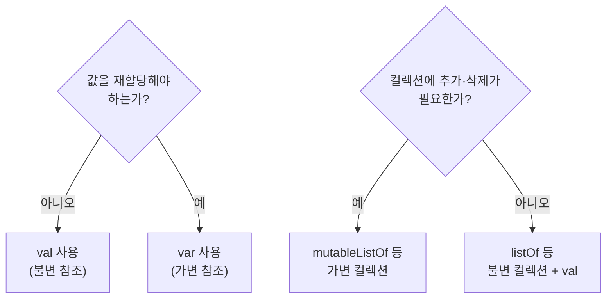
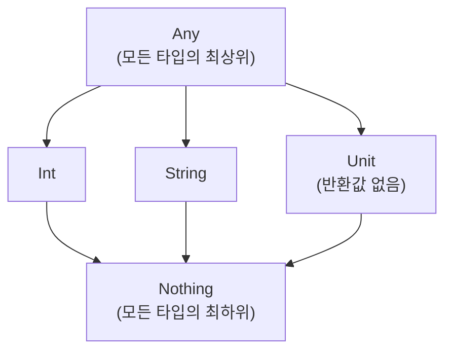

## 전체 비유: 상자와 라벨

Kotlin의 변수와 타입을 **상자와 라벨** 에 비유하면 이해하기 쉽습니다. 상자에는 물건(값)을 담고, 라벨(타입)이 어떤 물건을 담을 수 있는지 알려 줍니다. `val`은 한 번 담으면 교체할 수 없는 잠금 상자, `var`은 내용물을 바꿀 수 있는 일반 상자입니다.

| 비유 | Kotlin 개념 | 역할 |
|------|------------|------|
| 잠금 상자 | `val` (불변) | 한 번 담으면 교체 불가 |
| 일반 상자 | `var` (가변) | 언제든 내용물 교체 가능 |
| 상자 라벨 | 타입 선언 | 담을 수 있는 값의 종류 정의 |
| 자동 라벨링 기계 | 타입 추론 | 컴파일러가 타입을 자동으로 결정 |
| 내용물 확인 창 | 문자열 템플릿 | 값을 문자열 안에 바로 삽입 |

---

> **대상 독자**: [기본 문법](../basics/)을 읽은 학습자
> **선수 지식**: Kotlin 기본 문법 (패키지, 진입점, 표현식)
> **소요 시간**: 약 25분
> **이 문서를 읽으면**: `val`과 `var`을 올바르게 선택하고, 기본 타입을 사용하며, 문자열 템플릿으로 값을 출력할 수 있습니다.


- **`val`을 기본으로** 사용하고, 꼭 필요할 때만 `var`을 씁니다
- **타입 추론** 이 강력해서 대부분 타입 표기를 생략할 수 있습니다
- **문자열 템플릿** `"$변수"`, `"${표현식}"`으로 문자열 조합이 간편합니다
- **`Any`**, **`Unit`**, **`Nothing`** 은 Kotlin 타입 계층의 특수 타입입니다


#### 왜 val/var를 구분하는가?

상태 변경은 버그의 주요 원인 중 하나입니다. 값이 어디서 바뀌었는지 추적하는 것은 코드가 커질수록 어려워집니다. Kotlin은 **불변을 기본값** 으로 만들어 이 문제를 설계 단계에서 줄입니다.



---

#### val — 불변 변수

`val`로 선언한 변수는 **초기화 이후 재할당이 불가능** 합니다.

```kotlin
val name = "Kotlin"
val version = 2
val pi = 3.14159

// name = "Java"  // 컴파일 오류! val은 재할당 불가
```


`val`은 **참조(reference)** 가 변경되지 않는 것이지, 참조가 가리키는 객체 내부가 불변임을 보장하지 않습니다.

```kotlin
val list = mutableListOf(1, 2, 3)
list.add(4)      // OK — 리스트 내부는 변경 가능
// list = mutableListOf() // 오류 — 참조 자체는 변경 불가
```


#### var — 가변 변수

`var`로 선언한 변수는 **재할당이 가능** 합니다. 꼭 필요한 상황에서만 사용합니다.

```kotlin
var count = 0
count = count + 1   // OK
count += 1          // OK (축약형)

var message = "시작"
message = "완료"    // OK
```

**언제 var을 쓰는가?**

| 상황 | 설명 |
|------|------|
| 루프 누적 변수 | 반복하며 값을 쌓을 때 |
| 외부 라이브러리 요구 | 라이브러리가 가변 상태를 요구할 때 |
| 초기화 시점 분리 | 선언과 초기화를 나눠야 할 때 |

---

#### 기본 타입

Kotlin의 모든 타입은 객체입니다. 숫자 타입도 메서드를 가집니다.

**숫자 타입**

| 타입 | 크기 | 범위 | 예시 |
|------|------|------|------|
| `Byte` | 8 bit | -128 ~ 127 | `val b: Byte = 42` |
| `Short` | 16 bit | -32768 ~ 32767 | `val s: Short = 1000` |
| `Int` | 32 bit | 약 ±21억 | `val i = 42` |
| `Long` | 64 bit | 약 ±922경 | `val l = 1_000_000L` |
| `Float` | 32 bit | 단정밀도 | `val f = 3.14f` |
| `Double` | 64 bit | 배정밀도 | `val d = 3.14159` |

```kotlin
// 숫자 리터럴
val million = 1_000_000     // 밑줄로 가독성 향상
val hex = 0xFF              // 16진수
val binary = 0b1010_1010    // 2진수
val longVal = 100L          // Long 리터럴

// 숫자 타입의 메서드
val n = 42
println(n.toString())   // "42"
println(n.toDouble())   // 42.0
println(42.coerceIn(0, 100))  // 42 (범위 내 값 보장)
```

**Boolean 타입**

```kotlin
val isActive = true
val isDisabled = false

// 논리 연산자
val and = isActive && !isDisabled   // true
val or = isActive || isDisabled     // true
val not = !isActive                 // false
```

**Char 타입**

```kotlin
val letter: Char = 'K'
val digit: Char = '5'

println(letter.code)            // 유니코드 코드 포인트: 75
println(digit.isDigit())        // true
println(letter.isUpperCase())   // true
println(letter.lowercaseChar()) // 'k'
```

**String 타입**

```kotlin
val greeting = "안녕하세요"
println(greeting.length)         // 5
println(greeting[0])             // '안'
println(greeting.uppercase())    // "안녕하세요" (한글은 변환 없음)
println("  공백  ".trim())       // "공백"

// 여러 줄 문자열
val multiline = """
    SELECT *
    FROM users
    WHERE active = true
""".trimIndent()
```

---

#### 타입 추론

Kotlin 컴파일러는 초기값을 보고 타입을 자동으로 추론합니다. 대부분의 경우 타입 표기를 생략할 수 있습니다.

```kotlin
val name = "Kotlin"          // String으로 추론
val count = 42               // Int로 추론
val pi = 3.14                // Double로 추론
val flag = true              // Boolean으로 추론
val nums = listOf(1, 2, 3)   // List<Int>로 추론
```

**명시적 타입 표기가 필요한 경우**

```kotlin
// 1. 특정 타입을 원할 때
val longNum: Long = 42         // 기본 추론은 Int이므로 Long을 명시
val floatNum: Float = 3.14f

// 2. 빈 컬렉션
val emptyList: List<String> = emptyList()  // 추론 불가

// 3. 함수 매개변수 (항상 필요)
fun add(a: Int, b: Int): Int = a + b

// 4. 재귀 함수의 반환 타입
fun factorial(n: Int): Int = if (n <= 1) 1 else n * factorial(n - 1)

// 5. 공개 API — 가독성을 위해 명시 권장
fun fetchUser(id: Long): User = userRepository.findById(id)
```

---

#### 문자열 템플릿

Kotlin의 문자열 템플릿(`$`)은 문자열 안에 변수나 표현식을 바로 삽입합니다.

```kotlin
val name = "홍길동"
val age = 30

// 변수 삽입
println("이름: $name")                    // 이름: 홍길동

// 표현식 삽입 — ${ } 사용
println("나이: ${age}세")                 // 나이: 30세
println("내년 나이: ${age + 1}세")        // 내년 나이: 31세
println("이름 길이: ${name.length}자")    // 이름 길이: 3자

// 중첩 표현식
val items = listOf("사과", "배", "감")
println("목록: ${items.joinToString(", ")}")  // 목록: 사과, 배, 감
```

**달러 기호를 문자로 쓰려면**

```kotlin
val price = 1000
println("가격: \$${price}원")   // 가격: $1000원
// 또는
println("가격: ${'$'}${price}원")
```

---

#### 숫자 변환

Kotlin은 숫자 타입 간 **암묵적 형 변환을 허용하지 않습니다.** 명시적으로 변환 함수를 호출해야 합니다.

```kotlin
val intVal: Int = 42
// val longVal: Long = intVal   // 컴파일 오류!
val longVal: Long = intVal.toLong()   // OK

// 변환 함수 목록
val n = 100
n.toByte()      // Byte
n.toShort()     // Short
n.toInt()       // Int
n.toLong()      // Long
n.toFloat()     // Float
n.toDouble()    // Double
n.toChar()      // Char (코드 포인트로 변환)
```

**문자열 ↔ 숫자 변환**

```kotlin
// 문자열 → 숫자
val num = "42".toInt()              // 42
val safe = "abc".toIntOrNull()      // null (파싱 실패 시)
val withDefault = "abc".toIntOrNull() ?: 0  // 0

// 숫자 → 문자열
val str = 42.toString()             // "42"
val formatted = "%.2f".format(3.14159)  // "3.14"
```

---

#### Any, Unit, Nothing

Kotlin 타입 계층의 세 가지 특수 타입입니다.



**Any — 모든 타입의 조상**

```kotlin
fun describe(value: Any): String = when (value) {
    is Int    -> "정수: $value"
    is String -> "문자열: $value"
    is Boolean -> "불린: $value"
    else      -> "기타: $value"
}

println(describe(42))       // 정수: 42
println(describe("hello"))  // 문자열: hello
```

**Unit — 반환값이 없는 타입**

`Unit`은 Java의 `void`에 해당합니다. 반환값이 없는 함수의 반환 타입입니다.

```kotlin
fun logMessage(msg: String): Unit {
    println("[LOG] $msg")
    // return Unit 이 암묵적으로 추가됨
}

// Unit 반환 타입은 생략 가능
fun logMessage2(msg: String) {
    println("[LOG] $msg")
}
```

**Nothing — 정상 반환이 없음을 표현**

`Nothing`은 반환되지 않는 함수의 타입입니다. 예외를 던지거나 무한 루프에 사용합니다.

```kotlin
// 항상 예외를 던지는 함수
fun fail(message: String): Nothing {
    throw IllegalStateException(message)
}

// Nothing은 모든 타입의 하위 타입이므로 타입 호환 가능
val name: String = System.getenv("APP_NAME") ?: fail("APP_NAME 환경 변수 없음")
```

| 특수 타입 | 위치 | 의미 |
|----------|------|------|
| `Any` | 타입 계층 최상위 | 모든 Kotlin 객체의 공통 조상 |
| `Unit` | 타입 계층 중간 | 반환값 없음 (void에 해당) |
| `Nothing` | 타입 계층 최하위 | 정상 반환이 없음 |

---

#### 코드 예제: 전부 합쳐보기

```kotlin
package com.example.types

fun main() {
    // val / var
    val language = "Kotlin"
    var year = 2016
    year = 2017  // JetBrains가 1.0 릴리즈한 연도로 수정

    // 타입 추론
    val pi = 3.14159          // Double
    val million = 1_000_000   // Int

    // 문자열 템플릿
    println("$language 출시 연도: $year")
    println("원주율 소수점 2자리: ${"%.2f".format(pi)}")
    println("백만의 절반: ${million / 2}")

    // 숫자 변환
    val intVal = 42
    val longVal: Long = intVal.toLong()
    val parsed = "100".toIntOrNull() ?: 0

    // Any 타입 활용
    val values: List<Any> = listOf(1, "둘", true, 3.0)
    for (v in values) {
        println("${v::class.simpleName}: $v")
    }
}
```

---

#### 핵심 포인트


- **`val`** 을 기본으로, **`var`** 은 꼭 필요할 때만 사용합니다
- **타입 추론** 으로 대부분의 경우 타입 표기를 생략할 수 있습니다
- **문자열 템플릿** `"$변수"`, `"${표현식}"`으로 문자열을 조합합니다
- **숫자 간 형 변환은 명시적** 으로 합니다 (`toInt()`, `toLong()` 등)
- **`Any`**, **`Unit`**, **`Nothing`** 은 각각 최상위·반환없음·최하위 타입입니다


#### 다음 단계

- [함수](../functions/) - `fun` 정의, 기본값/명명 인자, 람다를 학습합니다
- [Null Safety](../null-safety/) - nullable 타입과 안전 호출 연산자를 배웁니다
