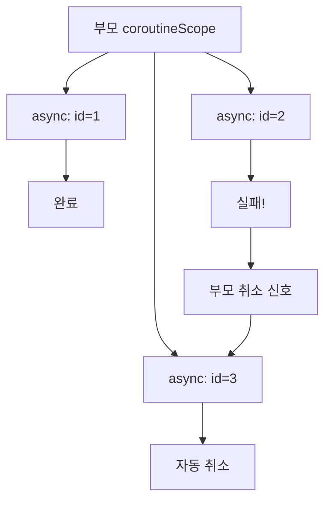

> **소요 시간**: 약 30분


- `async { }` + `await()` — 두 API를 병렬 호출, 직렬 대비 속도 향상
- `suspend fun`을 `@GetMapping`에 사용하면 Spring MVC에서 코루틴 컨트롤러 동작
- `withTimeout(ms) { }` — 타임아웃 지정, 초과 시 `TimeoutCancellationException`
- 구조화된 동시성 — 부모 코루틴이 취소되면 자식 코루틴도 자동 취소


**대상 독자**: Kotlin 기초와 Spring Boot 경험이 있는 개발자
**선수 지식**: [Spring Boot 연동](spring-boot-integration/), 코루틴 기초 개념

---

코루틴을 실무 시나리오에 적용합니다. 두 외부 API를 병렬 호출하고, Spring MVC 컨트롤러에서 `suspend fun`을 사용하며, 타임아웃과 취소 전파를 다룹니다.

#### Step 1 — 의존성 설정

```kotlin
// build.gradle.kts
dependencies {
    implementation("org.springframework.boot:spring-boot-starter-web")
    implementation("org.springframework.boot:spring-boot-starter-webflux") // WebClient용
    implementation("org.jetbrains.kotlinx:kotlinx-coroutines-core:1.8.1")
    implementation("org.jetbrains.kotlinx:kotlinx-coroutines-reactor:1.8.1") // Spring 통합
    implementation("org.jetbrains.kotlin:kotlin-reflect")
    implementation("com.fasterxml.jackson.module:jackson-module-kotlin")
    testImplementation("org.springframework.boot:spring-boot-starter-test")
    testImplementation("org.jetbrains.kotlinx:kotlinx-coroutines-test:1.8.1")
}
```

`kotlinx-coroutines-reactor`는 Reactor(Project Reactor)와 코루틴을 연결합니다. Spring MVC에서 `suspend fun`을 사용할 수 있게 해줍니다.

#### Step 2 — 외부 API 두 곳 병렬 호출

가장 흔한 실무 시나리오입니다. 사용자 정보와 주문 이력을 각각 다른 서비스에서 조회합니다.

```kotlin
// src/main/kotlin/com/example/coroutine/service/UserDashboardService.kt
package com.example.coroutine.service

import kotlinx.coroutines.async
import kotlinx.coroutines.coroutineScope
import kotlinx.coroutines.withTimeout
import org.slf4j.LoggerFactory
import org.springframework.stereotype.Service
import org.springframework.web.reactive.function.client.WebClient
import org.springframework.web.reactive.function.client.awaitBody

data class UserInfo(val id: Long, val name: String, val email: String)
data class OrderHistory(val userId: Long, val orders: List<String>, val totalAmount: Long)
data class UserDashboard(val user: UserInfo, val orders: OrderHistory, val loadTimeMs: Long)

@Service
class UserDashboardService(
    private val webClient: WebClient
) {
    private val log = LoggerFactory.getLogger(this::class.java)

    suspend fun getDashboard(userId: Long): UserDashboard {
        val startTime = System.currentTimeMillis()
        log.info("대시보드 조회 시작: userId=$userId")

        // coroutineScope — 두 작업이 모두 완료될 때까지 대기
        // 하나가 실패하면 다른 하나도 취소됩니다 (구조화된 동시성)
        return coroutineScope {
            // async — 두 API를 동시에 호출
            val userDeferred = async {
                withTimeout(3_000L) {   // 3초 타임아웃
                    fetchUserInfo(userId)
                }
            }

            val ordersDeferred = async {
                withTimeout(5_000L) {   // 5초 타임아웃
                    fetchOrderHistory(userId)
                }
            }

            // 두 결과 모두 기다림 — 병렬 실행
            val user = userDeferred.await()
            val orders = ordersDeferred.await()
            val elapsed = System.currentTimeMillis() - startTime

            log.info("대시보드 조회 완료: ${elapsed}ms")
            UserDashboard(user, orders, elapsed)
        }
    }

    private suspend fun fetchUserInfo(userId: Long): UserInfo {
        log.info("사용자 정보 조회 중: $userId")
        // 실제로는 외부 API 호출
        // return webClient.get()
        //     .uri("http://user-service/users/$userId")
        //     .retrieve()
        //     .awaitBody<UserInfo>()

        // 시뮬레이션
        kotlinx.coroutines.delay(500L)
        return UserInfo(userId, "홍길동", "hong@example.com")
    }

    private suspend fun fetchOrderHistory(userId: Long): OrderHistory {
        log.info("주문 이력 조회 중: $userId")
        // 시뮬레이션
        kotlinx.coroutines.delay(800L)
        return OrderHistory(userId, listOf("ORDER-001", "ORDER-002"), 150_000L)
    }
}
```

직렬 처리(500ms + 800ms = 1300ms) 대신 병렬 처리(max(500ms, 800ms) = 800ms)로 약 40% 빠릅니다.

#### Step 3 — suspend 컨트롤러

Spring MVC에서 `suspend fun`을 컨트롤러 메서드로 사용할 수 있습니다. 코루틴-Reactor 어댑터(`kotlinx-coroutines-reactor`)가 클래스패스에 있으면 Spring이 자동으로 코루틴을 인식합니다.

```kotlin
// src/main/kotlin/com/example/coroutine/controller/DashboardController.kt
package com.example.coroutine.controller

import com.example.coroutine.service.UserDashboard
import com.example.coroutine.service.UserDashboardService
import kotlinx.coroutines.TimeoutCancellationException
import org.slf4j.LoggerFactory
import org.springframework.http.HttpStatus
import org.springframework.web.bind.annotation.*

@RestController
@RequestMapping("/api")
class DashboardController(
    private val dashboardService: UserDashboardService
) {
    private val log = LoggerFactory.getLogger(this::class.java)

    // suspend fun — Spring이 코루틴으로 실행
    @GetMapping("/users/{userId}/dashboard")
    suspend fun getDashboard(@PathVariable userId: Long): UserDashboard {
        return dashboardService.getDashboard(userId)
    }

    // 예외 처리 — 타임아웃 포함
    @GetMapping("/users/{userId}/dashboard-safe")
    suspend fun getDashboardSafe(@PathVariable userId: Long): Any {
        return try {
            dashboardService.getDashboard(userId)
        } catch (ex: TimeoutCancellationException) {
            log.warn("대시보드 조회 타임아웃: userId=$userId")
            mapOf("error" to "요청이 시간 초과되었습니다", "code" to "TIMEOUT")
        } catch (ex: Exception) {
            log.error("대시보드 조회 실패: userId=$userId", ex)
            mapOf("error" to "서비스 오류가 발생했습니다", "code" to "INTERNAL_ERROR")
        }
    }
}
```

#### Step 4 — withTimeout 활용

```kotlin
// src/main/kotlin/com/example/coroutine/service/ResilientService.kt
package com.example.coroutine.service

import kotlinx.coroutines.*
import org.slf4j.LoggerFactory
import org.springframework.stereotype.Service

@Service
class ResilientService {
    private val log = LoggerFactory.getLogger(this::class.java)

    // 타임아웃 + 기본값
    suspend fun fetchWithFallback(id: Long): String {
        return try {
            withTimeout(2_000L) {
                slowExternalCall(id)
            }
        } catch (ex: TimeoutCancellationException) {
            log.warn("타임아웃 발생 — 기본값 반환: id=$id")
            "기본값"
        }
    }

    // 재시도 로직
    suspend fun fetchWithRetry(id: Long, maxRetries: Int = 3): String {
        repeat(maxRetries) { attempt ->
            try {
                return withTimeout(2_000L) {
                    slowExternalCall(id)
                }
            } catch (ex: TimeoutCancellationException) {
                log.warn("시도 ${attempt + 1}/$maxRetries 실패")
                if (attempt < maxRetries - 1) {
                    delay(500L * (attempt + 1))   // 지수 백오프
                }
            }
        }
        throw RuntimeException("$maxRetries 회 재시도 후 실패: id=$id")
    }

    private suspend fun slowExternalCall(id: Long): String {
        delay(1_500L)    // 1.5초 지연 시뮬레이션
        return "결과-$id"
    }
}
```

#### Step 5 — 구조화된 동시성으로 취소 전파

코루틴의 구조화된 동시성은 **부모가 취소되면 모든 자식 코루틴이 자동으로 취소** 됩니다.

```kotlin
// src/main/kotlin/com/example/coroutine/service/BatchService.kt
package com.example.coroutine.service

import kotlinx.coroutines.*
import org.slf4j.LoggerFactory
import org.springframework.stereotype.Service

@Service
class BatchService {
    private val log = LoggerFactory.getLogger(this::class.java)

    // 여러 항목을 병렬 처리 — 하나 실패 시 전체 취소
    suspend fun processBatch(ids: List<Long>): List<String> = coroutineScope {
        ids.map { id ->
            async {
                log.info("처리 시작: $id")
                processItem(id)
            }
        }.map { deferred ->
            deferred.await()   // 모든 결과 수집
        }
    }

    // 독립적인 병렬 처리 — 개별 실패가 다른 항목에 영향 없음
    suspend fun processBatchIndependent(ids: List<Long>): Map<Long, Result<String>> =
        coroutineScope {
            ids.map { id ->
                id to async {
                    runCatching { processItem(id) }   // 개별 예외 처리
                }
            }.associate { (id, deferred) ->
                id to deferred.await()
            }
        }

    // 취소 가능한 작업 — CancellationException 처리
    suspend fun cancellableWork(id: Long): String {
        return try {
            repeat(10) { i ->
                ensureActive()   // 취소 여부 확인
                delay(100L)
                log.info("진행 중 $i/10: id=$id")
            }
            "완료: $id"
        } catch (ex: CancellationException) {
            log.info("작업 취소됨: id=$id")
            throw ex   // CancellationException은 반드시 다시 던져야 합니다
        }
    }

    private suspend fun processItem(id: Long): String {
        delay(200L)
        if (id == 99L) throw RuntimeException("처리 실패: $id")
        return "결과-$id"
    }
}
```



#### Step 6 — 예외 처리 패턴

```kotlin
// src/main/kotlin/com/example/coroutine/service/ErrorHandlingService.kt
package com.example.coroutine.service

import kotlinx.coroutines.*
import org.slf4j.LoggerFactory
import org.springframework.stereotype.Service

@Service
class ErrorHandlingService {
    private val log = LoggerFactory.getLogger(this::class.java)

    // CoroutineExceptionHandler — launch에서 발생한 예외 처리
    private val exceptionHandler = CoroutineExceptionHandler { _, ex ->
        log.error("처리되지 않은 코루틴 예외", ex)
    }

    // SupervisorJob — 자식 코루틴이 실패해도 다른 자식은 계속 실행
    suspend fun independentTasks() = supervisorScope {
        val task1 = async {
            delay(100L)
            "task1 완료"
        }

        val task2 = async {
            delay(200L)
            throw RuntimeException("task2 실패")
        }

        val task3 = async {
            delay(300L)
            "task3 완료"
        }

        // task2가 실패해도 task1, task3는 완료됩니다
        listOf(
            runCatching { task1.await() }.getOrDefault("task1 실패"),
            runCatching { task2.await() }.getOrDefault("task2 실패"),
            runCatching { task3.await() }.getOrDefault("task3 실패")
        )
    }
}
```

#### Step 7 — 실행 및 테스트

```bash
./gradlew bootRun
```

```bash
# 병렬 API 호출 테스트
curl http://localhost:8080/api/users/1/dashboard

# 응답 예시
# {
#   "user": {"id":1,"name":"홍길동","email":"hong@example.com"},
#   "orders": {"userId":1,"orders":["ORDER-001","ORDER-002"],"totalAmount":150000},
#   "loadTimeMs": 823
# }

# 타임아웃 처리 테스트
curl http://localhost:8080/api/users/1/dashboard-safe
```

단순 테스트:

```kotlin
// src/test/kotlin/com/example/coroutine/service/UserDashboardServiceTest.kt
package com.example.coroutine.service

import kotlinx.coroutines.test.runTest
import org.junit.jupiter.api.Test
import org.springframework.boot.test.context.SpringBootTest

@SpringBootTest
class UserDashboardServiceTest(
    private val dashboardService: UserDashboardService
) {
    @Test
    fun `대시보드 조회가 병렬로 실행된다`() = runTest {
        val start = System.currentTimeMillis()
        val dashboard = dashboardService.getDashboard(1L)
        val elapsed = System.currentTimeMillis() - start

        assert(dashboard.user.id == 1L)
        // 직렬(1300ms)보다 빠르게 완료
        assert(elapsed < 1100L) { "병렬 실행이 예상보다 느립니다: ${elapsed}ms" }
    }
}
```


- `coroutineScope { }` + `async { }.await()` — 구조화된 동시성으로 병렬 실행
- `suspend fun` + Spring MVC — WebFlux 없이 코루틴 컨트롤러 동작
- `withTimeout(ms) { }` — 타임아웃 설정, `TimeoutCancellationException` 처리
- `CancellationException`은 반드시 다시 던져야 취소가 올바르게 전파됩니다
- `supervisorScope` — 자식 실패가 형제 코루틴에 영향을 주지 않을 때 사용


#### 다음 단계

- [Multiplatform 시작](multiplatform-intro/) — 코루틴이 KMP에서 동작하는 방식
- [코루틴 기초](../concepts/coroutines-basics/) — 코루틴 빌더와 디스패처 원리

> 💡 **함께 읽기**: 병렬 호출이 늘어나면 응답 시간 분포 분석이 중요해집니다. [Golden Signals: 지연시간]()에서 p95/p99 측정 기준과 운영 관점을 확인할 수 있습니다.
