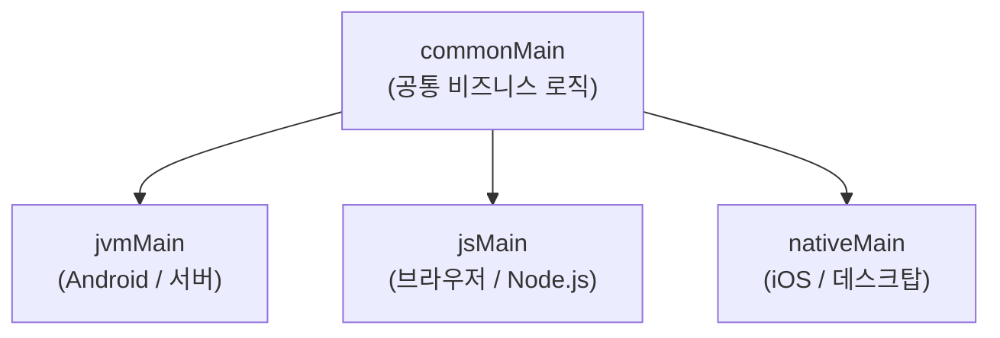


- `commonMain` — 모든 플랫폼에서 공유하는 Kotlin 코드
- `expect` — 공통 모듈에서 선언, `actual` — 각 플랫폼에서 구현
- `jvmMain`, `jsMain` — 플랫폼 특화 코드
- 한 번 작성한 비즈니스 로직을 JVM(백엔드/Android)과 JS(프론트엔드)에서 재사용


**대상 독자**: Kotlin 중급 이상의 개발자
**선수 지식**: [환경 설정](setup/), 기본 Kotlin 문법

---

Kotlin Multiplatform(KMP)으로 비즈니스 로직을 여러 플랫폼에서 공유합니다. 날짜 포매터를 공통 모듈로 작성하고, JVM과 JS에서 각각 구현하는 미니 프로젝트를 진행합니다.

#### Step 1 — 프로젝트 구조 이해

KMP 프로젝트에서 코드는 소스 세트(source set)로 구성됩니다.

```text
shared/
├── build.gradle.kts
└── src/
    ├── commonMain/kotlin/          # 모든 플랫폼 공유 코드
    ├── commonTest/kotlin/          # 공통 테스트
    ├── jvmMain/kotlin/             # JVM 전용 구현
    ├── jvmTest/kotlin/
    ├── jsMain/kotlin/              # JS 전용 구현
    └── jsTest/kotlin/
```



#### Step 2 — 프로젝트 생성

IntelliJ IDEA에서 **File** → **New** → **Project** → **Kotlin Multiplatform** → **Library** 선택.

또는 `build.gradle.kts`를 직접 작성합니다.

```kotlin
// settings.gradle.kts
rootProject.name = "kmp-date-formatter"
include(":shared")
```

```kotlin
// shared/build.gradle.kts
plugins {
    kotlin("multiplatform") version "2.0.0"
}

group = "com.example"
version = "0.1.0"

kotlin {
    jvm {
        jvmToolchain(17)
        testRuns["test"].executionTask.configure {
            useJUnitPlatform()
        }
    }

    js(IR) {
        browser {
            testTask {
                useKarma {
                    useChromeHeadless()
                }
            }
        }
        nodejs()
    }

    sourceSets {
        val commonMain by getting {
            dependencies {
                implementation("org.jetbrains.kotlinx:kotlinx-datetime:0.6.0")
            }
        }
        val commonTest by getting {
            dependencies {
                implementation(kotlin("test"))
            }
        }
        val jvmMain by getting
        val jvmTest by getting
        val jsMain by getting
        val jsTest by getting
    }
}
```

#### Step 3 — 공통 인터페이스 정의 (expect)

`expect`은 "이 선언은 각 플랫폼에서 구현되어야 한다"는 계약입니다.

```kotlin
// shared/src/commonMain/kotlin/com/example/datetime/DateFormatter.kt
package com.example.datetime

import kotlinx.datetime.LocalDate
import kotlinx.datetime.LocalDateTime

// expect 선언 — 각 플랫폼이 구현 제공
expect class PlatformDateFormatter() {
    fun formatDate(date: LocalDate): String
    fun formatDateTime(dateTime: LocalDateTime): String
    fun formatRelative(date: LocalDate): String   // "3일 전", "오늘" 등
}

// 공통 로직 — expect를 활용하는 비즈니스 로직
class DateService(private val formatter: PlatformDateFormatter = PlatformDateFormatter()) {

    fun describeDate(date: LocalDate): String {
        val relative = formatter.formatRelative(date)
        val formatted = formatter.formatDate(date)
        return "$relative ($formatted)"
    }

    fun describeDateTime(dateTime: LocalDateTime): String {
        return formatter.formatDateTime(dateTime)
    }
}
```

```kotlin
// shared/src/commonMain/kotlin/com/example/datetime/DateUtils.kt
package com.example.datetime

import kotlinx.datetime.*

// 플랫폼 독립적인 공통 유틸리티
fun LocalDate.isWeekend(): Boolean {
    val day = this.dayOfWeek
    return day == DayOfWeek.SATURDAY || day == DayOfWeek.SUNDAY
}

fun LocalDate.daysUntil(other: LocalDate): Long {
    return (other.toEpochDays() - this.toEpochDays()).toLong()
}

fun LocalDate.nextWeekday(): LocalDate {
    var next = this.plus(1, DateTimeUnit.DAY)
    while (next.isWeekend()) {
        next = next.plus(1, DateTimeUnit.DAY)
    }
    return next
}

data class DateRange(val start: LocalDate, val end: LocalDate) {
    val durationDays: Long get() = start.daysUntil(end)
    operator fun contains(date: LocalDate): Boolean = date >= start && date <= end
}
```

#### Step 4 — JVM 구현 (actual)

```kotlin
// shared/src/jvmMain/kotlin/com/example/datetime/DateFormatter.jvm.kt
package com.example.datetime

import kotlinx.datetime.*
import java.time.format.DateTimeFormatter
import java.time.format.FormatStyle
import java.util.Locale

actual class PlatformDateFormatter {
    private val locale = Locale.KOREAN
    private val dateFormatter = DateTimeFormatter.ofLocalizedDate(FormatStyle.LONG)
        .withLocale(locale)
    private val dateTimeFormatter = DateTimeFormatter.ofLocalizedDateTime(FormatStyle.MEDIUM)
        .withLocale(locale)

    actual fun formatDate(date: LocalDate): String {
        val javaDate = java.time.LocalDate.of(date.year, date.monthNumber, date.dayOfMonth)
        return javaDate.format(dateFormatter)
    }

    actual fun formatDateTime(dateTime: LocalDateTime): String {
        val javaDateTime = java.time.LocalDateTime.of(
            dateTime.year, dateTime.monthNumber, dateTime.dayOfMonth,
            dateTime.hour, dateTime.minute, dateTime.second
        )
        return javaDateTime.format(dateTimeFormatter)
    }

    actual fun formatRelative(date: LocalDate): String {
        val today = Clock.System.now().toLocalDateTime(TimeZone.currentSystemDefault()).date
        val diff = today.daysUntil(date)
        return when {
            diff == 0L -> "오늘"
            diff == 1L -> "내일"
            diff == -1L -> "어제"
            diff > 0 -> "${diff}일 후"
            else -> "${-diff}일 전"
        }
    }
}
```

#### Step 5 — JS 구현 (actual)

```kotlin
// shared/src/jsMain/kotlin/com/example/datetime/DateFormatter.js.kt
package com.example.datetime

import kotlinx.datetime.*

actual class PlatformDateFormatter {
    // JS에서는 Intl.DateTimeFormat API 사용 (kotlin-js 통해 접근)
    actual fun formatDate(date: LocalDate): String {
        // 한국어 형식으로 포맷
        return "${date.year}년 ${date.monthNumber}월 ${date.dayOfMonth}일"
    }

    actual fun formatDateTime(dateTime: LocalDateTime): String {
        return "${formatDate(dateTime.date)} " +
               "${dateTime.hour.toString().padStart(2, '0')}:" +
               "${dateTime.minute.toString().padStart(2, '0')}"
    }

    actual fun formatRelative(date: LocalDate): String {
        val today = Clock.System.now().toLocalDateTime(TimeZone.currentSystemDefault()).date
        val diff = today.daysUntil(date)
        return when {
            diff == 0L -> "오늘"
            diff == 1L -> "내일"
            diff == -1L -> "어제"
            diff > 0 -> "${diff}일 후"
            else -> "${-diff}일 전"
        }
    }
}
```

#### Step 6 — 공통 테스트

공통 테스트는 모든 플랫폼에서 실행됩니다.

```kotlin
// shared/src/commonTest/kotlin/com/example/datetime/DateUtilsTest.kt
package com.example.datetime

import kotlinx.datetime.LocalDate
import kotlin.test.Test
import kotlin.test.assertEquals
import kotlin.test.assertFalse
import kotlin.test.assertTrue

class DateUtilsTest {
    @Test
    fun `토요일은 주말이다`() {
        val saturday = LocalDate(2026, 5, 16)   // 토요일
        assertTrue(saturday.isWeekend())
    }

    @Test
    fun `월요일은 주말이 아니다`() {
        val monday = LocalDate(2026, 5, 11)     // 월요일
        assertFalse(monday.isWeekend())
    }

    @Test
    fun `날짜 범위에 포함 여부 확인`() {
        val range = DateRange(
            start = LocalDate(2026, 5, 1),
            end = LocalDate(2026, 5, 31)
        )
        assertTrue(LocalDate(2026, 5, 15) in range)
        assertFalse(LocalDate(2026, 6, 1) in range)
    }

    @Test
    fun `daysUntil 계산`() {
        val from = LocalDate(2026, 5, 1)
        val to = LocalDate(2026, 5, 10)
        assertEquals(9L, from.daysUntil(to))
    }

    @Test
    fun `nextWeekday는 주말을 건너뛴다`() {
        val friday = LocalDate(2026, 5, 15)     // 금요일
        val nextWorkday = friday.nextWeekday()
        assertEquals(LocalDate(2026, 5, 18), nextWorkday)  // 월요일
    }
}
```

#### Step 7 — JVM 메인 (사용 예시)

```kotlin
// shared/src/jvmMain/kotlin/com/example/Main.kt
package com.example

import com.example.datetime.*
import kotlinx.datetime.*

fun main() {
    val formatter = PlatformDateFormatter()
    val service = DateService(formatter)

    // 날짜 포맷
    val today = Clock.System.now()
        .toLocalDateTime(TimeZone.currentSystemDefault()).date

    println("오늘: ${formatter.formatDate(today)}")
    // 예: 오늘: 2026년 5월 13일

    // 상대적 날짜
    val nextWeek = today.plus(7, kotlinx.datetime.DateTimeUnit.DAY)
    println("다음 주: ${service.describeDate(nextWeek)}")
    // 예: 다음 주: 7일 후 (2026년 5월 20일)

    // 주말 확인
    println("오늘 주말 여부: ${today.isWeekend()}")

    // 날짜 범위
    val projectPeriod = DateRange(
        start = today,
        end = today.plus(30, kotlinx.datetime.DateTimeUnit.DAY)
    )
    println("프로젝트 기간: ${projectPeriod.durationDays}일")
}
```

#### Step 8 — 빌드 및 테스트

```bash
# 공통 테스트 실행 (JVM + JS)
./gradlew :shared:allTests

# JVM만 테스트
./gradlew :shared:jvmTest

# JS만 테스트
./gradlew :shared:jsTest

# JVM 실행
./gradlew :shared:jvmRun
```

**빌드 결과물**

```bash
# JVM용 JAR
shared/build/libs/shared-jvm-0.1.0.jar

# JS용 (Node.js/브라우저)
shared/build/js/packages/kmp-date-formatter-shared/
```


`expect`/`actual`은 클래스 외에도 다음에 적용할 수 있습니다.

- 최상위 함수: `expect fun currentTimeMs(): Long`
- 오브젝트: `expect object Platform`
- 타입 별칭: `expect class IOException`
- 어노테이션: `expect annotation class Serializable`



- 유효성 검사, 비즈니스 규칙 — 백엔드/프론트 동일 로직
- 날짜/시간 처리, 단위 변환, 포맷 규칙
- API 응답 파싱 모델 (data class)
- 알고리즘, 계산 로직

반면 UI, 파일 시스템, 네트워크 하위 계층은 플랫폼 특화 코드가 더 적합합니다.



- `commonMain` — 플랫폼 독립 공통 코드 (비즈니스 로직, 모델, 유틸)
- `expect` — 공통 모듈에서 선언, 각 플랫폼이 `actual`로 구현
- `jvmMain`, `jsMain` — 플랫폼 특화 API 사용 가능
- 공통 테스트는 모든 플랫폼에서 동시에 실행되어 일관성을 보장
- `kotlinx-datetime` 같은 공식 멀티플랫폼 라이브러리 활용으로 개발 범위 확장


#### 다음 단계

- [Multiplatform 개요](../concepts/multiplatform-overview/) — KMP 아키텍처와 플랫폼 지원 현황
- [환경 설정](setup/) — Gradle Kotlin DSL 심화
