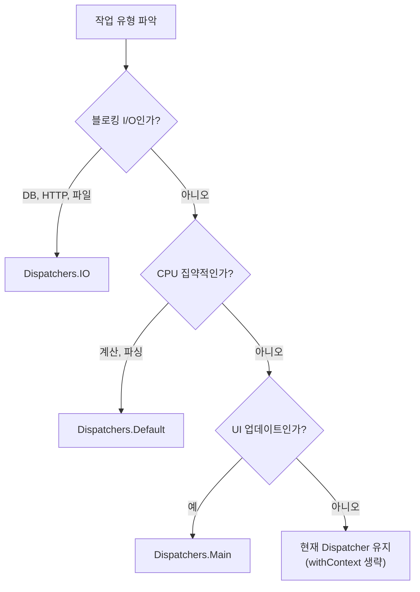

Kotlin/JVM 애플리케이션의 성능 병목을 찾고 최적화하는 절차를 단계별로 안내합니다.

**소요 시간**: 약 20~25분


- 추측하지 말고 **측정 먼저**. Async Profiler 또는 JFR로 실제 핫스팟을 찾습니다.
- 코루틴의 Dispatcher 선택이 성능에 가장 큰 영향을 줍니다. I/O는 `Dispatchers.IO`, CPU는 `Dispatchers.Default`.
- 람다 캡처와 boxing 비용을 줄이려면 `inline` 함수와 원시 타입을 활용합니다.
- JIT 워밍업 전에 측정한 결과는 실제 프로덕션 성능을 반영하지 않습니다.


---

## 이 가이드가 해결하는 문제

다음 상황에서 이 가이드를 사용하세요:

- API 응답 시간이 기대보다 느릴 때 어디서 병목이 발생하는지 찾고 싶을 때
- 코루틴 전환 후 오히려 성능이 나빠진 것 같을 때
- GC(가비지 컬렉션) 압력이 높아 지연이 발생할 때
- 람다와 고차 함수를 많이 쓰는 코드의 오버헤드를 줄이고 싶을 때

---

## 시작하기 전에: 측정 원칙


성능 최적화는 항상 **측정 → 분석 → 최적화 → 재측정** 순서로 진행합니다. 코드를 보고 "이 부분이 느릴 것 같다"는 직관보다 프로파일러 데이터를 신뢰합니다.


**측정 지표:**

| 지표 | 설명 | 측정 도구 |
|------|------|---------|
| 처리량(Throughput) | 초당 요청 수(RPS) | k6, wrk, Gatling |
| 지연(Latency) | p50/p95/p99 응답 시간 | k6, Gatling |
| CPU 사용률 | 메서드별 CPU 점유 시간 | Async Profiler, JFR |
| 메모리 할당 | GC 빈도, 힙 사용량 | JFR, VisualVM |
| 스레드 상태 | 대기/실행 비율 | Async Profiler |

---

## 1단계: Async Profiler 설치 및 사용

Async Profiler는 낮은 오버헤드로 CPU와 메모리 할당을 프로파일링합니다.

**설치:**

```bash
# Linux / macOS
wget https://github.com/async-profiler/async-profiler/releases/download/v3.0/async-profiler-3.0-linux-x64.tar.gz
tar -xzf async-profiler-3.0-linux-x64.tar.gz
cd async-profiler-3.0-linux-x64
```

**CPU 프로파일링 (30초):**

```bash
# 실행 중인 JVM 프로세스 PID 확인
jps -l

# CPU 프로파일링 (30초, Flamegraph HTML 생성)
./asprof -d 30 -f /tmp/cpu-flame.html <PID>
```

**메모리 할당 프로파일링:**

```bash
# 메모리 할당 핫스팟 찾기
./asprof -e alloc -d 30 -f /tmp/alloc-flame.html <PID>
```

**Spring Boot 앱 시작 시 자동 프로파일링:**

```bash
java -agentpath:/path/to/libasyncProfiler.so=start,event=cpu,file=/tmp/profile.html \
     -jar my-app.jar
```

**Flamegraph 읽는 법:**

- 가로축: 함수 호출 빈도 (넓을수록 많이 호출됨)
- 세로축: 호출 스택 깊이 (위로 갈수록 내부 함수)
- 가장 넓은 박스가 핫스팟

---

## 2단계: Java Flight Recorder (JFR) 사용

JFR은 JDK 11+에서 기본 제공하는 프로파일링 도구입니다. 오버헤드가 낮아 프로덕션에서도 사용 가능합니다.

**JFR 시작 (앱 실행 시):**

```bash
java -XX:+FlightRecorder \
     -XX:StartFlightRecording=duration=60s,filename=/tmp/app.jfr \
     -jar my-app.jar
```

**실행 중인 JVM에서 JFR 시작:**

```bash
# 60초 동안 기록
jcmd <PID> JFR.start duration=60s filename=/tmp/app.jfr

# 기록 중지 및 저장
jcmd <PID> JFR.stop name=1 filename=/tmp/app.jfr
```

**JFR 분석 (JMC — JDK Mission Control):**

1. [JDK Mission Control](https://adoptium.net/jmc) 다운로드
2. `/tmp/app.jfr` 파일 열기
3. **Method Profiling** 탭: CPU 핫스팟 확인
4. **Garbage Collection** 탭: GC 빈도·시간 확인
5. **Thread** 탭: 스레드 대기 시간 확인

**코드에서 JFR 이벤트 직접 기록:**

```kotlin
import jdk.jfr.*

@Label("사용자 조회")
@Description("UserService.getUser 실행 정보")
@Category("Application")
class UserFetchEvent : Event() {
    @Label("사용자 ID")
    var userId: String = ""

    @Label("소요 시간(ms)")
    var durationMs: Long = 0
}

class UserService {
    fun getUser(id: String): User {
        val event = UserFetchEvent()
        event.begin()
        event.userId = id

        val start = System.currentTimeMillis()
        try {
            return findUser(id)
        } finally {
            event.end()
            event.durationMs = System.currentTimeMillis() - start
            event.commit()
        }
    }
}
```

---

## 3단계: Kotlin 특유의 성능 비용

### 람다 캡처 비용

```kotlin
// 문제: 람다가 외부 변수를 캡처하면 객체 생성
fun processItems(items: List<String>) {
    val prefix = "처리됨"  // 캡처됨
    items.forEach { item ->
        println("$prefix: $item")  // 매 호출마다 람다 객체 생성 위험
    }
}

// 해결 1: inline 함수 사용 (forEach는 이미 inline)
// 표준 라이브러리 forEach는 inline이므로 람다 객체 생성 없음

// 해결 2: 람다를 클래스 수준으로 이동 (캡처 제거)
class ItemProcessor {
    private val prefix = "처리됨"

    fun process(items: List<String>) {
        items.forEach(::printItem)  // 메서드 참조 사용
    }

    private fun printItem(item: String) {
        println("$prefix: $item")
    }
}
```

### inline 함수 효과

```kotlin
// inline이 아닌 경우: 람다가 Function 객체로 boxing됨
fun <T> measureTime(block: () -> T): Pair<T, Long> {
    val start = System.nanoTime()
    val result = block()
    return result to (System.nanoTime() - start)
}

// inline: 람다가 호출 지점에 인라이닝됨, 객체 생성 없음
inline fun <T> measureTimeInline(block: () -> T): Pair<T, Long> {
    val start = System.nanoTime()
    val result = block()
    return result to (System.nanoTime() - start)
}

// 고빈도 호출 경로에서는 inline이 의미 있음
fun criticalPath() {
    repeat(1_000_000) {
        val (result, time) = measureTimeInline { heavyComputation() }
    }
}
```

### 박싱(Boxing) 비용

```kotlin
// 잘못된 예: 제네릭 때문에 Int가 Integer로 boxing됨
fun sumBoxed(numbers: List<Int>): Int {
    return numbers.fold(0) { acc, n -> acc + n }
    // List<Int>는 사실 List<Integer> — 원시 타입 사용 불가
}

// 최적화: IntArray 사용 (박싱 없음)
fun sumUnboxed(numbers: IntArray): Int {
    return numbers.sum()  // primitive int 배열 — 박싱 없음
}

// 또는 LongArray, DoubleArray 등 원시 배열 활용
```

---

## 4단계: 코루틴 성능 최적화

### Dispatcher 선택이 핵심

```kotlin
import kotlinx.coroutines.*

// 잘못된 예: CPU 작업에 IO Dispatcher 사용
suspend fun badCpuTask(): Long = withContext(Dispatchers.IO) {
    // IO는 스레드를 64개까지 늘림 → CPU 작업에 비효율
    (1L..10_000_000L).sum()
}

// 올바른 예: CPU 작업은 Default
suspend fun goodCpuTask(): Long = withContext(Dispatchers.Default) {
    // Default는 CPU 코어 수 = 스레드 최소화
    (1L..10_000_000L).sum()
}

// 잘못된 예: I/O 블로킹 작업에 Default 사용
suspend fun badIoTask(): String = withContext(Dispatchers.Default) {
    Thread.sleep(1000)  // Default 스레드 풀 점유!
    "결과"
}

// 올바른 예: 블로킹 I/O는 IO
suspend fun goodIoTask(): String = withContext(Dispatchers.IO) {
    Thread.sleep(1000)  // IO 전용 풀에서 처리
    "결과"
}
```

### suspend 함수 재진입 비용

`suspend` 함수는 재개(resume)될 때마다 상태 기계(state machine) 코드를 실행합니다. 매우 짧은 작업에 `suspend`를 남용하면 오버헤드가 발생할 수 있습니다.

```kotlin
// 잘못된 예: 너무 세분화된 suspend 함수
suspend fun addOne(n: Int): Int {
    return n + 1  // suspend 오버헤드가 실제 작업보다 큼
}

// 올바른 예: 실제 비동기 작업에만 suspend 사용
suspend fun fetchAndProcess(id: Int): String {
    val data = fetchFromDatabase(id)  // 실제 I/O - suspend 의미 있음
    return process(data)              // 순수 계산 - suspend 없어도 됨
}

fun process(data: String): String = data.uppercase().trim()
```

### withContext 남용 피하기

```kotlin
// 잘못된 예: 매 호출마다 컨텍스트 전환
suspend fun processAll(ids: List<Int>): List<String> {
    return ids.map { id ->
        withContext(Dispatchers.IO) {  // 매번 컨텍스트 전환 비용
            fetchFromDb(id)
        }
    }
}

// 올바른 예: 한 번에 IO 컨텍스트로 전환
suspend fun processAllOptimized(ids: List<Int>): List<String> =
    withContext(Dispatchers.IO) {
        ids.map { id -> fetchFromDb(id) }  // 이미 IO 컨텍스트
    }

// 병렬 처리가 필요하면 async 사용
suspend fun processAllParallel(ids: List<Int>): List<String> =
    withContext(Dispatchers.IO) {
        ids.map { id ->
            async { fetchFromDb(id) }
        }.awaitAll()
    }
```

---

## 5단계: JMH로 마이크로 벤치마크

JMH(Java Microbenchmark Harness)는 JVM 워밍업을 고려한 정확한 벤치마크를 제공합니다.

**Gradle 설정:**

```kotlin
// build.gradle.kts
plugins {
    id("me.champeau.jmh") version "0.7.2"
}

dependencies {
    jmhImplementation("org.openjdk.jmh:jmh-core:1.37")
    jmhAnnotationProcessor("org.openjdk.jmh:jmh-generator-annprocess:1.37")
}
```

**벤치마크 코드:**

```kotlin
import org.openjdk.jmh.annotations.*
import java.util.concurrent.TimeUnit

@BenchmarkMode(Mode.AverageTime)
@OutputTimeUnit(TimeUnit.MICROSECONDS)
@Warmup(iterations = 5, time = 1)    // 워밍업: 5회, 각 1초
@Measurement(iterations = 10, time = 1) // 측정: 10회, 각 1초
@State(Scope.Benchmark)
open class KotlinBenchmark {

    private val data = (1..1000).toList()

    @Benchmark
    fun sumWithFold(): Int = data.fold(0) { acc, n -> acc + n }

    @Benchmark
    fun sumWithSum(): Int = data.sum()

    @Benchmark
    fun sumWithReduce(): Int = data.reduce { acc, n -> acc + n }

    @Benchmark
    fun sumWithLoop(): Int {
        var sum = 0
        for (n in data) sum += n
        return sum
    }
}
```

**실행:**

```bash
./gradlew jmh
```

---

## 6단계: GC 압력 줄이기

```kotlin
// 잘못된 예: 루프에서 많은 임시 객체 생성
fun buildReport(items: List<Int>): String {
    var result = ""
    for (item in items) {
        result += "$item\n"  // 매 반복마다 String 객체 생성!
    }
    return result
}

// 올바른 예: StringBuilder 사용
fun buildReportOptimized(items: List<Int>): String = buildString {
    for (item in items) {
        appendLine(item)  // 단일 객체 재사용
    }
}

// 또는 joinToString
fun buildReportConcise(items: List<Int>): String =
    items.joinToString(separator = "\n")
```

**Data class copy() 비용:**

```kotlin
data class Config(
    val host: String,
    val port: Int,
    val timeout: Int,
    val maxConnections: Int
    // ... 많은 필드
)

// copy()는 새 객체를 생성함
val updated = config.copy(port = 9090)  // Config 객체 생성

// 빈번한 업데이트가 있다면 Builder 패턴이나 Mutable 클래스 고려
```

---

## 7단계: 측정 결과 해석

**핵심 지표 목표치 (일반적 기준):**

| 지표 | 좋음 | 주의 | 위험 |
|------|------|------|------|
| p99 API 응답 | < 100ms | 100~500ms | > 500ms |
| GC 일시 정지 | < 10ms | 10~100ms | > 100ms |
| CPU 사용률 | < 60% | 60~80% | > 80% |
| 스레드 대기 비율 | > 80% (I/O 서버) | - | < 50% |

**코루틴 디스패처 선택 가이드:**



*그림: 코루틴 디스패처 선택 결정 트리 — 블로킹 I/O는 Dispatchers.IO, CPU 집약적 작업은 Dispatchers.Default, UI 업데이트는 Dispatchers.Main으로 분류하는 흐름을 보여줍니다.*

---

## 체크리스트

성능 최적화 전 다음을 확인하세요:

- [ ] Async Profiler 또는 JFR로 실제 핫스팟을 측정했는가?
- [ ] JIT 워밍업 후의 데이터인가? (최소 5,000회 이상 실행 후 측정)
- [ ] Dispatcher 선택이 작업 유형과 맞는가? (CPU/IO 구분)
- [ ] `withContext`가 불필요하게 반복 호출되지 않는가?
- [ ] 고빈도 코드 경로에서 람다 캡처나 boxing 비용을 확인했는가?
- [ ] `String` 연산 루프를 `buildString` / `StringBuilder`로 교체했는가?
- [ ] 최적화 후 재측정하여 개선 여부를 확인했는가?

---

## 관련 문서

- [코루틴 기초](../concepts/coroutines-basics/) — Dispatcher 종류와 선택 기준
- [코루틴 고급](../concepts/coroutines-advanced/) — CoroutineScope와 누수 방지
- [코루틴 디버깅](coroutine-debugging/) — 성능 문제와 디버깅의 교차점
- [인라인/Reified](../concepts/inline-reified/) — inline 함수 성능 원리
