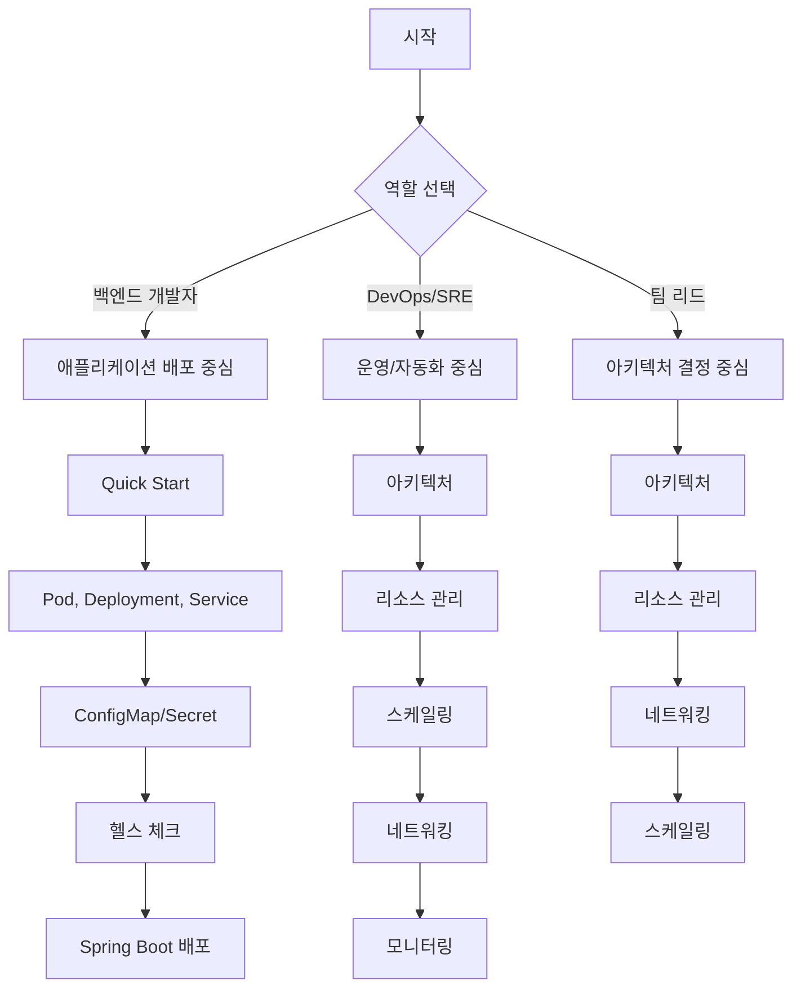

Kubernetes(K8s)는 **컨테이너화된 애플리케이션의 배포, 확장, 관리를 자동화하는 오픈소스 플랫폼**입니다. Google이 15년간 프로덕션 워크로드를 운영한 경험을 바탕으로 설계되었으며, 현재 CNCF(Cloud Native Computing Foundation)가 관리합니다.

**왜 Kubernetes가 필요한가?**

Docker로 컨테이너를 만들었다고 끝이 아닙니다. 실제 운영 환경에서는 여러 대의 서버에 수십, 수백 개의 컨테이너를 배포하고 관리해야 합니다.

| 컨테이너만 사용할 때의 문제 | Kubernetes 도입 후 |
|---------------------------|-------------------|
| 컨테이너가 죽으면 수동으로 재시작 | 자동 복구(Self-healing)로 컨테이너 재시작 |
| 트래픽 증가 시 수동으로 컨테이너 추가 | 자동 스케일링(HPA)으로 Pod 수 조절 |
| 여러 서버에 배포 시 수동 관리 | 선언적 배포로 원하는 상태 자동 유지 |
| 로드 밸런싱 직접 구성 | Service로 자동 로드 밸런싱 |
| 롤링 업데이트 스크립트 작성 | Deployment로 무중단 배포 자동화 |
| 설정/시크릿 관리 복잡 | ConfigMap/Secret으로 중앙 관리 |

이처럼 Kubernetes는 컨테이너 운영에서 발생하는 다양한 문제들을 자동화와 선언적 구성을 통해 해결합니다.

**Kubernetes의 핵심 특징**

Kubernetes가 제공하는 핵심 기능은 다음과 같습니다:

**1. 선언적 구성(Declarative Configuration)**
"컨테이너 3개를 실행해라"가 아닌 "컨테이너 3개가 실행되는 상태를 유지해라"라고 선언합니다. Kubernetes가 현재 상태를 지속적으로 모니터링하고 원하는 상태와 맞추기 위해 자동으로 조치합니다.

**2. 자동 복구(Self-healing)**
컨테이너가 실패하면 자동으로 재시작하고, 노드가 죽으면 해당 노드의 Pod를 다른 노드로 재배치합니다. 헬스 체크에 응답하지 않는 컨테이너는 서비스에서 제외됩니다.

**3. 수평적 확장(Horizontal Scaling)**
CPU 사용량, 메모리, 커스텀 메트릭을 기반으로 Pod 수를 자동으로 조절합니다. 트래픽 증가에 유연하게 대응할 수 있습니다.

**4. 서비스 디스커버리와 로드 밸런싱**
Pod의 IP가 변경되어도 Service를 통해 안정적으로 접근할 수 있습니다. 여러 Pod에 트래픽을 자동으로 분산합니다.

**언제 Kubernetes를 써야 할까?**

Kubernetes 도입은 팀의 규모, 서비스 복잡도, 운영 역량을 고려해야 합니다.

**적합한 경우:**
- 마이크로서비스 아키텍처로 서비스가 여러 개로 분리된 경우
- 트래픽 변동이 크고 자동 스케일링이 필요한 경우
- 멀티 클라우드 또는 하이브리드 클라우드 전략을 사용하는 경우
- 무중단 배포, 롤백이 빈번하게 필요한 경우
- 팀에 DevOps/SRE 역량이 있는 경우

**과할 수 있는 경우:**
- 모놀리식 애플리케이션 1~2개만 운영하는 경우
- 트래픽이 예측 가능하고 변동이 적은 경우
- 팀에 컨테이너/클라우드 경험이 부족한 경우
- 관리형 서비스(AWS ECS, Google Cloud Run 등)로 충분한 경우

## 이 가이드에서 다루는 것

이 가이드는 백엔드 개발자가 Kubernetes를 실무에 적용할 수 있도록 단계별로 구성되어 있습니다.

**[Quick Start]()**
5분 만에 Kubernetes에 애플리케이션을 배포해봅니다. 개념보다 먼저 동작하는 환경을 확인하세요.

**[개념 이해]()**

Kubernetes의 핵심 원리를 **백엔드 개발자의 관점**에서 설명합니다.

| 주제 | 배우는 것 |
|------|----------|
| [아키텍처]() | Control Plane, Worker Node의 구성요소와 역할 |
| [Pod]() | Kubernetes의 최소 배포 단위, 컨테이너 그룹화 |
| [Deployment]() | 애플리케이션 배포와 업데이트 전략 |
| [Service]() | Pod에 대한 네트워크 접근과 로드 밸런싱 |
| [ConfigMap과 Secret]() | 설정과 민감 정보의 분리 관리 |
| [Volume과 스토리지]() | 영구 데이터 저장과 PV/PVC |
| [네트워킹]() | 클러스터 내/외부 통신과 Ingress |
| [리소스 관리]() | CPU/메모리 요청과 제한 |
| [스케일링]() | HPA, VPA를 통한 자동 스케일링 |
| [헬스 체크]() | Liveness, Readiness, Startup Probe |

**[실습 예제]()**

실행 가능한 예제로 실습합니다:
- [환경 설정]() - 로컬 Kubernetes 환경 구성 (Minikube, Kind)
- [기본 예제]() - Pod, Deployment, Service 실습
- [Spring Boot 배포]() - Spring Boot 애플리케이션 Kubernetes 배포

**[How-To Guide]()**

특정 문제를 해결하기 위한 단계별 가이드입니다:
- [Pod 트러블슈팅]() - Pod가 시작되지 않을 때 진단
- [리소스 최적화]() - 적절한 리소스 설정 찾기

**[부록]()**
- [용어 사전]() - Kubernetes 용어 빠른 참조
- [FAQ]() - 자주 묻는 질문
- [참고 자료]() - 공식 문서 및 추가 학습 자료

## Docker vs Kubernetes

Docker와 Kubernetes는 서로 다른 영역의 도구입니다. Docker는 컨테이너를 만들고 실행하는 도구이고, Kubernetes는 여러 컨테이너를 관리하는 오케스트레이션 플랫폼입니다.

| 항목 | Docker | Kubernetes |
|------|--------|------------|
| 역할 | 컨테이너 런타임 | 컨테이너 오케스트레이션 |
| 범위 | 단일 호스트 | 다중 호스트(클러스터) |
| 배포 | `docker run` | Deployment, Pod |
| 네트워킹 | 브리지 네트워크 | 클러스터 네트워크, Service |
| 스케일링 | 수동 | 자동 (HPA) |
| 장애 복구 | 없음 (`--restart` 플래그) | 자동 (Self-healing) |
| 로드 밸런싱 | 직접 구성 | Service로 자동 |

Docker로 이미지를 빌드하고, Kubernetes가 해당 이미지를 클러스터에 배포하고 관리하는 것이 일반적인 워크플로우입니다. 참고로 Kubernetes v1.24부터 Docker 대신 containerd나 CRI-O 같은 컨테이너 런타임을 사용합니다(Dockershim 지원 종료).

> **참고:** Kubernetes에서 Docker 지원을 중단한 것은 Docker 이미지를 사용할 수 없다는 의미가 아닙니다. Docker로 빌드한 OCI 호환 이미지는 모든 컨테이너 런타임에서 실행 가능합니다.

## 선수 지식

이 가이드를 효과적으로 학습하기 위해 다음 지식이 필요합니다:

- **필수**: Docker 기본 (이미지, 컨테이너 개념), Linux 명령어
- **도움됨**: YAML 문법, 네트워크 기초 (IP, 포트, DNS), REST API 개발 경험

## 학습 경로 가이드

역할과 목표에 따라 효율적인 학습 순서가 다릅니다:

**역할별 학습 경로**

**난이도별 문서 분류**

| 문서 | 난이도 | 예상 시간 | 선수 문서 |
|------|--------|----------|----------|
| **Quick Start** | ⭐ 입문 | 30분 | 없음 |
| **아키텍처** | ⭐ 입문 | 30분 | 없음 |
| **Pod** | ⭐ 입문 | 30분 | Quick Start |
| **Deployment** | ⭐⭐ 기초 | 45분 | Pod |
| **Service** | ⭐⭐ 기초 | 45분 | Pod |
| **ConfigMap/Secret** | ⭐⭐ 기초 | 30분 | Pod |
| **기본 예제** | ⭐⭐ 기초 | 60분 | Deployment, Service |
| **헬스 체크** | ⭐⭐⭐ 중급 | 30분 | Pod, Deployment |
| **Volume과 스토리지** | ⭐⭐⭐ 중급 | 45분 | Pod |
| **리소스 관리** | ⭐⭐⭐ 중급 | 45분 | Pod, Deployment |
| **네트워킹** | ⭐⭐⭐ 중급 | 60분 | Service |
| **Spring Boot 배포** | ⭐⭐⭐ 중급 | 90분 | 기본 예제 |
| **스케일링** | ⭐⭐⭐⭐ 고급 | 60분 | Deployment, 리소스 관리 |
| **Pod 트러블슈팅** | ⭐⭐⭐⭐ 고급 | 45분 | Pod, 헬스 체크 |

각 문서는 독립적으로 읽을 수 있지만, 처음이라면 위 순서를 추천합니다.

## 흔한 오해

Kubernetes에 대해 자주 듣는 오해들을 정리합니다:

**"Kubernetes는 대기업에서만 쓴다"** — 아닙니다. Minikube, Kind, k3s 같은 경량 배포판으로 개발 환경이나 소규모 운영 환경에서도 사용할 수 있습니다. 클라우드 관리형 서비스(EKS, GKE, AKS)를 사용하면 운영 부담도 크게 줄어듭니다.

**"Kubernetes를 쓰려면 DevOps 팀이 필요하다"** — 클라우드 관리형 서비스를 사용하면 클러스터 운영 부담이 크게 줄어듭니다. 개발자도 기본적인 배포와 스케일링은 직접 할 수 있습니다.

**"Docker를 알면 Kubernetes는 쉽다"** — Docker 지식은 도움이 되지만, Kubernetes는 분산 시스템에 대한 추가 학습이 필요합니다. 네트워킹, 스토리지, 스케줄링 등 새로운 개념을 이해해야 합니다.

**"모든 애플리케이션을 Kubernetes에 올려야 한다"** — 아닙니다. 데이터베이스 같은 상태 저장 워크로드는 관리형 서비스(RDS, Cloud SQL)를 사용하는 것이 운영 부담이 적습니다. Kubernetes의 강점은 상태 비저장(Stateless) 애플리케이션에서 극대화됩니다.
