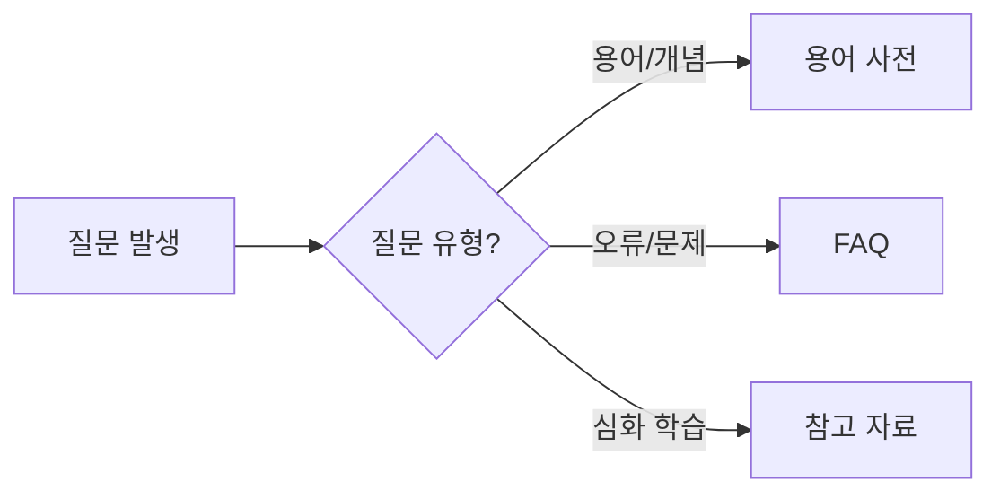

이 섹션에서는 Kubernetes 학습과 운영에 도움이 되는 보조 자료들을 제공합니다.

## 상황별 부록 활용 가이드

어떤 자료를 봐야 할지 모르겠다면 아래 가이드를 참고하세요.

| 상황 | 추천 자료 | 활용 예시 |
|------|----------|----------|
| 모르는 용어가 나왔을 때 | [용어 사전]() | "PVC가 뭐지?" → PersistentVolumeClaim 정의 확인 |
| 막히거나 오류가 발생했을 때 | [FAQ]() | "Pod가 Pending 상태야" → 원인과 해결책 확인 |
| 더 깊이 공부하고 싶을 때 | [참고 자료]() | "CKA 준비하려면?" → 자격증/학습 자료 확인 |

## 부록 목록

| 자료 | 설명 | 추천 대상 |
|------|------|----------|
| [용어 사전]() | Kubernetes 핵심 용어 빠른 참조 | 모든 학습자 |
| [FAQ]() | 자주 묻는 질문과 답변 | 초보자, 트러블슈팅 시 |
| [참고 자료]() | 공식 문서 및 추가 학습 자료 링크 | 심화 학습자 |
