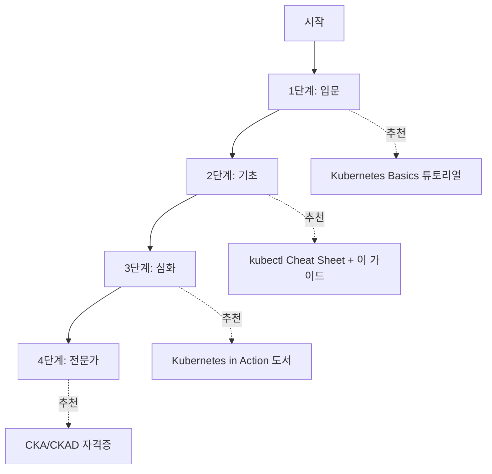

Kubernetes 학습과 운영에 도움이 되는 공식 문서와 추가 학습 자료를 정리합니다.

## 학습 단계별 추천 자료

어디서부터 시작해야 할지 모르겠다면 아래 로드맵을 참고하세요.

| 단계 | 목표 | 추천 자료 | 예상 기간 |
|------|------|----------|----------|
| **1. 입문** | 첫 배포 성공 | Kubernetes Basics, Play with K8s | 1주 |
| **2. 기초** | 핵심 개념 이해 | 이 가이드, kubectl Cheat Sheet | 2-4주 |
| **3. 심화** | 운영 역량 확보 | Kubernetes in Action, Prometheus | 1-3개월 |
| **4. 전문가** | 자격증/아키텍처 | CKA/CKAD, Kubernetes Patterns | 3-6개월 |

---

## 공식 문서

### Kubernetes 공식

| 자료 | 설명 | 링크 |
|------|------|------|
| Kubernetes Documentation | 공식 문서 (한글 지원) | [kubernetes.io/docs](https://kubernetes.io/docs/) |
| Kubernetes Blog | 새로운 기능, 릴리스 소식 | [kubernetes.io/blog](https://kubernetes.io/blog/) |
| Kubernetes GitHub | 소스 코드, 이슈 | [github.com/kubernetes](https://github.com/kubernetes/kubernetes) |

### kubectl 참조

| 자료 | 설명 | 링크 |
|------|------|------|
| kubectl Cheat Sheet | 자주 쓰는 명령어 모음 | [kubectl cheatsheet](https://kubernetes.io/docs/reference/kubectl/cheatsheet/) |
| kubectl Reference | 전체 명령어 참조 | [kubectl reference](https://kubernetes.io/docs/reference/kubectl/) |

### API 참조

| 자료 | 설명 | 링크 |
|------|------|------|
| API Reference | Kubernetes API 문서 | [API Reference](https://kubernetes.io/docs/reference/kubernetes-api/) |

## 학습 자료

### 인터랙티브 튜토리얼

| 자료 | 설명 | 링크 |
|------|------|------|
| Kubernetes Basics | 공식 인터랙티브 튜토리얼 | [Learn Kubernetes Basics](https://kubernetes.io/docs/tutorials/kubernetes-basics/) |
| Katacoda (Killercoda) | 브라우저 기반 실습 환경 | [killercoda.com](https://killercoda.com/) |
| Play with Kubernetes | 무료 온라인 실습 환경 | [labs.play-with-k8s.com](https://labs.play-with-k8s.com/) |

### 도서

| 도서 | 저자 | 특징 |
|------|------|------|
| Kubernetes in Action | Marko Lukša | 실무 중심, 상세한 설명 |
| Kubernetes Patterns | Bilgin Ibryam | 디자인 패턴 중심 |
| Cloud Native DevOps with Kubernetes | John Arundel | DevOps 관점 |

### 자격증

| 자격증 | 대상 | 설명 |
|--------|------|------|
| CKA | 관리자 | Kubernetes 클러스터 관리 능력 검증 |
| CKAD | 개발자 | Kubernetes 애플리케이션 개발 능력 검증 |
| CKS | 보안 전문가 | Kubernetes 보안 능력 검증 |

## 도구

### 로컬 개발

| 도구 | 설명 | 링크 |
|------|------|------|
| Minikube | 로컬 Kubernetes 클러스터 | [minikube.sigs.k8s.io](https://minikube.sigs.k8s.io/) |
| Kind | Docker 기반 로컬 클러스터 | [kind.sigs.k8s.io](https://kind.sigs.k8s.io/) |
| k3d | 경량 Kubernetes (k3s) | [k3d.io](https://k3d.io/) |

### 패키지 관리

| 도구 | 설명 | 링크 |
|------|------|------|
| Helm | Kubernetes 패키지 관리자 | [helm.sh](https://helm.sh/) |
| Kustomize | 설정 커스터마이징 | [kustomize.io](https://kustomize.io/) |

### 모니터링

| 도구 | 설명 | 링크 |
|------|------|------|
| Prometheus | 메트릭 수집 | [prometheus.io](https://prometheus.io/) |
| Grafana | 시각화 대시보드 | [grafana.com](https://grafana.com/) |
| Lens | Kubernetes IDE | [k8slens.dev](https://k8slens.dev/) |

### CLI 도구

| 도구 | 설명 | 링크 |
|------|------|------|
| kubectx/kubens | 컨텍스트/네임스페이스 전환 | [github.com/ahmetb/kubectx](https://github.com/ahmetb/kubectx) |
| k9s | 터미널 UI | [k9scli.io](https://k9scli.io/) |
| stern | 멀티 Pod 로그 | [github.com/stern/stern](https://github.com/stern/stern) |

## 관리형 Kubernetes

| 서비스 | 클라우드 | 링크 |
|--------|----------|------|
| Amazon EKS | AWS | [aws.amazon.com/eks](https://aws.amazon.com/eks/) |
| Google GKE | GCP | [cloud.google.com/kubernetes-engine](https://cloud.google.com/kubernetes-engine) |
| Azure AKS | Azure | [azure.microsoft.com/services/kubernetes-service](https://azure.microsoft.com/services/kubernetes-service/) |

## 커뮤니티

| 채널 | 설명 | 링크 |
|------|------|------|
| Kubernetes Slack | 공식 커뮤니티 | [slack.kubernetes.io](https://slack.kubernetes.io/) |
| CNCF | Cloud Native 재단 | [cncf.io](https://www.cncf.io/) |
| Stack Overflow | Q&A | [stackoverflow.com/questions/tagged/kubernetes](https://stackoverflow.com/questions/tagged/kubernetes) |

## 버전 및 릴리스

| 자료 | 설명 | 링크 |
|------|------|------|
| Release Notes | 버전별 변경사항 | [kubernetes.io/releases](https://kubernetes.io/releases/) |
| Deprecation Policy | 지원 중단 정책 | [Deprecation Policy](https://kubernetes.io/docs/reference/using-api/deprecation-policy/) |
| Version Skew Policy | 버전 호환성 | [Version Skew](https://kubernetes.io/releases/version-skew-policy/) |
