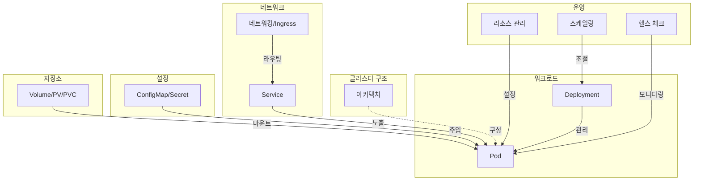

## 전체 비유: 아파트 단지 운영

Kubernetes 개념을 **아파트 단지 운영**에 비유하면 전체 그림을 쉽게 이해할 수 있습니다:

| 아파트 단지 비유 | Kubernetes | 역할 |
|----------------|------------|------|
| 아파트 단지 전체 | Cluster | 모든 리소스를 포함하는 최상위 단위 |
| 관리사무소 | Control Plane | 전체 단지 운영 결정 및 관리 |
| 각 동 건물 | Worker Node | 실제 세대(Pod)가 거주하는 공간 |
| 아파트 한 세대 | Pod | 최소 거주 단위, 여러 사람(컨테이너)이 함께 거주 |
| 입주민 관리인 | Deployment | 세대 수 유지, 이사(업데이트) 관리 |
| 동 현관 인터폰 | Service | 외부에서 세대로 연결하는 고정 접근점 |
| 단지 정문/경비실 | Ingress | 외부 방문자의 출입 통제 및 안내 |
| 게시판 공지사항 | ConfigMap | 일반 설정 정보 공유 |
| 우편함 비밀번호 | Secret | 민감한 정보 보관 |
| 세대 창고/수납공간 | Volume/PV | 이사해도 유지되는 물건 보관 |
| 전기/수도 배당량 | Resources | CPU/메모리 할당 및 제한 |
| 세대 수 조절 | Scaling | 입주 수요에 따른 확장/축소 |
| 정기 안전 점검 | Health Check | 세대 상태 확인 및 문제 시 조치 |

이 비유를 기억하면서 각 개념을 학습하면 서로의 관계를 더 쉽게 파악할 수 있습니다.

---

Kubernetes를 제대로 활용하려면 단순히 kubectl 명령어를 아는 것만으로는 부족합니다. 왜 Pod가 여러 개 필요한지, Service가 어떻게 트래픽을 분산하는지, 설정은 어디에 저장해야 하는지를 이해해야 운영 중 발생하는 문제를 빠르게 진단하고 해결할 수 있습니다. 이 섹션에서는 Kubernetes의 핵심 구성요소와 동작 원리를 단계별로 학습합니다.

## 개념 전체 구조

아래 다이어그램은 Kubernetes 핵심 개념들의 관계를 보여줍니다. 화살표 방향은 의존 또는 참조 관계를 나타냅니다.

## 개념 요약

| 개념 | 한 줄 요약 | 핵심 질문 |
|------|-----------|----------|
| [아키텍처](architecture/) | Control Plane과 Worker Node로 구성된 클러스터 구조 | "Kubernetes는 어떻게 동작하나?" |
| [Pod](pod/) | 컨테이너를 감싸는 최소 배포 단위 | "왜 컨테이너가 아닌 Pod인가?" |
| [Deployment](deployment/) | Pod의 선언적 배포와 업데이트 관리 | "어떻게 무중단 배포하나?" |
| [Service](service/) | Pod에 대한 안정적인 네트워크 접근점 | "변경되는 Pod IP를 어떻게 찾나?" |
| [ConfigMap/Secret](configmap-secret/) | 설정과 민감 정보의 분리 관리 | "설정을 어떻게 코드와 분리하나?" |
| [Volume/스토리지](storage/) | Pod 생명주기와 독립적인 데이터 저장 | "Pod가 죽어도 데이터를 유지하려면?" |
| [네트워킹](networking/) | 클러스터 내/외부 통신과 Ingress | "외부에서 어떻게 접근하나?" |
| [리소스 관리](resources/) | CPU/메모리 요청과 제한 설정 | "얼마나 많은 리소스를 할당할까?" |
| [스케일링](scaling/) | HPA/VPA를 통한 자동 확장/축소 | "트래픽 증가에 어떻게 대응하나?" |
| [헬스 체크](health-checks/) | Probe를 통한 상태 모니터링과 자동 복구 | "앱이 정상인지 어떻게 확인하나?" |
| [Namespace](namespace/) | 클러스터 내 리소스를 논리적으로 격리하는 메커니즘 | "팀별로 리소스를 어떻게 분리하나?" |
| [StatefulSet](statefulset/) | 상태를 유지하는 애플리케이션의 배포와 관리 | "DB를 Kubernetes에 어떻게 배포하나?" |
| [RBAC](rbac/) | 역할 기반 접근 제어로 API 권한 관리 | "누가 어떤 리소스에 접근할 수 있나?" |
| [Job과 CronJob](jobs/) | 일회성/반복 배치 작업 실행 관리 | "배치 작업을 어떻게 실행하나?" |
| [NetworkPolicy](network-policy/) | Pod 간 네트워크 트래픽 제어 | "Pod 간 통신을 어떻게 제한하나?" |

#### 학습 순서

아래 학습 순서는 개념 간 의존성을 고려하여 설계되었습니다. 기초 개념을 충분히 이해한 후 심화 학습으로 넘어가는 것을 권장합니다. 특히 Pod와 Deployment는 이후 모든 개념의 토대가 되므로 확실하게 이해하고 넘어가야 합니다.

**기초 개념**

기초 개념에서는 Kubernetes 클러스터를 구성하는 핵심 요소들과 애플리케이션이 배포되는 과정을 다룹니다. Pod가 어떻게 생성되고, Deployment가 Pod를 어떻게 관리하며, Service가 어떻게 트래픽을 전달하는지 이해하는 것이 목표입니다.

1. [아키텍처](architecture/) - Control Plane과 Worker Node의 구성요소를 이해합니다. Kubernetes가 어떻게 동작하는지 전체 그림을 파악합니다.
2. [Pod](pod/) - Kubernetes의 최소 배포 단위인 Pod의 개념과 생명주기를 학습합니다. 왜 컨테이너 대신 Pod를 사용하는지 이해합니다.
3. [Deployment](deployment/) - Pod의 생성, 업데이트, 롤백을 관리하는 Deployment를 학습합니다. 무중단 배포의 원리를 이해합니다.
4. [Service](service/) - Pod에 대한 안정적인 네트워크 접근을 제공하는 Service를 학습합니다. ClusterIP, NodePort, LoadBalancer의 차이를 이해합니다.
5. [ConfigMap과 Secret](configmap-secret/) - 애플리케이션 설정과 민감 정보를 분리하여 관리하는 방법을 학습합니다.

**심화 학습**

심화 학습에서는 운영 환경에서 Kubernetes를 안정적으로 운영하기 위한 고급 주제들을 다룹니다. 영구 데이터 저장, 네트워크 구성, 리소스 관리, 자동 스케일링 등 실제 서비스 운영에 필수적인 내용입니다.

6. [Volume과 스토리지](storage/) - Pod가 종료되어도 데이터를 유지하는 영구 볼륨(PV)과 볼륨 클레임(PVC)을 학습합니다.
7. [네트워킹](networking/) - 클러스터 내부/외부 통신의 원리와 Ingress를 통한 HTTP 라우팅을 학습합니다.
8. [리소스 관리](resources/) - CPU와 메모리의 요청(requests)과 제한(limits) 설정 방법을 학습합니다. 리소스 부족 상황에서의 동작을 이해합니다.
9. [스케일링](scaling/) - HPA(Horizontal Pod Autoscaler)를 통한 자동 스케일링과 VPA의 개념을 학습합니다.
10. [헬스 체크](health-checks/) - Liveness, Readiness, Startup Probe를 통해 애플리케이션 상태를 모니터링하고 자동 복구하는 방법을 학습합니다.

**고급 주제**

고급 주제에서는 멀티 테넌트 환경 구성, 상태 유지 워크로드, 보안, 배치 처리 등 실전에서 필요한 심화 내용을 다룹니다.

11. [Namespace](namespace/) - 클러스터 내 리소스를 논리적으로 격리하고 ResourceQuota로 사용량을 제한하는 방법을 학습합니다.
12. [StatefulSet](statefulset/) - 데이터베이스와 같이 상태를 유지해야 하는 애플리케이션의 배포와 관리 방법을 학습합니다.
13. [RBAC](rbac/) - Role-Based Access Control을 통해 사용자와 서비스의 API 접근 권한을 관리하는 방법을 학습합니다.
14. [Job과 CronJob](jobs/) - 일회성 배치 작업과 스케줄 기반 반복 작업을 실행하고 관리하는 방법을 학습합니다.
15. [NetworkPolicy](network-policy/) - Pod 간 네트워크 트래픽을 제어하여 클러스터 보안을 강화하는 방법을 학습합니다.
