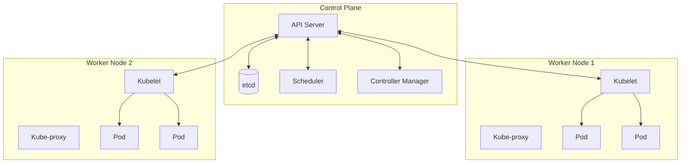
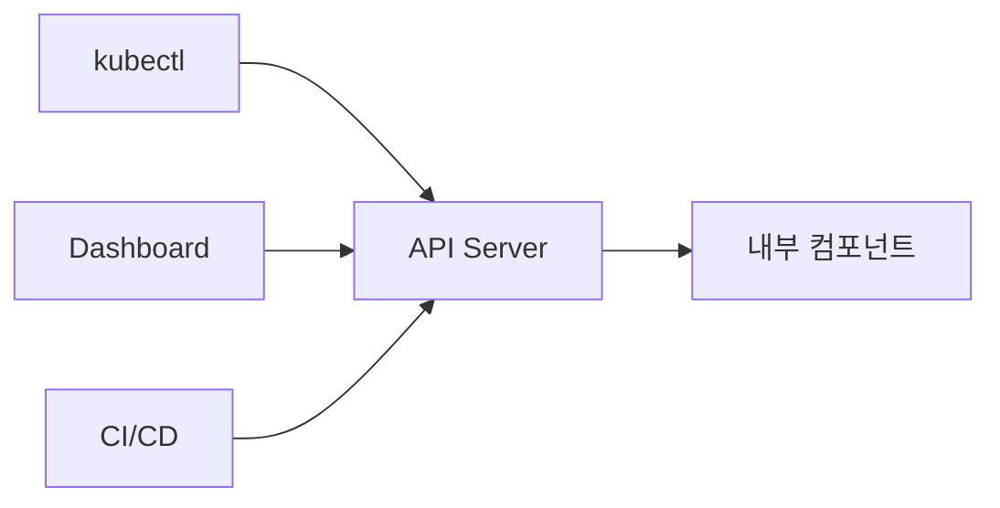
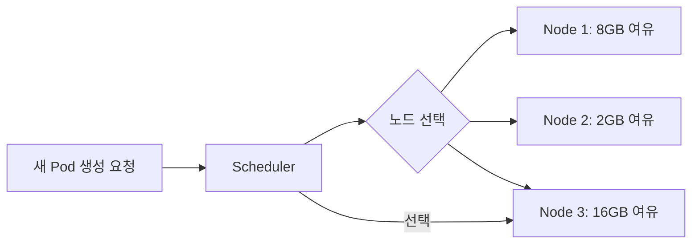
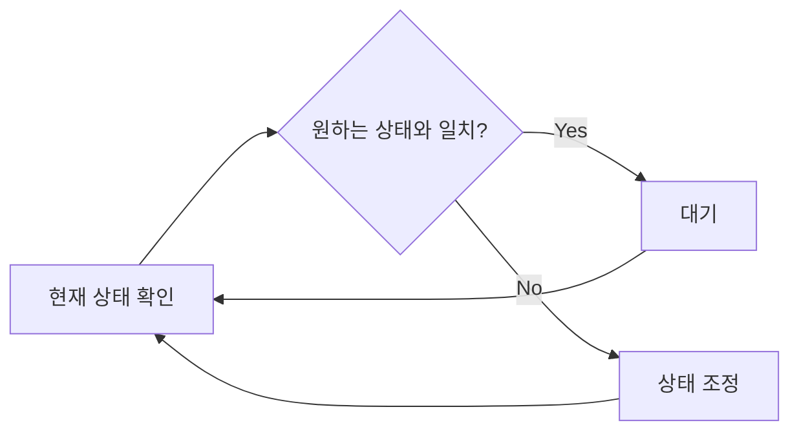
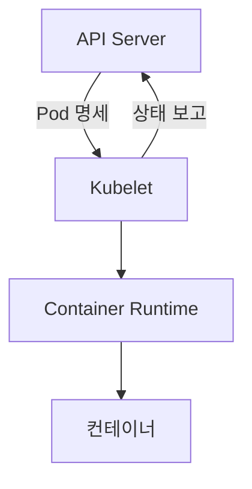
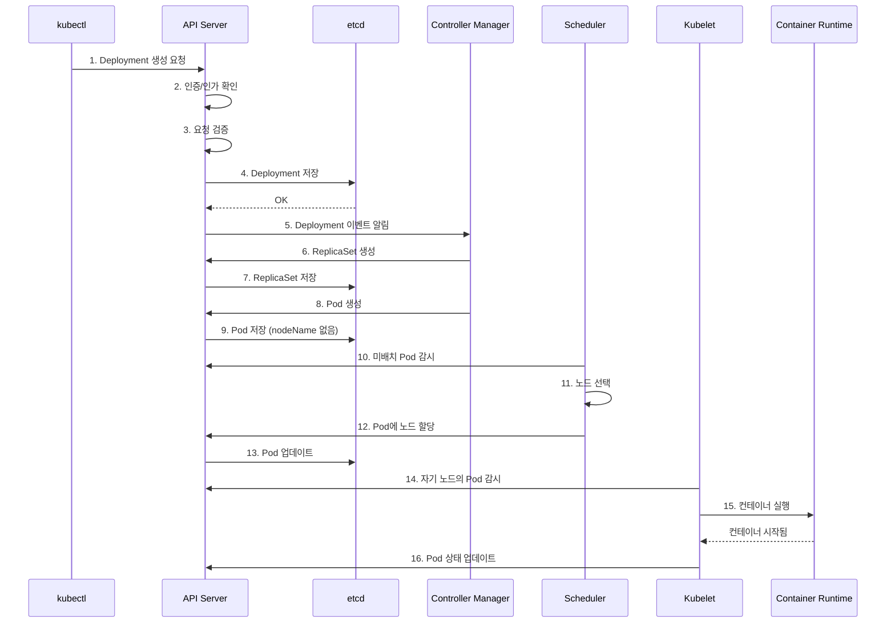
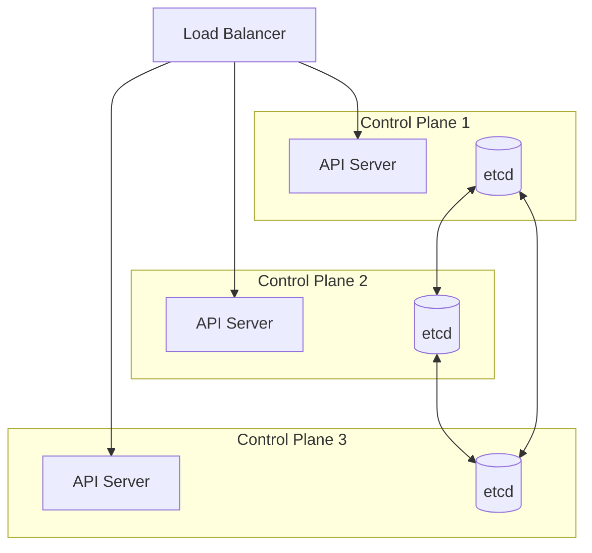

> **대상 독자**: Kubernetes 구조를 이해하고 싶은 백엔드 개발자
> **선수 지식**: Docker 기본 개념
> **이 문서를 읽으면**: Kubernetes 클러스터의 구성요소와 각 역할을 이해할 수 있습니다


- Kubernetes 클러스터는 Control Plane(뇌)과 Worker Node(근육)로 구성됩니다
- Control Plane은 클러스터 상태를 관리하고, Worker Node는 실제 워크로드를 실행합니다
- kubectl 명령은 API Server를 통해 클러스터와 통신합니다


## 클러스터 전체 구조

Kubernetes 클러스터는 크게 두 부분으로 나뉩니다.



Control Plane과 Worker Node의 역할을 비교하면 다음과 같습니다.

| 구성요소 | 역할 | 비유 |
|----------|------|------|
| Control Plane | 클러스터 상태 관리, 스케줄링 결정 | 뇌, 관제탑 |
| Worker Node | 실제 컨테이너 실행, 네트워크 처리 | 근육, 작업자 |

Control Plane은 클러스터 전체를 관리하는 두뇌 역할을 하고, Worker Node는 Control Plane의 지시에 따라 실제 컨테이너를 실행하는 역할을 합니다.

## Control Plane 구성요소

Control Plane은 클러스터의 두뇌입니다. 4개의 핵심 컴포넌트로 구성됩니다.

### API Server (kube-apiserver)

API Server는 Kubernetes의 프론트엔드입니다. 모든 통신은 API Server를 거칩니다.



주요 역할은 다음과 같습니다.

**인증과 권한 검사**를 수행합니다. kubectl 명령이 들어오면 먼저 요청자가 누구인지(인증), 해당 작업을 할 권한이 있는지(인가)를 확인합니다.

**요청 검증**을 수행합니다. YAML 문법이 올바른지, 필수 필드가 있는지 등을 검사합니다.

**etcd와 통신**합니다. 검증을 통과한 리소스는 etcd에 저장됩니다. API Server만 etcd에 직접 접근할 수 있습니다.

```bash
# API Server에 직접 요청하기 (kubectl이 내부적으로 하는 일)
kubectl get pods -v=8  # -v=8은 HTTP 요청을 상세히 출력
```

### etcd

etcd는 클러스터의 모든 상태를 저장하는 분산 키-값 저장소입니다.

저장되는 정보는 다음과 같습니다.

| 저장 대상 | 예시 |
|-----------|------|
| 리소스 정의 | Deployment, Service, ConfigMap YAML |
| 클러스터 상태 | Pod IP, 노드 상태, 레이블 |
| 설정 정보 | RBAC 정책, 네임스페이스 |

etcd가 손상되면 클러스터 상태를 완전히 복구할 수 없습니다. 그래서 프로덕션에서는 etcd 백업이 필수입니다.


etcd는 Kubernetes의 유일한 상태 저장소입니다. 다른 컴포넌트들은 상태를 저장하지 않고, 필요할 때 API Server를 통해 etcd에서 조회합니다.


### Scheduler (kube-scheduler)

Scheduler는 새로 생성된 Pod를 어느 노드에서 실행할지 결정합니다.



스케줄링 결정 요소는 다음과 같습니다.

| 요소 | 설명 |
|------|------|
| 리소스 요구사항 | Pod가 요청한 CPU/메모리를 제공할 수 있는 노드 |
| 노드 셀렉터 | 특정 레이블을 가진 노드에만 배치 |
| Taint/Toleration | 특정 조건의 노드 회피 또는 허용 |
| Affinity/Anti-affinity | 특정 Pod와 같이/다르게 배치 |

Scheduler는 결정만 내립니다. 실제 Pod 실행은 해당 노드의 Kubelet이 담당합니다.

### Controller Manager (kube-controller-manager)

Controller Manager는 여러 컨트롤러를 실행하는 프로세스입니다. 각 컨트롤러는 특정 리소스를 관리합니다.

주요 컨트롤러와 역할은 다음과 같습니다.

| 컨트롤러 | 관리 대상 | 역할 |
|----------|----------|------|
| Deployment Controller | Deployment | ReplicaSet 생성/업데이트 |
| ReplicaSet Controller | ReplicaSet | Pod 수 유지 |
| Node Controller | Node | 노드 상태 모니터링, 장애 감지 |
| Service Controller | Service | 클라우드 로드밸런서 프로비저닝 |
| Endpoint Controller | Endpoints | Service와 Pod 연결 |

컨트롤러의 동작 원리는 **조정 루프(Reconciliation Loop)**입니다.



예를 들어 Deployment에서 `replicas: 3`으로 설정했는데 현재 Pod가 2개라면, ReplicaSet Controller가 1개를 추가로 생성합니다.

## Worker Node 구성요소

Worker Node는 실제 워크로드가 실행되는 곳입니다.

### Kubelet

Kubelet은 각 노드에서 실행되는 에이전트입니다. Pod의 생명주기를 관리합니다.

주요 역할은 다음과 같습니다.

**Pod 실행**을 담당합니다. API Server로부터 할당받은 Pod 명세대로 컨테이너를 실행합니다.

**상태 보고**를 수행합니다. Pod와 노드의 상태를 주기적으로 API Server에 보고합니다.

**헬스 체크**를 실행합니다. Liveness/Readiness Probe를 실행하고 결과에 따라 조치합니다.



Kubelet은 컨테이너 런타임(containerd, CRI-O 등)과 통신하여 실제 컨테이너를 관리합니다.

### Kube-proxy

Kube-proxy는 네트워크 규칙을 관리합니다. Service로 들어오는 트래픽을 적절한 Pod로 전달합니다.

동작 방식을 비교하면 다음과 같습니다.

| 모드 | 설명 | 성능 |
|------|------|------|
| iptables | Linux iptables 규칙 사용 | 중간 |
| IPVS | Linux IPVS(IP Virtual Server) 사용 | 높음 |
| userspace | 사용자 공간에서 프록시 (레거시) | 낮음 |

대부분의 환경에서 iptables 모드를 기본으로 사용합니다. 대규모 클러스터에서는 IPVS 모드가 권장됩니다.

### Container Runtime

실제 컨테이너를 실행하는 소프트웨어입니다.

| 런타임 | 설명 |
|--------|------|
| containerd | Docker에서 분리된 경량 런타임 (권장) |
| CRI-O | Kubernetes를 위해 설계된 런타임 |
| Docker | v1.24부터 직접 지원 종료 |

Kubernetes v1.24부터 Docker를 직접 지원하지 않지만, Docker로 빌드한 이미지는 모든 런타임에서 실행 가능합니다.

## kubectl 명령의 흐름

`kubectl apply -f deployment.yaml` 명령을 실행했을 때 클러스터 내부에서 일어나는 일을 추적해봅니다.



각 단계를 요약하면 다음과 같습니다.

| 단계 | 컴포넌트 | 동작 |
|------|----------|------|
| 1-4 | API Server | 요청 검증 후 etcd에 저장 |
| 5-9 | Controller Manager | Deployment → ReplicaSet → Pod 생성 |
| 10-13 | Scheduler | Pod를 실행할 노드 결정 |
| 14-16 | Kubelet | 컨테이너 실행 및 상태 보고 |

## 고가용성(HA) 구성

프로덕션 환경에서는 Control Plane을 고가용성으로 구성합니다.



HA 구성의 핵심 요소는 다음과 같습니다.

| 요소 | 구성 | 이유 |
|------|------|------|
| Control Plane 노드 | 3개 이상 (홀수) | 과반수 합의 필요 |
| API Server | 로드밸런서 뒤에 배치 | 무중단 접근 |
| etcd | 클러스터 구성 | 데이터 복제 |
| Scheduler/Controller | Leader 선출 | 중복 동작 방지 |

관리형 Kubernetes(EKS, GKE, AKS)를 사용하면 Control Plane HA는 클라우드 제공자가 관리합니다.

## 개발자 관점: 왜 아키텍처를 알아야 하나?

배포 문제가 발생했을 때 **어떤 컴포넌트를 확인해야 하는지** 알기 위해서입니다.

### 증상별 원인 컴포넌트

| 증상 | 원인 컴포넌트 | 확인 방법 |
|------|--------------|----------|
| Pod가 Pending 상태 | Scheduler | `kubectl describe pod` → Events 확인 |
| Pod가 생성되지 않음 | Controller Manager | `kubectl get events --sort-by=.lastTimestamp` |
| Pod가 노드에서 시작 안 됨 | Kubelet | `kubectl describe node`, 노드 로그 |
| Service 연결 안 됨 | kube-proxy | `kubectl get endpoints` |
| 모든 명령이 안 됨 | API Server | `kubectl cluster-info` |

### 컴포넌트 장애 시 영향도

| 컴포넌트 | 장애 시 영향 | 기존 Pod | 긴급도 |
|----------|-------------|----------|--------|
| **API Server** | 모든 kubectl 불가, 신규 배포 불가 | 유지됨 | 🔴 Critical |
| **etcd** | 클러스터 상태 유실, 복구 불가 | 유지됨 | 🔴 Critical |
| **Scheduler** | 신규 Pod 배치 불가 | 유지됨 | 🟡 High |
| **Controller Manager** | 자동 복구/스케일링 중단 | 유지됨 | 🟡 High |
| **Kubelet (1개 노드)** | 해당 노드 Pod만 영향 | 다른 노드는 정상 | 🟢 Medium |
| **kube-proxy** | 해당 노드 Service 라우팅 불가 | Pod 자체는 정상 | 🟢 Medium |


Control Plane 장애 시에도 **이미 실행 중인 Pod는 계속 동작**합니다. 하지만 신규 배포, 스케일링, 자동 복구가 중단됩니다.


---

## 실습: 클러스터 구성요소 확인

실제 클러스터에서 구성요소들을 확인해봅니다.

### Control Plane 컴포넌트 확인

```bash
# kube-system 네임스페이스의 Pod 확인
kubectl get pods -n kube-system
```

**예상 출력:**
```
NAME                               READY   STATUS    RESTARTS   AGE
coredns-xxx                        1/1     Running   0          1d
etcd-minikube                      1/1     Running   0          1d
kube-apiserver-minikube            1/1     Running   0          1d
kube-controller-manager-minikube   1/1     Running   0          1d
kube-proxy-xxx                     1/1     Running   0          1d
kube-scheduler-minikube            1/1     Running   0          1d
```

### 노드 정보 확인

```bash
# 노드 목록
kubectl get nodes

# 노드 상세 정보
kubectl describe node <node-name>
```

노드 상세 정보에서 확인할 수 있는 항목은 다음과 같습니다.

| 항목 | 설명 |
|------|------|
| Capacity | 노드의 총 리소스 |
| Allocatable | Pod에 할당 가능한 리소스 |
| Conditions | 노드 상태 (Ready, MemoryPressure 등) |
| Addresses | 노드 IP |
| Non-terminated Pods | 실행 중인 Pod 목록 |

### API Server 상태 확인

```bash
# 클러스터 정보
kubectl cluster-info

# API 리소스 목록
kubectl api-resources
```

---

## 다음 단계

아키텍처를 이해했다면 다음 단계로 진행하세요:

| 목표 | 추천 문서 |
|------|----------|
| Pod 개념 이해하기 | [Pod](../pod/) |
| 실제 배포해보기 | [Quick Start](../../quick-start/) |
| 네트워크 구성 이해하기 | [네트워킹](../networking/) |
