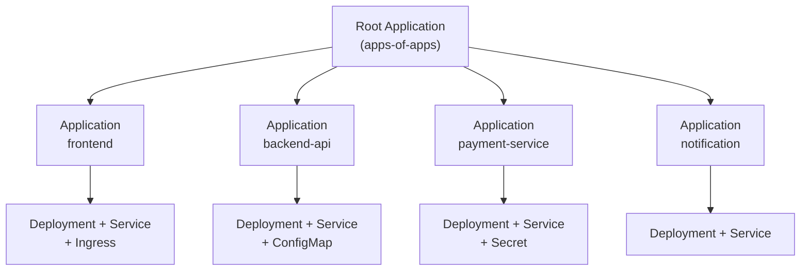
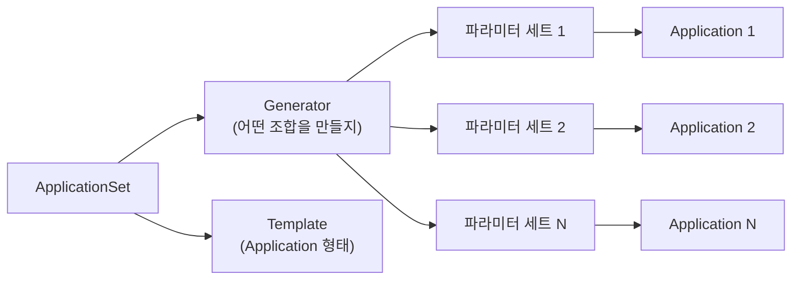
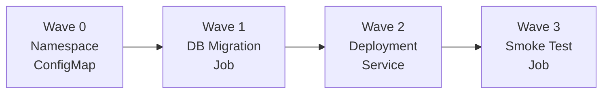
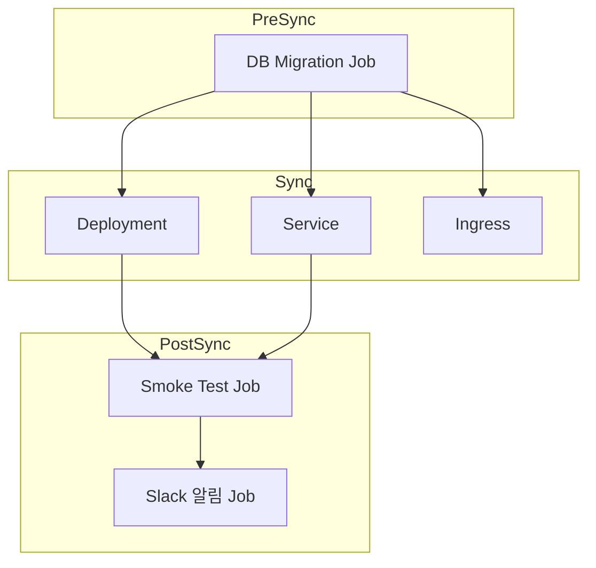
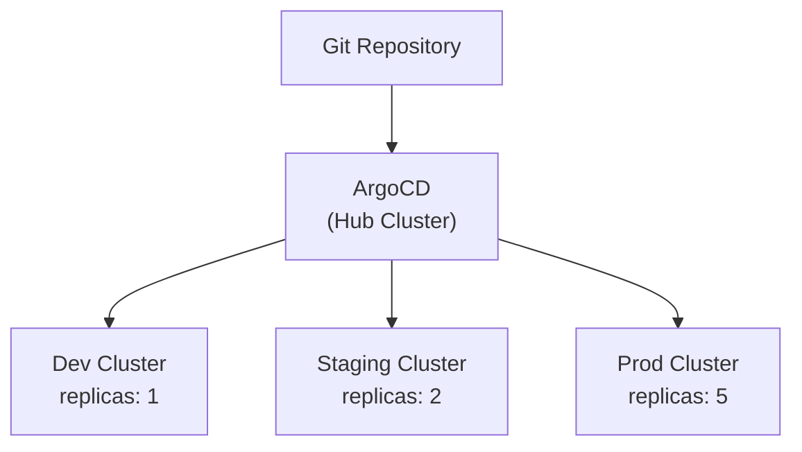

## 전체 비유: 프랜차이즈 본사 운영 시스템

ArgoCD 고급 패턴을 **프랜차이즈 본사 운영 시스템**에 비유하면 이해하기 쉽습니다:

| 프랜차이즈 비유 | ArgoCD 고급 패턴 | 역할 |
|----------------|------------------|------|
| 본사 관리 시스템 | Root Application | 모든 매장(Application)을 총괄 관리 |
| 매장 자동 개설 규칙 | ApplicationSet | 조건에 맞으면 자동으로 매장 생성 |
| 개점 순서 매뉴얼 | Sync Waves | 인테리어 → 장비 설치 → 직원 배치 순서 보장 |
| 전국 지역 본부 | 멀티 클러스터 | 지역별(dev/staging/prod) 독립 운영 |
| 개점 전 점검표 | PreSync Hook | 배포 전 사전 검증 수행 |
| 영업 중 점검표 | PostSync Hook | 배포 후 상태 확인 |
| 본사 표준 매뉴얼 | Git Repository | 모든 매장의 원천(Source of Truth) |

이처럼 ArgoCD 고급 패턴은 "본사가 수백 개 매장을 일관된 규칙으로 자동 관리하고, 개점 순서를 체계적으로 통제"하는 것과 같습니다.

---

> **대상 독자**: ArgoCD 기본을 이해한 DevOps 엔지니어
> **선수 지식**: ArgoCD 기본 개념, Kubernetes 리소스 관리
> **소요 시간**: 약 35분
> **이 문서를 읽으면**: App of Apps, ApplicationSet, Sync Waves 등 고급 패턴을 활용하여 대규모 멀티 클러스터 환경을 효율적으로 관리할 수 있습니다


- **App of Apps**: Root Application이 하위 Application을 재귀적으로 관리하는 패턴
- **ApplicationSet**: Generator 기반으로 Application을 자동 생성하는 선언적 방식
- **Sync Waves**: 숫자 기반 배포 순서 제어로 의존성 있는 리소스를 안전하게 배포
- **멀티 클러스터**: ApplicationSet + Cluster Generator로 여러 클러스터를 통합 관리


## 1. App of Apps 패턴

### 왜 필요한가?

마이크로서비스 아키텍처에서 서비스가 10개, 20개로 늘어나면 어떻게 될까요? 각 서비스마다 ArgoCD Application을 수동으로 만들고 관리해야 합니다. 서비스가 추가될 때마다 kubectl로 Application을 생성하고, 삭제할 때도 하나씩 지워야 합니다. 이런 수동 작업은 실수를 유발하고, 전체 배포 상태를 파악하기 어렵게 만듭니다.

App of Apps 패턴은 이 문제를 해결합니다. **하나의 Root Application이 나머지 모든 Application을 관리**합니다.

### 작동 원리



*Root Application이 하위 Application 매니페스트를 관리하고, 각 Application이 자신의 Kubernetes 리소스를 관리하는 2단계 구조를 보여줍니다.*

### 디렉토리 구조

```
gitops-repo/
├── apps/                          # Root Application이 바라보는 경로
│   ├── frontend.yaml              # Application 매니페스트
│   ├── backend-api.yaml
│   ├── payment-service.yaml
│   └── notification.yaml
├── manifests/                     # 각 서비스의 실제 K8s 리소스
│   ├── frontend/
│   │   ├── deployment.yaml
│   │   ├── service.yaml
│   │   └── ingress.yaml
│   ├── backend-api/
│   │   ├── deployment.yaml
│   │   └── service.yaml
│   ├── payment-service/
│   │   ├── deployment.yaml
│   │   ├── service.yaml
│   │   └── secret.yaml
│   └── notification/
│       ├── deployment.yaml
│       └── service.yaml
```

### Root Application 예시

```yaml
apiVersion: argoproj.io/v1alpha1
kind: Application
metadata:
  name: apps-of-apps
  namespace: argocd
spec:
  project: default
  source:
    repoURL: https://github.com/my-org/gitops-repo.git
    targetRevision: main
    path: apps           # 하위 Application 매니페스트가 있는 디렉토리
  destination:
    server: https://kubernetes.default.svc
    namespace: argocd
  syncPolicy:
    automated:
      prune: true        # Git에서 삭제된 앱은 클러스터에서도 삭제
      selfHeal: true     # 수동 변경 시 Git 상태로 복원
```

### 하위 Application 예시

```yaml
# apps/frontend.yaml
apiVersion: argoproj.io/v1alpha1
kind: Application
metadata:
  name: frontend
  namespace: argocd
  finalizers:
    - resources-finalizer.argocd.argoproj.io
spec:
  project: default
  source:
    repoURL: https://github.com/my-org/gitops-repo.git
    targetRevision: main
    path: manifests/frontend
  destination:
    server: https://kubernetes.default.svc
    namespace: frontend
  syncPolicy:
    automated:
      prune: true
      selfHeal: true
    syncOptions:
      - CreateNamespace=true
```


App of Apps의 핵심은 **Git 저장소가 Single Source of Truth**라는 점입니다. 새 서비스를 추가하려면 `apps/` 디렉토리에 Application YAML만 커밋하면 됩니다. 삭제도 마찬가지로 파일을 지우고 커밋하면 ArgoCD가 자동으로 정리합니다.


## 2. ApplicationSet

### 왜 필요한가?

App of Apps 패턴은 효과적이지만 한계가 있습니다. 서비스가 30개라면 거의 동일한 Application YAML 30개를 작성해야 합니다. 클러스터가 3개(dev/staging/prod)라면 90개입니다. 이름과 namespace만 다른 파일을 복사-붙여넣기하는 것은 비효율적이고 오류가 발생하기 쉽습니다.

ApplicationSet은 **템플릿 + Generator**로 이 문제를 해결합니다. 규칙을 정의하면 Application이 자동으로 생성됩니다.

### Generator 종류

| Generator | 용도 | 사용 시나리오 |
|-----------|------|--------------|
| List | 명시적 목록 | 소수의 고정된 환경 정의 |
| Cluster | 등록된 클러스터 기반 | 멀티 클러스터 배포 |
| Git Directory | Git 디렉토리 구조 기반 | 디렉토리별 자동 Application 생성 |
| Git File | Git 파일 내용 기반 | JSON/YAML 설정 파일로 제어 |
| Matrix | Generator 조합 (곱집합) | 클러스터 x 서비스 조합 |
| Merge | Generator 병합 | 기본값 + 오버라이드 |

### ApplicationSet 구조



*ApplicationSet이 Generator에서 파라미터를 추출하고, Template에 주입하여 여러 Application을 자동 생성하는 흐름을 보여줍니다.*

### Git Directory Generator 예시

디렉토리 구조만으로 Application을 자동 생성합니다:

```yaml
apiVersion: argoproj.io/v1alpha1
kind: ApplicationSet
metadata:
  name: service-apps
  namespace: argocd
spec:
  generators:
    - git:
        repoURL: https://github.com/my-org/gitops-repo.git
        revision: main
        directories:
          - path: manifests/*    # manifests 하위 각 디렉토리마다 Application 생성
  template:
    metadata:
      name: '{{path.basename}}'
    spec:
      project: default
      source:
        repoURL: https://github.com/my-org/gitops-repo.git
        targetRevision: main
        path: '{{path}}'
      destination:
        server: https://kubernetes.default.svc
        namespace: '{{path.basename}}'
      syncPolicy:
        automated:
          prune: true
          selfHeal: true
        syncOptions:
          - CreateNamespace=true
```

이 설정으로 `manifests/` 아래에 새 디렉토리를 추가하면 자동으로 Application이 생성됩니다.

### List Generator 예시 — 멀티 클러스터

```yaml
apiVersion: argoproj.io/v1alpha1
kind: ApplicationSet
metadata:
  name: multi-cluster-app
  namespace: argocd
spec:
  generators:
    - list:
        elements:
          - cluster: dev
            url: https://dev-cluster.example.com
            namespace: app-dev
          - cluster: staging
            url: https://staging-cluster.example.com
            namespace: app-staging
          - cluster: prod
            url: https://prod-cluster.example.com
            namespace: app-prod
  template:
    metadata:
      name: 'myapp-{{cluster}}'
    spec:
      project: default
      source:
        repoURL: https://github.com/my-org/gitops-repo.git
        targetRevision: main
        path: 'overlays/{{cluster}}'
      destination:
        server: '{{url}}'
        namespace: '{{namespace}}'
```

### Matrix Generator 예시 — 클러스터 x 서비스

```yaml
apiVersion: argoproj.io/v1alpha1
kind: ApplicationSet
metadata:
  name: cluster-service-matrix
  namespace: argocd
spec:
  generators:
    - matrix:
        generators:
          - clusters:
              selector:
                matchLabels:
                  env: production
          - git:
              repoURL: https://github.com/my-org/gitops-repo.git
              revision: main
              directories:
                - path: services/*
  template:
    metadata:
      name: '{{name}}-{{path.basename}}'
    spec:
      project: default
      source:
        repoURL: https://github.com/my-org/gitops-repo.git
        targetRevision: main
        path: '{{path}}'
      destination:
        server: '{{server}}'
        namespace: '{{path.basename}}'
```


ApplicationSet은 App of Apps의 상위 호환입니다. 소규모 프로젝트에서는 App of Apps가 직관적이지만, 서비스와 클러스터가 늘어나면 ApplicationSet의 Generator 기반 자동화가 훨씬 효율적입니다.


## 3. Sync Waves & Hooks

### 왜 필요한가?

모든 리소스를 동시에 배포하면 문제가 발생할 수 있습니다. 예를 들어:

- DB 스키마 마이그레이션이 완료되기 **전에** 애플리케이션이 시작되면 테이블이 없어서 에러 발생
- ConfigMap이 생성되기 **전에** Deployment가 배포되면 환경 변수를 읽을 수 없음
- 배포 **후에** smoke test를 실행해야 문제를 빠르게 감지 가능

Sync Waves와 Hooks는 **배포 순서를 명시적으로 제어**합니다.

### Sync Wave 작동 방식

Sync Wave는 `argocd.argoproj.io/sync-wave` 어노테이션으로 순서를 지정합니다. 숫자가 작을수록 먼저 배포되며, 같은 Wave의 리소스는 동시에 배포됩니다.



*Sync Wave 번호 순서대로 리소스가 배포되는 흐름을 보여줍니다. 각 Wave가 완료되어야 다음 Wave로 진행합니다.*

### Sync Wave 예시

```yaml
# Wave 0: Namespace (기본값, 어노테이션 생략 가능)
apiVersion: v1
kind: Namespace
metadata:
  name: myapp
  annotations:
    argocd.argoproj.io/sync-wave: "0"
---
# Wave 1: ConfigMap과 Secret
apiVersion: v1
kind: ConfigMap
metadata:
  name: myapp-config
  annotations:
    argocd.argoproj.io/sync-wave: "1"
data:
  DATABASE_URL: "jdbc:postgresql://db:5432/myapp"
---
# Wave 2: DB 마이그레이션 Job
apiVersion: batch/v1
kind: Job
metadata:
  name: db-migration
  annotations:
    argocd.argoproj.io/sync-wave: "2"
    argocd.argoproj.io/hook: PreSync
spec:
  template:
    spec:
      containers:
        - name: migrate
          image: myapp/migration:v1.2
          command: ["flyway", "migrate"]
      restartPolicy: Never
---
# Wave 3: 애플리케이션 Deployment
apiVersion: apps/v1
kind: Deployment
metadata:
  name: myapp
  annotations:
    argocd.argoproj.io/sync-wave: "3"
spec:
  replicas: 3
  selector:
    matchLabels:
      app: myapp
  template:
    metadata:
      labels:
        app: myapp
    spec:
      containers:
        - name: myapp
          image: myapp/api:v1.2
```

### Hook 종류

| Hook | 실행 시점 | 용도 |
|------|----------|------|
| PreSync | Sync 시작 전 | DB 마이그레이션, 데이터 백업 |
| Sync | 일반 리소스와 함께 | 기본 배포 |
| PostSync | Sync 완료 후 | Smoke test, 알림 전송 |
| SyncFail | Sync 실패 시 | 롤백 트리거, 장애 알림 |
| Skip | Sync에서 제외 | 수동 관리 리소스 |

### Hook 삭제 정책

Hook으로 생성된 리소스는 삭제 정책을 지정할 수 있습니다:

```yaml
metadata:
  annotations:
    argocd.argoproj.io/hook: PostSync
    argocd.argoproj.io/hook-delete-policy: HookSucceeded
```

| 정책 | 설명 |
|------|------|
| HookSucceeded | 성공 시 삭제 |
| HookFailed | 실패 시 삭제 |
| BeforeHookCreation | 새 Hook 생성 전 기존 것 삭제 |

### 실전 시나리오: DB 마이그레이션 → 앱 배포 → Smoke Test



*PreSync에서 DB 마이그레이션을 수행하고, Sync에서 애플리케이션을 배포한 후, PostSync에서 검증과 알림을 수행하는 전체 배포 파이프라인을 보여줍니다.*

```yaml
# PostSync: Smoke Test
apiVersion: batch/v1
kind: Job
metadata:
  name: smoke-test
  annotations:
    argocd.argoproj.io/hook: PostSync
    argocd.argoproj.io/hook-delete-policy: BeforeHookCreation
spec:
  template:
    spec:
      containers:
        - name: test
          image: curlimages/curl:latest
          command:
            - sh
            - -c
            - |
              curl -sf http://myapp-service:8080/health || exit 1
              echo "Smoke test passed"
      restartPolicy: Never
  backoffLimit: 3
---
# SyncFail: 장애 알림
apiVersion: batch/v1
kind: Job
metadata:
  name: notify-failure
  annotations:
    argocd.argoproj.io/hook: SyncFail
    argocd.argoproj.io/hook-delete-policy: BeforeHookCreation
spec:
  template:
    spec:
      containers:
        - name: notify
          image: curlimages/curl:latest
          command:
            - sh
            - -c
            - |
              curl -X POST "$SLACK_WEBHOOK_URL" \
                -H 'Content-Type: application/json' \
                -d '{"text": "배포 실패: myapp sync 에러 발생"}'
      restartPolicy: Never
```


Sync Wave와 Hook을 결합하면 복잡한 배포 파이프라인을 **선언적으로** 정의할 수 있습니다. CI/CD 파이프라인에서 스크립트로 순서를 제어하는 것보다 Git으로 관리되어 추적과 롤백이 쉽습니다.


## 4. 멀티 클러스터 관리

### 왜 필요한가?

실제 운영 환경에서는 단일 클러스터로 모든 워크로드를 처리하는 경우가 드뭅니다. 일반적으로 개발(dev), 스테이징(staging), 프로덕션(prod) 환경을 별도 클러스터로 분리합니다. 이때 각 클러스터에 동일한 애플리케이션을 일관되게 배포하되, 환경별 설정만 달리해야 합니다.

### 클러스터 등록

```bash
# 클러스터 등록
argocd cluster add dev-cluster-context --name dev
argocd cluster add staging-cluster-context --name staging
argocd cluster add prod-cluster-context --name prod

# 등록된 클러스터 확인
argocd cluster list
```

등록된 클러스터에는 라벨을 추가하여 ApplicationSet의 Cluster Generator에서 활용할 수 있습니다:

```bash
# 클러스터에 라벨 추가
kubectl label secret dev-cluster -n argocd env=dev
kubectl label secret staging-cluster -n argocd env=staging
kubectl label secret prod-cluster -n argocd env=prod
```

### ApplicationSet + Cluster Generator 조합

```yaml
apiVersion: argoproj.io/v1alpha1
kind: ApplicationSet
metadata:
  name: multi-env-deployment
  namespace: argocd
spec:
  generators:
    - clusters:
        selector:
          matchLabels:
            env: dev
        values:
          replicas: "1"
          logLevel: "debug"
    - clusters:
        selector:
          matchLabels:
            env: staging
        values:
          replicas: "2"
          logLevel: "info"
    - clusters:
        selector:
          matchLabels:
            env: prod
        values:
          replicas: "5"
          logLevel: "warn"
  template:
    metadata:
      name: 'myapp-{{name}}'
    spec:
      project: default
      source:
        repoURL: https://github.com/my-org/gitops-repo.git
        targetRevision: main
        path: base
        helm:
          parameters:
            - name: replicas
              value: '{{values.replicas}}'
            - name: logLevel
              value: '{{values.logLevel}}'
      destination:
        server: '{{server}}'
        namespace: myapp
```

### 환경별 Kustomize 디렉토리 구조

```
gitops-repo/
├── base/                        # 공통 매니페스트
│   ├── deployment.yaml
│   ├── service.yaml
│   └── kustomization.yaml
└── overlays/
    ├── dev/
    │   ├── kustomization.yaml   # replicas: 1, resources 최소
    │   └── patch-deployment.yaml
    ├── staging/
    │   ├── kustomization.yaml   # replicas: 2
    │   └── patch-deployment.yaml
    └── prod/
        ├── kustomization.yaml   # replicas: 5, resources 확대
        ├── patch-deployment.yaml
        └── patch-hpa.yaml
```



*하나의 ArgoCD 인스턴스(Hub Cluster)가 Git 저장소를 감시하고, 여러 클러스터에 환경별 설정으로 배포하는 구조를 보여줍니다.*


멀티 클러스터 관리의 핵심은 **Hub-Spoke 모델**입니다. ArgoCD가 설치된 Hub Cluster에서 모든 Spoke Cluster를 중앙 관리합니다. Cluster Generator를 사용하면 새 클러스터를 등록하는 것만으로 자동 배포가 시작됩니다.


## 5. 고급 Sync 전략

### Selective Sync

특정 리소스만 선택적으로 동기화할 수 있습니다:

```bash
# 특정 리소스만 Sync
argocd app sync myapp --resource '*:Service:myapp-svc'
argocd app sync myapp --resource 'apps:Deployment:myapp'

# 특정 리소스 제외
argocd app sync myapp --resource '!*:ConfigMap:*'
```

### Sync Windows

특정 시간대에만 Sync를 허용하거나 차단할 수 있습니다. 프로덕션 환경에서 업무 시간 중 배포를 막거나, 점검 시간에만 배포를 허용하는 데 유용합니다:

```yaml
apiVersion: argoproj.io/v1alpha1
kind: AppProject
metadata:
  name: production
  namespace: argocd
spec:
  syncWindows:
    # 평일 업무 시간(09:00-18:00)에는 자동 Sync 차단
    - kind: deny
      schedule: '0 9 * * 1-5'
      duration: 9h
      applications:
        - '*'
      manualSync: true        # 수동 Sync는 허용
    # 매주 수요일 새벽 2시에 배포 허용 (1시간)
    - kind: allow
      schedule: '0 2 * * 3'
      duration: 1h
      applications:
        - '*'
```

### Resource Hooks & Finalizers

Application 삭제 시 하위 리소스를 어떻게 처리할지 제어합니다:

```yaml
metadata:
  finalizers:
    # Application 삭제 시 하위 리소스도 함께 삭제 (Cascading Delete)
    - resources-finalizer.argocd.argoproj.io
```

| Finalizer | 동작 |
|-----------|------|
| `resources-finalizer.argocd.argoproj.io` | Application 삭제 시 관리 리소스도 삭제 |
| `resources-finalizer.argocd.argoproj.io/background` | 백그라운드에서 비동기 삭제 |
| (없음) | Application만 삭제, 리소스는 유지 |

### Diff Customization

특정 필드의 차이를 무시하여 불필요한 OutOfSync 상태를 방지합니다:

```yaml
apiVersion: argoproj.io/v1alpha1
kind: Application
metadata:
  name: myapp
spec:
  ignoreDifferences:
    # 자동 생성되는 replicas 필드 무시 (HPA가 관리)
    - group: apps
      kind: Deployment
      jsonPointers:
        - /spec/replicas
    # ServiceAccount의 자동 주입 필드 무시
    - group: ""
      kind: ServiceAccount
      jqPathExpressions:
        - '.secrets'
    # 모든 Ingress의 status 필드 무시
    - group: networking.k8s.io
      kind: Ingress
      jsonPointers:
        - /status
```


`ignoreDifferences`를 과도하게 사용하면 실제 드리프트를 감지하지 못할 수 있습니다. HPA가 관리하는 `replicas`처럼 외부 컨트롤러가 변경하는 필드에만 제한적으로 사용하세요.


## 패턴 비교 요약

어떤 패턴을 선택해야 할지 결정하는 데 도움이 되는 비교표입니다:

| 기준 | App of Apps | ApplicationSet |
|------|-------------|----------------|
| 복잡도 | 낮음 (순수 YAML) | 중간 (Generator + Template) |
| 자동화 수준 | 수동 (파일 추가 필요) | 높음 (규칙 기반 자동 생성) |
| 멀티 클러스터 | 가능하나 파일 수 폭증 | Cluster Generator로 간편 |
| 유연성 | 각 Application을 개별 커스텀 | 템플릿 기반이라 일관성 강제 |
| 추천 규모 | 10개 이하 서비스 | 10개 이상 또는 멀티 클러스터 |
| 학습 곡선 | 낮음 | 중간 |

## 참고 자료 / 다음 단계

### 공식 문서

| 리소스 | URL |
|--------|-----|
| ArgoCD 공식 문서 | https://argo-cd.readthedocs.io |
| ApplicationSet 문서 | https://argo-cd.readthedocs.io/en/stable/operator-manual/applicationset |
| Sync Waves 가이드 | https://argo-cd.readthedocs.io/en/stable/user-guide/sync-waves |
| 멀티 클러스터 가이드 | https://argo-cd.readthedocs.io/en/stable/operator-manual/declarative-setup/#clusters |

### 다음 단계

1. **기본 실습**: 단일 클러스터에서 App of Apps 패턴 구성
2. **자동화 확장**: ApplicationSet의 Git Directory Generator로 전환
3. **배포 안전성**: Sync Waves + Hooks로 DB 마이그레이션 파이프라인 구축
4. **멀티 환경**: Kustomize overlays + Cluster Generator로 dev/staging/prod 통합 관리
5. **운영 고도화**: Sync Windows와 RBAC으로 프로덕션 배포 거버넌스 확립
