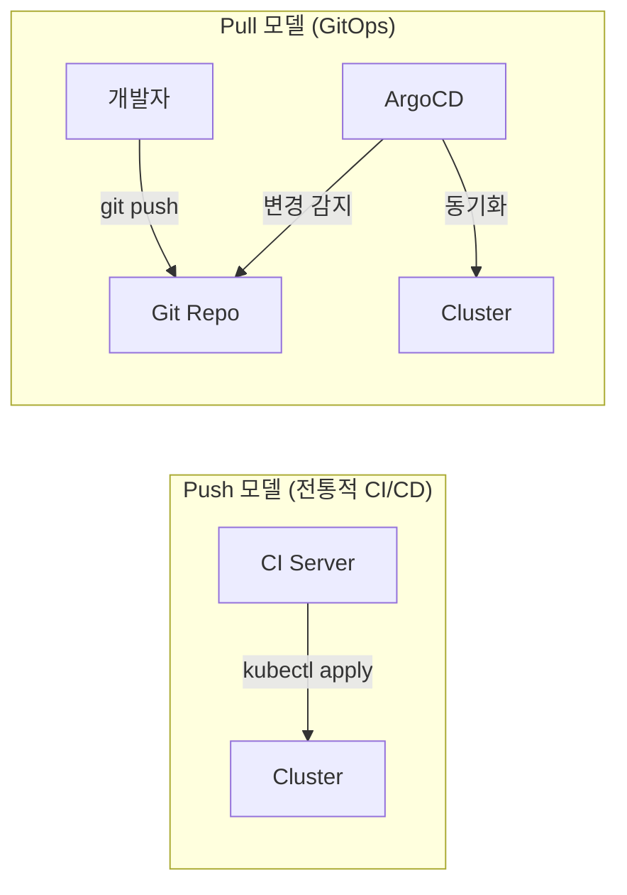
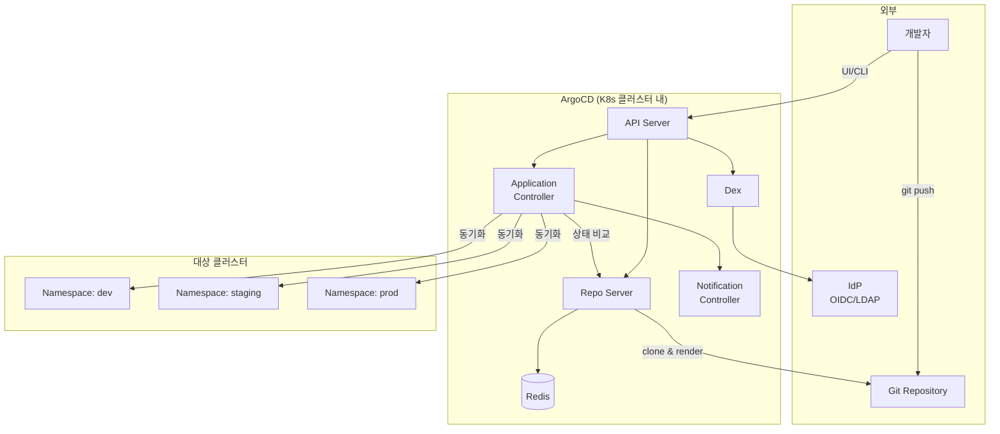
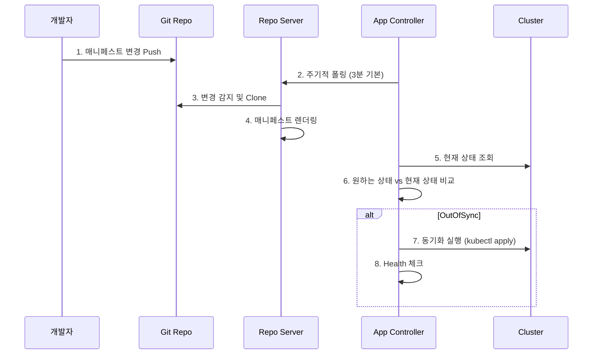
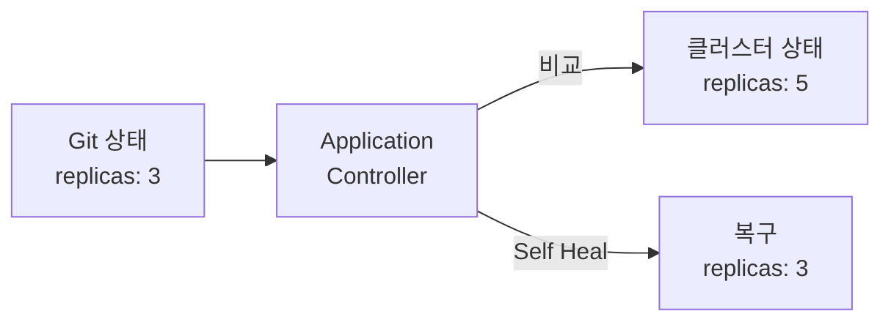
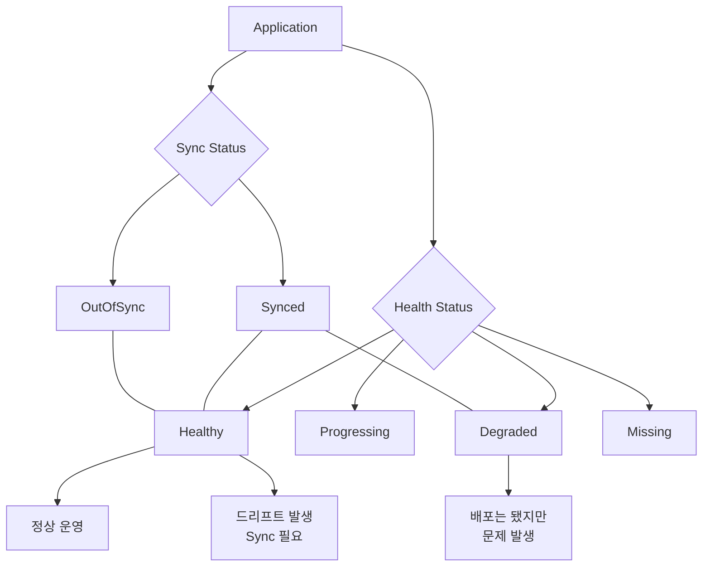

## 전체 비유: 자동 동기화 사서 시스템

ArgoCD를 **도서관 자동 동기화 사서**에 비유하면 이해하기 쉽습니다:

| 도서관 비유 | ArgoCD | 역할 |
|------------|--------|------|
| 도서 목록 원본 (마스터 장부) | Git Repository | 모든 배포 정의의 원천 |
| 자동 동기화 사서 | Application Controller | 실제 서가와 목록을 지속 비교 |
| 서가 (실제 책 배치) | Kubernetes Cluster | 실제 배포된 리소스 |
| 목록과 서가 비교 | Sync Status 확인 | Git 상태와 클러스터 상태 비교 |
| 책이 빠지면 자동 보충 | Self Healing | 누군가 수동 변경하면 원본으로 복구 |
| 사서의 검수 보고 | Health Assessment | 배포된 리소스의 상태 진단 |
| 서가 구역별 관리자 | AppProject | 팀/환경별 접근 제어 |
| 새 도서 입고 자동 배치 | Auto Sync | Git 변경 감지 시 자동 배포 |
| 폐기 도서 자동 제거 | Prune | Git에서 삭제된 리소스 자동 정리 |

이처럼 ArgoCD는 "마스터 장부(Git)와 실제 서가(클러스터)를 항상 동일하게 유지하는 자동화 사서"입니다.

---

> **대상 독자**: Kubernetes 배포를 자동화하고 싶은 백엔드/인프라 엔지니어
> **선수 지식**: Deployment, Service
> **소요 시간**: 약 30분
> **이 문서를 읽으면**: GitOps 개념과 ArgoCD의 아키텍처, 핵심 리소스, Sync 전략을 이해할 수 있습니다


- ArgoCD는 Git을 Single Source of Truth로 삼아 Kubernetes에 자동 배포합니다
- Application 리소스가 Git 레포와 K8s 클러스터를 매핑합니다
- Auto Sync + Self Healing으로 Git과 클러스터 상태를 항상 동기화합니다
- Health Assessment로 배포된 리소스의 건강 상태를 실시간 모니터링합니다


## GitOps란?

### 왜 GitOps가 필요한가?

**운영자가 kubectl로 직접 클러스터를 수정하면 어떤 문제가 생길까요?** 누가, 언제, 무엇을 바꿨는지 추적할 수 없고, 개발 환경과 운영 환경의 설정이 점점 달라집니다. 장애가 발생하면 "마지막으로 누가 뭘 바꿨지?"라는 질문에 아무도 답할 수 없게 됩니다. GitOps는 이 문제를 근본적으로 해결합니다.

GitOps는 **Git을 인프라와 애플리케이션의 단일 진실 원천(Single Source of Truth)으로 사용하는 운영 방식**입니다. 모든 변경은 Git을 통해서만 이루어지고, 실제 시스템은 Git의 상태를 반영하도록 자동 동기화됩니다.

### 전통적 배포 vs GitOps

| 항목 | 전통적 배포 (CI/CD Push) | GitOps |
|------|------------------------|--------|
| 배포 트리거 | CI 파이프라인이 클러스터에 Push | Git 변경을 감지하여 Pull |
| 상태 관리 | 파이프라인 실행 기록에 의존 | Git 커밋 히스토리 = 배포 히스토리 |
| 롤백 | 이전 파이프라인 재실행 | Git revert |
| 감사 추적 | 별도 로깅 필요 | Git 커밋 로그로 자동 추적 |
| 클러스터 접근 | CI가 클러스터 자격 증명 보유 | ArgoCD만 클러스터에 접근 |
| 드리프트 감지 | 수동 확인 | 자동 감지 및 복구 |

### Push vs Pull 모델



*Push 모델은 외부에서 클러스터에 직접 배포하고, Pull 모델은 클러스터 내부의 ArgoCD가 Git을 감시하여 동기화합니다.*


Pull 모델의 가장 큰 장점은 **보안**입니다. CI 파이프라인에 클러스터 자격 증명을 줄 필요가 없습니다. ArgoCD가 클러스터 내부에서 동작하며 Git만 읽으면 됩니다.


### GitOps의 4가지 원칙

| 원칙 | 설명 |
|------|------|
| 선언적 (Declarative) | 시스템의 원하는 상태를 선언적으로 기술 |
| 버전 관리 (Versioned) | 모든 상태를 Git에서 버전 관리 |
| 자동 적용 (Automated) | 승인된 변경은 자동으로 시스템에 적용 |
| 자가 치유 (Self-healing) | 실제 상태가 선언과 다르면 자동 복구 |

## ArgoCD 아키텍처

### 왜 ArgoCD인가?

**GitOps를 수동으로 구현하면 어떨까요?** Git 변경을 폴링하고, diff를 계산하고, kubectl apply를 실행하고, 실패 시 재시도하고... 이 모든 것을 직접 구현하면 복잡도가 폭발합니다. ArgoCD는 이 복잡한 GitOps 워크플로를 검증된 방식으로 패키징한 도구입니다.

ArgoCD는 Kubernetes 클러스터에 설치되어 동작하는 GitOps 지속적 배포 도구입니다. 핵심 컴포넌트는 다음과 같습니다.

| 컴포넌트 | 역할 |
|----------|------|
| API Server | 웹 UI, CLI, gRPC API 제공. 인증/인가 처리 |
| Repo Server | Git 레포 클론, 매니페스트 생성 (Helm, Kustomize 등) |
| Application Controller | 클러스터 상태 감시, Git과 비교, Sync 실행 |
| Redis | 캐싱 (Repo 데이터, 클러스터 상태) |
| Dex | SSO 연동 (OIDC, LDAP, SAML 등) |
| Notification Controller | Slack, 이메일 등 알림 전송 |

### 아키텍처 다이어그램



*ArgoCD는 클러스터 내부에서 동작하며, Git Repository의 매니페스트를 대상 클러스터(또는 네임스페이스)에 동기화합니다.*

### 동작 흐름

ArgoCD의 기본 동작 흐름은 다음과 같습니다:



*개발자가 Git에 Push하면 ArgoCD가 변경을 감지하고 클러스터에 자동 동기화합니다.*


ArgoCD는 기본적으로 **3분마다** Git 레포를 폴링합니다. 더 빠른 반영이 필요하면 **Webhook**을 설정하여 Git Push 즉시 Sync를 트리거할 수 있습니다.


## 핵심 리소스

### 왜 리소스 모델이 중요한가?

**ArgoCD를 사용하려면 "어떤 Git 레포의 어떤 경로를 어떤 클러스터에 배포할 것인가?"를 정의해야 합니다.** ArgoCD는 이 매핑을 Kubernetes CRD(Custom Resource Definition)로 관리합니다. 가장 중요한 세 가지 리소스를 살펴봅시다.

### Application

Application은 ArgoCD의 핵심 리소스입니다. Git 레포의 특정 경로를 Kubernetes 클러스터의 특정 네임스페이스에 매핑합니다.

```yaml
apiVersion: argoproj.io/v1alpha1
kind: Application
metadata:
  name: my-app
  namespace: argocd
spec:
  project: default
  source:
    repoURL: https://github.com/my-org/my-app.git
    targetRevision: main
    path: k8s/overlays/dev
  destination:
    server: https://kubernetes.default.svc
    namespace: my-app-dev
  syncPolicy:
    automated:
      prune: true
      selfHeal: true
    syncOptions:
      - CreateNamespace=true
```

각 필드의 역할은 다음과 같습니다:

| 필드 | 설명 |
|------|------|
| `project` | 이 Application이 속한 AppProject |
| `source.repoURL` | Git 레포 URL |
| `source.targetRevision` | 추적할 브랜치, 태그, 또는 커밋 |
| `source.path` | 매니페스트가 있는 디렉토리 경로 |
| `destination.server` | 대상 클러스터 API 서버 |
| `destination.namespace` | 배포 대상 네임스페이스 |
| `syncPolicy.automated` | 자동 동기화 활성화 |
| `syncPolicy.automated.prune` | Git에서 삭제된 리소스 자동 제거 |
| `syncPolicy.automated.selfHeal` | 수동 변경 시 자동 복구 |

### Helm 기반 Application

Helm Chart를 사용하는 경우의 Application 정의입니다:

```yaml
apiVersion: argoproj.io/v1alpha1
kind: Application
metadata:
  name: my-app-helm
  namespace: argocd
spec:
  project: default
  source:
    repoURL: https://charts.example.com
    chart: my-app
    targetRevision: 1.2.3
    helm:
      values: |
        replicaCount: 3
        image:
          tag: v2.1.0
        resources:
          requests:
            memory: 256Mi
            cpu: 100m
  destination:
    server: https://kubernetes.default.svc
    namespace: my-app
```

### AppProject

**여러 팀이 하나의 ArgoCD를 공유하면 어떻게 격리할까요?** AppProject는 논리적 그룹을 만들어 접근 제어를 적용합니다.

```yaml
apiVersion: argoproj.io/v1alpha1
kind: AppProject
metadata:
  name: backend-team
  namespace: argocd
spec:
  description: "백엔드 팀 프로젝트"
  sourceRepos:
    - "https://github.com/my-org/backend-*"
  destinations:
    - namespace: "backend-*"
      server: https://kubernetes.default.svc
  clusterResourceWhitelist:
    - group: ""
      kind: Namespace
  namespaceResourceWhitelist:
    - group: "apps"
      kind: Deployment
    - group: ""
      kind: Service
    - group: ""
      kind: ConfigMap
  roles:
    - name: developer
      description: "백엔드 개발자"
      policies:
        - p, proj:backend-team:developer, applications, sync, backend-team/*, allow
        - p, proj:backend-team:developer, applications, get, backend-team/*, allow
```

AppProject가 제어하는 항목은 다음과 같습니다:

| 항목 | 설명 |
|------|------|
| `sourceRepos` | 허용된 Git 레포 (와일드카드 지원) |
| `destinations` | 배포 가능한 클러스터와 네임스페이스 |
| `clusterResourceWhitelist` | 허용된 클러스터 범위 리소스 |
| `namespaceResourceWhitelist` | 허용된 네임스페이스 범위 리소스 |
| `roles` | RBAC 역할과 정책 정의 |


`default` 프로젝트는 모든 것을 허용합니다. 운영 환경에서는 반드시 **팀별/환경별 AppProject**를 만들어 최소 권한 원칙을 적용하세요.


### Repository

ArgoCD에 Git 또는 Helm 저장소를 연결하는 방법입니다:

```bash
# HTTPS (사용자/비밀번호)
argocd repo add https://github.com/my-org/my-app.git \
  --username admin \
  --password $GIT_TOKEN

# SSH 키
argocd repo add git@github.com:my-org/my-app.git \
  --ssh-private-key-path ~/.ssh/id_rsa

# Helm 레포
argocd repo add https://charts.example.com \
  --type helm \
  --name my-charts
```

Secret으로 직접 정의할 수도 있습니다:

```yaml
apiVersion: v1
kind: Secret
metadata:
  name: my-repo
  namespace: argocd
  labels:
    argocd.argoproj.io/secret-type: repository
stringData:
  type: git
  url: https://github.com/my-org/my-app.git
  username: admin
  password: ghp_xxxxxxxxxxxx
```

## Sync 전략

### 왜 Sync 전략을 이해해야 하나?

**Git에 Push하면 무조건 즉시 배포되어야 할까요?** 개발 환경은 자동 배포가 편리하지만, 운영 환경은 수동 승인 후 배포가 안전합니다. ArgoCD는 환경별로 다른 Sync 전략을 적용할 수 있습니다.

### Auto Sync vs Manual Sync

| 전략 | 설명 | 적합한 환경 |
|------|------|------------|
| Auto Sync | Git 변경 감지 시 자동 배포 | dev, staging |
| Manual Sync | UI/CLI에서 명시적으로 Sync 실행 | production |

```yaml
# Auto Sync 설정
syncPolicy:
  automated:
    prune: true      # Git에서 삭제된 리소스 자동 제거
    selfHeal: true   # 수동 변경 시 자동 복구
    allowEmpty: false # 빈 매니페스트 방지
```

```yaml
# Manual Sync (automated 블록 생략)
syncPolicy:
  syncOptions:
    - Validate=true
```

### Self Healing

**운영자가 kubectl로 클러스터를 직접 수정하면 어떻게 될까요?** Self Healing이 켜져 있으면 ArgoCD가 변경을 감지하고 Git 상태로 자동 복구합니다.



*누군가 kubectl scale로 replicas를 5로 변경해도, Self Healing이 Git의 3으로 자동 복구합니다.*


Self Healing이 켜져 있으면 kubectl로 수행한 긴급 조치도 되돌아갑니다. 긴급 상황에서는 ArgoCD Application을 일시적으로 **Manual Sync로 전환**하거나 **Auto Sync를 비활성화**하세요.


### Prune

Prune은 Git에서 삭제된 리소스를 클러스터에서도 자동으로 제거하는 기능입니다.

| Prune 설정 | Git에서 파일 삭제 시 | 클러스터 동작 |
|------------|---------------------|--------------|
| `prune: false` (기본값) | 삭제된 파일 감지 | 리소스 유지 (OutOfSync 표시) |
| `prune: true` | 삭제된 파일 감지 | 리소스 자동 삭제 |

### Sync Status

ArgoCD는 Git과 클러스터의 상태 차이를 세 가지로 표현합니다:

| 상태 | 의미 | 아이콘 |
|------|------|--------|
| **Synced** | Git과 클러스터 상태가 일치 | 녹색 체크 |
| **OutOfSync** | Git과 클러스터 상태가 불일치 | 황색 원 |
| **Unknown** | 상태를 확인할 수 없음 | 회색 물음표 |

```mermaid
stateDiagram-v2
    &#91;*&#93; --> OutOfSync : 새 Application 생성
    OutOfSync --> Synced : Sync 실행 성공
    Synced --> OutOfSync : Git 변경 감지
    Synced --> OutOfSync : 수동 클러스터 변경
    OutOfSync --> OutOfSync : Sync 실패
    Synced --> Unknown : 연결 끊김
    Unknown --> OutOfSync : 연결 복구
```



*Application의 Sync Status 상태 전이 다이어그램입니다.*

### Sync Wave와 Hook

복잡한 배포에서는 리소스의 배포 순서가 중요합니다. Sync Wave를 사용하면 순서를 제어할 수 있습니다:

```yaml
# wave 0: 먼저 배포 (기본값)
apiVersion: v1
kind: Namespace
metadata:
  name: my-app
  annotations:
    argocd.argoproj.io/sync-wave: "0"
---
# wave 1: Namespace 생성 후 배포
apiVersion: v1
kind: ConfigMap
metadata:
  name: my-config
  annotations:
    argocd.argoproj.io/sync-wave: "1"
---
# wave 2: ConfigMap 생성 후 배포
apiVersion: apps/v1
kind: Deployment
metadata:
  name: my-app
  annotations:
    argocd.argoproj.io/sync-wave: "2"
```

Sync Hook은 Sync 라이프사이클의 특정 시점에 Job을 실행합니다:

| Hook | 실행 시점 | 용도 |
|------|----------|------|
| `PreSync` | Sync 실행 전 | DB 마이그레이션, 스키마 변경 |
| `Sync` | 메인 Sync와 함께 | 일반 리소스 배포 |
| `PostSync` | Sync 완료 후 | 통합 테스트, 알림 |
| `SyncFail` | Sync 실패 시 | 롤백, 알림 |

```yaml
apiVersion: batch/v1
kind: Job
metadata:
  name: db-migration
  annotations:
    argocd.argoproj.io/hook: PreSync
    argocd.argoproj.io/hook-delete-policy: HookSucceeded
spec:
  template:
    spec:
      containers:
        - name: migrate
          image: my-app:latest
          command: ["./migrate.sh"]
      restartPolicy: Never
```

## Health Assessment

### 왜 Health 체크가 필요한가?

**Sync가 성공했다고 배포가 정상인 것은 아닙니다.** kubectl apply는 성공했지만 Pod가 CrashLoopBackOff에 빠질 수 있습니다. ArgoCD의 Health Assessment는 배포된 리소스가 실제로 정상 동작하는지 확인합니다.

### Health Status

ArgoCD는 리소스의 실제 상태를 네 가지로 분류합니다:

| 상태 | 의미 | 예시 |
|------|------|------|
| **Healthy** | 정상 동작 중 | Deployment의 모든 Pod가 Ready |
| **Progressing** | 진행 중 | 롤링 업데이트 중 |
| **Degraded** | 비정상 | Pod CrashLoopBackOff |
| **Missing** | 리소스가 존재하지 않음 | 아직 생성되지 않음 |
| **Suspended** | 일시 중단 | CronJob 대기 중 |



*Sync Status와 Health Status를 조합하면 Application의 전체 상태를 파악할 수 있습니다.*

### 리소스별 기본 Health 체크

ArgoCD는 주요 Kubernetes 리소스에 대해 기본 Health 체크를 제공합니다:

| 리소스 | Healthy 조건 |
|--------|-------------|
| Deployment | 모든 replicas가 업데이트되고 available |
| StatefulSet | 모든 replicas가 ready |
| Service | LoadBalancer인 경우 External IP 할당 완료 |
| Ingress | Address 할당 완료 |
| PVC | Bound 상태 |
| Pod | Running 상태이고 모든 컨테이너 ready |
| Job | Complete 상태 |

### 커스텀 Health 체크

기본 Health 체크가 부족하면 `argocd-cm` ConfigMap에 Lua 스크립트로 커스텀 체크를 정의할 수 있습니다. `resource.customizations.health.<group>_<kind>` 키에 Lua 코드를 작성하면, ArgoCD가 해당 리소스의 `.status`를 읽어 Healthy/Progressing/Degraded를 판별합니다.


커스텀 Health 체크는 **CRD(Custom Resource Definition)**에 특히 유용합니다. ArgoCD가 기본적으로 알 수 없는 리소스(예: KafkaTopic, Certificate)의 건강 상태를 정의할 수 있습니다.


## 운영 모범 사례

### Git 레포 구성

```
k8s-manifests/
├── base/                    # 공통 매니페스트
│   ├── deployment.yaml
│   ├── service.yaml
│   └── kustomization.yaml
└── overlays/                # 환경별 오버레이
    ├── dev/
    │   └── kustomization.yaml
    ├── staging/
    │   └── kustomization.yaml
    └── prod/
        └── kustomization.yaml
```

### 환경별 전략 요약

| 항목 | dev | staging | production |
|------|-----|---------|------------|
| Auto Sync | O | O | X (Manual) |
| Self Heal | O | O | 선택적 |
| Prune | O | O | X (주의) |
| Webhook | O | O | O |
| AppProject | team-dev | team-staging | team-prod (엄격) |

### 보안 모범 사례

1. **Secrets를 Git에 저장하지 마세요** - Sealed Secrets, External Secrets Operator, 또는 Vault를 사용하세요
2. **AppProject로 최소 권한 적용** - 팀별로 접근 가능한 레포, 네임스페이스, 리소스를 제한하세요
3. **SSO 연동** - Dex를 통해 조직의 IdP와 연동하세요
4. **RBAC 정책 설정** - 역할별 권한을 세분화하세요


Git에 평문 Secret을 저장하면 안 됩니다. 다음 중 하나를 사용하세요:
- **Sealed Secrets**: 암호화된 Secret을 Git에 저장
- **External Secrets Operator**: AWS Secrets Manager, Vault 등에서 런타임에 주입
- **SOPS**: Mozilla SOPS로 YAML 파일 암호화


## 참고 자료

| 자료 | 링크 |
|------|------|
| ArgoCD 공식 문서 | https://argo-cd.readthedocs.io |
| ArgoCD GitHub | https://github.com/argoproj/argo-cd |
| GitOps 원칙 (OpenGitOps) | https://opengitops.dev |
| Argo Project 전체 | https://argoproj.github.io |

### 다음 단계

이 문서에서 ArgoCD의 핵심 개념을 살펴봤습니다. 다음 문서에서 더 깊은 내용을 다룹니다:

- **ArgoCD 설치와 초기 설정**: 클러스터에 ArgoCD를 설치하고 첫 Application을 배포하는 방법
- **ArgoCD 고급 패턴**: ApplicationSet, App of Apps, Progressive Delivery 등 운영 레벨 패턴
