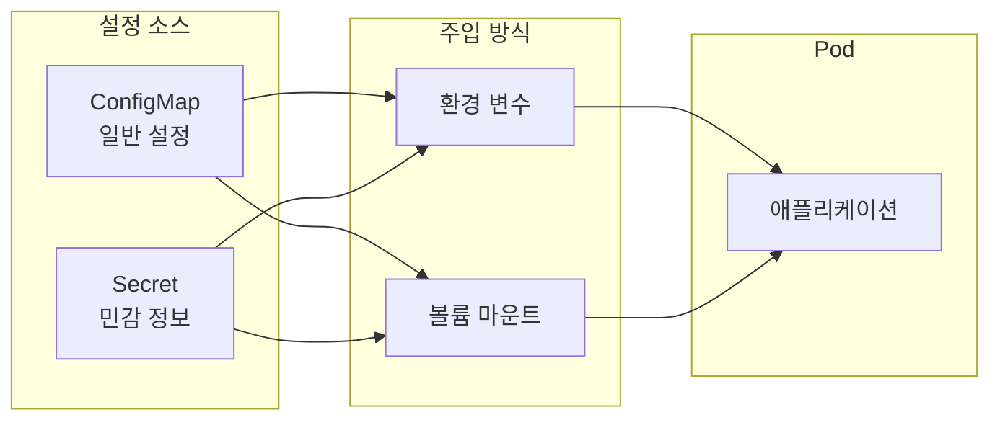

> **대상 독자**: 애플리케이션 설정을 Kubernetes에서 관리하고 싶은 백엔드 개발자
> **선수 지식**: Pod 개념
> **이 문서를 읽으면**: ConfigMap과 Secret으로 설정과 민감 정보를 분리하여 관리하는 방법을 이해할 수 있습니다


- ConfigMap은 일반 설정을 저장합니다 (DB 호스트, 로그 레벨 등)
- Secret은 민감한 정보를 저장합니다 (비밀번호, API 키 등)
- 둘 다 환경 변수 또는 파일로 Pod에 주입할 수 있습니다


## 전체 흐름

ConfigMap과 Secret이 Pod에 주입되는 흐름을 먼저 살펴봅니다.



| 주입 방식 | 장점 | 단점 | 사용 시점 |
|----------|------|------|----------|
| 환경 변수 | 코드 변경 없이 접근 | Pod 재시작 시에만 반영 | 단순 값, 시작 시 필요한 설정 |
| 볼륨 마운트 | 파일로 접근, 자동 갱신 | 파일 읽기 로직 필요 | 설정 파일, 인증서, 동적 변경 필요 시 |

## 왜 설정을 분리해야 하나?

이미지에 설정을 하드코딩하면 여러 문제가 발생합니다.

| 문제 | 설정 분리 후 |
|------|-------------|
| 환경별로 다른 이미지 필요 | 같은 이미지, 다른 설정 |
| 설정 변경 시 이미지 재빌드 | 설정만 업데이트 |
| 민감 정보가 이미지에 포함 | Secret으로 안전하게 관리 |
| 설정 이력 관리 어려움 | Kubernetes 리소스로 버전 관리 |

## ConfigMap

ConfigMap은 키-값 쌍으로 설정 데이터를 저장합니다.

### ConfigMap 생성

세 가지 방법으로 생성할 수 있습니다.

**1. 명령어로 생성:**
```bash
# 리터럴 값으로 생성
kubectl create configmap app-config \
  --from-literal=database_host=db.example.com \
  --from-literal=log_level=info

# 파일에서 생성
kubectl create configmap app-config \
  --from-file=application.properties
```

**2. YAML로 생성:**
```yaml
apiVersion: v1
kind: ConfigMap
metadata:
  name: app-config
data:
  # 단순 키-값
  database_host: "db.example.com"
  log_level: "info"

  # 멀티라인 설정 파일
  application.properties: |
    spring.datasource.url=jdbc:postgresql://db:5432/mydb
    spring.jpa.show-sql=true
    logging.level.root=info
```

### ConfigMap 사용: 환경 변수

Pod에서 환경 변수로 주입합니다.

```yaml
apiVersion: v1
kind: Pod
metadata:
  name: my-app
spec:
  containers:
  - name: app
    image: my-app:1.0
    env:
    # 개별 키 참조
    - name: DATABASE_HOST
      valueFrom:
        configMapKeyRef:
          name: app-config
          key: database_host
    # 또는 모든 키를 환경 변수로
    envFrom:
    - configMapRef:
        name: app-config
```

### ConfigMap 사용: 볼륨 마운트

설정 파일로 마운트합니다.

```yaml
apiVersion: v1
kind: Pod
metadata:
  name: my-app
spec:
  containers:
  - name: app
    image: my-app:1.0
    volumeMounts:
    - name: config-volume
      mountPath: /etc/config
  volumes:
  - name: config-volume
    configMap:
      name: app-config
```

마운트 결과는 다음과 같습니다.

```
/etc/config/
├── database_host        # 파일 내용: db.example.com
├── log_level            # 파일 내용: info
└── application.properties  # 멀티라인 내용
```

## Secret

Secret은 민감한 정보를 저장합니다.

### Secret vs ConfigMap

| 항목 | ConfigMap | Secret |
|------|-----------|--------|
| 용도 | 일반 설정 | 민감 정보 |
| 저장 형식 | 평문 | Base64 인코딩 |
| 메모리 저장 | 선택적 | etcd에서 암호화 가능 |
| 예시 | DB 호스트, 로그 레벨 | 비밀번호, API 키, 인증서 |


기본적으로 Secret은 Base64 인코딩만 되어 있어 쉽게 디코딩됩니다. 프로덕션에서는 etcd 암호화, RBAC 제한, 외부 시크릿 관리 도구(HashiCorp Vault 등)를 고려하세요.


### Secret 생성

```bash
# 명령어로 생성
kubectl create secret generic db-secret \
  --from-literal=username=admin \
  --from-literal=password=secretpass123
```

```yaml
apiVersion: v1
kind: Secret
metadata:
  name: db-secret
type: Opaque
data:
  # Base64 인코딩된 값
  username: YWRtaW4=           # echo -n "admin" | base64
  password: c2VjcmV0cGFzczEyMw== # echo -n "secretpass123" | base64
---
# 또는 stringData 사용 (자동 인코딩)
apiVersion: v1
kind: Secret
metadata:
  name: db-secret
type: Opaque
stringData:
  username: admin
  password: secretpass123
```

### Secret 타입

| 타입 | 용도 |
|------|------|
| Opaque | 일반적인 시크릿 (기본값) |
| kubernetes.io/tls | TLS 인증서 |
| kubernetes.io/dockerconfigjson | 프라이빗 레지스트리 인증 |
| kubernetes.io/basic-auth | 기본 인증 정보 |
| kubernetes.io/ssh-auth | SSH 키 |

### Secret 사용

ConfigMap과 동일한 방식으로 사용합니다.

**환경 변수:**
```yaml
spec:
  containers:
  - name: app
    env:
    - name: DB_PASSWORD
      valueFrom:
        secretKeyRef:
          name: db-secret
          key: password
    envFrom:
    - secretRef:
        name: db-secret
```

**볼륨 마운트:**
```yaml
spec:
  containers:
  - name: app
    volumeMounts:
    - name: secret-volume
      mountPath: /etc/secrets
      readOnly: true
  volumes:
  - name: secret-volume
    secret:
      secretName: db-secret
```

## 실전 예시: Spring Boot 설정

Spring Boot 애플리케이션의 설정을 ConfigMap과 Secret으로 분리합니다.

### 설정 분리 전략

| 설정 항목 | 저장 위치 |
|----------|----------|
| DB 호스트, 포트 | ConfigMap |
| DB 사용자명, 비밀번호 | Secret |
| 로깅 레벨 | ConfigMap |
| API 키 | Secret |

### ConfigMap 정의

```yaml
apiVersion: v1
kind: ConfigMap
metadata:
  name: spring-config
data:
  SPRING_DATASOURCE_URL: "jdbc:postgresql://db-service:5432/mydb"
  SPRING_JPA_SHOW_SQL: "false"
  LOGGING_LEVEL_ROOT: "info"
  SERVER_PORT: "8080"
```

### Secret 정의

```yaml
apiVersion: v1
kind: Secret
metadata:
  name: spring-secret
type: Opaque
stringData:
  SPRING_DATASOURCE_USERNAME: "myuser"
  SPRING_DATASOURCE_PASSWORD: "mysecretpassword"
```

### Deployment에서 사용

```yaml
apiVersion: apps/v1
kind: Deployment
metadata:
  name: spring-app
spec:
  replicas: 2
  selector:
    matchLabels:
      app: spring-app
  template:
    metadata:
      labels:
        app: spring-app
    spec:
      containers:
      - name: app
        image: my-spring-app:1.0
        ports:
        - containerPort: 8080
        envFrom:
        - configMapRef:
            name: spring-config
        - secretRef:
            name: spring-secret
```

## 업데이트 동작

ConfigMap이나 Secret을 업데이트하면 어떻게 될까요?

| 주입 방식 | 업데이트 반영 |
|----------|--------------|
| 환경 변수 | Pod 재시작 필요 |
| 볼륨 마운트 | 자동 반영 (수 분 소요) |

볼륨 마운트 시에도 애플리케이션이 파일 변경을 감지해야 합니다. Spring Boot의 경우 `spring-cloud-kubernetes`를 사용하면 자동 리로드가 가능합니다.

### 강제 재시작으로 업데이트 적용

```bash
# Pod 재시작 트리거
kubectl rollout restart deployment/spring-app
```

또는 Deployment에 annotation을 추가하여 변경 시 자동 재시작:

```yaml
spec:
  template:
    metadata:
      annotations:
        # 이 값이 변경되면 Pod가 재생성됨
        configmap-hash: "{{ .Values.configmapHash }}"
```

## 불변 ConfigMap/Secret

한 번 생성하면 수정할 수 없게 설정할 수 있습니다.

```yaml
apiVersion: v1
kind: ConfigMap
metadata:
  name: app-config
immutable: true  # 불변 설정
data:
  key: value
```

불변 ConfigMap의 장점은 다음과 같습니다.

| 장점 | 설명 |
|------|------|
| 실수 방지 | 의도치 않은 수정 불가 |
| 성능 향상 | kubelet이 변경 감시 안 해도 됨 |
| 명시적 버전 관리 | 변경 시 새로운 리소스 생성 필요 |

## 실습: ConfigMap/Secret 생성과 확인

### ConfigMap 실습

```bash
# ConfigMap 생성
kubectl create configmap test-config \
  --from-literal=message="Hello Kubernetes"

# 확인
kubectl get configmap test-config -o yaml

# Pod에서 테스트
kubectl run test --image=busybox:1.36 --rm -it \
  --env-from=configmap:test-config -- env | grep message
```

### Secret 실습

```bash
# Secret 생성
kubectl create secret generic test-secret \
  --from-literal=password=mysecret

# 확인 (Base64 인코딩된 값 표시)
kubectl get secret test-secret -o yaml

# 디코딩
kubectl get secret test-secret -o jsonpath='{.data.password}' | base64 -d
```

---

## 다음 단계

ConfigMap과 Secret을 이해했다면 다음 단계로 진행하세요:

| 목표 | 추천 문서 |
|------|----------|
| 영구 데이터 저장 | [Volume과 스토리지](../storage/) |
| 애플리케이션 상태 확인 | [헬스 체크](../health-checks/) |
| 실제 배포 실습 | [Spring Boot 배포](../../examples/spring-boot/) |
