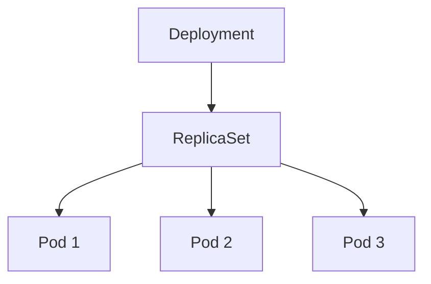
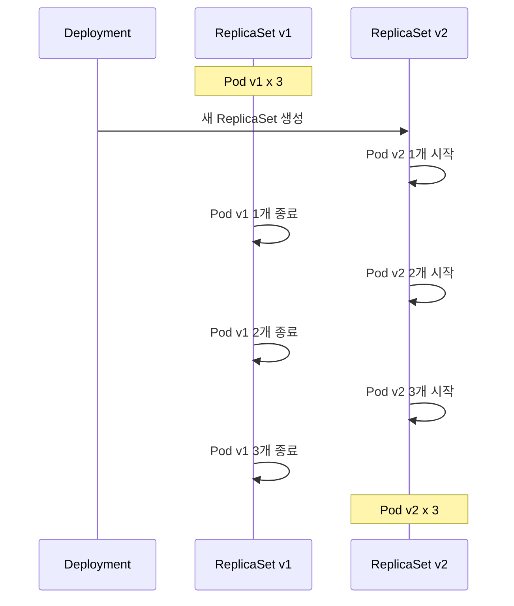

## 전체 비유: 입주민 관리 시스템

Deployment를 **아파트 입주민 관리 시스템**에 비유하면 이해하기 쉽습니다:

| 아파트 관리 비유 | Kubernetes Deployment | 역할 |
|----------------|----------------------|------|
| 입주민 관리 시스템 | Deployment | 세대(Pod) 배치와 업데이트 총괄 |
| "항상 3세대 유지" 규칙 | replicas: 3 | 원하는 세대 수 선언 |
| 세대 목록 관리대장 | ReplicaSet | 실제 세대 수 유지 담당 |
| 순차적 이사 | Rolling Update | 한 세대씩 새 버전으로 교체 |
| 이전 주소로 복귀 | Rollback | 문제 시 이전 상태로 되돌리기 |
| 공실 발생 시 자동 입주 | 자동 복구 | Pod 장애 시 자동 재생성 |
| 입주 규격 템플릿 | Pod Template | 생성할 세대의 표준 사양 |
| 과거 입주 기록 보관 | revisionHistory | 롤백용 이전 버전 유지 |

이처럼 Deployment는 "관리사무소가 항상 일정 수의 세대를 유지하고, 리모델링 시 순차적으로 진행"하는 것과 같습니다.

---

> **대상 독자**: Kubernetes에서 애플리케이션을 배포하고 싶은 백엔드 개발자
> **선수 지식**: Pod 개념
> **이 문서를 읽으면**: Deployment로 애플리케이션을 배포하고 업데이트하는 방법을 이해할 수 있습니다


- Deployment는 Pod의 선언적 업데이트를 관리합니다
- 롤링 업데이트로 무중단 배포가 가능합니다
- 문제 발생 시 이전 버전으로 롤백할 수 있습니다


## Deployment란?

Deployment는 Pod의 배포와 업데이트를 관리하는 리소스입니다. Pod를 직접 관리하지 않고 Deployment를 사용하면 여러 이점이 있습니다.

| 기능 | 설명 |
|------|------|
| 선언적 업데이트 | 원하는 상태만 정의하면 Kubernetes가 알아서 처리 |
| 롤링 업데이트 | 무중단으로 새 버전 배포 |
| 롤백 | 문제 발생 시 이전 버전으로 되돌리기 |
| 스케일링 | replicas 조정으로 Pod 수 변경 |
| 자동 복구 | Pod 장애 시 자동 재생성 |

## Deployment 구조

Deployment는 ReplicaSet을 생성하고, ReplicaSet이 Pod를 관리합니다.



각 리소스의 역할을 비교하면 다음과 같습니다.

| 리소스 | 역할 |
|--------|------|
| Deployment | 배포 전략 관리, ReplicaSet 버전 관리 |
| ReplicaSet | 지정된 수의 Pod 복제본 유지 |
| Pod | 실제 애플리케이션 컨테이너 실행 |


ReplicaSet을 직접 만들 수도 있지만, 롤링 업데이트나 롤백 기능이 없습니다. Deployment가 이러한 기능을 제공하므로 항상 Deployment를 사용하세요.


## Deployment YAML

기본적인 Deployment 정의입니다.

```yaml
apiVersion: apps/v1
kind: Deployment
metadata:
  name: my-app
  labels:
    app: my-app
spec:
  replicas: 3
  selector:
    matchLabels:
      app: my-app
  template:
    metadata:
      labels:
        app: my-app
    spec:
      containers:
      - name: app
        image: my-app:1.0
        ports:
        - containerPort: 8080
        resources:
          requests:
            memory: "256Mi"
            cpu: "250m"
          limits:
            memory: "512Mi"
            cpu: "500m"
```

주요 필드를 설명합니다.

| 필드 | 설명 |
|------|------|
| `replicas` | 유지할 Pod 수 |
| `selector.matchLabels` | 관리할 Pod를 선택하는 기준 |
| `template` | 생성할 Pod 템플릿 |
| `template.metadata.labels` | Pod에 붙일 레이블 (selector와 일치해야 함) |

### selector와 labels의 관계

Deployment의 selector와 Pod의 labels는 반드시 일치해야 합니다.

```yaml
spec:
  selector:
    matchLabels:
      app: my-app      # 이 레이블을 가진 Pod를 관리
  template:
    metadata:
      labels:
        app: my-app    # Pod에 이 레이블 부여 (위와 일치)
```

## 롤링 업데이트

Deployment의 핵심 기능인 롤링 업데이트를 이해합니다.

### 롤링 업데이트 과정

이미지 버전을 변경하면 롤링 업데이트가 시작됩니다.



### 롤링 업데이트 단계별 상태

`replicas=3`, `maxSurge=1`, `maxUnavailable=0` 설정 시:

| 단계 | v1 Pod | v2 Pod | 총 Pod | 가용 Pod | 설명 |
|------|--------|--------|--------|----------|------|
| 0 (시작 전) | 3 | 0 | 3 | 3 | 초기 상태 |
| 1 | 3 | 1 | 4 | 3 | v2 Pod 1개 생성 |
| 2 | 2 | 1 | 3 | 3 | v2 Ready 후 v1 1개 종료 |
| 3 | 2 | 2 | 4 | 3 | v2 Pod 1개 추가 생성 |
| 4 | 1 | 2 | 3 | 3 | v2 Ready 후 v1 1개 종료 |
| 5 | 1 | 3 | 4 | 3 | v2 Pod 1개 추가 생성 |
| 6 (완료) | 0 | 3 | 3 | 3 | 마지막 v1 종료 |


`maxUnavailable=0`이므로 가용 Pod가 항상 3개 이상 유지됩니다. 새 Pod가 Ready가 된 후에만 이전 Pod를 종료합니다.


롤링 업데이트의 장점은 다음과 같습니다.

| 장점 | 설명 |
|------|------|
| 무중단 | 항상 일정 수의 Pod가 실행 중 |
| 점진적 | 문제 발견 시 중단 가능 |
| 자동화 | 별도 스크립트 불필요 |

### 업데이트 전략 설정

```yaml
spec:
  strategy:
    type: RollingUpdate
    rollingUpdate:
      maxSurge: 1        # 원하는 수 대비 추가 허용 Pod
      maxUnavailable: 0  # 동시에 중단 가능한 Pod
```

| 설정 | 의미 | 예시 (replicas=3) |
|------|------|------------------|
| `maxSurge: 1` | 최대 4개까지 실행 허용 | 3+1=4 |
| `maxUnavailable: 0` | 최소 3개는 항상 실행 | 절대 2개 이하 안 됨 |
| `maxSurge: 25%` | 최대 4개까지 허용 | 3*1.25=3.75→4 |

일반적인 전략을 비교하면 다음과 같습니다.

| 전략 | maxSurge | maxUnavailable | 특징 |
|------|----------|----------------|------|
| 안전 우선 | 1 | 0 | 느리지만 안전 |
| 빠른 배포 | 25% | 25% | 빠르지만 일시적 용량 감소 |
| 리소스 절약 | 0 | 1 | 추가 리소스 불필요 |

### Recreate 전략

모든 Pod를 종료 후 새로 생성하는 전략입니다.

```yaml
spec:
  strategy:
    type: Recreate
```

사용하는 경우는 다음과 같습니다.

- 이전 버전과 새 버전이 동시에 실행되면 안 되는 경우
- 단일 인스턴스만 허용되는 애플리케이션
- 데이터베이스 마이그레이션이 필요한 경우


Recreate 전략은 다운타임이 발생합니다. 프로덕션에서는 신중하게 사용하세요.


## 롤백

문제 발생 시 이전 버전으로 되돌립니다.

### 롤아웃 히스토리 확인

```bash
# 배포 히스토리 확인
kubectl rollout history deployment/my-app
```

**예상 출력:**
```
REVISION  CHANGE-CAUSE
1         <none>
2         <none>
3         <none>
```

`CHANGE-CAUSE`를 기록하려면 배포 시 annotation을 추가합니다.

```bash
kubectl annotate deployment/my-app kubernetes.io/change-cause="이미지 버전 2.0으로 업데이트"
```

### 롤백 실행

```bash
# 바로 이전 버전으로 롤백
kubectl rollout undo deployment/my-app

# 특정 버전으로 롤백
kubectl rollout undo deployment/my-app --to-revision=2
```

### 롤아웃 상태 확인

```bash
# 롤아웃 진행 상태
kubectl rollout status deployment/my-app

# 롤아웃 일시 중지
kubectl rollout pause deployment/my-app

# 롤아웃 재개
kubectl rollout resume deployment/my-app
```

## 스케일링

Pod 수를 조정하여 트래픽 변화에 대응합니다.

### 수동 스케일링

```bash
# replicas를 5로 변경
kubectl scale deployment/my-app --replicas=5

# 또는 YAML 수정
kubectl edit deployment/my-app
```

### 스케일링 시 주의사항

| 고려사항 | 설명 |
|----------|------|
| 리소스 확인 | 노드에 충분한 리소스가 있는지 |
| 연결 수 | DB 연결 풀, 외부 API 제한 |
| 세션 관리 | Sticky Session 필요 여부 |
| 스토리지 | RWO 볼륨은 여러 Pod에서 공유 불가 |

## 실습: Deployment 배포와 업데이트

### Deployment 생성

```bash
# Deployment 생성
kubectl apply -f deployment.yaml

# 상태 확인
kubectl get deployment my-app
kubectl get replicaset
kubectl get pods -l app=my-app
```

### 이미지 업데이트

```bash
# 이미지 변경으로 롤링 업데이트 트리거
kubectl set image deployment/my-app app=my-app:2.0

# 롤아웃 상태 모니터링
kubectl rollout status deployment/my-app

# Pod가 교체되는 과정 확인
kubectl get pods -w
```

### ReplicaSet 확인

```bash
# ReplicaSet 목록 - 이전 버전도 유지됨
kubectl get rs

# 예상 출력:
# NAME                  DESIRED   CURRENT   READY   AGE
# my-app-7d8f9b7c5f     3         3         3       10m
# my-app-5b9f8c6d4e     0         0         0       30m
```

이전 ReplicaSet이 유지되는 이유는 롤백을 위해서입니다. `revisionHistoryLimit`으로 보관 개수를 설정할 수 있습니다.

```yaml
spec:
  revisionHistoryLimit: 3  # 최근 3개 버전만 유지
```

### 롤백 실습

```bash
# 의도적으로 잘못된 이미지 배포
kubectl set image deployment/my-app app=my-app:invalid

# 롤아웃 상태 확인 (실패)
kubectl rollout status deployment/my-app

# Pod 상태 확인
kubectl get pods
# ImagePullBackOff 상태의 Pod 확인

# 롤백
kubectl rollout undo deployment/my-app

# 복구 확인
kubectl get pods
```

## 자주 사용하는 kubectl 명령어

| 명령어 | 설명 |
|--------|------|
| `kubectl get deployment` | Deployment 목록 |
| `kubectl describe deployment <name>` | 상세 정보 |
| `kubectl rollout status deployment/<name>` | 롤아웃 상태 |
| `kubectl rollout history deployment/<name>` | 버전 히스토리 |
| `kubectl rollout undo deployment/<name>` | 롤백 |
| `kubectl scale deployment/<name> --replicas=N` | 스케일링 |
| `kubectl set image deployment/<name> <container>=<image>` | 이미지 변경 |

## 프로덕션 권장 설정

실제 운영을 위한 Deployment 예시입니다.

```yaml
apiVersion: apps/v1
kind: Deployment
metadata:
  name: my-app
spec:
  replicas: 3
  revisionHistoryLimit: 5
  strategy:
    type: RollingUpdate
    rollingUpdate:
      maxSurge: 1
      maxUnavailable: 0
  selector:
    matchLabels:
      app: my-app
  template:
    metadata:
      labels:
        app: my-app
    spec:
      containers:
      - name: app
        image: my-app:1.0
        ports:
        - containerPort: 8080
        resources:
          requests:
            memory: "256Mi"
            cpu: "250m"
          limits:
            memory: "512Mi"
            cpu: "500m"
        readinessProbe:
          httpGet:
            path: /health
            port: 8080
          initialDelaySeconds: 10
          periodSeconds: 5
        livenessProbe:
          httpGet:
            path: /health
            port: 8080
          initialDelaySeconds: 30
          periodSeconds: 10
```

권장 설정 체크리스트는 다음과 같습니다.

| 항목 | 이유 |
|------|------|
| `resources` 설정 | 리소스 경합 방지, 스케줄링 정확도 |
| `readinessProbe` | 준비되지 않은 Pod에 트래픽 방지 |
| `livenessProbe` | 멈춘 Pod 자동 재시작 |
| `maxUnavailable: 0` | 무중단 배포 보장 |
| `revisionHistoryLimit` | 롤백 가능 버전 관리 |

---

## 다음 단계

Deployment를 이해했다면 다음 단계로 진행하세요:

| 목표 | 추천 문서 |
|------|----------|
| Pod에 접근하기 | [Service](service/) |
| 자동 스케일링 | [스케일링](scaling/) |
| 헬스 체크 설정 | [헬스 체크](health-checks/) |
