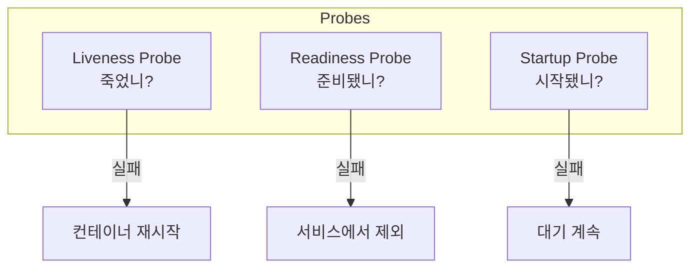
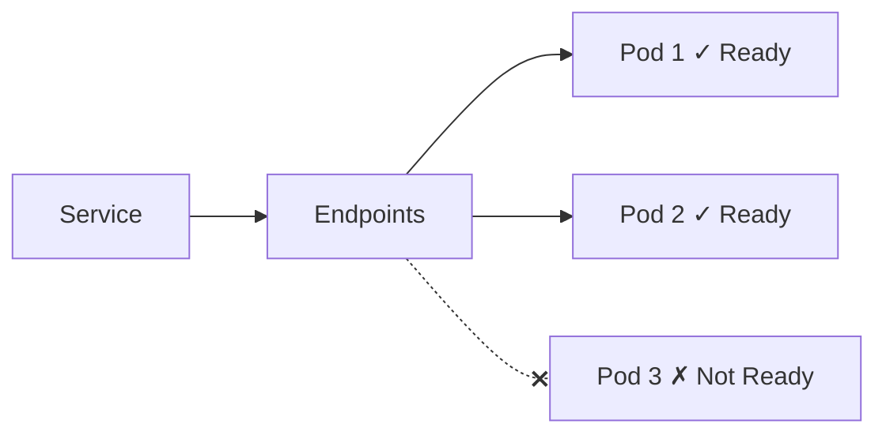
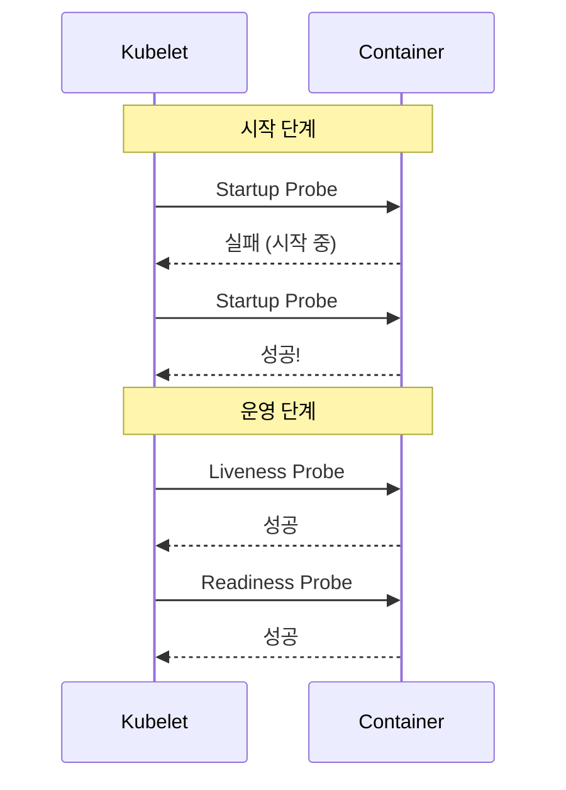

## 전체 비유: 아파트 안전 점검

헬스 체크를 **아파트 안전 점검**에 비유하면 이해하기 쉽습니다:

| 아파트 점검 비유 | Kubernetes | 역할 |
|----------------|------------|------|
| 정기 안전 점검 | Health Check | 애플리케이션 상태 확인 |
| "살아 계신가요?" 확인 | Liveness Probe | 컨테이너 생존 확인 |
| "손님 받을 준비 됐나요?" | Readiness Probe | 트래픽 수신 준비 확인 |
| "이사 완료됐나요?" | Startup Probe | 시작 완료 여부 확인 |
| 응답 없으면 119 호출 | Liveness 실패 → 재시작 | 컨테이너 재시작 |
| 바쁘면 손님 안 받음 | Readiness 실패 → 트래픽 제외 | Service에서 제외 |
| 이사 중이면 기다림 | Startup 진행 중 | 다른 Probe 비활성화 |
| 초인종 눌러서 확인 | HTTP Probe | HTTP 엔드포인트 체크 |
| 전화해서 확인 | TCP Probe | 포트 연결 체크 |
| 가스 점검 (직접 확인) | Exec Probe | 명령어 실행 체크 |

이처럼 Probe는 "관리인이 주기적으로 세대를 방문하여 상태를 확인"하는 것과 같습니다.

---

> **대상 독자**: Kubernetes에서 애플리케이션 상태를 모니터링하고 싶은 백엔드 개발자
> **선수 지식**: Pod, Deployment 개념
> **소요 시간**: 약 25-30분
> **이 문서를 읽으면**: Liveness, Readiness, Startup Probe의 차이와 설정 방법을 이해할 수 있습니다


- **Liveness Probe**: 컨테이너가 살아있는지 확인, 실패 시 재시작
- **Readiness Probe**: 트래픽을 받을 준비가 되었는지 확인, 실패 시 서비스에서 제외
- **Startup Probe**: 시작 완료 여부 확인, 완료 전까지 다른 Probe 비활성화


## 왜 헬스 체크가 필요한가?

컨테이너가 실행 중(Running)이라고 해서 애플리케이션이 정상인 것은 아닙니다.

| 상황 | 컨테이너 상태 | 실제 상태 |
|------|-------------|----------|
| 데드락 발생 | Running | 응답 불가 |
| DB 연결 끊김 | Running | 서비스 불가 |
| 시작 중 | Running | 준비 안 됨 |
| 메모리 부족 | Running | 느린 응답 |

헬스 체크를 통해 이러한 상황을 감지하고 자동으로 대응할 수 있습니다.

## Probe 유형 비교



각 Probe의 특징을 비교하면 다음과 같습니다.

| Probe | 질문 | 실패 시 동작 | 사용 시점 |
|-------|------|-------------|----------|
| Liveness | 살아있니? | 컨테이너 재시작 | 항상 |
| Readiness | 준비됐니? | 서비스에서 제외 | 항상 |
| Startup | 시작됐니? | 대기 | 시작 시에만 |

## Liveness Probe

애플리케이션이 정상적으로 동작하는지 확인합니다. 실패하면 kubelet이 컨테이너를 재시작합니다.

### HTTP 체크

```yaml
apiVersion: v1
kind: Pod
metadata:
  name: liveness-http
spec:
  containers:
  - name: app
    image: my-app:1.0
    livenessProbe:
      httpGet:
        path: /health
        port: 8080
      initialDelaySeconds: 30
      periodSeconds: 10
      timeoutSeconds: 5
      failureThreshold: 3
```

### TCP 체크

포트가 열려있는지 확인합니다.

```yaml
livenessProbe:
  tcpSocket:
    port: 8080
  initialDelaySeconds: 15
  periodSeconds: 20
```

### 명령 실행 체크

```yaml
livenessProbe:
  exec:
    command:
    - cat
    - /tmp/healthy
  initialDelaySeconds: 5
  periodSeconds: 5
```

### Probe 설정 값

| 설정 | 기본값 | 설명 |
|------|--------|------|
| initialDelaySeconds | 0 | 첫 체크까지 대기 시간 |
| periodSeconds | 10 | 체크 간격 |
| timeoutSeconds | 1 | 응답 대기 시간 |
| successThreshold | 1 | 성공으로 판단하기 위한 연속 성공 횟수 |
| failureThreshold | 3 | 실패로 판단하기 위한 연속 실패 횟수 |

## Readiness Probe

애플리케이션이 트래픽을 받을 준비가 되었는지 확인합니다. 실패하면 Service의 Endpoints에서 제외됩니다.

```yaml
readinessProbe:
  httpGet:
    path: /ready
    port: 8080
  initialDelaySeconds: 5
  periodSeconds: 5
  failureThreshold: 3
```

### Readiness vs Liveness

| 상황 | Readiness | Liveness |
|------|-----------|----------|
| DB 연결 끊김 | 실패 (트래픽 제외) | 성공 (재시작 불필요) |
| 설정 로드 중 | 실패 (준비 안 됨) | 성공 (정상 동작 중) |
| 데드락 | 실패 | 실패 (재시작 필요) |



## Startup Probe

애플리케이션 시작에 오래 걸리는 경우 사용합니다. Startup Probe가 성공할 때까지 Liveness/Readiness Probe는 비활성화됩니다.

```yaml
startupProbe:
  httpGet:
    path: /health
    port: 8080
  initialDelaySeconds: 10
  periodSeconds: 10
  failureThreshold: 30  # 최대 5분 대기 (10초 × 30회)
```

### 왜 Startup Probe가 필요한가?

Liveness Probe의 `initialDelaySeconds`를 길게 설정하면 되지 않을까요?

| 방식 | 문제점 |
|------|--------|
| Liveness만 사용, initialDelay 길게 | 시작 후에도 체크 간격이 길어짐 |
| Startup + Liveness | 시작 시만 긴 대기, 이후 짧은 간격 |



## 실전 예시: Spring Boot

Spring Boot 애플리케이션의 Probe 설정 예시입니다.

### Spring Boot Actuator 설정

```yaml
# application.yml
management:
  endpoints:
    web:
      exposure:
        include: health
  endpoint:
    health:
      probes:
        enabled: true
  health:
    livenessState:
      enabled: true
    readinessState:
      enabled: true
```

Spring Boot Actuator는 다음 엔드포인트를 제공합니다.

| 엔드포인트 | 용도 |
|-----------|------|
| /actuator/health/liveness | Liveness Probe |
| /actuator/health/readiness | Readiness Probe |
| /actuator/health | 전체 상태 |

### Kubernetes Probe 설정

```yaml
apiVersion: apps/v1
kind: Deployment
metadata:
  name: spring-app
spec:
  replicas: 3
  selector:
    matchLabels:
      app: spring-app
  template:
    metadata:
      labels:
        app: spring-app
    spec:
      containers:
      - name: app
        image: spring-app:1.0
        ports:
        - containerPort: 8080
        startupProbe:
          httpGet:
            path: /actuator/health/liveness
            port: 8080
          initialDelaySeconds: 10
          periodSeconds: 10
          failureThreshold: 30
        livenessProbe:
          httpGet:
            path: /actuator/health/liveness
            port: 8080
          periodSeconds: 10
          failureThreshold: 3
        readinessProbe:
          httpGet:
            path: /actuator/health/readiness
            port: 8080
          periodSeconds: 5
          failureThreshold: 3
```

## 권장 설정

| 애플리케이션 유형 | startupProbe | livenessProbe | readinessProbe |
|-----------------|--------------|---------------|----------------|
| 빠른 시작 (< 30초) | 선택 | 필수 | 필수 |
| 느린 시작 (> 30초) | 필수 | 필수 | 필수 |
| 외부 의존성 있음 | 선택 | 단순 체크 | 의존성 포함 체크 |

### 체크 엔드포인트 설계

| Probe | 체크 내용 |
|-------|----------|
| Liveness | 프로세스 생존 여부만 (빠르고 단순하게) |
| Readiness | 외부 의존성 (DB, 캐시, 외부 API) |


Liveness Probe에서 DB 연결을 체크하면, DB 장애 시 모든 Pod가 재시작되어 상황이 악화될 수 있습니다. 외부 의존성은 Readiness Probe에서 체크하세요.


## 트러블슈팅

### Pod가 계속 재시작됨

```bash
# 이벤트 확인
kubectl describe pod <pod-name>

# 로그 확인
kubectl logs <pod-name> --previous
```

일반적인 원인은 다음과 같습니다.

| 원인 | 해결 |
|------|------|
| initialDelaySeconds 부족 | Startup Probe 사용 또는 값 증가 |
| timeoutSeconds 부족 | 값 증가 또는 엔드포인트 최적화 |
| 잘못된 헬스 체크 경로 | 경로와 포트 확인 |

### Readiness 실패로 트래픽 못 받음

```bash
# Endpoints 확인
kubectl get endpoints <service-name>

# Pod Ready 상태 확인
kubectl get pods -o wide
```

Endpoints가 비어있다면 Readiness Probe 실패 중입니다.

## 실습: Probe 설정과 테스트

### Probe 동작 확인

```yaml
apiVersion: v1
kind: Pod
metadata:
  name: probe-test
spec:
  containers:
  - name: app
    image: nginx:1.25
    ports:
    - containerPort: 80
    livenessProbe:
      httpGet:
        path: /
        port: 80
      initialDelaySeconds: 5
      periodSeconds: 5
    readinessProbe:
      httpGet:
        path: /
        port: 80
      initialDelaySeconds: 5
      periodSeconds: 5
```

```bash
# Pod 생성
kubectl apply -f probe-test.yaml

# 이벤트 모니터링
kubectl get events --watch

# Probe 실패 시뮬레이션
kubectl exec probe-test -- rm /usr/share/nginx/html/index.html

# Pod 상태 확인 (재시작 발생)
kubectl get pods -w
```

---

## 다음 단계

헬스 체크를 이해했다면 다음 단계로 진행하세요:

| 목표 | 추천 문서 |
|------|----------|
| Pod 문제 해결 | [Pod 트러블슈팅](../howto/pod-troubleshooting/) |
| 실제 배포 실습 | [Spring Boot 배포](../examples/spring-boot/) |
| 자동 스케일링 | [스케일링](scaling/) |
