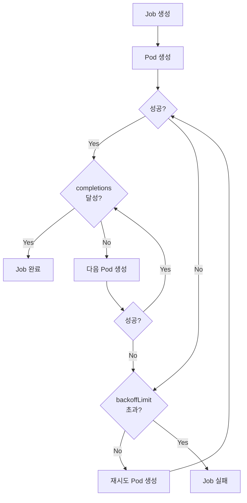
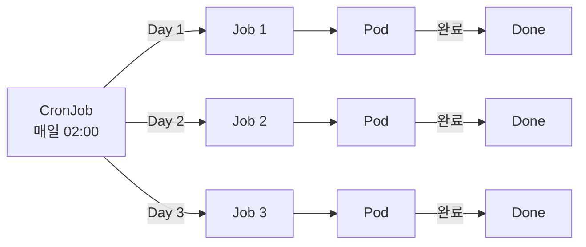

## 전체 비유: 아르바이트와 정기 청소

Job과 CronJob을 **아르바이트와 정기 청소**에 비유하면 이해하기 쉽습니다:

| 비유 | Kubernetes | 역할 |
|------|-----------|------|
| 일회성 아르바이트 | Job | 한 번 실행하고 끝나는 작업 |
| 정기 청소 스케줄 | CronJob | 주기적으로 반복 실행되는 작업 |
| 아르바이트생 3명 고용 | completions: 3 | 성공 완료해야 할 횟수 |
| 동시에 2명 투입 | parallelism: 2 | 동시에 실행할 Pod 수 |
| 최대 재시도 횟수 | backoffLimit | 실패 시 재시도 상한 |
| 작업 마감 시한 | activeDeadlineSeconds | 전체 작업 제한 시간 |

이처럼 Job은 "정해진 일을 완료하면 끝나는 작업"이고, CronJob은 "정해진 시간에 반복 실행되는 예약 작업"입니다.

---

> **대상 독자**: 배치 작업이나 정기 작업을 Kubernetes에서 실행하려는 개발자
> **선수 지식**: Pod, Deployment 개념
> **소요 시간**: 약 20분
> **이 문서를 읽으면**: Job과 CronJob의 동작 원리와 설정 방법을 이해할 수 있습니다


- Job은 지정된 횟수만큼 성공적으로 완료되면 종료되는 일회성 작업입니다
- CronJob은 cron 표현식에 따라 주기적으로 Job을 생성합니다
- backoffLimit과 activeDeadlineSeconds로 실패 처리를 제어합니다


## Job이란?

Job은 하나 이상의 Pod를 생성하여 지정된 작업을 완료하면 종료되는 리소스입니다. Deployment와 달리 Pod가 성공적으로 종료되는 것이 목표입니다.

| 특성 | Deployment | Job |
|------|-----------|-----|
| 목적 | Pod를 계속 실행 유지 | 작업 완료 후 종료 |
| Pod 종료 시 | 새 Pod 재생성 | 성공이면 완료 처리 |
| 사용 사례 | 웹 서버, API 서버 | 데이터 마이그레이션, 배치 처리 |

## Job 실행 흐름



*Job이 Pod를 생성하고, 성공 시 completions 확인, 실패 시 backoffLimit까지 재시도하는 실행 흐름을 보여줍니다.*

## Job YAML

### 기본 Job

```yaml
apiVersion: batch/v1
kind: Job
metadata:
  name: data-migration
spec:
  completions: 1        # 성공 완료 횟수
  parallelism: 1        # 동시 실행 Pod 수
  backoffLimit: 3       # 최대 재시도 횟수
  activeDeadlineSeconds: 600  # 전체 제한 시간 (초)
  template:
    spec:
      containers:
      - name: migration
        image: my-app:1.0
        command: ["python", "migrate.py"]
        env:
        - name: DB_HOST
          valueFrom:
            secretKeyRef:
              name: db-secret
              key: host
      restartPolicy: Never    # Job에서는 Never 또는 OnFailure
```

주요 필드를 설명합니다.

| 필드 | 기본값 | 설명 |
|------|--------|------|
| `completions` | 1 | 성공적으로 완료해야 할 Pod 수 |
| `parallelism` | 1 | 동시에 실행할 Pod 수 |
| `backoffLimit` | 6 | 실패 시 최대 재시도 횟수 |
| `activeDeadlineSeconds` | 없음 | Job 전체 실행 제한 시간 (초) |
| `restartPolicy` | - | `Never` 또는 `OnFailure` (Required 아님) |


- `Never`: 실패한 Pod를 두고 새 Pod 생성 (디버깅에 유용)
- `OnFailure`: 같은 Pod 내에서 컨테이너 재시작 (리소스 절약)


### 병렬 처리 Job

여러 Pod를 동시에 실행하여 작업을 빠르게 처리합니다.

```yaml
apiVersion: batch/v1
kind: Job
metadata:
  name: batch-processing
spec:
  completions: 10       # 총 10번 성공 필요
  parallelism: 3        # 동시에 3개 Pod 실행
  backoffLimit: 5
  template:
    spec:
      containers:
      - name: worker
        image: batch-worker:1.0
        command: ["./process.sh"]
      restartPolicy: Never
```

| completions | parallelism | 동작 |
|------------|-------------|------|
| 1 | 1 | 단일 Pod 실행 (기본) |
| N | 1 | N개 Pod를 순차 실행 |
| N | M | 최대 M개 Pod 동시 실행, 총 N번 성공 |
| 없음 | M | Work Queue 모드 (Pod가 스스로 종료 판단) |

## CronJob이란?

CronJob은 cron 스케줄에 따라 주기적으로 Job을 생성하는 리소스입니다.



*CronJob이 스케줄에 따라 매일 Job을 생성하고, 각 Job의 Pod가 작업을 완료하는 반복 흐름을 보여줍니다.*

## CronJob YAML

```yaml
apiVersion: batch/v1
kind: CronJob
metadata:
  name: daily-backup
spec:
  schedule: "0 2 * * *"           # 매일 새벽 2시
  concurrencyPolicy: Forbid        # 이전 Job 실행 중이면 건너뜀
  successfulJobsHistoryLimit: 3    # 성공 Job 보관 수
  failedJobsHistoryLimit: 3        # 실패 Job 보관 수
  startingDeadlineSeconds: 200     # 스케줄 시작 유예 시간
  jobTemplate:
    spec:
      backoffLimit: 2
      activeDeadlineSeconds: 3600
      template:
        spec:
          containers:
          - name: backup
            image: backup-tool:1.0
            command: ["./backup.sh"]
          restartPolicy: OnFailure
```

### Cron 표현식

```
┌───────────── 분 (0 - 59)
│ ┌───────────── 시 (0 - 23)
│ │ ┌───────────── 일 (1 - 31)
│ │ │ ┌───────────── 월 (1 - 12)
│ │ │ │ ┌───────────── 요일 (0 - 6, 일요일=0)
│ │ │ │ │
* * * * *
```

| 표현식 | 의미 |
|--------|------|
| `0 2 * * *` | 매일 새벽 2시 |
| `*/15 * * * *` | 15분마다 |
| `0 9 * * 1-5` | 평일 오전 9시 |
| `0 0 1 * *` | 매월 1일 자정 |
| `0 */6 * * *` | 6시간마다 |

### concurrencyPolicy

| 값 | 설명 |
|----|------|
| `Allow` (기본) | 이전 Job이 실행 중이어도 새 Job 생성 |
| `Forbid` | 이전 Job이 실행 중이면 새 Job 건너뜀 |
| `Replace` | 이전 Job을 취소하고 새 Job 생성 |


`Allow` 정책에서 Job 실행 시간이 스케줄 간격보다 길면 Job이 누적될 수 있습니다. 프로덕션에서는 `Forbid` 또는 `Replace`를 권장합니다.


## 재시도 정책

Job 실패 시 재시도 동작을 제어하는 설정입니다.

| 설정 | 설명 |
|------|------|
| `backoffLimit` | 실패 시 최대 재시도 횟수 (기본 6) |
| `activeDeadlineSeconds` | Job 전체 실행 시간 제한 |

재시도 간격은 지수 백오프(exponential backoff)로 증가합니다: 10초, 20초, 40초, ... 최대 6분.

```yaml
spec:
  backoffLimit: 3              # 3번 실패하면 Job 실패 처리
  activeDeadlineSeconds: 600   # 10분 초과 시 Job 강제 종료
```


두 조건 중 하나라도 만족하면 Job이 실패로 처리됩니다. `activeDeadlineSeconds`는 재시도 횟수와 무관하게 전체 시간을 제한합니다.


## 실습: Job과 CronJob 배포

### Job 실행 및 확인

```bash
# Job 생성
kubectl apply -f job.yaml

# Job 상태 확인
kubectl get jobs

# 예상 출력:
# NAME              COMPLETIONS   DURATION   AGE
# data-migration    1/1           15s        30s

# Pod 상태 확인 (Completed 상태)
kubectl get pods -l job-name=data-migration

# Job 로그 확인
kubectl logs job/data-migration
```

### CronJob 생성 및 확인

```bash
# CronJob 생성
kubectl apply -f cronjob.yaml

# CronJob 상태 확인
kubectl get cronjobs

# 예상 출력:
# NAME           SCHEDULE    SUSPEND   ACTIVE   LAST SCHEDULE
# daily-backup   0 2 * * *   False     0        <none>

# 수동으로 즉시 실행
kubectl create job --from=cronjob/daily-backup manual-backup

# 생성된 Job 확인
kubectl get jobs
```

### 실패한 Job 디버깅

```bash
# 실패한 Pod 확인
kubectl get pods -l job-name=data-migration --field-selector=status.phase=Failed

# 실패 Pod 로그 확인
kubectl logs <pod-name>

# Job 이벤트 확인
kubectl describe job data-migration
```

## 자주 사용하는 kubectl 명령어

| 명령어 | 설명 |
|--------|------|
| `kubectl get jobs` | Job 목록 |
| `kubectl get cronjobs` | CronJob 목록 |
| `kubectl describe job <name>` | Job 상세 정보 |
| `kubectl logs job/<name>` | Job 로그 |
| `kubectl delete job <name>` | Job 삭제 |
| `kubectl create job --from=cronjob/<name> <job-name>` | CronJob 수동 실행 |

---

## 다음 단계

Job과 CronJob을 이해했다면 다음 단계로 진행하세요:

| 목표 | 추천 문서 |
|------|----------|
| 네트워크 정책 | [NetworkPolicy](network-policy/) |
| 리소스 격리 | [Namespace](namespace/) |
| 접근 권한 관리 | [RBAC](rbac/) |
