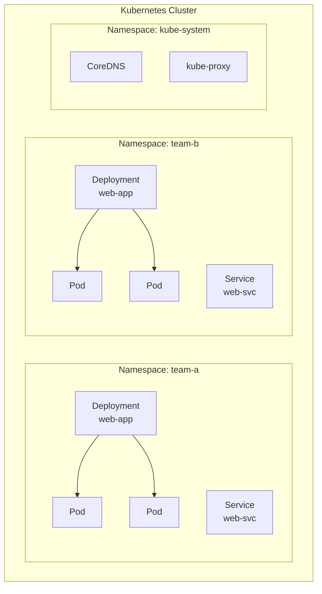
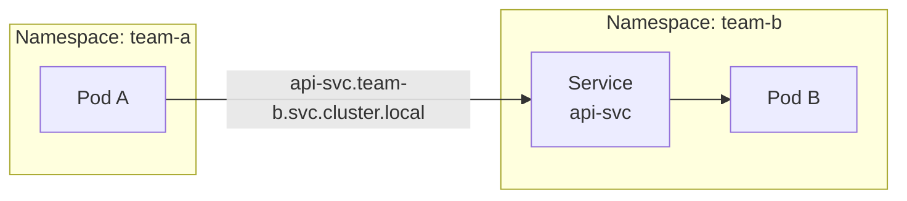

## 전체 비유: 아파트 단지의 동 구분

Namespace를 **아파트 단지의 동 구분**에 비유하면 이해하기 쉽습니다:

| 아파트 단지 비유 | Kubernetes Namespace | 역할 |
|----------------|---------------------|------|
| 101동, 102동 구분 | Namespace | 리소스를 논리적으로 분리 |
| 동별 관리비 예산 | ResourceQuota | 네임스페이스별 리소스 총량 제한 |
| 세대당 전기/수도 한도 | LimitRange | 개별 Pod/컨테이너 리소스 기본값 |
| 관리사무소 전용 구역 | kube-system | 시스템 구성요소 전용 공간 |
| 공용 게시판 구역 | kube-public | 모든 사용자 접근 가능 공간 |
| 동별 출입 카드 | RBAC + Namespace | 접근 권한 분리 |

이처럼 Namespace는 "하나의 아파트 단지에서 동별로 관리 영역을 나누는 것"과 같습니다.

---

> **대상 독자**: Kubernetes 클러스터에서 리소스를 체계적으로 관리하고 싶은 운영자
> **선수 지식**: Pod, Deployment, Service 개념
> **소요 시간**: 약 20분
> **이 문서를 읽으면**: Namespace를 활용한 멀티 테넌트 환경 구성 방법을 이해할 수 있습니다


- Namespace는 클러스터 내 리소스를 논리적으로 격리합니다
- ResourceQuota와 LimitRange로 리소스 사용량을 제한할 수 있습니다
- 팀/환경별 분리를 통해 멀티 테넌트 운영이 가능합니다


## Namespace란?

Namespace는 하나의 물리 클러스터를 여러 가상 클러스터로 나누는 메커니즘입니다. 같은 이름의 리소스도 서로 다른 Namespace에 존재할 수 있습니다.

| 기능 | 설명 |
|------|------|
| 리소스 격리 | 팀/프로젝트별 리소스 분리 |
| 이름 범위 | 같은 이름의 리소스를 다른 Namespace에 생성 가능 |
| 접근 제어 | RBAC과 결합하여 권한 분리 |
| 리소스 제한 | ResourceQuota로 사용량 상한 설정 |

## Namespace 격리 구조



각 Namespace는 독립적인 공간이므로, `team-a`와 `team-b`에 동일한 이름의 `web-app` Deployment가 존재할 수 있습니다.

## 기본 Namespace

Kubernetes 클러스터를 생성하면 다음 Namespace가 자동으로 만들어집니다.

| Namespace | 용도 |
|-----------|------|
| `default` | 별도 Namespace를 지정하지 않으면 사용되는 기본 공간 |
| `kube-system` | Kubernetes 시스템 구성요소 (CoreDNS, kube-proxy 등) |
| `kube-public` | 모든 사용자가 읽을 수 있는 공용 리소스 |
| `kube-node-lease` | 노드 하트비트용 Lease 오브젝트 저장 |


`kube-system` Namespace의 리소스를 임의로 수정하거나 삭제하면 클러스터가 정상 동작하지 않을 수 있습니다.


## Namespace 생성과 사용

### Namespace 생성

```yaml
apiVersion: v1
kind: Namespace
metadata:
  name: team-a
  labels:
    team: a
    environment: production
```

```bash
# YAML로 생성
kubectl apply -f namespace.yaml

# 또는 명령어로 생성
kubectl create namespace team-a
```

### Namespace 지정하여 리소스 생성

```yaml
apiVersion: apps/v1
kind: Deployment
metadata:
  name: web-app
  namespace: team-a    # Namespace 지정
spec:
  replicas: 2
  selector:
    matchLabels:
      app: web-app
  template:
    metadata:
      labels:
        app: web-app
    spec:
      containers:
      - name: app
        image: nginx:1.25
        ports:
        - containerPort: 80
```

### kubectl에서 Namespace 지정

```bash
# 특정 Namespace의 Pod 조회
kubectl get pods -n team-a

# 모든 Namespace의 Pod 조회
kubectl get pods --all-namespaces

# 기본 Namespace 변경
kubectl config set-context --current --namespace=team-a
```

## ResourceQuota

ResourceQuota는 Namespace 전체의 리소스 사용량을 제한합니다.

```yaml
apiVersion: v1
kind: ResourceQuota
metadata:
  name: team-a-quota
  namespace: team-a
spec:
  hard:
    requests.cpu: "4"
    requests.memory: 8Gi
    limits.cpu: "8"
    limits.memory: 16Gi
    pods: "20"
    services: "10"
    persistentvolumeclaims: "5"
```

| 항목 | 설명 |
|------|------|
| `requests.cpu` / `requests.memory` | 전체 리소스 요청 합계 상한 |
| `limits.cpu` / `limits.memory` | 전체 리소스 제한 합계 상한 |
| `pods` | 생성 가능한 Pod 수 |
| `services` | 생성 가능한 Service 수 |
| `persistentvolumeclaims` | 생성 가능한 PVC 수 |

```bash
# ResourceQuota 확인
kubectl describe resourcequota team-a-quota -n team-a
```

## LimitRange

LimitRange는 Namespace 내 개별 Pod/컨테이너의 리소스 기본값과 범위를 설정합니다.

```yaml
apiVersion: v1
kind: LimitRange
metadata:
  name: team-a-limits
  namespace: team-a
spec:
  limits:
  - type: Container
    default:
      cpu: "500m"
      memory: "256Mi"
    defaultRequest:
      cpu: "100m"
      memory: "128Mi"
    max:
      cpu: "2"
      memory: "2Gi"
    min:
      cpu: "50m"
      memory: "64Mi"
```

| 필드 | 설명 |
|------|------|
| `default` | limits 미지정 시 자동 적용되는 기본 제한값 |
| `defaultRequest` | requests 미지정 시 자동 적용되는 기본 요청값 |
| `max` | 컨테이너가 설정할 수 있는 최대값 |
| `min` | 컨테이너가 설정해야 하는 최소값 |


ResourceQuota는 Namespace 전체 리소스 총량을 제한하고, LimitRange는 개별 컨테이너의 리소스 범위를 제한합니다. 둘을 함께 사용하면 효과적으로 리소스를 관리할 수 있습니다.


## 네임스페이스 간 통신

같은 클러스터 내 다른 Namespace의 Service에 접근하려면 FQDN(Fully Qualified Domain Name)을 사용합니다.

```
<service-name>.<namespace>.svc.cluster.local
```



| 접근 방식 | 예시 | 설명 |
|-----------|------|------|
| 같은 Namespace | `api-svc` | Service 이름만으로 접근 |
| 다른 Namespace | `api-svc.team-b` | Namespace 이름 추가 |
| 전체 FQDN | `api-svc.team-b.svc.cluster.local` | 완전한 DNS 이름 |

## 실습: Namespace 기반 멀티 테넌트 구성

### Namespace와 리소스 제한 설정

```bash
# Namespace 생성
kubectl create namespace team-a

# ResourceQuota 적용
kubectl apply -f resourcequota.yaml

# LimitRange 적용
kubectl apply -f limitrange.yaml

# 설정 확인
kubectl describe namespace team-a
```

### 리소스 배포 및 확인

```bash
# team-a Namespace에 Deployment 생성
kubectl apply -f deployment.yaml -n team-a

# 리소스 사용량 확인
kubectl describe resourcequota team-a-quota -n team-a

# 예상 출력:
# Name:                   team-a-quota
# Resource                Used    Hard
# --------                ----    ----
# limits.cpu              1       8
# limits.memory           512Mi   16Gi
# pods                    2       20
# requests.cpu            200m    4
# requests.memory         256Mi   8Gi
```

## 자주 사용하는 kubectl 명령어

| 명령어 | 설명 |
|--------|------|
| `kubectl get namespaces` | Namespace 목록 |
| `kubectl create namespace <name>` | Namespace 생성 |
| `kubectl delete namespace <name>` | Namespace 삭제 (내부 리소스 모두 삭제) |
| `kubectl get all -n <namespace>` | 특정 Namespace 리소스 조회 |
| `kubectl describe resourcequota -n <namespace>` | 리소스 사용량 확인 |


Namespace를 삭제하면 해당 Namespace 내 모든 리소스(Pod, Service, ConfigMap 등)가 함께 삭제됩니다. 반드시 확인 후 삭제하세요.


---

## 다음 단계

Namespace를 이해했다면 다음 단계로 진행하세요:

| 목표 | 추천 문서 |
|------|----------|
| 상태 유지 워크로드 | [StatefulSet](statefulset/) |
| 접근 권한 관리 | [RBAC](rbac/) |
| 네트워크 정책 | [NetworkPolicy](network-policy/) |
