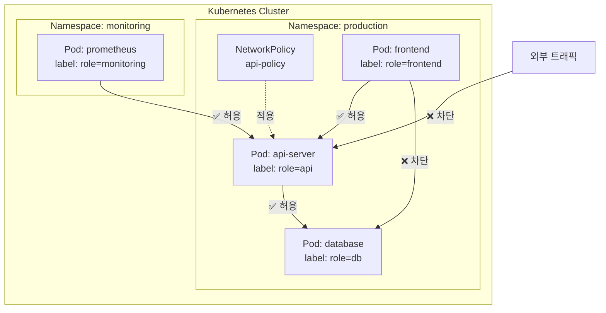

## 전체 비유: 아파트 단지 방화벽

NetworkPolicy를 **아파트 단지의 출입 통제 시스템**에 비유하면 이해하기 쉽습니다:

| 아파트 단지 비유 | Kubernetes NetworkPolicy | 역할 |
|----------------|------------------------|------|
| 동별 출입 통제 규칙 | NetworkPolicy | Pod 간 트래픽 허용/차단 정의 |
| "101동 주민만 출입 허용" | podSelector | 정책 적용 대상 Pod 선택 |
| "배달원은 로비까지만" | Ingress 규칙 | 들어오는 트래픽 제어 |
| "택배 발송은 경비실 경유" | Egress 규칙 | 나가는 트래픽 제어 |
| 경비 시스템 (CCTV, 카드키) | CNI 플러그인 | 정책을 실제로 적용하는 네트워크 엔진 |
| 규칙 없으면 자유 출입 | 기본 Allow All | NetworkPolicy 미설정 시 모든 트래픽 허용 |

이처럼 NetworkPolicy는 "어떤 Pod가 어떤 Pod와 통신할 수 있는지"를 제어하는 방화벽 규칙과 같습니다.

---

> **대상 독자**: Kubernetes 클러스터의 네트워크 보안을 강화하려는 운영자
> **선수 지식**: Pod, Service, Namespace, Label 개념
> **소요 시간**: 약 20분
> **이 문서를 읽으면**: NetworkPolicy로 Pod 간 트래픽을 제어하는 방법을 이해할 수 있습니다


- NetworkPolicy는 Pod 간 네트워크 트래픽을 제어하는 방화벽 규칙입니다
- Ingress(인바운드)와 Egress(아웃바운드) 트래픽을 각각 제어합니다
- CNI 플러그인(Calico, Cilium 등)이 설치되어야 정책이 적용됩니다


## NetworkPolicy란?

NetworkPolicy는 Pod 수준의 방화벽 규칙을 정의하는 리소스입니다. 기본적으로 Kubernetes Pod는 모든 트래픽을 허용하지만, NetworkPolicy를 설정하면 허용된 트래픽만 통과시킬 수 있습니다.

| 특성 | 설명 |
|------|------|
| 기본 동작 | NetworkPolicy 미설정 시 모든 트래픽 허용 |
| 적용 대상 | podSelector로 선택된 Pod |
| 방향 | Ingress(수신), Egress(발신) 각각 설정 |
| 합산 규칙 | 여러 NetworkPolicy는 OR 조건으로 합산 |

## 네트워크 정책 적용 흐름



## 기본 정책: Allow All vs Deny All

### 기본 상태 (Allow All)

NetworkPolicy가 없으면 모든 Pod 간 통신이 허용됩니다.

### Deny All Ingress

모든 인바운드 트래픽을 차단하는 기본 정책입니다.

```yaml
apiVersion: networking.k8s.io/v1
kind: NetworkPolicy
metadata:
  name: deny-all-ingress
  namespace: production
spec:
  podSelector: {}      # 모든 Pod에 적용
  policyTypes:
  - Ingress
  # ingress 규칙 없음 = 모든 인바운드 차단
```

### Deny All Egress

모든 아웃바운드 트래픽을 차단하는 기본 정책입니다.

```yaml
apiVersion: networking.k8s.io/v1
kind: NetworkPolicy
metadata:
  name: deny-all-egress
  namespace: production
spec:
  podSelector: {}
  policyTypes:
  - Egress
  # egress 규칙 없음 = 모든 아웃바운드 차단
```


보안을 위해 먼저 Deny All 정책을 적용한 뒤, 필요한 통신만 허용하는 NetworkPolicy를 추가하는 것이 좋습니다. 이것이 Zero Trust 네트워크의 기본 원칙입니다.


## Ingress 규칙

들어오는 트래픽을 제어합니다.

```yaml
apiVersion: networking.k8s.io/v1
kind: NetworkPolicy
metadata:
  name: api-ingress
  namespace: production
spec:
  podSelector:
    matchLabels:
      role: api          # 이 정책이 적용되는 Pod
  policyTypes:
  - Ingress
  ingress:
  - from:
    - podSelector:       # 같은 Namespace의 특정 Pod
        matchLabels:
          role: frontend
    - namespaceSelector:  # 다른 Namespace의 특정 Pod
        matchLabels:
          name: monitoring
      podSelector:
        matchLabels:
          role: prometheus
    ports:
    - protocol: TCP
      port: 8080
```

### Selector 조합 규칙

`from` 배열의 각 항목은 OR 조건이고, 하나의 항목 안에서 podSelector와 namespaceSelector는 AND 조건입니다.

```yaml
ingress:
- from:
  # 규칙 1: 같은 Namespace의 frontend Pod (OR)
  - podSelector:
      matchLabels:
        role: frontend
  # 규칙 2: monitoring Namespace의 prometheus Pod (AND)
  - namespaceSelector:
      matchLabels:
        name: monitoring
    podSelector:
      matchLabels:
        role: prometheus
```

| 조합 | 의미 |
|------|------|
| `podSelector`만 | 같은 Namespace 내 특정 Pod |
| `namespaceSelector`만 | 특정 Namespace의 모든 Pod |
| 둘 다 (같은 항목) | 특정 Namespace의 특정 Pod (AND) |
| 별도 항목 | 각각 독립적으로 허용 (OR) |


`podSelector`와 `namespaceSelector`가 같은 배열 항목(`-`)에 있으면 AND 조건, 다른 항목이면 OR 조건입니다. 들여쓰기에 주의하세요.


## Egress 규칙

나가는 트래픽을 제어합니다.

```yaml
apiVersion: networking.k8s.io/v1
kind: NetworkPolicy
metadata:
  name: api-egress
  namespace: production
spec:
  podSelector:
    matchLabels:
      role: api
  policyTypes:
  - Egress
  egress:
  - to:
    - podSelector:
        matchLabels:
          role: db
    ports:
    - protocol: TCP
      port: 5432
  - to:                        # DNS 허용 (필수)
    - namespaceSelector: {}
    ports:
    - protocol: UDP
      port: 53
    - protocol: TCP
      port: 53
```


Egress를 제한할 때는 반드시 DNS(포트 53) 트래픽을 허용해야 합니다. 그렇지 않으면 Service 이름을 통한 통신이 불가능합니다.


## 복합 정책 예시

Ingress와 Egress를 함께 설정하는 예시입니다.

```yaml
apiVersion: networking.k8s.io/v1
kind: NetworkPolicy
metadata:
  name: db-policy
  namespace: production
spec:
  podSelector:
    matchLabels:
      role: db
  policyTypes:
  - Ingress
  - Egress
  ingress:
  - from:
    - podSelector:
        matchLabels:
          role: api
    ports:
    - protocol: TCP
      port: 5432
  egress:
  - to:                        # DNS만 허용
    - namespaceSelector: {}
    ports:
    - protocol: UDP
      port: 53
    - protocol: TCP
      port: 53
```

이 정책을 요약하면 다음과 같습니다.

| 방향 | 허용 대상 | 포트 |
|------|----------|------|
| Ingress | role=api Pod만 | TCP 5432 |
| Egress | DNS만 | UDP/TCP 53 |

## CNI 플러그인 의존성

NetworkPolicy는 CNI(Container Network Interface) 플러그인이 지원해야 실제로 동작합니다.

| CNI 플러그인 | NetworkPolicy 지원 | 특징 |
|-------------|-------------------|------|
| Calico | O | 가장 널리 사용, BGP 기반 |
| Cilium | O | eBPF 기반, L7 정책 지원 |
| Weave Net | O | 간편한 설정 |
| Flannel | X | NetworkPolicy 미지원 |
| AWS VPC CNI | 부분 지원 | Calico 추가 설치 필요 |


Flannel과 같이 NetworkPolicy를 지원하지 않는 CNI를 사용하면, NetworkPolicy 리소스를 생성해도 실제 트래픽 제어가 적용되지 않습니다. 반드시 사용 중인 CNI의 지원 여부를 확인하세요.


## 실습: NetworkPolicy 설정

### Default Deny 정책 적용

```bash
# Deny All Ingress 적용
kubectl apply -f deny-all-ingress.yaml

# 확인
kubectl get networkpolicy -n production
```

### 허용 규칙 추가

```bash
# API Pod 정책 적용
kubectl apply -f api-ingress.yaml

# 정책 확인
kubectl describe networkpolicy api-ingress -n production
```

### 연결 테스트

```bash
# frontend Pod에서 API 접근 테스트 (허용됨)
kubectl exec -n production frontend-pod -- curl -s http://api-svc:8080/health
# 200 OK

# 다른 Pod에서 API 접근 테스트 (차단됨)
kubectl exec -n production other-pod -- curl -s --connect-timeout 3 http://api-svc:8080/health
# curl: (28) Connection timed out
```

## 자주 사용하는 kubectl 명령어

| 명령어 | 설명 |
|--------|------|
| `kubectl get networkpolicy -n <namespace>` | NetworkPolicy 목록 |
| `kubectl describe networkpolicy <name> -n <namespace>` | 상세 정보 |
| `kubectl delete networkpolicy <name> -n <namespace>` | 정책 삭제 |
| `kubectl exec <pod> -- curl <target>` | 연결 테스트 |

---

## 다음 단계

NetworkPolicy를 이해했다면 다음 단계로 진행하세요:

| 목표 | 추천 문서 |
|------|----------|
| 리소스 격리 | [Namespace](namespace/) |
| 접근 권한 관리 | [RBAC](rbac/) |
| 상태 유지 워크로드 | [StatefulSet](statefulset/) |
