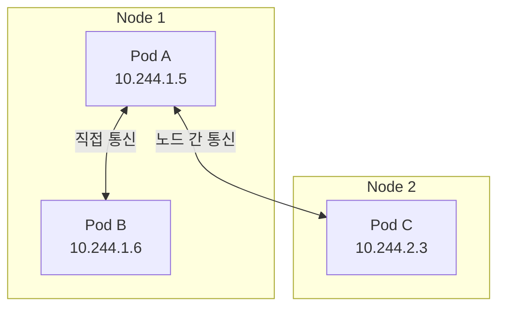
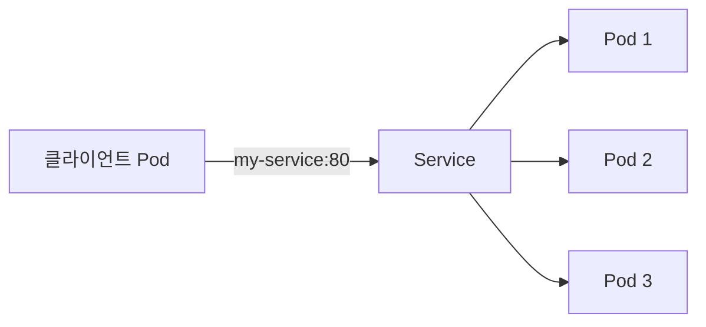
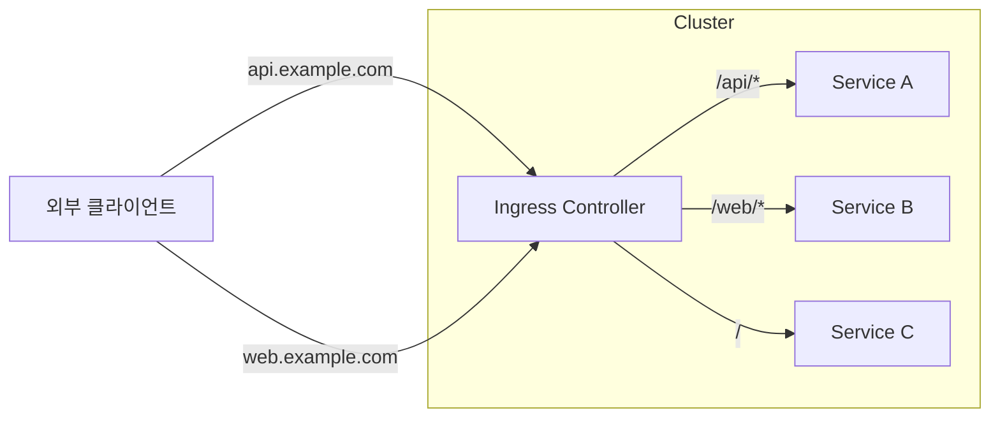
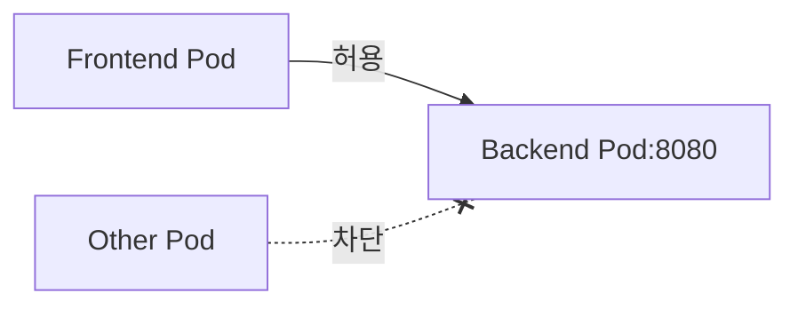

> **대상 독자**: Kubernetes 네트워크 구조를 이해하고 싶은 백엔드 개발자
> **선수 지식**: Service 개념, 기본 네트워크 지식 (IP, 포트, DNS)
> **이 문서를 읽으면**: Kubernetes의 네트워크 모델과 Ingress를 이해할 수 있습니다


- 모든 Pod는 고유한 IP를 가지며, 다른 Pod와 직접 통신할 수 있습니다
- Service는 Pod 집합에 대한 안정적인 접근점을 제공합니다
- Ingress는 클러스터 외부에서 HTTP/HTTPS 트래픽을 라우팅합니다


## Kubernetes 네트워크 모델

Kubernetes 네트워크는 세 가지 기본 원칙을 따릅니다.

| 원칙 | 설명 |
|------|------|
| Pod-to-Pod | 모든 Pod는 NAT 없이 다른 Pod와 통신 가능 |
| Node-to-Pod | 모든 노드는 NAT 없이 모든 Pod와 통신 가능 |
| Pod IP | Pod가 보는 자신의 IP와 다른 Pod가 보는 IP가 동일 |



## 클러스터 내부 통신

### Pod 간 통신

같은 클러스터 내의 Pod들은 IP로 직접 통신할 수 있습니다.

```bash
# Pod A에서 Pod C로 직접 통신
kubectl exec pod-a -- curl http://10.244.2.3:8080
```

하지만 Pod IP는 변경될 수 있으므로, 실제로는 Service를 사용합니다.

### Service를 통한 통신



Service DNS를 사용하면 Pod IP 변경에 영향받지 않습니다.

```yaml
# 애플리케이션에서 Service 이름 사용
spring:
  datasource:
    url: jdbc:postgresql://postgres-service:5432/mydb
```

## 외부 노출 방법 비교

클러스터 외부에서 애플리케이션에 접근하는 방법을 비교합니다.

| 방법 | 사용 사례 | 특징 |
|------|----------|------|
| NodePort | 개발/테스트 | 간단하지만 포트 제한(30000-32767) |
| LoadBalancer | 단일 서비스 외부 노출 | 클라우드 LB 사용, 비용 발생 |
| Ingress | 여러 서비스 HTTP 라우팅 | 도메인/경로 기반 라우팅 |

## Ingress

Ingress는 클러스터 외부에서 내부 Service로의 HTTP/HTTPS 트래픽을 관리합니다.

### Ingress vs LoadBalancer

| 항목 | LoadBalancer | Ingress |
|------|--------------|---------|
| 대상 | 단일 Service | 여러 Service |
| 프로토콜 | TCP/UDP | HTTP/HTTPS |
| 라우팅 | 없음 | 호스트/경로 기반 |
| TLS | Service별 설정 | 중앙 관리 |
| 비용 | Service당 LB 비용 | LB 하나로 여러 서비스 |



### Ingress Controller

Ingress 리소스만으로는 동작하지 않습니다. Ingress Controller가 필요합니다.

| 컨트롤러 | 특징 |
|----------|------|
| NGINX Ingress | 가장 널리 사용, 커뮤니티 지원 |
| Traefik | 자동 설정, Let's Encrypt 통합 |
| AWS ALB Ingress | AWS ALB와 통합 |
| GKE Ingress | GCP HTTP(S) LB와 통합 |

### Ingress 리소스 정의

```yaml
apiVersion: networking.k8s.io/v1
kind: Ingress
metadata:
  name: my-ingress
  annotations:
    nginx.ingress.kubernetes.io/rewrite-target: /
spec:
  ingressClassName: nginx
  rules:
  - host: api.example.com
    http:
      paths:
      - path: /users
        pathType: Prefix
        backend:
          service:
            name: user-service
            port:
              number: 80
      - path: /orders
        pathType: Prefix
        backend:
          service:
            name: order-service
            port:
              number: 80
  - host: web.example.com
    http:
      paths:
      - path: /
        pathType: Prefix
        backend:
          service:
            name: web-service
            port:
              number: 80
```

주요 필드를 설명합니다.

| 필드 | 설명 |
|------|------|
| ingressClassName | 사용할 Ingress Controller |
| rules[].host | 라우팅할 도메인 |
| rules[].http.paths[] | 경로별 라우팅 규칙 |
| pathType | Exact(정확히 일치) 또는 Prefix(접두사) |
| backend.service | 트래픽을 전달할 Service |

### TLS 설정

HTTPS를 위한 TLS 설정입니다.

```yaml
apiVersion: networking.k8s.io/v1
kind: Ingress
metadata:
  name: tls-ingress
spec:
  ingressClassName: nginx
  tls:
  - hosts:
    - api.example.com
    secretName: api-tls-secret
  rules:
  - host: api.example.com
    http:
      paths:
      - path: /
        pathType: Prefix
        backend:
          service:
            name: api-service
            port:
              number: 80
```

TLS Secret 생성은 다음과 같이 합니다.

```bash
kubectl create secret tls api-tls-secret \
  --cert=path/to/cert.crt \
  --key=path/to/cert.key
```

## NetworkPolicy

NetworkPolicy는 Pod 간 트래픽을 제어합니다. 기본적으로 모든 Pod는 서로 통신할 수 있지만, NetworkPolicy로 제한할 수 있습니다.

### 기본 격리

```yaml
apiVersion: networking.k8s.io/v1
kind: NetworkPolicy
metadata:
  name: deny-all
spec:
  podSelector: {}  # 모든 Pod에 적용
  policyTypes:
  - Ingress
  - Egress
```

이 정책이 적용되면 해당 네임스페이스의 모든 Pod는 트래픽이 차단됩니다.

### 특정 트래픽 허용

```yaml
apiVersion: networking.k8s.io/v1
kind: NetworkPolicy
metadata:
  name: allow-frontend
spec:
  podSelector:
    matchLabels:
      app: backend
  policyTypes:
  - Ingress
  ingress:
  - from:
    - podSelector:
        matchLabels:
          app: frontend
    ports:
    - protocol: TCP
      port: 8080
```

이 정책은 `app: frontend` 레이블을 가진 Pod에서 `app: backend` Pod의 8080 포트로의 접근만 허용합니다.



## 실습: Ingress 설정

### Minikube에서 Ingress 활성화

```bash
# NGINX Ingress Controller 활성화
minikube addons enable ingress

# 상태 확인
kubectl get pods -n ingress-nginx
```

### 테스트 애플리케이션 배포

```bash
# 두 개의 Deployment 생성
kubectl create deployment web --image=nginx
kubectl create deployment api --image=httpd

# Service 생성
kubectl expose deployment web --port=80
kubectl expose deployment api --port=80
```

### Ingress 리소스 생성

```yaml
apiVersion: networking.k8s.io/v1
kind: Ingress
metadata:
  name: test-ingress
  annotations:
    nginx.ingress.kubernetes.io/rewrite-target: /
spec:
  ingressClassName: nginx
  rules:
  - host: test.local
    http:
      paths:
      - path: /web
        pathType: Prefix
        backend:
          service:
            name: web
            port:
              number: 80
      - path: /api
        pathType: Prefix
        backend:
          service:
            name: api
            port:
              number: 80
```

### 테스트

```bash
# Minikube IP 확인
minikube ip

# /etc/hosts에 추가 (Linux/macOS)
echo "$(minikube ip) test.local" | sudo tee -a /etc/hosts

# 테스트
curl http://test.local/web
curl http://test.local/api
```

---

## 다음 단계

네트워킹을 이해했다면 다음 단계로 진행하세요:

| 목표 | 추천 문서 |
|------|----------|
| 리소스 설정 | [리소스 관리](../resources/) |
| 자동 스케일링 | [스케일링](../scaling/) |
| 실제 배포 실습 | [Spring Boot 배포](../../examples/spring-boot/) |
