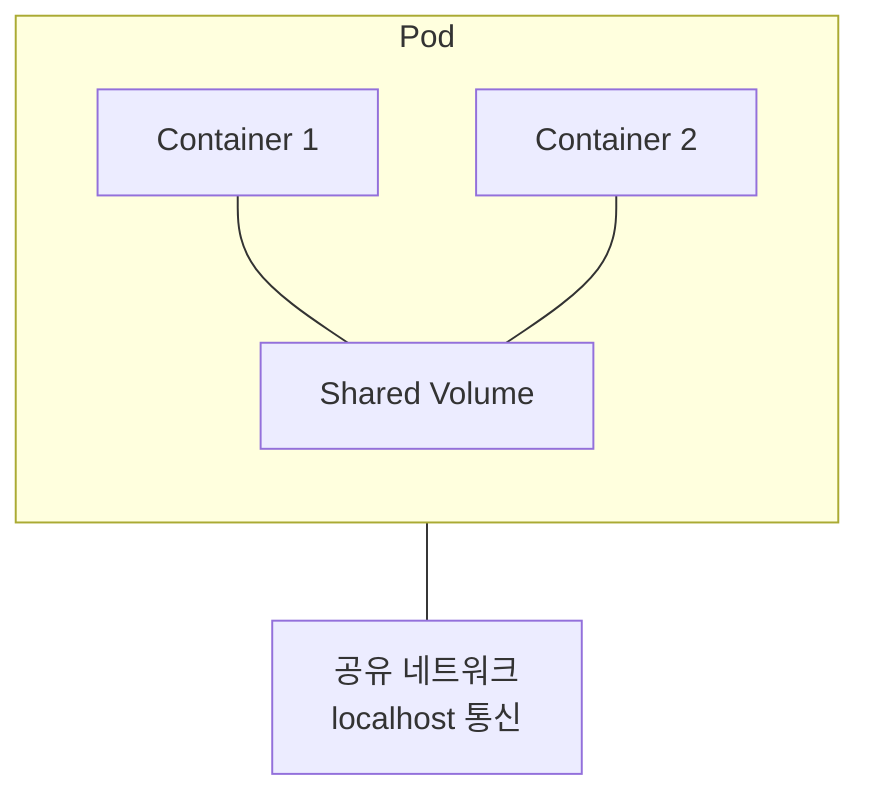
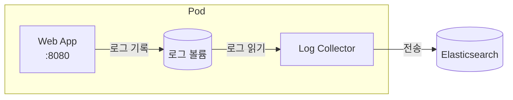
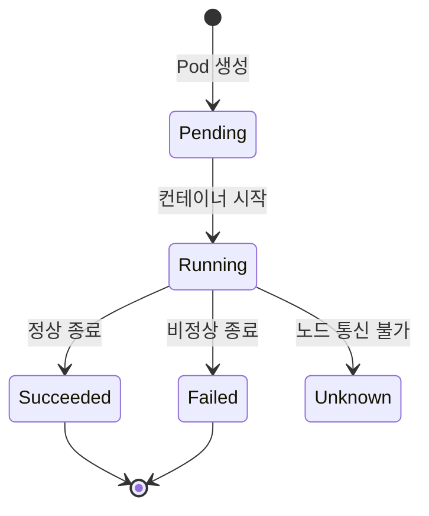
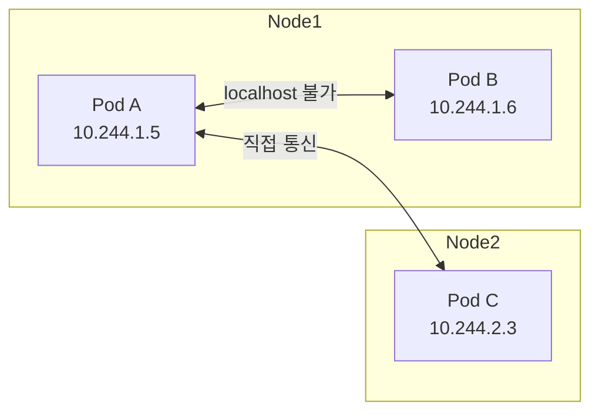

## 전체 비유: 아파트 한 세대

Pod를 **아파트 한 세대**에 비유하면 이해하기 쉽습니다:

| 아파트 세대 비유 | Kubernetes Pod | 역할 |
|----------------|----------------|------|
| 아파트 한 세대 | Pod | 최소 거주/배포 단위 |
| 세대 내 거주자들 | Containers | 함께 살며 자원 공유 |
| 세대 현관문 | Pod IP | 외부에서 접근하는 주소 |
| 거실/주방 공유 | Network 공유 | 같은 Pod 내 localhost 통신 |
| 공용 창고 | Volume | 거주자들이 함께 사용하는 저장 공간 |
| 각자 방 | Container 격리 | 개별 파일시스템, 프로세스 |
| 이사 시 함께 이동 | 공동 생명주기 | Pod 삭제 시 모든 컨테이너 종료 |
| 원룸 vs 투룸 | 단일/멀티 컨테이너 | 대부분 원룸(1 컨테이너) 권장 |

이처럼 Pod는 "한 세대에 여러 사람이 함께 살면서 주방과 거실을 공유"하는 것과 같습니다.

---

> **대상 독자**: Kubernetes Pod 개념을 이해하고 싶은 백엔드 개발자
> **선수 지식**: Docker 컨테이너 기본 개념
> **소요 시간**: 약 25-30분
> **이 문서를 읽으면**: Pod가 무엇인지, 왜 컨테이너 대신 Pod를 사용하는지 이해할 수 있습니다


- Pod는 Kubernetes의 최소 배포 단위입니다
- Pod는 하나 이상의 컨테이너를 포함하며, 컨테이너들은 네트워크와 스토리지를 공유합니다
- 대부분의 경우 Pod에 컨테이너 1개만 포함합니다


## Pod란?

Pod는 Kubernetes에서 생성하고 관리할 수 있는 가장 작은 배포 단위입니다. Docker에서는 컨테이너가 최소 단위지만, Kubernetes에서는 Pod가 최소 단위입니다.



Pod 내의 컨테이너들이 공유하는 것은 다음과 같습니다.

| 공유 리소스 | 설명 |
|-------------|------|
| 네트워크 | 같은 IP 주소, localhost로 통신 가능 |
| 스토리지 | Volume을 마운트하여 데이터 공유 |
| IPC | 프로세스 간 통신 네임스페이스 공유 |

반면 컨테이너별로 격리되는 것도 있습니다.

| 격리 리소스 | 설명 |
|-------------|------|
| 파일시스템 | 각 컨테이너는 자체 파일시스템 보유 |
| 프로세스 | 각 컨테이너는 독립된 프로세스 공간 |
| CPU/메모리 | 각 컨테이너별 리소스 제한 설정 가능 |

## 왜 컨테이너가 아닌 Pod인가?

Docker의 컨테이너와 Kubernetes의 Pod는 어떻게 다를까요?

| 관점 | Docker 컨테이너 | Kubernetes Pod |
|------|----------------|----------------|
| 구성 | 단일 프로세스 권장 | 관련 컨테이너 그룹 |
| 네트워크 | 각자 IP 할당 | Pod당 하나의 IP |
| 스케일링 | 개별 스케일링 | Pod 단위 스케일링 |
| 배포 | 개별 배포 | 함께 배포, 함께 종료 |

Pod를 사용하는 이유는 **밀접하게 연관된 컨테이너들을 하나의 단위로 관리**하기 위해서입니다.

### 예시: 웹 애플리케이션과 로그 수집



이 경우 Web App과 Log Collector는 다음과 같은 이유로 같은 Pod에 있어야 합니다.

- 같은 노드에서 실행되어야 함 (로그 파일 공유)
- 함께 시작하고 함께 종료되어야 함
- 스케일 아웃 시 함께 복제되어야 함

## Pod YAML 구조

기본적인 Pod 정의를 살펴봅니다.

```yaml
apiVersion: v1
kind: Pod
metadata:
  name: my-app
  labels:
    app: my-app
    version: v1
spec:
  containers:
  - name: app
    image: nginx:1.25
    ports:
    - containerPort: 80
    resources:
      requests:
        memory: "128Mi"
        cpu: "100m"
      limits:
        memory: "256Mi"
        cpu: "200m"
```

각 필드의 의미는 다음과 같습니다.

| 필드 | 설명 |
|------|------|
| `apiVersion` | 사용할 API 버전 (Pod는 v1) |
| `kind` | 리소스 종류 |
| `metadata.name` | Pod 이름 (네임스페이스 내 고유) |
| `metadata.labels` | Pod를 식별하는 레이블 |
| `spec.containers` | 컨테이너 목록 |
| `resources.requests` | 최소 필요 리소스 (스케줄링 기준) |
| `resources.limits` | 최대 사용 가능 리소스 |

## Pod 생명주기

Pod는 생성부터 종료까지 여러 단계를 거칩니다.



각 단계를 설명하면 다음과 같습니다.

| 단계 | 설명 | 일반적인 원인 |
|------|------|--------------|
| Pending | Pod가 생성되었지만 컨테이너가 아직 시작되지 않음 | 이미지 다운로드 중, 노드 스케줄링 중 |
| Running | 모든 컨테이너가 생성되고 최소 하나가 실행 중 | 정상 상태 |
| Succeeded | 모든 컨테이너가 성공적으로 종료 | Job, CronJob 완료 |
| Failed | 모든 컨테이너가 종료되고 최소 하나가 실패 | 애플리케이션 오류 |
| Unknown | Pod 상태를 확인할 수 없음 | 노드 네트워크 문제 |

### 컨테이너 상태

Pod 내 각 컨테이너도 상태를 가집니다.

| 상태 | 설명 |
|------|------|
| Waiting | 컨테이너 시작 대기 중 (이미지 pull 등) |
| Running | 컨테이너 실행 중 |
| Terminated | 컨테이너 종료됨 (성공 또는 실패) |

```bash
# 컨테이너 상태 확인
kubectl describe pod my-app
```

## 멀티 컨테이너 패턴

Pod에 여러 컨테이너를 포함하는 대표적인 패턴들입니다.

### Sidecar 패턴

메인 컨테이너를 보조하는 컨테이너를 함께 실행합니다.

```yaml
apiVersion: v1
kind: Pod
metadata:
  name: web-with-logging
spec:
  containers:
  - name: web
    image: nginx:1.25
    volumeMounts:
    - name: logs
      mountPath: /var/log/nginx
  - name: log-forwarder
    image: fluent/fluentd:v1.16
    volumeMounts:
    - name: logs
      mountPath: /var/log/nginx
      readOnly: true
  volumes:
  - name: logs
    emptyDir: {}
```

| 컨테이너 | 역할 |
|----------|------|
| web | 메인 애플리케이션, 로그 생성 |
| log-forwarder | 로그 수집 및 외부 전송 |

Sidecar 패턴의 활용 사례는 다음과 같습니다.

- 로그 수집 (Fluentd, Filebeat)
- 프록시 (Envoy, Istio)
- 설정 동기화 (Git-sync)

### Init Container 패턴

메인 컨테이너 실행 전에 초기화 작업을 수행합니다.

```yaml
apiVersion: v1
kind: Pod
metadata:
  name: app-with-init
spec:
  initContainers:
  - name: init-db-check
    image: busybox:1.36
    command: ['sh', '-c', 'until nc -z db-service 5432; do sleep 2; done']
  containers:
  - name: app
    image: my-app:1.0
```

Init Container의 특징은 다음과 같습니다.

| 특징 | 설명 |
|------|------|
| 순차 실행 | 여러 Init Container는 순서대로 실행 |
| 완료 필수 | 모든 Init Container가 성공해야 메인 컨테이너 시작 |
| 재시도 | 실패 시 성공할 때까지 재시도 |

활용 사례는 다음과 같습니다.

- 의존 서비스 대기 (DB, 캐시 등)
- 설정 파일 생성
- 데이터 다운로드

## Pod 네트워킹

Pod 네트워킹의 핵심 개념을 이해합니다.

### Pod IP

각 Pod는 클러스터 내에서 고유한 IP를 할당받습니다.



네트워킹 규칙은 다음과 같습니다.

| 규칙 | 설명 |
|------|------|
| Pod 간 통신 | 같은 클러스터 내 모든 Pod는 NAT 없이 통신 |
| 노드 간 통신 | 다른 노드의 Pod도 IP로 직접 통신 |
| Pod 내 통신 | 같은 Pod의 컨테이너는 localhost로 통신 |

### 포트 충돌

같은 Pod 내 컨테이너는 동일한 포트를 사용할 수 없습니다.

```yaml
# 잘못된 예시 - 포트 충돌
spec:
  containers:
  - name: app1
    ports:
    - containerPort: 8080  # 충돌!
  - name: app2
    ports:
    - containerPort: 8080  # 충돌!
```

```yaml
# 올바른 예시
spec:
  containers:
  - name: app1
    ports:
    - containerPort: 8080
  - name: app2
    ports:
    - containerPort: 8081  # 다른 포트 사용
```

## 실습: Pod 생성과 관리

### Pod 생성

```bash
# YAML 파일로 생성
kubectl apply -f pod.yaml

# 명령형으로 빠르게 생성 (테스트용)
kubectl run nginx --image=nginx:1.25
```

### Pod 상태 확인

```bash
# Pod 목록
kubectl get pods

# 상세 정보
kubectl describe pod nginx

# 로그 확인
kubectl logs nginx

# 멀티 컨테이너 Pod의 특정 컨테이너 로그
kubectl logs nginx -c sidecar
```

### Pod 접속

```bash
# 컨테이너 셸 접속
kubectl exec -it nginx -- /bin/bash

# 특정 컨테이너 접속
kubectl exec -it nginx -c sidecar -- /bin/sh

# 명령 실행
kubectl exec nginx -- cat /etc/nginx/nginx.conf
```

### Pod 삭제

```bash
# 단일 Pod 삭제
kubectl delete pod nginx

# YAML 파일로 삭제
kubectl delete -f pod.yaml

# 강제 삭제 (주의 필요)
kubectl delete pod nginx --force --grace-period=0
```

## Pod를 직접 사용하지 않는 이유

실제 운영에서는 Pod를 직접 생성하지 않습니다.

| Pod 직접 사용 | Deployment 사용 |
|---------------|-----------------|
| Pod 삭제 시 복구 안 됨 | 자동 복구 |
| 업데이트 시 수동 재생성 | 롤링 업데이트 |
| 스케일링 불가 | replicas로 스케일링 |
| 노드 장애 시 손실 | 다른 노드에 재배치 |

따라서 실제로는 Deployment, StatefulSet, DaemonSet 등의 워크로드 리소스를 통해 Pod를 관리합니다.


- 디버깅용 임시 Pod
- 일회성 작업 (kubectl run으로 빠른 테스트)
- 학습 목적

프로덕션에서는 항상 Deployment 등을 사용하세요.


---

## 다음 단계

Pod를 이해했다면 다음 단계로 진행하세요:

| 목표 | 추천 문서 |
|------|----------|
| Pod 자동 관리 | [Deployment]() |
| Pod 접근 방법 | [Service]() |
| 헬스 체크 설정 | [헬스 체크]() |
