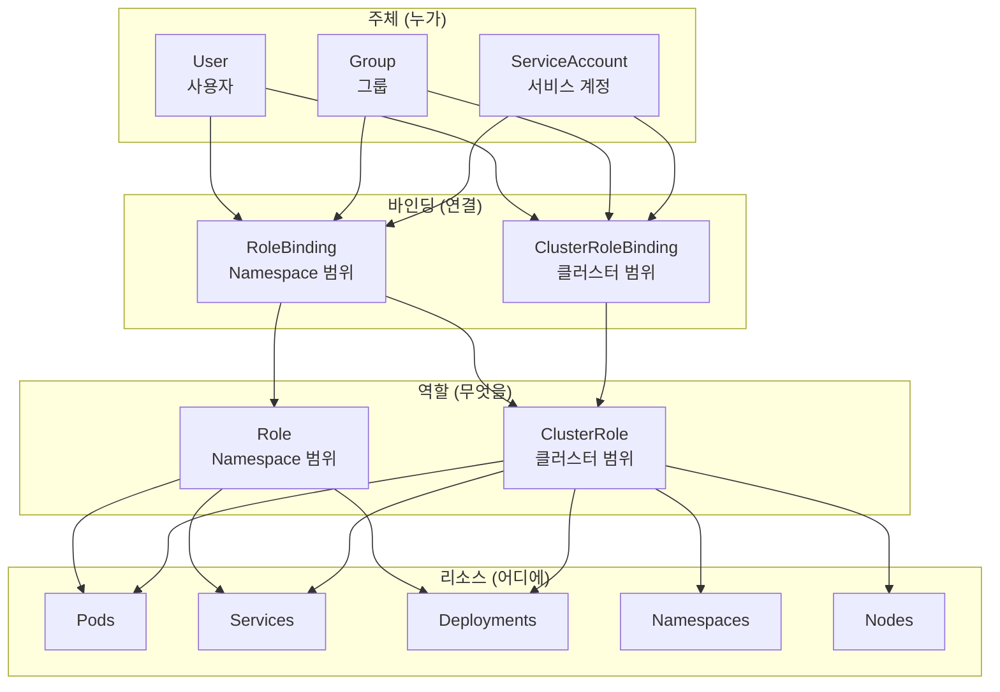

## 전체 비유: 건물 출입 카드 시스템

RBAC을 **건물 출입 카드 시스템**에 비유하면 이해하기 쉽습니다:

| 건물 출입 비유 | Kubernetes RBAC | 역할 |
|--------------|----------------|------|
| 출입 권한 세트 (3층 서버실 접근 가능) | Role | 특정 Namespace 내 허용 작업 정의 |
| 전 건물 마스터 권한 | ClusterRole | 클러스터 전체 허용 작업 정의 |
| 사원증에 권한 부여 | RoleBinding | 사용자에게 Role 할당 |
| 전 지점 출입 권한 부여 | ClusterRoleBinding | 사용자에게 ClusterRole 할당 |
| 사원증 | ServiceAccount | Pod가 사용하는 인증 주체 |
| "꼭 필요한 구역만 출입" 원칙 | 최소 권한 원칙 | 필요한 권한만 부여 |

이처럼 RBAC은 "누가 어디에서 무엇을 할 수 있는지"를 체계적으로 관리하는 것과 같습니다.

---

> **대상 독자**: Kubernetes 클러스터의 보안과 접근 제어를 설정하려는 운영자
> **선수 지식**: Namespace, Pod, ServiceAccount 기본 개념
> **소요 시간**: 약 20분
> **이 문서를 읽으면**: RBAC을 활용한 접근 권한 관리 방법을 이해할 수 있습니다


- RBAC은 역할 기반으로 Kubernetes API 접근을 제어합니다
- Role은 Namespace 범위, ClusterRole은 클러스터 범위의 권한을 정의합니다
- RoleBinding/ClusterRoleBinding으로 사용자에게 역할을 할당합니다


## RBAC이란?

RBAC(Role-Based Access Control)은 사용자나 서비스의 역할에 따라 Kubernetes API에 대한 접근을 제어하는 메커니즘입니다.

| 구성요소 | 설명 |
|---------|------|
| Role | Namespace 내 허용할 작업(권한) 정의 |
| ClusterRole | 클러스터 전체 범위의 권한 정의 |
| RoleBinding | 특정 Namespace에서 사용자에게 Role 할당 |
| ClusterRoleBinding | 클러스터 전체에서 사용자에게 ClusterRole 할당 |
| ServiceAccount | Pod에서 Kubernetes API에 접근하기 위한 인증 주체 |

## RBAC 구성요소 관계



*주체(User, Group, ServiceAccount)가 Binding을 통해 Role/ClusterRole의 권한으로 리소스에 접근하는 RBAC 구조를 보여줍니다.*

## Role vs ClusterRole

### Role (Namespace 범위)

특정 Namespace 내 리소스에 대한 권한을 정의합니다.

```yaml
apiVersion: rbac.authorization.k8s.io/v1
kind: Role
metadata:
  name: pod-reader
  namespace: team-a
rules:
- apiGroups: [""]
  resources: ["pods"]
  verbs: ["get", "watch", "list"]
- apiGroups: [""]
  resources: ["pods/log"]
  verbs: ["get"]
```

### ClusterRole (클러스터 범위)

클러스터 전체 리소스에 대한 권한을 정의합니다.

```yaml
apiVersion: rbac.authorization.k8s.io/v1
kind: ClusterRole
metadata:
  name: node-reader
rules:
- apiGroups: [""]
  resources: ["nodes"]
  verbs: ["get", "watch", "list"]
- apiGroups: [""]
  resources: ["namespaces"]
  verbs: ["get", "list"]
```

### 사용 가능한 Verbs

| Verb | 설명 | HTTP 메서드 |
|------|------|------------|
| `get` | 단일 리소스 조회 | GET |
| `list` | 리소스 목록 조회 | GET |
| `watch` | 리소스 변경 감시 | GET (watch) |
| `create` | 리소스 생성 | POST |
| `update` | 리소스 수정 | PUT |
| `patch` | 리소스 부분 수정 | PATCH |
| `delete` | 리소스 삭제 | DELETE |

## RoleBinding vs ClusterRoleBinding

### RoleBinding

```yaml
apiVersion: rbac.authorization.k8s.io/v1
kind: RoleBinding
metadata:
  name: read-pods
  namespace: team-a
subjects:
- kind: User
  name: developer-kim
  apiGroup: rbac.authorization.k8s.io
- kind: ServiceAccount
  name: app-sa
  namespace: team-a
roleRef:
  kind: Role
  name: pod-reader
  apiGroup: rbac.authorization.k8s.io
```

### ClusterRoleBinding

```yaml
apiVersion: rbac.authorization.k8s.io/v1
kind: ClusterRoleBinding
metadata:
  name: read-nodes
subjects:
- kind: Group
  name: ops-team
  apiGroup: rbac.authorization.k8s.io
roleRef:
  kind: ClusterRole
  name: node-reader
  apiGroup: rbac.authorization.k8s.io
```

| 항목 | RoleBinding | ClusterRoleBinding |
|------|-----------|-------------------|
| 범위 | 특정 Namespace | 클러스터 전체 |
| 참조 가능 Role | Role, ClusterRole | ClusterRole만 |
| 사용 사례 | 팀별 권한 | 클러스터 관리자 권한 |


ClusterRole을 RoleBinding으로 참조하면, 클러스터 전체가 아닌 특정 Namespace에서만 해당 권한이 적용됩니다. 공통 권한 세트를 여러 Namespace에 재사용할 때 유용합니다.


## ServiceAccount

Pod는 ServiceAccount를 통해 Kubernetes API에 접근합니다.

```yaml
apiVersion: v1
kind: ServiceAccount
metadata:
  name: app-sa
  namespace: team-a
---
apiVersion: apps/v1
kind: Deployment
metadata:
  name: my-app
  namespace: team-a
spec:
  replicas: 1
  selector:
    matchLabels:
      app: my-app
  template:
    metadata:
      labels:
        app: my-app
    spec:
      serviceAccountName: app-sa    # ServiceAccount 지정
      containers:
      - name: app
        image: my-app:1.0
```


ServiceAccount를 지정하지 않으면 `default` ServiceAccount가 사용됩니다. 프로덕션에서는 반드시 전용 ServiceAccount를 생성하고 최소 권한만 부여하세요.


## 최소 권한 원칙

RBAC 설정 시 반드시 최소 권한 원칙(Principle of Least Privilege)을 따라야 합니다.

| 원칙 | 설명 |
|------|------|
| 필요한 권한만 부여 | `*` (와일드카드) 사용 자제 |
| Namespace 범위 우선 | ClusterRole보다 Role 우선 사용 |
| 전용 ServiceAccount | default SA 사용 금지 |
| 정기적 권한 감사 | 불필요한 권한 정리 |

잘못된 예와 올바른 예를 비교합니다.

```yaml
# ❌ 잘못된 예: 너무 넓은 권한
rules:
- apiGroups: ["*"]
  resources: ["*"]
  verbs: ["*"]

# ✅ 올바른 예: 필요한 권한만 명시
rules:
- apiGroups: [""]
  resources: ["pods"]
  verbs: ["get", "list"]
- apiGroups: ["apps"]
  resources: ["deployments"]
  verbs: ["get", "list", "update"]
```

## 기본 제공 ClusterRole

Kubernetes는 자주 사용되는 권한 세트를 기본 제공합니다.

| ClusterRole | 설명 |
|------------|------|
| `cluster-admin` | 클러스터 전체 모든 권한 |
| `admin` | Namespace 내 대부분의 리소스 관리 |
| `edit` | Namespace 내 리소스 읽기/쓰기 (RBAC 수정 불가) |
| `view` | Namespace 내 리소스 읽기 전용 |

```bash
# 기본 ClusterRole 확인
kubectl get clusterroles | grep -E "^(cluster-admin|admin|edit|view)"
```

## 실습: RBAC 설정

### ServiceAccount와 Role 생성

```bash
# ServiceAccount 생성
kubectl create serviceaccount app-sa -n team-a

# Role 생성
kubectl apply -f role.yaml

# RoleBinding 생성
kubectl apply -f rolebinding.yaml

# 권한 확인
kubectl auth can-i get pods --as system:serviceaccount:team-a:app-sa -n team-a
# yes

kubectl auth can-i delete pods --as system:serviceaccount:team-a:app-sa -n team-a
# no
```

### 권한 테스트

```bash
# 사용자의 권한 확인
kubectl auth can-i list deployments --as developer-kim -n team-a

# 현재 사용자의 모든 권한 확인
kubectl auth can-i --list -n team-a
```

## 자주 사용하는 kubectl 명령어

| 명령어 | 설명 |
|--------|------|
| `kubectl get roles -n <namespace>` | Role 목록 |
| `kubectl get rolebindings -n <namespace>` | RoleBinding 목록 |
| `kubectl get clusterroles` | ClusterRole 목록 |
| `kubectl describe role <name> -n <namespace>` | Role 상세 정보 |
| `kubectl auth can-i <verb> <resource> --as <user>` | 권한 확인 |
| `kubectl create role <name> --verb=<verbs> --resource=<resources>` | Role 생성 |

---

## 다음 단계

RBAC을 이해했다면 다음 단계로 진행하세요:

| 목표 | 추천 문서 |
|------|----------|
| 배치 작업 실행 | [Job과 CronJob](jobs/) |
| 네트워크 정책 | [NetworkPolicy](network-policy/) |
| 리소스 격리 | [Namespace](namespace/) |
