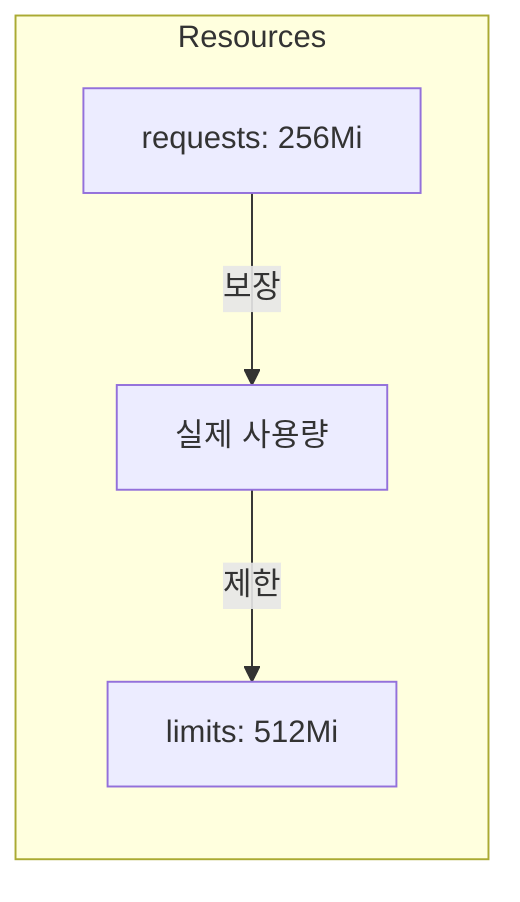
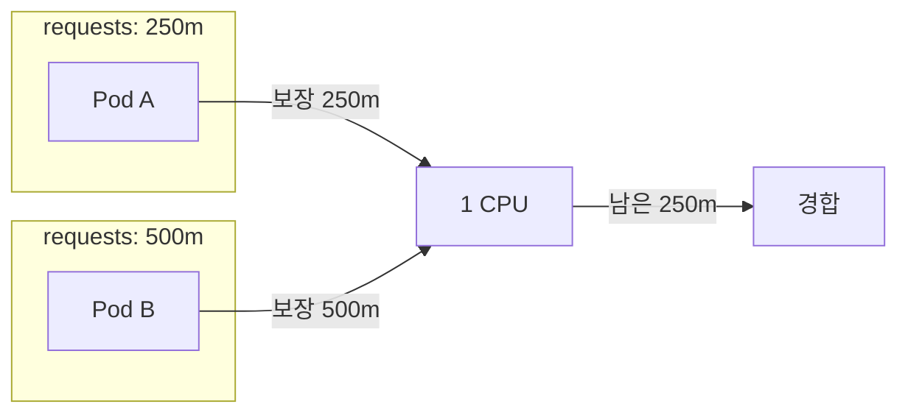

## 전체 비유: 아파트 전기/수도 배정

리소스 관리를 **아파트 전기/수도 배정**에 비유하면 이해하기 쉽습니다:

| 아파트 공과금 비유 | Kubernetes | 역할 |
|------------------|------------|------|
| 기본 전기 용량 | requests | 최소 보장 리소스 |
| 최대 전기 용량 | limits | 사용 가능한 최대치 |
| 전기 초과 시 차단기 | CPU 스로틀링 | 한계 초과 시 성능 저하 |
| 수도 초과 시 단수 | OOMKilled | 메모리 초과 시 강제 종료 |
| 프리미엄 세대 | Guaranteed QoS | 가장 마지막에 퇴거 요청 |
| 일반 세대 | Burstable QoS | 중간 우선순위 |
| 관리비 미납 세대 | BestEffort QoS | 가장 먼저 퇴거 요청 |
| 단지 전체 전기 한도 | ResourceQuota | 네임스페이스 총량 제한 |
| 세대별 기본 배정량 | LimitRange | 기본 리소스 설정 |

이처럼 requests는 "항상 보장받는 기본 전기량"이고, limits는 "절대 넘을 수 없는 최대 사용량"입니다.

---

> **대상 독자**: Kubernetes에서 리소스를 효율적으로 관리하고 싶은 백엔드 개발자
> **선수 지식**: Pod, Deployment 개념
> **이 문서를 읽으면**: requests와 limits의 차이, 적절한 리소스 설정 방법을 이해할 수 있습니다


- `requests`: 스케줄링에 사용되는 최소 보장 리소스
- `limits`: 사용 가능한 최대 리소스
- CPU 초과 시 스로틀링, 메모리 초과 시 OOMKilled


## 왜 리소스 설정이 필요한가?

리소스 설정 없이 Pod를 실행하면 여러 문제가 발생합니다.

| 문제 | 리소스 설정 후 |
|------|---------------|
| 한 Pod가 노드 리소스 독점 | limits로 최대 사용량 제한 |
| 스케줄링 시 리소스 고려 안 됨 | requests 기반 스케줄링 |
| 메모리 부족 시 임의 Pod 종료 | QoS 클래스 기반 우선순위 |
| 리소스 사용량 예측 불가 | 명시적 리소스 할당 |

## requests와 limits

Kubernetes는 두 가지 리소스 제어 방식을 제공합니다.

```yaml
resources:
  requests:
    memory: "256Mi"
    cpu: "250m"
  limits:
    memory: "512Mi"
    cpu: "500m"
```



requests와 limits를 비교하면 다음과 같습니다.

| 항목 | requests | limits |
|------|----------|--------|
| 역할 | 최소 보장량 | 최대 허용량 |
| 스케줄링 | 기준으로 사용 | 사용 안 함 |
| 실행 중 | 항상 사용 가능 | 초과 시 제한 |
| 미설정 시 | limits와 동일 | 무제한 |

## CPU 리소스

CPU는 압축 가능한(compressible) 리소스입니다. 초과해도 스로틀링될 뿐 종료되지 않습니다.

### CPU 단위

| 표기 | 의미 | 예시 |
|------|------|------|
| 1 | 1 vCPU | `cpu: 1` |
| 1000m | 1 vCPU | `cpu: 1000m` |
| 500m | 0.5 vCPU | `cpu: 500m` |
| 100m | 0.1 vCPU | `cpu: 100m` |

`m`은 밀리코어(millicores)를 의미합니다. 1000m = 1 CPU입니다.

### CPU 동작



| 상황 | 동작 |
|------|------|
| 전체 사용량 < 노드 용량 | 모든 Pod가 필요한 만큼 사용 |
| 전체 사용량 > 노드 용량 | requests 비율에 따라 분배 |
| Pod 사용량 > limits | CPU 스로틀링 (성능 저하) |

## 메모리 리소스

메모리는 압축 불가능한(incompressible) 리소스입니다. 초과하면 Pod가 종료(OOMKilled)됩니다.

### 메모리 단위

| 표기 | 의미 |
|------|------|
| 256Mi | 256 메비바이트 (256 × 2^20 bytes) |
| 1Gi | 1 기비바이트 (1 × 2^30 bytes) |
| 256M | 256 메가바이트 (256 × 10^6 bytes) |
| 1G | 1 기가바이트 (1 × 10^9 bytes) |


`Mi`(메비바이트)는 2^20 bytes, `M`(메가바이트)는 10^6 bytes입니다. Kubernetes에서는 보통 `Mi`, `Gi`를 사용합니다.


### 메모리 동작

| 상황 | 동작 |
|------|------|
| 사용량 < requests | 정상 실행 |
| requests < 사용량 < limits | 정상 실행 (노드 여유 있으면) |
| 사용량 > limits | OOMKilled (컨테이너 재시작) |
| 노드 메모리 부족 | QoS 클래스 기반 종료 |

## QoS 클래스

Kubernetes는 리소스 설정에 따라 Pod에 QoS(Quality of Service) 클래스를 할당합니다.

| 클래스 | 조건 | 우선순위 |
|--------|------|----------|
| Guaranteed | 모든 컨테이너에 requests=limits | 최고 (가장 마지막에 종료) |
| Burstable | requests < limits 또는 일부만 설정 | 중간 |
| BestEffort | 리소스 설정 없음 | 최저 (가장 먼저 종료) |

```yaml
# Guaranteed
resources:
  requests:
    memory: "256Mi"
    cpu: "250m"
  limits:
    memory: "256Mi"
    cpu: "250m"

# Burstable
resources:
  requests:
    memory: "256Mi"
    cpu: "250m"
  limits:
    memory: "512Mi"
    cpu: "500m"

# BestEffort (리소스 설정 없음)
# resources: {}
```

노드 메모리가 부족할 때 종료 순서는 다음과 같습니다.


## 권장 설정

### 워크로드 유형별 권장 설정

실제 운영에서 자주 사용되는 워크로드 유형별 시작점입니다.

| 워크로드 | requests (CPU/Mem) | limits (CPU/Mem) | 특징 |
|----------|-------------------|------------------|------|
| **Spring Boot API** | 250m / 512Mi | 1000m / 1Gi | JVM 힙 고려 |
| **Node.js API** | 100m / 128Mi | 500m / 256Mi | 가벼움 |
| **Python Flask** | 100m / 128Mi | 500m / 512Mi | ML 라이브러리 시 증가 |
| **Nginx (프록시)** | 50m / 64Mi | 200m / 128Mi | 매우 가벼움 |
| **Redis (캐시)** | 100m / 256Mi | 500m / 512Mi | 메모리 중심 |
| **Batch Job** | 500m / 512Mi | 2000m / 2Gi | 처리량 중심 |


위 값은 시작점입니다. 실제 사용량을 모니터링(`kubectl top pods`)하여 조정하세요.


### Java 애플리케이션

```yaml
resources:
  requests:
    memory: "512Mi"
    cpu: "250m"
  limits:
    memory: "1Gi"
    cpu: "1000m"
```

Java 애플리케이션 특성상 메모리 limits는 넉넉히 설정하되, JVM 힙 사이즈도 함께 조정해야 합니다.

```yaml
env:
- name: JAVA_OPTS
  value: "-Xms256m -Xmx768m"
```

JVM 힙은 컨테이너 메모리 limits의 70-80%로 설정하는 것이 일반적입니다.

### 리소스 설정 가이드라인

| 항목 | 권장 사항 |
|------|----------|
| requests | 평상시 사용량의 90% |
| limits (CPU) | requests의 2-4배 또는 미설정 |
| limits (메모리) | requests의 1.5-2배 |
| Guaranteed | 중요 워크로드에 사용 |

## LimitRange

네임스페이스 수준에서 기본 리소스 제한을 설정합니다.

```yaml
apiVersion: v1
kind: LimitRange
metadata:
  name: default-limits
spec:
  limits:
  - default:          # 기본 limits
      cpu: "500m"
      memory: "512Mi"
    defaultRequest:   # 기본 requests
      cpu: "100m"
      memory: "128Mi"
    max:              # 최대 허용
      cpu: "2"
      memory: "2Gi"
    min:              # 최소 허용
      cpu: "50m"
      memory: "64Mi"
    type: Container
```

리소스를 명시하지 않은 Pod에 기본값이 적용됩니다.

## ResourceQuota

네임스페이스 전체의 리소스 총량을 제한합니다.

```yaml
apiVersion: v1
kind: ResourceQuota
metadata:
  name: compute-quota
spec:
  hard:
    requests.cpu: "4"
    requests.memory: "8Gi"
    limits.cpu: "8"
    limits.memory: "16Gi"
    pods: "10"
```

이 설정은 해당 네임스페이스에서 다음을 제한합니다.

| 항목 | 제한 |
|------|------|
| CPU requests 합계 | 4 코어 |
| 메모리 requests 합계 | 8Gi |
| 최대 Pod 수 | 10개 |

## 실습: 리소스 설정과 확인

### 리소스 사용량 확인

```bash
# 노드 리소스 확인
kubectl describe node <node-name>

# Pod 리소스 사용량 (metrics-server 필요)
kubectl top pods
kubectl top nodes
```

### 리소스 부족 시뮬레이션

```yaml
apiVersion: v1
kind: Pod
metadata:
  name: memory-demo
spec:
  containers:
  - name: memory-demo
    image: polinux/stress
    resources:
      requests:
        memory: "50Mi"
      limits:
        memory: "100Mi"
    command: ["stress"]
    args: ["--vm", "1", "--vm-bytes", "150M", "--vm-hang", "1"]
```

```bash
# Pod 생성
kubectl apply -f memory-demo.yaml

# 상태 확인 (OOMKilled 발생)
kubectl get pod memory-demo
kubectl describe pod memory-demo
```

### QoS 클래스 확인

```bash
kubectl get pod <pod-name> -o jsonpath='{.status.qosClass}'
```

---

## 다음 단계

리소스 관리를 이해했다면 다음 단계로 진행하세요:

| 목표 | 추천 문서 |
|------|----------|
| 자동 스케일링 | [스케일링](scaling/) |
| 헬스 체크 설정 | [헬스 체크](health-checks/) |
| 리소스 최적화 | [리소스 최적화](../howto/resource-optimization/) |
