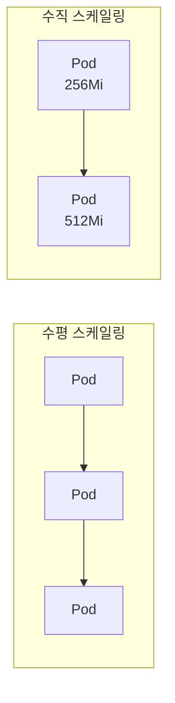
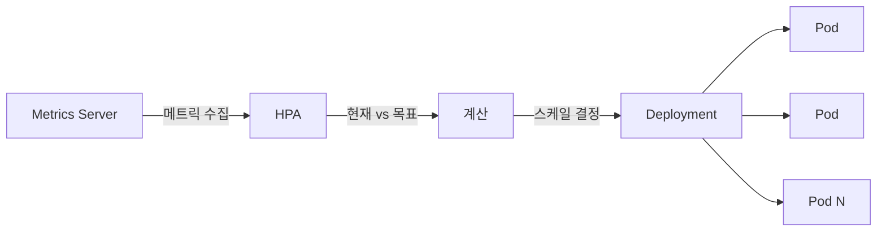
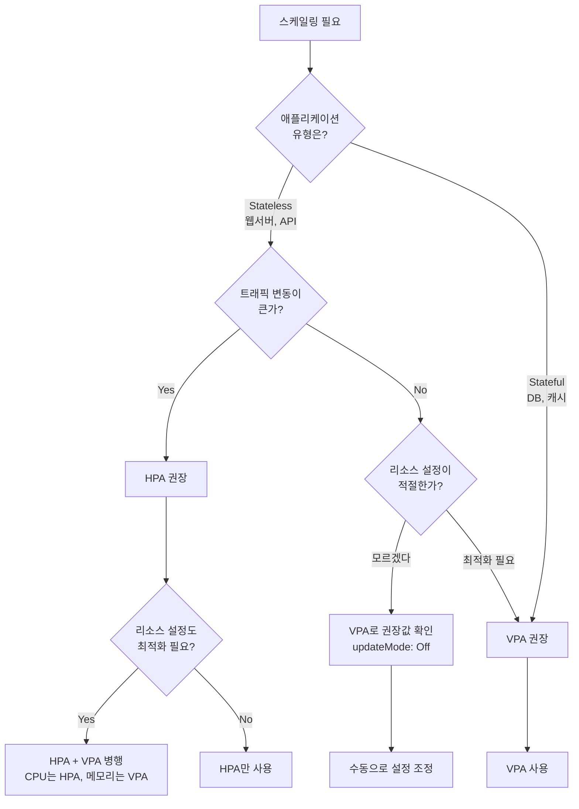

> **대상 독자**: Kubernetes에서 자동 스케일링을 구성하고 싶은 백엔드 개발자
> **선수 지식**: Deployment, 리소스 관리 개념
> **이 문서를 읽으면**: HPA와 VPA를 사용한 자동 스케일링 방법을 이해할 수 있습니다


- HPA(Horizontal Pod Autoscaler)는 Pod 수를 자동으로 조정합니다
- VPA(Vertical Pod Autoscaler)는 Pod의 리소스 요청을 자동으로 조정합니다
- 대부분의 경우 HPA를 먼저 고려하세요


## 스케일링 방식 비교

Kubernetes는 두 가지 스케일링 방식을 제공합니다.

| 방식 | 설명 | 적합한 경우 |
|------|------|------------|
| 수평 스케일링 (HPA) | Pod 수 조정 | Stateless 애플리케이션 |
| 수직 스케일링 (VPA) | Pod 리소스 조정 | Stateful, 리소스 최적화 |



## HPA (Horizontal Pod Autoscaler)

HPA는 메트릭(CPU, 메모리, 커스텀)을 기반으로 Pod 수를 자동으로 조정합니다.

### HPA 동작 원리



HPA 동작 순서는 다음과 같습니다.

| 단계 | 동작 |
|------|------|
| 1 | Metrics Server에서 현재 메트릭 수집 (15초 간격) |
| 2 | 목표 메트릭과 현재 메트릭 비교 |
| 3 | 필요한 replicas 수 계산 |
| 4 | Deployment의 replicas 조정 |

### HPA 생성

**명령어로 생성:**
```bash
kubectl autoscale deployment my-app \
  --cpu-percent=50 \
  --min=2 \
  --max=10
```

**YAML로 생성:**
```yaml
apiVersion: autoscaling/v2
kind: HorizontalPodAutoscaler
metadata:
  name: my-app-hpa
spec:
  scaleTargetRef:
    apiVersion: apps/v1
    kind: Deployment
    name: my-app
  minReplicas: 2
  maxReplicas: 10
  metrics:
  - type: Resource
    resource:
      name: cpu
      target:
        type: Utilization
        averageUtilization: 50
```

주요 필드를 설명합니다.

| 필드 | 설명 |
|------|------|
| scaleTargetRef | 스케일링 대상 (Deployment 등) |
| minReplicas | 최소 Pod 수 |
| maxReplicas | 최대 Pod 수 |
| metrics | 스케일링 기준 메트릭 |
| averageUtilization | 목표 사용률 (%) |

### 복합 메트릭 HPA

CPU와 메모리를 함께 고려하는 HPA입니다.

```yaml
apiVersion: autoscaling/v2
kind: HorizontalPodAutoscaler
metadata:
  name: my-app-hpa
spec:
  scaleTargetRef:
    apiVersion: apps/v1
    kind: Deployment
    name: my-app
  minReplicas: 2
  maxReplicas: 10
  metrics:
  - type: Resource
    resource:
      name: cpu
      target:
        type: Utilization
        averageUtilization: 50
  - type: Resource
    resource:
      name: memory
      target:
        type: Utilization
        averageUtilization: 70
```

여러 메트릭이 있을 때, 각 메트릭에서 계산된 replicas 중 가장 큰 값이 적용됩니다.

### HPA 스케일링 계산

HPA는 다음 공식으로 필요한 replicas를 계산합니다:

```
desiredReplicas = ceil(currentReplicas × (currentMetric / targetMetric))
```

예시는 다음과 같습니다.

| 현재 상태 | 계산 | 결과 |
|----------|------|------|
| 3 Pods, CPU 70%, 목표 50% | 3 × (70/50) = 4.2 | 5 Pods |
| 5 Pods, CPU 30%, 목표 50% | 5 × (30/50) = 3 | 3 Pods |

### 스케일링 동작 제어

급격한 스케일링을 방지하기 위한 설정입니다.

```yaml
apiVersion: autoscaling/v2
kind: HorizontalPodAutoscaler
metadata:
  name: my-app-hpa
spec:
  scaleTargetRef:
    apiVersion: apps/v1
    kind: Deployment
    name: my-app
  minReplicas: 2
  maxReplicas: 10
  behavior:
    scaleDown:
      stabilizationWindowSeconds: 300  # 5분간 안정화
      policies:
      - type: Percent
        value: 10
        periodSeconds: 60  # 1분마다 최대 10% 감소
    scaleUp:
      stabilizationWindowSeconds: 0
      policies:
      - type: Percent
        value: 100
        periodSeconds: 15  # 15초마다 최대 100% 증가
  metrics:
  - type: Resource
    resource:
      name: cpu
      target:
        type: Utilization
        averageUtilization: 50
```

스케일 업/다운 정책을 비교하면 다음과 같습니다.

| 항목 | Scale Up | Scale Down |
|------|----------|------------|
| 속도 | 빠르게 | 천천히 |
| 이유 | 트래픽 급증 대응 | 불필요한 스케일 다운 방지 |

## VPA (Vertical Pod Autoscaler)

VPA는 Pod의 리소스 requests/limits를 자동으로 조정합니다.


VPA는 별도로 설치해야 합니다. [VPA GitHub](https://github.com/kubernetes/autoscaler/tree/master/vertical-pod-autoscaler)을 참고하세요.


### VPA 구성요소

| 구성요소 | 역할 |
|----------|------|
| Recommender | 리소스 사용량 분석, 권장 값 계산 |
| Updater | Pod 재시작하여 새 리소스 적용 |
| Admission Controller | 새 Pod 생성 시 리소스 주입 |

### VPA 예시

```yaml
apiVersion: autoscaling.k8s.io/v1
kind: VerticalPodAutoscaler
metadata:
  name: my-app-vpa
spec:
  targetRef:
    apiVersion: apps/v1
    kind: Deployment
    name: my-app
  updatePolicy:
    updateMode: "Auto"  # Off, Initial, Recreate, Auto
  resourcePolicy:
    containerPolicies:
    - containerName: app
      minAllowed:
        memory: "128Mi"
        cpu: "100m"
      maxAllowed:
        memory: "2Gi"
        cpu: "2"
```

updateMode 옵션을 비교하면 다음과 같습니다.

| 모드 | 동작 |
|------|------|
| Off | 권장 값만 제공, 적용 안 함 |
| Initial | 새 Pod 생성 시만 적용 |
| Recreate | 기존 Pod 재시작하여 적용 |
| Auto | 자동으로 가장 적합한 방식 선택 |

## HPA vs VPA 선택 가이드

어떤 스케일링을 선택해야 할까요? 다음 플로차트를 참고하세요.



| 기준 | HPA | VPA |
|------|-----|-----|
| Stateless 애플리케이션 | ✓ | |
| Stateful 애플리케이션 | | ✓ |
| 트래픽 변동 대응 | ✓ | |
| 리소스 최적화 | | ✓ |
| 즉시 적용 | ✓ | ✗ (재시작 필요) |

### 실제 선택 예시

| 상황 | 권장 | 이유 |
|------|------|------|
| REST API 서버, 트래픽 변동 큼 | HPA | Pod 수로 빠르게 대응 |
| 배치 작업 서버 | VPA | 리소스 사용량 최적화 |
| DB 연결이 제한된 서버 | HPA (max 주의) | Pod 수에 따른 연결 수 관리 필요 |
| 신규 서비스, 적정 리소스 모름 | VPA (Off 모드) | 권장 값 수집 후 설정 |


HPA와 VPA를 동일한 Deployment에 함께 사용할 때는 주의가 필요합니다. VPA가 메모리만 조정하고 HPA가 CPU 기반으로 스케일링하도록 분리하는 것이 권장됩니다.


## 전제 조건

HPA를 사용하려면 다음이 필요합니다.

| 요구사항 | 설명 |
|----------|------|
| Metrics Server | 클러스터에 설치되어 있어야 함 |
| 리소스 requests | Pod에 CPU/메모리 requests 설정 필요 |

### Metrics Server 설치 확인

```bash
# Metrics Server 동작 확인
kubectl top nodes
kubectl top pods
```

`error: Metrics API not available` 오류가 발생하면 Metrics Server를 설치하세요.

```bash
# Minikube
minikube addons enable metrics-server

# 기타 환경
kubectl apply -f https://github.com/kubernetes-sigs/metrics-server/releases/latest/download/components.yaml
```

## 실습: HPA 설정과 테스트

### 테스트 애플리케이션 배포

```yaml
apiVersion: apps/v1
kind: Deployment
metadata:
  name: php-apache
spec:
  replicas: 1
  selector:
    matchLabels:
      app: php-apache
  template:
    metadata:
      labels:
        app: php-apache
    spec:
      containers:
      - name: php-apache
        image: k8s.gcr.io/hpa-example
        ports:
        - containerPort: 80
        resources:
          requests:
            cpu: 200m
          limits:
            cpu: 500m
---
apiVersion: v1
kind: Service
metadata:
  name: php-apache
spec:
  ports:
  - port: 80
  selector:
    app: php-apache
```

### HPA 생성

```bash
kubectl autoscale deployment php-apache --cpu-percent=50 --min=1 --max=10
```

### 부하 테스트

새 터미널에서 부하를 생성합니다:

```bash
kubectl run -i --tty load-generator --rm --image=busybox --restart=Never \
  -- /bin/sh -c "while sleep 0.01; do wget -q -O- http://php-apache; done"
```

### HPA 동작 확인

```bash
# HPA 상태 모니터링
kubectl get hpa php-apache --watch

# 예상 출력:
# NAME         REFERENCE               TARGETS   MINPODS   MAXPODS   REPLICAS
# php-apache   Deployment/php-apache   0%/50%    1         10        1
# php-apache   Deployment/php-apache   250%/50%  1         10        1
# php-apache   Deployment/php-apache   250%/50%  1         10        5
```

부하 생성기를 중지하면(Ctrl+C) 잠시 후 Pod 수가 감소합니다.

---

## 다음 단계

스케일링을 이해했다면 다음 단계로 진행하세요:

| 목표 | 추천 문서 |
|------|----------|
| 헬스 체크 설정 | [헬스 체크](../health-checks/) |
| 리소스 최적화 | [리소스 최적화](../../howto/resource-optimization/) |
| 실제 배포 실습 | [Spring Boot 배포](../../examples/spring-boot/) |
