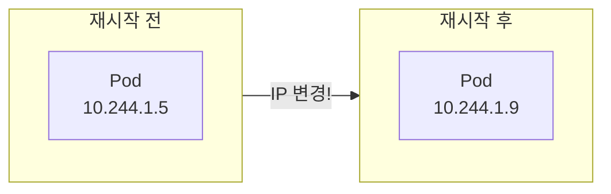
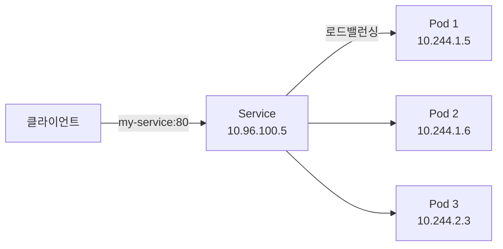
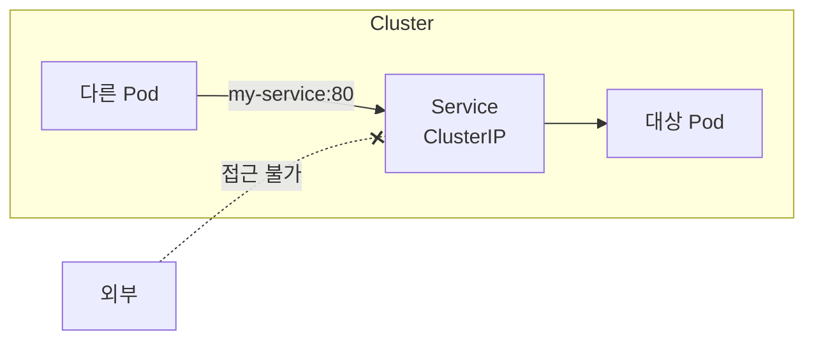
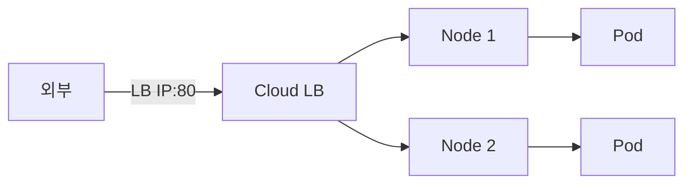

## 전체 비유: 아파트 인터폰/안내 시스템

Service를 **아파트 인터폰 시스템**에 비유하면 이해하기 쉽습니다:

| 아파트 인터폰 비유 | Kubernetes Service | 역할 |
|------------------|-------------------|------|
| 동 현관 인터폰 | Service | 고정된 접근점으로 세대 연결 |
| 인터폰 번호 (101동) | ClusterIP | 변하지 않는 내부 주소 |
| 세대 호수 변경되어도 인터폰 동일 | Pod IP 변경 무관 | Service IP는 고정 |
| 같은 세대 여러 명에게 연결 | Load Balancing | 여러 Pod에 트래픽 분산 |
| 내부 인터폰 | ClusterIP | 단지 내부에서만 통화 가능 |
| 외부 전화 연결 | NodePort | 외부에서 특정 포트로 연결 |
| 대표 전화번호 | LoadBalancer | 외부 고정 IP로 연결 |
| 입주민 명부 | Endpoints | Service가 관리하는 Pod IP 목록 |
| "101동 김철수네" | DNS | 이름으로 Service 접근 |

이처럼 Service는 "세대 번호가 바뀌어도 인터폰 번호는 그대로여서 항상 연결 가능"한 것과 같습니다.

---

> **대상 독자**: Kubernetes에서 네트워크 접근을 설정하고 싶은 백엔드 개발자
> **선수 지식**: Pod, Deployment 개념
> **이 문서를 읽으면**: Service로 Pod에 안정적으로 접근하는 방법을 이해할 수 있습니다


- Service는 Pod 집합에 대한 안정적인 네트워크 엔드포인트를 제공합니다
- Pod IP는 변경되지만 Service IP(ClusterIP)는 고정됩니다
- ClusterIP, NodePort, LoadBalancer 세 가지 유형이 있습니다


## Service가 필요한 이유

Pod IP는 Pod가 재생성될 때마다 변경됩니다. 이런 상황에서 어떻게 안정적으로 통신할 수 있을까요?



Service를 사용하면 Pod IP가 변경되어도 일관된 접근점을 유지할 수 있습니다.

| 문제 | Service의 해결책 |
|------|-----------------|
| Pod IP가 변경됨 | 고정된 Service IP 제공 |
| 여러 Pod에 트래픽 분산 필요 | 자동 로드 밸런싱 |
| Pod 이름으로 접근 어려움 | DNS 이름 제공 |
| 외부 접근 방법 필요 | NodePort, LoadBalancer 제공 |

## Service 동작 원리

Service는 label selector로 Pod를 찾고, 해당 Pod들로 트래픽을 분산합니다.



Service와 Pod의 연결 과정은 다음과 같습니다.

| 단계 | 설명 |
|------|------|
| 1. Pod 생성 | Pod가 label과 함께 생성됨 |
| 2. Service 생성 | selector로 대상 Pod 정의 |
| 3. Endpoints 생성 | Service가 자동으로 Pod IP 목록 관리 |
| 4. 트래픽 라우팅 | kube-proxy가 트래픽을 Pod로 전달 |

## Service 유형

Kubernetes는 세 가지 Service 유형을 제공합니다.

### ClusterIP (기본)

클러스터 내부에서만 접근 가능한 Service입니다.

```yaml
apiVersion: v1
kind: Service
metadata:
  name: my-service
spec:
  type: ClusterIP  # 기본값, 생략 가능
  selector:
    app: my-app
  ports:
  - port: 80        # Service 포트
    targetPort: 8080 # Pod 포트
```



ClusterIP의 특징은 다음과 같습니다.

| 특징 | 설명 |
|------|------|
| 접근 범위 | 클러스터 내부만 |
| 사용 사례 | 내부 마이크로서비스 통신 |
| DNS | `<service-name>.<namespace>.svc.cluster.local` |

### NodePort

모든 노드의 특정 포트로 외부 접근을 허용합니다.

```yaml
apiVersion: v1
kind: Service
metadata:
  name: my-service
spec:
  type: NodePort
  selector:
    app: my-app
  ports:
  - port: 80
    targetPort: 8080
    nodePort: 30080  # 30000-32767 범위
```


NodePort의 특징은 다음과 같습니다.

| 특징 | 설명 |
|------|------|
| 접근 범위 | 외부 (노드 IP + 포트) |
| 포트 범위 | 30000-32767 |
| 사용 사례 | 개발/테스트, 간단한 외부 노출 |
| 제한 | 포트당 하나의 서비스만 가능 |

### LoadBalancer

클라우드 제공자의 로드밸런서를 프로비저닝합니다.

```yaml
apiVersion: v1
kind: Service
metadata:
  name: my-service
spec:
  type: LoadBalancer
  selector:
    app: my-app
  ports:
  - port: 80
    targetPort: 8080
```



LoadBalancer의 특징은 다음과 같습니다.

| 특징 | 설명 |
|------|------|
| 접근 범위 | 외부 (고정 IP) |
| 요구사항 | 클라우드 환경 (AWS, GCP, Azure) |
| 사용 사례 | 프로덕션 외부 서비스 |
| 비용 | 클라우드 LB 비용 발생 |

### 유형 비교 요약

| 유형 | 접근 범위 | 사용 사례 | 비용 |
|------|----------|----------|------|
| ClusterIP | 내부 | 마이크로서비스 간 통신 | 없음 |
| NodePort | 외부 (노드 IP) | 개발/테스트 | 없음 |
| LoadBalancer | 외부 (LB IP) | 프로덕션 | 있음 |

## Service DNS

Kubernetes는 Service에 DNS 이름을 자동으로 할당합니다.

### DNS 이름 형식

```
<service-name>.<namespace>.svc.cluster.local
```

DNS 이름의 예시는 다음과 같습니다.

| 예시 | 설명 |
|------|------|
| `my-service` | 같은 네임스페이스에서 접근 |
| `my-service.default` | default 네임스페이스의 서비스 |
| `my-service.production.svc.cluster.local` | 전체 FQDN |

### DNS 활용

```yaml
# 애플리케이션에서 Service DNS 사용
spring:
  datasource:
    url: jdbc:postgresql://db-service:5432/mydb
```

Pod 내에서 다른 Service에 접근할 때 IP 대신 DNS 이름을 사용하세요.

## Endpoints

Service는 Endpoints 리소스를 통해 Pod IP 목록을 관리합니다.

```bash
# Endpoints 확인
kubectl get endpoints my-service
```

**예상 출력:**
```
NAME         ENDPOINTS                                   AGE
my-service   10.244.1.5:8080,10.244.1.6:8080,10.244.2.3:8080   1h
```

Endpoints가 비어있으면 다음을 확인하세요.

| 확인 사항 | 명령어 |
|----------|--------|
| Pod 존재 여부 | `kubectl get pods -l <selector>` |
| Pod Ready 상태 | `kubectl get pods` 에서 READY 확인 |
| 레이블 일치 | Service selector와 Pod labels 비교 |

## 세션 어피니티

같은 클라이언트의 요청을 같은 Pod로 보내고 싶을 때 사용합니다.

```yaml
apiVersion: v1
kind: Service
metadata:
  name: my-service
spec:
  selector:
    app: my-app
  sessionAffinity: ClientIP
  sessionAffinityConfig:
    clientIP:
      timeoutSeconds: 3600  # 1시간
  ports:
  - port: 80
    targetPort: 8080
```

세션 어피니티 옵션을 비교하면 다음과 같습니다.

| 옵션 | 설명 |
|------|------|
| None | 기본값, 라운드 로빈 분산 |
| ClientIP | 클라이언트 IP 기반 고정 |


Kubernetes Service는 쿠키 기반 세션 어피니티를 지원하지 않습니다. 필요하다면 Ingress Controller를 사용하세요.


## 외부 서비스 연결

클러스터 외부 서비스(예: 외부 DB)를 Service로 추상화할 수 있습니다.

### ExternalName

외부 DNS 이름을 Service로 매핑합니다.

```yaml
apiVersion: v1
kind: Service
metadata:
  name: external-db
spec:
  type: ExternalName
  externalName: database.example.com
```

Pod에서 `external-db`로 접근하면 `database.example.com`으로 연결됩니다.

### selector 없는 Service

외부 IP를 직접 지정합니다.

```yaml
apiVersion: v1
kind: Service
metadata:
  name: external-service
spec:
  ports:
  - port: 80
    targetPort: 80
---
apiVersion: v1
kind: Endpoints
metadata:
  name: external-service  # Service와 같은 이름
subsets:
- addresses:
  - ip: 203.0.113.10
  ports:
  - port: 80
```

## 실습: Service 생성과 테스트

### ClusterIP Service 생성

```bash
# Deployment 생성 (이미 있다면 생략)
kubectl create deployment nginx --image=nginx:1.25 --replicas=3

# Service 생성
kubectl expose deployment nginx --port=80 --target-port=80

# 또는 YAML로 생성
kubectl apply -f service.yaml
```

### Service 확인

```bash
# Service 목록
kubectl get services

# 상세 정보
kubectl describe service nginx

# Endpoints 확인
kubectl get endpoints nginx
```

### 클러스터 내부에서 테스트

```bash
# 테스트용 Pod 생성
kubectl run test --image=busybox:1.36 --rm -it -- sh

# Service DNS로 접근
wget -qO- http://nginx
wget -qO- http://nginx.default.svc.cluster.local

# 여러 번 요청하면 다른 Pod로 분산되는 것 확인
for i in 1 2 3 4 5; do wget -qO- http://nginx | head -1; done
```

### NodePort 테스트

```bash
# NodePort Service 생성
kubectl expose deployment nginx --type=NodePort --port=80 --target-port=80

# 할당된 NodePort 확인
kubectl get service nginx

# Minikube에서 접근
minikube service nginx --url
```

## 트러블슈팅

### Service에 연결되지 않음

1. Endpoints 확인:
   ```bash
   kubectl get endpoints <service-name>
   ```
   비어있다면 selector와 Pod labels를 확인하세요.

2. Pod Ready 상태 확인:
   ```bash
   kubectl get pods -l <selector>
   ```
   Pod가 Running이지만 Ready가 아니면 readinessProbe를 확인하세요.

3. 포트 확인:
   ```bash
   kubectl describe service <service-name>
   ```
   targetPort가 Pod의 containerPort와 일치하는지 확인하세요.

### DNS 해석 실패

```bash
# CoreDNS 상태 확인
kubectl get pods -n kube-system -l k8s-app=kube-dns

# DNS 테스트
kubectl run test --image=busybox:1.36 --rm -it -- nslookup <service-name>
```

---

## 다음 단계

Service를 이해했다면 다음 단계로 진행하세요:

| 목표 | 추천 문서 |
|------|----------|
| 외부 HTTP 라우팅 | [네트워킹](networking/) |
| 설정 분리 | [ConfigMap과 Secret](configmap-secret/) |
| 실제 배포 실습 | [Spring Boot 배포](../examples/spring-boot/) |
