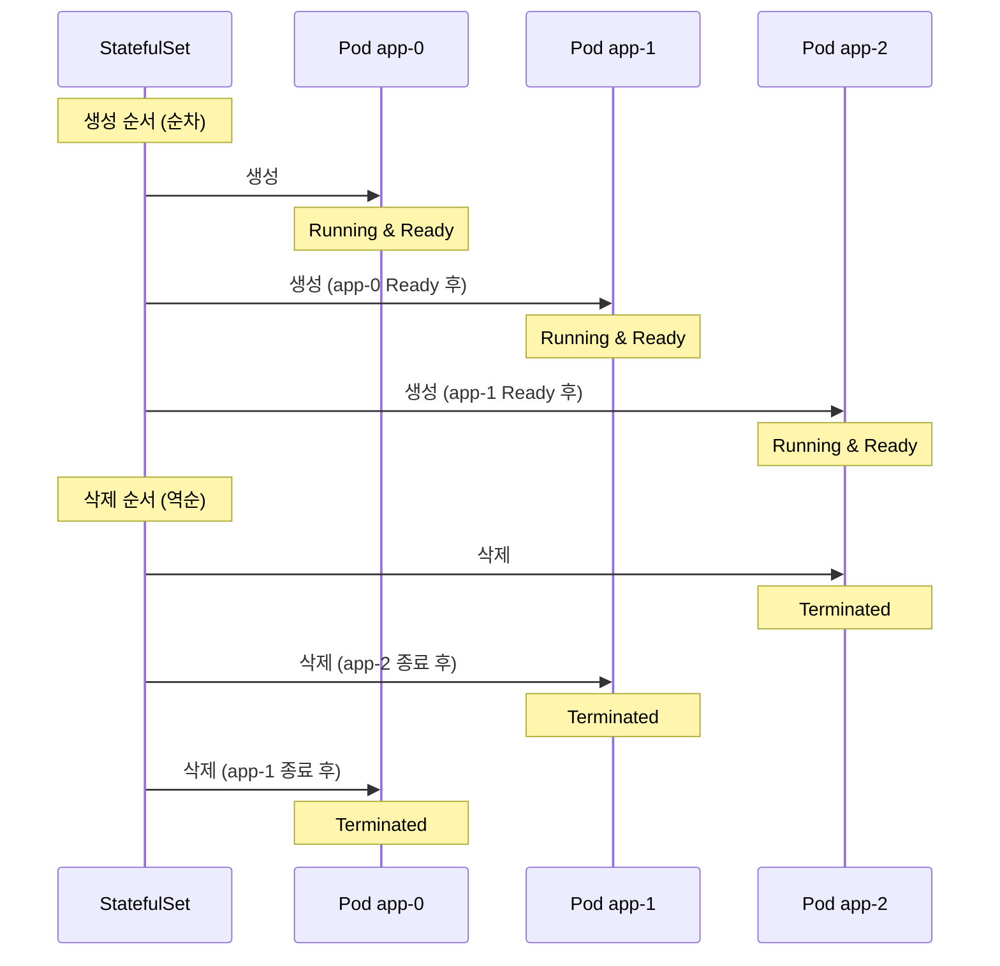
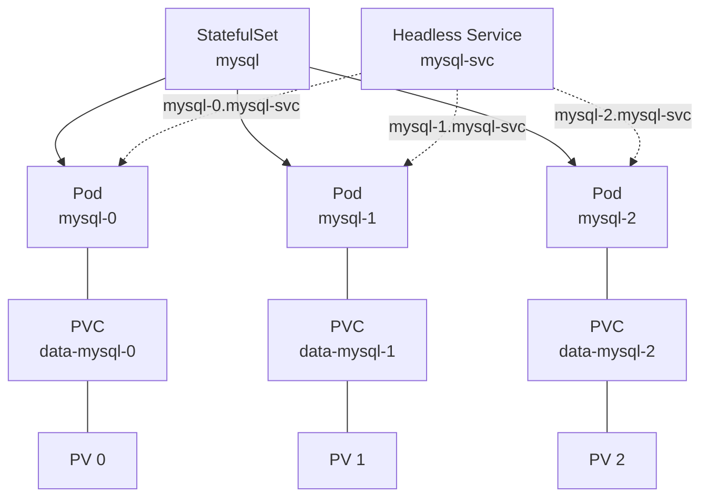

## 전체 비유: 지정석이 있는 식당

StatefulSet을 **지정석이 있는 식당**에 비유하면 이해하기 쉽습니다:

| 식당 비유 | Kubernetes StatefulSet | 역할 |
|----------|----------------------|------|
| 지정석 번호 (1번, 2번, 3번) | Pod 이름 (app-0, app-1, app-2) | 안정적이고 고유한 식별자 |
| 손님 전용 사물함 | PersistentVolumeClaim | Pod마다 전용 영구 스토리지 |
| 순서대로 착석/퇴석 | 순차적 생성/삭제 | 0번부터 생성, 역순으로 삭제 |
| 예약 명패 | 안정적 네트워크 ID | Pod 재시작 후에도 같은 호스트명 유지 |
| 자유석 식당 | Deployment | 아무 자리나 앉고, 바뀔 수 있음 |

이처럼 StatefulSet은 "지정석과 전용 사물함이 있어서 항상 같은 자리, 같은 물건을 사용하는 것"과 같습니다.

---

> **대상 독자**: 데이터베이스나 클러스터링 애플리케이션을 Kubernetes에 배포하려는 개발자
> **선수 지식**: Deployment, Service, Volume/PVC 개념
> **이 문서를 읽으면**: StatefulSet의 동작 원리와 Deployment와의 차이를 이해할 수 있습니다


- StatefulSet은 상태를 유지하는 애플리케이션을 위한 워크로드 리소스입니다
- 각 Pod에 안정적인 네트워크 ID와 전용 스토리지를 제공합니다
- Pod는 순서대로 생성되고 역순으로 삭제됩니다


## StatefulSet이란?

StatefulSet은 상태가 있는(stateful) 애플리케이션을 관리하기 위한 워크로드 리소스입니다. Deployment와 달리 각 Pod가 고유한 정체성을 유지합니다.

| 특성 | Deployment | StatefulSet |
|------|-----------|-------------|
| Pod 이름 | 랜덤 해시 (app-7d8f9b) | 순번 인덱스 (app-0, app-1) |
| 네트워크 ID | 매번 변경 가능 | 안정적 호스트명 유지 |
| 스토리지 | 공유 또는 임시 | Pod마다 전용 PVC |
| 생성 순서 | 동시에 생성 | 순차적 생성 (0 → 1 → 2) |
| 삭제 순서 | 동시에 삭제 | 역순 삭제 (2 → 1 → 0) |
| 사용 사례 | 무상태 웹 앱 | DB, 캐시, 메시지 큐 |

## Pod 생성/삭제 순서

StatefulSet은 Pod를 순차적으로 생성하고 역순으로 삭제합니다.




데이터베이스 클러스터에서 Primary 노드(app-0)가 먼저 시작되어야 Replica 노드(app-1, app-2)가 연결할 수 있습니다. 삭제 시에는 Replica를 먼저 제거해야 데이터 손실을 방지할 수 있습니다.


## StatefulSet 구조



각 구성요소의 역할은 다음과 같습니다.

| 구성요소 | 역할 |
|---------|------|
| StatefulSet | Pod의 순서와 고유성을 보장하며 관리 |
| Headless Service | 각 Pod에 고유한 DNS 레코드 제공 |
| PVC | Pod마다 독립적인 영구 스토리지 연결 |

## StatefulSet YAML

```yaml
apiVersion: v1
kind: Service
metadata:
  name: mysql-svc
spec:
  clusterIP: None       # Headless Service
  selector:
    app: mysql
  ports:
  - port: 3306
    targetPort: 3306
---
apiVersion: apps/v1
kind: StatefulSet
metadata:
  name: mysql
spec:
  serviceName: mysql-svc    # Headless Service 이름
  replicas: 3
  selector:
    matchLabels:
      app: mysql
  template:
    metadata:
      labels:
        app: mysql
    spec:
      containers:
      - name: mysql
        image: mysql:8.0
        ports:
        - containerPort: 3306
        env:
        - name: MYSQL_ROOT_PASSWORD
          valueFrom:
            secretKeyRef:
              name: mysql-secret
              key: root-password
        volumeMounts:
        - name: data
          mountPath: /var/lib/mysql
  volumeClaimTemplates:
  - metadata:
      name: data
    spec:
      accessModes: ["ReadWriteOnce"]
      resources:
        requests:
          storage: 10Gi
```

주요 필드를 설명합니다.

| 필드 | 설명 |
|------|------|
| `serviceName` | Headless Service 이름 (Pod DNS에 사용) |
| `volumeClaimTemplates` | 각 Pod에 자동 생성할 PVC 템플릿 |
| `clusterIP: None` | Headless Service 설정 (개별 Pod DNS 제공) |

### Headless Service와 Pod DNS

Headless Service를 사용하면 각 Pod에 예측 가능한 DNS 이름이 부여됩니다.

```
<pod-name>.<service-name>.<namespace>.svc.cluster.local
```

| Pod | DNS 이름 |
|-----|---------|
| mysql-0 | `mysql-0.mysql-svc.default.svc.cluster.local` |
| mysql-1 | `mysql-1.mysql-svc.default.svc.cluster.local` |
| mysql-2 | `mysql-2.mysql-svc.default.svc.cluster.local` |

## 사용 사례

StatefulSet이 적합한 애플리케이션은 다음과 같습니다.

| 애플리케이션 | StatefulSet이 필요한 이유 |
|-------------|------------------------|
| MySQL / PostgreSQL | Primary-Replica 구성, 데이터 영속성 |
| Redis Cluster | 노드별 고유 ID, 슬롯 할당 |
| Apache Kafka | Broker ID, 파티션 데이터 유지 |
| ZooKeeper | 앙상블 멤버 식별, 순서 보장 |
| Elasticsearch | 노드 역할 구분, 데이터 샤드 유지 |


모든 데이터베이스에 StatefulSet이 최선은 아닙니다. 운영 복잡성이 높으므로, 관리형 서비스(RDS, Cloud SQL 등)를 먼저 검토하세요.


## 업데이트 전략

StatefulSet의 업데이트 전략은 두 가지입니다.

### RollingUpdate (기본값)

```yaml
spec:
  updateStrategy:
    type: RollingUpdate
    rollingUpdate:
      partition: 0    # 이 번호 이상의 Pod만 업데이트
```

역순으로 업데이트됩니다 (app-2 → app-1 → app-0).

### Partition을 이용한 카나리 배포

`partition` 값을 설정하면 해당 번호 이상의 Pod만 업데이트됩니다.

```yaml
spec:
  updateStrategy:
    type: RollingUpdate
    rollingUpdate:
      partition: 2    # app-2만 먼저 업데이트
```

| partition 값 | 업데이트 대상 | 유지 대상 |
|-------------|-------------|----------|
| 0 | 모든 Pod | 없음 |
| 1 | app-1, app-2 | app-0 |
| 2 | app-2 | app-0, app-1 |

### OnDelete

```yaml
spec:
  updateStrategy:
    type: OnDelete    # Pod를 수동 삭제해야 새 버전으로 교체
```

## 실습: StatefulSet 배포

### StatefulSet 생성 및 확인

```bash
# StatefulSet 배포
kubectl apply -f statefulset.yaml

# Pod 생성 순서 확인 (순차적으로 생성됨)
kubectl get pods -w -l app=mysql

# 예상 출력:
# NAME      READY   STATUS    AGE
# mysql-0   1/1     Running   30s
# mysql-1   1/1     Running   20s
# mysql-2   1/1     Running   10s
```

### PVC 확인

```bash
# 각 Pod에 개별 PVC 생성 확인
kubectl get pvc

# 예상 출력:
# NAME           STATUS   VOLUME   CAPACITY   ACCESS MODES
# data-mysql-0   Bound    pv-001   10Gi       RWO
# data-mysql-1   Bound    pv-002   10Gi       RWO
# data-mysql-2   Bound    pv-003   10Gi       RWO
```

### Pod 재시작 후 상태 확인

```bash
# Pod 삭제 후 재생성 확인
kubectl delete pod mysql-1

# 같은 이름과 같은 PVC로 재생성됨
kubectl get pods -l app=mysql
kubectl get pvc
```


Pod가 삭제되어도 PVC는 유지됩니다. 새로 생성된 Pod는 동일한 PVC에 연결되어 기존 데이터를 그대로 사용합니다.


## 자주 사용하는 kubectl 명령어

| 명령어 | 설명 |
|--------|------|
| `kubectl get statefulset` | StatefulSet 목록 |
| `kubectl describe statefulset <name>` | 상세 정보 |
| `kubectl scale statefulset <name> --replicas=N` | 스케일링 |
| `kubectl rollout status statefulset/<name>` | 롤아웃 상태 |
| `kubectl delete statefulset <name> --cascade=orphan` | Pod 유지하며 StatefulSet만 삭제 |

---

## 다음 단계

StatefulSet을 이해했다면 다음 단계로 진행하세요:

| 목표 | 추천 문서 |
|------|----------|
| 접근 권한 관리 | [RBAC](rbac/) |
| 배치 작업 실행 | [Job과 CronJob](jobs/) |
| 네트워크 정책 | [NetworkPolicy](network-policy/) |
