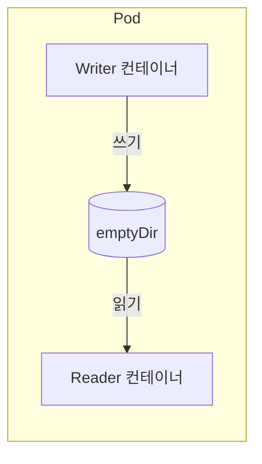
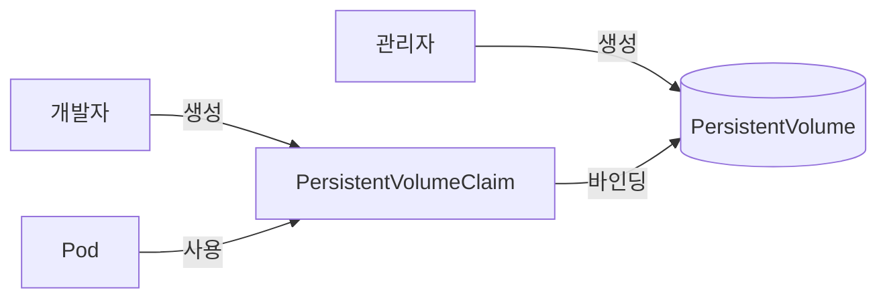
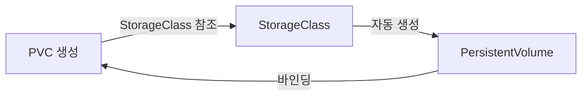

> **대상 독자**: Kubernetes에서 데이터를 영구 저장하고 싶은 백엔드 개발자
> **선수 지식**: Pod 개념
> **이 문서를 읽으면**: Volume, PersistentVolume, PersistentVolumeClaim의 개념과 사용 방법을 이해할 수 있습니다


- Pod는 기본적으로 일시적(ephemeral)이며, 종료 시 데이터가 사라집니다
- Volume을 사용하면 Pod 내 컨테이너 간 데이터를 공유할 수 있습니다
- PersistentVolume(PV)과 PersistentVolumeClaim(PVC)으로 Pod 생명주기와 독립적으로 데이터를 유지합니다


## 왜 Volume이 필요한가?

컨테이너의 파일시스템은 기본적으로 일시적입니다.

| 문제 | Volume의 해결책 |
|------|----------------|
| 컨테이너 재시작 시 데이터 손실 | Volume으로 데이터 유지 |
| 같은 Pod 내 컨테이너 간 파일 공유 불가 | 공유 Volume 마운트 |
| Pod 종료 시 모든 데이터 손실 | PersistentVolume으로 영구 저장 |

## Volume 유형 개요

Kubernetes는 다양한 Volume 유형을 제공합니다.

| 유형 | 수명 | 용도 |
|------|------|------|
| emptyDir | Pod와 동일 | 임시 파일, 캐시 |
| hostPath | 노드 수명 | 노드 로그 접근 (개발용) |
| configMap/secret | 리소스 수명 | 설정 주입 |
| PersistentVolume | 독립적 | 데이터베이스, 파일 저장 |

## emptyDir

Pod가 시작될 때 빈 디렉토리를 생성하고, Pod가 종료되면 삭제됩니다.

```yaml
apiVersion: v1
kind: Pod
metadata:
  name: shared-data
spec:
  containers:
  - name: writer
    image: busybox:1.36
    command: ['sh', '-c', 'while true; do date >> /data/log.txt; sleep 5; done']
    volumeMounts:
    - name: shared
      mountPath: /data
  - name: reader
    image: busybox:1.36
    command: ['sh', '-c', 'tail -f /data/log.txt']
    volumeMounts:
    - name: shared
      mountPath: /data
  volumes:
  - name: shared
    emptyDir: {}
```



emptyDir의 특징을 정리하면 다음과 같습니다.

| 특징 | 설명 |
|------|------|
| 수명 | Pod와 동일 (Pod 삭제 시 데이터 삭제) |
| 저장 위치 | 노드의 디스크 또는 메모리 |
| 용도 | 임시 캐시, 컨테이너 간 데이터 공유 |

메모리 기반 emptyDir:
```yaml
volumes:
- name: cache
  emptyDir:
    medium: Memory
    sizeLimit: 100Mi
```

## PersistentVolume과 PersistentVolumeClaim

Pod 생명주기와 독립적으로 데이터를 저장하려면 PV/PVC를 사용합니다.

### PV/PVC 관계



| 리소스 | 생성 주체 | 역할 |
|--------|----------|------|
| PersistentVolume (PV) | 관리자 | 실제 스토리지 리소스 |
| PersistentVolumeClaim (PVC) | 개발자 | 스토리지 요청 |

### PersistentVolume 생성

```yaml
apiVersion: v1
kind: PersistentVolume
metadata:
  name: my-pv
spec:
  capacity:
    storage: 10Gi
  accessModes:
    - ReadWriteOnce
  persistentVolumeReclaimPolicy: Retain
  hostPath:
    path: /data/pv-data
```

주요 필드를 설명합니다.

| 필드 | 설명 |
|------|------|
| capacity | 스토리지 용량 |
| accessModes | 접근 모드 |
| reclaimPolicy | PVC 삭제 시 동작 |

### Access Modes

| 모드 | 약자 | 설명 |
|------|------|------|
| ReadWriteOnce | RWO | 단일 노드에서 읽기/쓰기 |
| ReadOnlyMany | ROX | 여러 노드에서 읽기 전용 |
| ReadWriteMany | RWX | 여러 노드에서 읽기/쓰기 |

### Reclaim Policy

| 정책 | 동작 |
|------|------|
| Retain | PVC 삭제 후 PV와 데이터 유지 |
| Delete | PVC 삭제 시 PV와 스토리지 삭제 |
| Recycle | 데이터 삭제 후 재사용 (deprecated) |

### PersistentVolumeClaim 생성

```yaml
apiVersion: v1
kind: PersistentVolumeClaim
metadata:
  name: my-pvc
spec:
  accessModes:
    - ReadWriteOnce
  resources:
    requests:
      storage: 5Gi
```

PVC는 조건에 맞는 PV를 자동으로 찾아 바인딩합니다.

### Pod에서 PVC 사용

```yaml
apiVersion: v1
kind: Pod
metadata:
  name: app-with-storage
spec:
  containers:
  - name: app
    image: my-app:1.0
    volumeMounts:
    - name: data
      mountPath: /app/data
  volumes:
  - name: data
    persistentVolumeClaim:
      claimName: my-pvc
```

## StorageClass

StorageClass는 동적으로 PV를 프로비저닝합니다. PV를 미리 생성할 필요 없이 PVC 생성 시 자동으로 PV가 생성됩니다.



### StorageClass 예시

```yaml
apiVersion: storage.k8s.io/v1
kind: StorageClass
metadata:
  name: fast
provisioner: kubernetes.io/aws-ebs
parameters:
  type: gp3
reclaimPolicy: Delete
volumeBindingMode: WaitForFirstConsumer
```

클라우드별 주요 provisioner는 다음과 같습니다.

| 클라우드 | Provisioner | 스토리지 유형 |
|----------|-------------|--------------|
| AWS | kubernetes.io/aws-ebs | EBS |
| GCP | kubernetes.io/gce-pd | Persistent Disk |
| Azure | kubernetes.io/azure-disk | Azure Disk |

### PVC에서 StorageClass 사용

```yaml
apiVersion: v1
kind: PersistentVolumeClaim
metadata:
  name: fast-storage
spec:
  accessModes:
    - ReadWriteOnce
  storageClassName: fast  # StorageClass 지정
  resources:
    requests:
      storage: 20Gi
```

## 실전 예시: 데이터베이스 배포

PostgreSQL을 PVC와 함께 배포하는 예시입니다.

```yaml
# PVC
apiVersion: v1
kind: PersistentVolumeClaim
metadata:
  name: postgres-pvc
spec:
  accessModes:
    - ReadWriteOnce
  resources:
    requests:
      storage: 10Gi
---
# Deployment
apiVersion: apps/v1
kind: Deployment
metadata:
  name: postgres
spec:
  replicas: 1
  selector:
    matchLabels:
      app: postgres
  template:
    metadata:
      labels:
        app: postgres
    spec:
      containers:
      - name: postgres
        image: postgres:15
        ports:
        - containerPort: 5432
        env:
        - name: POSTGRES_PASSWORD
          valueFrom:
            secretKeyRef:
              name: postgres-secret
              key: password
        - name: PGDATA
          value: /var/lib/postgresql/data/pgdata
        volumeMounts:
        - name: postgres-data
          mountPath: /var/lib/postgresql/data
      volumes:
      - name: postgres-data
        persistentVolumeClaim:
          claimName: postgres-pvc
```


PostgreSQL은 데이터 디렉토리가 비어있어야 합니다. PVC 마운트 시 `lost+found` 디렉토리가 있을 수 있으므로 서브디렉토리(`pgdata`)를 사용합니다.


## 실습: PV/PVC 생성과 확인

### PVC 생성 및 상태 확인

```bash
# PVC 생성
kubectl apply -f pvc.yaml

# 상태 확인
kubectl get pvc
```

**예상 출력:**
```
NAME     STATUS   VOLUME       CAPACITY   ACCESS MODES   STORAGECLASS   AGE
my-pvc   Bound    pvc-xxx      5Gi        RWO            standard       10s
```

PVC 상태 설명은 다음과 같습니다.

| 상태 | 설명 |
|------|------|
| Pending | 적합한 PV를 찾는 중 |
| Bound | PV와 바인딩 완료 |
| Lost | 바인딩된 PV가 삭제됨 |

### PV 확인

```bash
kubectl get pv
```

### 데이터 영속성 테스트

```bash
# Pod 생성 및 데이터 쓰기
kubectl exec -it app-with-storage -- sh -c "echo 'test data' > /app/data/test.txt"

# Pod 삭제
kubectl delete pod app-with-storage

# Pod 재생성 후 데이터 확인
kubectl apply -f pod.yaml
kubectl exec -it app-with-storage -- cat /app/data/test.txt
# 출력: test data (데이터 유지됨)
```

## 실제 사용 시나리오

### 시나리오 1: 애플리케이션 로그 저장

여러 Pod의 로그를 중앙에서 수집하기 위해 emptyDir을 사용합니다.

```yaml
apiVersion: v1
kind: Pod
metadata:
  name: app-with-log-collector
spec:
  containers:
  - name: app
    image: my-app:1.0
    volumeMounts:
    - name: logs
      mountPath: /var/log/app
  - name: log-collector
    image: fluent/fluentd:v1.16
    volumeMounts:
    - name: logs
      mountPath: /var/log/app
      readOnly: true
  volumes:
  - name: logs
    emptyDir: {}
```

**사용 이유:** 앱 컨테이너가 로그를 파일로 생성하고, 사이드카 컨테이너가 이를 읽어 외부 시스템으로 전송합니다.

### 시나리오 2: 파일 업로드 저장소

사용자가 업로드한 파일을 영구 저장합니다.

```yaml
apiVersion: v1
kind: PersistentVolumeClaim
metadata:
  name: upload-storage
spec:
  accessModes:
    - ReadWriteOnce
  resources:
    requests:
      storage: 50Gi
---
apiVersion: apps/v1
kind: Deployment
metadata:
  name: file-server
spec:
  replicas: 1  # RWO는 단일 Pod만 가능
  selector:
    matchLabels:
      app: file-server
  template:
    metadata:
      labels:
        app: file-server
    spec:
      containers:
      - name: server
        image: nginx:1.25
        volumeMounts:
        - name: uploads
          mountPath: /usr/share/nginx/html/uploads
      volumes:
      - name: uploads
        persistentVolumeClaim:
          claimName: upload-storage
```

**주의:** `ReadWriteOnce`는 단일 노드에서만 마운트 가능합니다. 여러 Pod에서 접근하려면 NFS 같은 `ReadWriteMany` 스토리지가 필요합니다.

### 시나리오 3: 설정 파일 주입

ConfigMap의 설정 파일을 애플리케이션에 전달합니다.

```yaml
apiVersion: v1
kind: ConfigMap
metadata:
  name: nginx-config
data:
  nginx.conf: |
    server {
        listen 80;
        location / {
            root /usr/share/nginx/html;
        }
    }
---
apiVersion: v1
kind: Pod
metadata:
  name: nginx
spec:
  containers:
  - name: nginx
    image: nginx:1.25
    volumeMounts:
    - name: config
      mountPath: /etc/nginx/conf.d
  volumes:
  - name: config
    configMap:
      name: nginx-config
```

**장점:** ConfigMap 변경 시 Pod 내 파일이 자동으로 갱신됩니다 (수 분 소요).

---

## 다음 단계

Volume과 스토리지를 이해했다면 다음 단계로 진행하세요:

| 목표 | 추천 문서 |
|------|----------|
| 네트워크 설정 | [네트워킹](networking/) |
| 리소스 관리 | [리소스 관리](resources/) |
| 실제 배포 실습 | [Spring Boot 배포](../examples/spring-boot/) |
