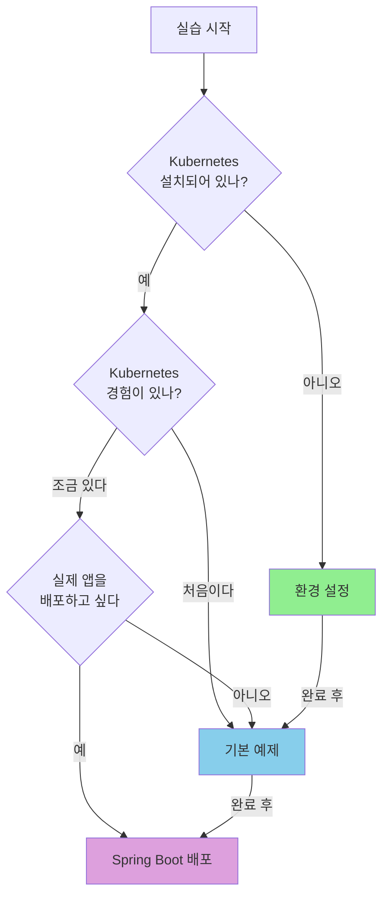

이 섹션에서는 Kubernetes의 핵심 기능들을 실제로 실행해볼 수 있는 예제들을 제공합니다. 각 예제는 독립적으로 실행할 수 있으며, 필요한 YAML 파일과 명령어를 모두 포함하고 있습니다.

## 목표별 예제 선택

**"나는 어떤 예제부터 해야 할까?"**

| 당신의 상황 | 추천 예제 | 배우는 것 |
|------------|----------|----------|
| Kubernetes가 처음이다 | [환경 설정](setup/) → [기본 예제](basic/) | 클러스터 구축, Pod/Service 기초 |
| 개념은 알지만 실습이 부족하다 | [기본 예제](basic/) | Pod, Deployment, Service 직접 실행 |
| 실제 앱을 배포하고 싶다 | [Spring Boot 배포](spring-boot/) | ConfigMap, Secret, Probe 적용 |

#### 예제 목록

| 예제 | 난이도 | 예상 시간 | 다루는 내용 |
|------|--------|----------|-------------|
| [환경 설정](setup/) | ⭐ 입문 | 30분 | Minikube, Kind 등 로컬 환경 구성 |
| [기본 예제](basic/) | ⭐⭐ 기초 | 60분 | Pod, Deployment, Service 실습 |
| [Spring Boot 배포](spring-boot/) | ⭐⭐⭐ 중급 | 90분 | 실제 애플리케이션 배포 |

#### 예제 실행 전 준비사항

모든 예제는 다음 환경이 필요합니다:

- Docker 24.x 이상
- kubectl 1.29.x 이상
- 로컬 Kubernetes 클러스터 (Minikube 또는 Kind)

환경 설정이 되어 있지 않다면 먼저 [환경 설정](setup/) 예제를 따라 진행하세요.
