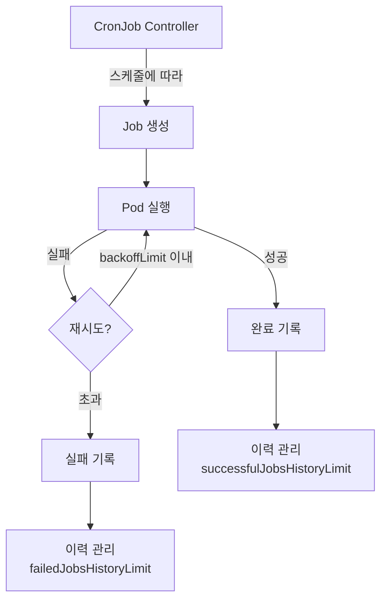
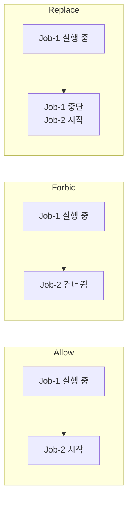

> **대상 독자**: Kubernetes에서 주기적 작업을 스케줄링하고 싶은 개발자
> **선수 지식**: Pod, Job 개념
> **이 문서를 읽으면**: CronJob으로 주기적 백업 작업을 만들고, 실행 이력과 동시 실행 정책을 관리할 수 있습니다


- CronJob으로 주기적 데이터 백업을 자동화합니다
- `successfulJobsHistoryLimit`로 실행 이력을 관리합니다
- `concurrencyPolicy`로 동시 실행을 제어합니다
- 실패 시 알림을 설정합니다


## CronJob 동작 흐름



## 사전 준비

다음이 필요합니다:

- 로컬 Kubernetes 클러스터 (Minikube 또는 Kind)
- kubectl

```bash
# 클러스터 상태 확인
kubectl cluster-info

# 네임스페이스 생성
kubectl create namespace cronjob-lab
```

## 실습 1: 기본 CronJob 만들기

매분 실행되는 간단한 CronJob을 만듭니다.

```yaml
# hello-cronjob.yaml
apiVersion: batch/v1
kind: CronJob
metadata:
  name: hello
  namespace: cronjob-lab
spec:
  schedule: "*/1 * * * *"
  jobTemplate:
    spec:
      template:
        spec:
          containers:
          - name: hello
            image: busybox:1.36
            command:
            - /bin/sh
            - -c
            - echo "Hello from CronJob! $(date)"
          restartPolicy: OnFailure
```

```bash
kubectl apply -f hello-cronjob.yaml

# CronJob 상태 확인
kubectl get cronjob hello -n cronjob-lab
```

**예상 출력:**
```
NAME    SCHEDULE      SUSPEND   ACTIVE   LAST SCHEDULE   AGE
hello   */1 * * * *   False     0        <none>          10s
```

```bash
# 1분 후 실행된 Job 확인
kubectl get jobs -n cronjob-lab

# Pod 로그 확인
kubectl logs -l job-name -n cronjob-lab --tail=5
```

## 실습 2: 데이터 백업 CronJob

MySQL 데이터를 주기적으로 백업하는 실전 예제입니다.

### ConfigMap으로 백업 스크립트 관리

```yaml
# backup-script-configmap.yaml
apiVersion: v1
kind: ConfigMap
metadata:
  name: backup-script
  namespace: cronjob-lab
data:
  backup.sh: |
    #!/bin/sh
    set -e

    TIMESTAMP=$(date +%Y%m%d-%H%M%S)
    BACKUP_FILE="/backup/db-backup-${TIMESTAMP}.sql"

    echo "[$(date)] 백업 시작..."
    mysqldump -h ${DB_HOST} -u ${DB_USER} -p${DB_PASSWORD} ${DB_NAME} > ${BACKUP_FILE}

    # 7일 이상 된 백업 삭제
    find /backup -name "*.sql" -mtime +7 -delete

    echo "[$(date)] 백업 완료: ${BACKUP_FILE}"
    ls -lh /backup/
```

### 백업 CronJob

```yaml
# db-backup-cronjob.yaml
apiVersion: batch/v1
kind: CronJob
metadata:
  name: db-backup
  namespace: cronjob-lab
spec:
  schedule: "0 2 * * *"
  concurrencyPolicy: Forbid
  successfulJobsHistoryLimit: 7
  failedJobsHistoryLimit: 3
  startingDeadlineSeconds: 300
  jobTemplate:
    spec:
      backoffLimit: 2
      activeDeadlineSeconds: 600
      template:
        spec:
          containers:
          - name: backup
            image: mysql:8.0
            command: ["/bin/sh", "/scripts/backup.sh"]
            env:
            - name: DB_HOST
              value: "mysql.default.svc.cluster.local"
            - name: DB_NAME
              value: "mydb"
            - name: DB_USER
              valueFrom:
                secretKeyRef:
                  name: db-credentials
                  key: username
            - name: DB_PASSWORD
              valueFrom:
                secretKeyRef:
                  name: db-credentials
                  key: password
            volumeMounts:
            - name: backup-storage
              mountPath: /backup
            - name: scripts
              mountPath: /scripts
            resources:
              requests:
                memory: "128Mi"
                cpu: "100m"
              limits:
                memory: "256Mi"
                cpu: "200m"
          restartPolicy: OnFailure
          volumes:
          - name: backup-storage
            persistentVolumeClaim:
              claimName: backup-pvc
          - name: scripts
            configMap:
              name: backup-script
              defaultMode: 0755
```

### 주요 필드 설명

| 필드 | 값 | 설명 |
|------|-----|------|
| `schedule` | `"0 2 * * *"` | 매일 오전 2시 실행 |
| `concurrencyPolicy` | `Forbid` | 이전 Job이 실행 중이면 새 Job 건너뜀 |
| `successfulJobsHistoryLimit` | `7` | 성공한 Job 7개까지 보관 |
| `failedJobsHistoryLimit` | `3` | 실패한 Job 3개까지 보관 |
| `startingDeadlineSeconds` | `300` | 5분 내에 시작하지 못하면 건너뜀 |
| `backoffLimit` | `2` | 실패 시 최대 2번 재시도 |
| `activeDeadlineSeconds` | `600` | 10분 내에 완료되지 않으면 종료 |

## 실습 3: 동시 실행 정책 (concurrencyPolicy)

세 가지 정책을 비교합니다.



| 정책 | 동작 | 사용 사례 |
|------|------|----------|
| `Allow` (기본) | 동시 실행 허용 | 독립적인 작업 |
| `Forbid` | 새 Job 건너뜀 | 데이터 백업, 배치 처리 |
| `Replace` | 기존 Job 중단, 새 Job 시작 | 최신 데이터만 필요한 경우 |

### 테스트: 오래 걸리는 작업으로 Forbid 확인

```yaml
# slow-cronjob.yaml
apiVersion: batch/v1
kind: CronJob
metadata:
  name: slow-job
  namespace: cronjob-lab
spec:
  schedule: "*/1 * * * *"
  concurrencyPolicy: Forbid
  jobTemplate:
    spec:
      template:
        spec:
          containers:
          - name: slow
            image: busybox:1.36
            command:
            - /bin/sh
            - -c
            - echo "시작"; sleep 90; echo "완료"
          restartPolicy: OnFailure
```

```bash
kubectl apply -f slow-cronjob.yaml

# 2분 후 확인 - 동시에 2개의 Job이 실행되지 않음
kubectl get jobs -n cronjob-lab -l job-name
```

## 실습 4: 실행 이력 관리

### 이력 확인

```bash
# CronJob의 최근 실행 확인
kubectl get cronjob hello -n cronjob-lab -o wide

# 완료된 Job 목록
kubectl get jobs -n cronjob-lab --sort-by=.metadata.creationTimestamp

# 특정 Job의 Pod 로그
JOB_NAME=$(kubectl get jobs -n cronjob-lab -o jsonpath='{.items[-1].metadata.name}')
kubectl logs -l job-name=${JOB_NAME} -n cronjob-lab
```

### 이력 제한 변경

```bash
# 성공 이력을 3개로 변경
kubectl patch cronjob hello -n cronjob-lab \
  -p '{"spec":{"successfulJobsHistoryLimit":3}}'

# 확인
kubectl get cronjob hello -n cronjob-lab -o jsonpath='{.spec.successfulJobsHistoryLimit}'
```

## 실습 5: 실패 시 알림 설정

CronJob 실패를 감지하는 모니터링 Job을 함께 구성합니다.

```yaml
# backup-monitor-cronjob.yaml
apiVersion: batch/v1
kind: CronJob
metadata:
  name: backup-monitor
  namespace: cronjob-lab
spec:
  schedule: "30 3 * * *"
  jobTemplate:
    spec:
      template:
        spec:
          containers:
          - name: monitor
            image: bitnami/kubectl:latest
            command:
            - /bin/sh
            - -c
            - |
              echo "=== 백업 Job 상태 확인 ==="

              # 최근 실패한 Job 확인
              FAILED=$(kubectl get jobs -n cronjob-lab \
                -l app=db-backup \
                --field-selector status.successful=0 \
                --no-headers 2>/dev/null | wc -l)

              if [ "$FAILED" -gt "0" ]; then
                echo "[경고] 실패한 백업 Job이 ${FAILED}개 있습니다!"
                # Slack Webhook 등으로 알림 전송
                # curl -X POST -H 'Content-type: application/json' \
                #   --data '{"text":"백업 실패 감지!"}' \
                #   ${SLACK_WEBHOOK_URL}
                exit 1
              fi

              echo "[정상] 모든 백업이 정상 완료되었습니다."
          restartPolicy: Never
          serviceAccountName: backup-monitor-sa
```

### 모니터링용 ServiceAccount 및 Role

```yaml
# backup-monitor-rbac.yaml
apiVersion: v1
kind: ServiceAccount
metadata:
  name: backup-monitor-sa
  namespace: cronjob-lab
---
apiVersion: rbac.authorization.k8s.io/v1
kind: Role
metadata:
  name: job-reader
  namespace: cronjob-lab
rules:
- apiGroups: ["batch"]
  resources: ["jobs"]
  verbs: ["get", "list"]
---
apiVersion: rbac.authorization.k8s.io/v1
kind: RoleBinding
metadata:
  name: backup-monitor-binding
  namespace: cronjob-lab
subjects:
- kind: ServiceAccount
  name: backup-monitor-sa
roleRef:
  kind: Role
  name: job-reader
  apiGroup: rbac.authorization.k8s.io
```

```bash
kubectl apply -f backup-monitor-rbac.yaml
kubectl apply -f backup-monitor-cronjob.yaml
```

## 실습 6: CronJob 일시 중지

유지보수 시 CronJob을 일시 중지할 수 있습니다.

```bash
# CronJob 일시 중지
kubectl patch cronjob hello -n cronjob-lab \
  -p '{"spec":{"suspend":true}}'

# 상태 확인 (SUSPEND=True)
kubectl get cronjob hello -n cronjob-lab

# 재개
kubectl patch cronjob hello -n cronjob-lab \
  -p '{"spec":{"suspend":false}}'
```

## 리소스 정리

```bash
# 모든 CronJob 삭제 (관련 Job, Pod도 함께 삭제)
kubectl delete cronjob --all -n cronjob-lab

# RBAC 리소스 삭제
kubectl delete -f backup-monitor-rbac.yaml

# 네임스페이스 삭제
kubectl delete namespace cronjob-lab
```

---

## 다음 단계

CronJob 실습을 완료했다면 다음 단계로 진행하세요:

| 목표 | 추천 문서 |
|------|----------|
| 상태 관리 | [StatefulSet 실습](../examples/statefulset/) |
| 접근 제어 | [RBAC 설정 실습](../examples/rbac/) |
| 문제 해결 | [Pod 트러블슈팅](../howto/pod-troubleshooting/) |
