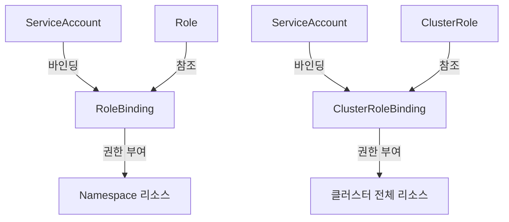

> **대상 독자**: Kubernetes 클러스터의 접근 제어를 설정하고 싶은 개발자/운영자
> **선수 지식**: Namespace, Pod, Deployment 개념
> **이 문서를 읽으면**: Role, RoleBinding, ServiceAccount를 활용한 네임스페이스별 접근 제어를 구성할 수 있습니다


- 개발팀용 제한된 권한 Role을 만듭니다
- ServiceAccount를 생성하고 Role에 바인딩합니다
- `kubectl auth can-i`로 권한을 테스트합니다
- 네임스페이스별로 접근 권한을 분리합니다


## RBAC 구조



| 리소스 | 범위 | 설명 |
|--------|------|------|
| Role | Namespace | 특정 Namespace 내 리소스 권한 |
| ClusterRole | Cluster | 클러스터 전체 리소스 권한 |
| RoleBinding | Namespace | Role/ClusterRole을 주체에 바인딩 |
| ClusterRoleBinding | Cluster | ClusterRole을 주체에 바인딩 |

## 사전 준비

다음이 필요합니다:

- 로컬 Kubernetes 클러스터 (Minikube 또는 Kind)
- kubectl (cluster-admin 권한)

```bash
# 클러스터 상태 확인
kubectl cluster-info

# 실습용 네임스페이스 생성
kubectl create namespace dev-team
kubectl create namespace staging
```

## 실습 1: 개발팀용 Role 만들기

개발팀이 `dev-team` 네임스페이스에서 Pod와 Deployment만 관리할 수 있도록 제한합니다.

### Role 생성

```yaml
# dev-role.yaml
apiVersion: rbac.authorization.k8s.io/v1
kind: Role
metadata:
  name: developer
  namespace: dev-team
rules:
- apiGroups: [""]
  resources: ["pods", "pods/log", "pods/exec"]
  verbs: ["get", "list", "watch", "create", "delete"]
- apiGroups: ["apps"]
  resources: ["deployments"]
  verbs: ["get", "list", "watch", "create", "update", "patch"]
- apiGroups: [""]
  resources: ["services"]
  verbs: ["get", "list", "watch"]
- apiGroups: [""]
  resources: ["configmaps"]
  verbs: ["get", "list"]
```

```bash
kubectl apply -f dev-role.yaml
```

### 권한 매트릭스

위 Role이 부여하는 권한을 정리합니다:

| 리소스 | get | list | watch | create | update | delete |
|--------|-----|------|-------|--------|--------|--------|
| pods | O | O | O | O | - | O |
| deployments | O | O | O | O | O | - |
| services | O | O | O | - | - | - |
| configmaps | O | O | - | - | - | - |
| secrets | - | - | - | - | - | - |

## 실습 2: ServiceAccount 생성 및 바인딩

### ServiceAccount 생성

```yaml
# dev-serviceaccount.yaml
apiVersion: v1
kind: ServiceAccount
metadata:
  name: dev-user
  namespace: dev-team
```

```bash
kubectl apply -f dev-serviceaccount.yaml
```

### RoleBinding 생성

```yaml
# dev-rolebinding.yaml
apiVersion: rbac.authorization.k8s.io/v1
kind: RoleBinding
metadata:
  name: developer-binding
  namespace: dev-team
subjects:
- kind: ServiceAccount
  name: dev-user
  namespace: dev-team
roleRef:
  kind: Role
  name: developer
  apiGroup: rbac.authorization.k8s.io
```

```bash
kubectl apply -f dev-rolebinding.yaml
```

## 실습 3: 권한 테스트

### kubectl auth can-i로 확인

```bash
# dev-user가 dev-team에서 Pod를 조회할 수 있는지 확인
kubectl auth can-i get pods \
  --namespace=dev-team \
  --as=system:serviceaccount:dev-team:dev-user
# 예상: yes

# dev-user가 dev-team에서 Secret을 조회할 수 있는지 확인
kubectl auth can-i get secrets \
  --namespace=dev-team \
  --as=system:serviceaccount:dev-team:dev-user
# 예상: no

# dev-user가 dev-team에서 Deployment를 생성할 수 있는지 확인
kubectl auth can-i create deployments \
  --namespace=dev-team \
  --as=system:serviceaccount:dev-team:dev-user
# 예상: yes

# dev-user가 staging 네임스페이스에 접근할 수 있는지 확인
kubectl auth can-i get pods \
  --namespace=staging \
  --as=system:serviceaccount:dev-team:dev-user
# 예상: no
```

### 실제 리소스로 테스트

```bash
# dev-user로 Deployment 생성 (성공해야 함)
kubectl create deployment test-nginx --image=nginx:1.25 \
  --namespace=dev-team \
  --as=system:serviceaccount:dev-team:dev-user

# 확인
kubectl get deployment test-nginx \
  --namespace=dev-team \
  --as=system:serviceaccount:dev-team:dev-user
```

**예상 출력:**
```
NAME         READY   UP-TO-DATE   AVAILABLE   AGE
test-nginx   1/1     1            1           30s
```

```bash
# dev-user로 Secret 생성 시도 (실패해야 함)
kubectl create secret generic test-secret \
  --from-literal=key=value \
  --namespace=dev-team \
  --as=system:serviceaccount:dev-team:dev-user
```

**예상 출력:**
```
Error from server (Forbidden): secrets is forbidden: User "system:serviceaccount:dev-team:dev-user" cannot create resource "secrets" in API group "" in the namespace "dev-team"
```

## 실습 4: 네임스페이스별 접근 제어

staging 네임스페이스에는 읽기 전용 권한만 부여합니다.

### 읽기 전용 Role

```yaml
# staging-readonly-role.yaml
apiVersion: rbac.authorization.k8s.io/v1
kind: Role
metadata:
  name: viewer
  namespace: staging
rules:
- apiGroups: ["", "apps", "batch"]
  resources: ["pods", "deployments", "services", "jobs", "configmaps"]
  verbs: ["get", "list", "watch"]
```

### RoleBinding

```yaml
# staging-rolebinding.yaml
apiVersion: rbac.authorization.k8s.io/v1
kind: RoleBinding
metadata:
  name: viewer-binding
  namespace: staging
subjects:
- kind: ServiceAccount
  name: dev-user
  namespace: dev-team
roleRef:
  kind: Role
  name: viewer
  apiGroup: rbac.authorization.k8s.io
```

```bash
kubectl apply -f staging-readonly-role.yaml
kubectl apply -f staging-rolebinding.yaml
```

### 교차 네임스페이스 권한 확인

```bash
# staging에서 읽기 가능
kubectl auth can-i get pods \
  --namespace=staging \
  --as=system:serviceaccount:dev-team:dev-user
# 예상: yes

# staging에서 쓰기 불가
kubectl auth can-i create deployments \
  --namespace=staging \
  --as=system:serviceaccount:dev-team:dev-user
# 예상: no
```

## 실습 5: 전체 권한 요약 확인

```bash
# dev-user의 dev-team 네임스페이스 권한 전체 확인
kubectl auth can-i --list \
  --namespace=dev-team \
  --as=system:serviceaccount:dev-team:dev-user

# dev-user의 staging 네임스페이스 권한 전체 확인
kubectl auth can-i --list \
  --namespace=staging \
  --as=system:serviceaccount:dev-team:dev-user
```

## 리소스 정리

```bash
# dev-team 리소스 삭제
kubectl delete rolebinding developer-binding -n dev-team
kubectl delete role developer -n dev-team
kubectl delete serviceaccount dev-user -n dev-team

# staging 리소스 삭제
kubectl delete rolebinding viewer-binding -n staging
kubectl delete role viewer -n staging

# 네임스페이스 삭제 (모든 리소스 포함)
kubectl delete namespace dev-team
kubectl delete namespace staging
```

---

## 다음 단계

RBAC 설정 실습을 완료했다면 다음 단계로 진행하세요:

| 목표 | 추천 문서 |
|------|----------|
| 상태 관리 | [StatefulSet 실습](../examples/statefulset/) |
| 주기적 작업 | [CronJob 실습](../examples/cronjob/) |
| 네트워크 정책 | [네트워킹](../concepts/networking/) |
