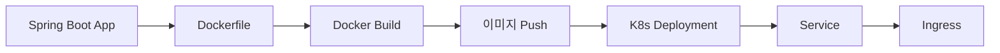

> **대상 독자**: Spring Boot 애플리케이션을 Kubernetes에 배포하고 싶은 백엔드 개발자
> **선수 지식**: Deployment, Service, ConfigMap, Docker
> **이 문서를 읽으면**: Spring Boot 앱을 컨테이너화하고 Kubernetes에 배포할 수 있습니다


- Dockerfile 작성 → 이미지 빌드 → Kubernetes 배포
- ConfigMap/Secret으로 환경별 설정 분리
- Actuator 엔드포인트로 헬스 체크 구성


## 전체 흐름



*Spring Boot 앱을 Docker 이미지로 빌드하고 Kubernetes에 Deployment, Service, Ingress로 배포하는 전체 흐름을 보여줍니다.*

## 1. Spring Boot 애플리케이션 준비

### 예제 애플리케이션 구조

```
my-app/
├── src/main/
│   ├── java/com/example/
│   │   └── MyAppApplication.java
│   └── resources/
│       └── application.yml
├── Dockerfile
├── build.gradle.kts
└── kubernetes/
    ├── deployment.yaml
    ├── service.yaml
    ├── configmap.yaml
    └── secret.yaml
```

### application.yml

```yaml
spring:
  application:
    name: my-app
  datasource:
    url: ${DATABASE_URL:jdbc:postgresql://localhost:5432/mydb}
    username: ${DATABASE_USERNAME:postgres}
    password: ${DATABASE_PASSWORD:postgres}

server:
  port: 8080

management:
  endpoints:
    web:
      exposure:
        include: health,info,prometheus
  endpoint:
    health:
      probes:
        enabled: true
  health:
    livenessState:
      enabled: true
    readinessState:
      enabled: true
```

### 간단한 컨트롤러

```java
@RestController
public class HelloController {

    @GetMapping("/")
    public String hello() {
        return "Hello from Kubernetes!";
    }

    @GetMapping("/hostname")
    public String hostname() {
        try {
            return "Pod: " + InetAddress.getLocalHost().getHostName();
        } catch (UnknownHostException e) {
            return "Unknown";
        }
    }
}
```

## 2. Docker 이미지 빌드

### Dockerfile (멀티스테이지 빌드)

```dockerfile
# 빌드 스테이지
FROM eclipse-temurin:17-jdk AS build
WORKDIR /app
COPY gradle gradle
COPY build.gradle.kts settings.gradle.kts gradlew ./
COPY src src
RUN ./gradlew bootJar --no-daemon

# 실행 스테이지
FROM eclipse-temurin:17-jre
WORKDIR /app

# 보안: non-root 사용자
RUN addgroup --system appgroup && adduser --system appuser --ingroup appgroup
USER appuser

COPY --from=build /app/build/libs/*.jar app.jar

EXPOSE 8080

ENTRYPOINT ["java", "-jar", "app.jar"]
```

### 이미지 빌드

```bash
# Docker 이미지 빌드
docker build -t my-app:1.0 .

# 로컬 테스트
docker run -p 8080:8080 my-app:1.0

# Minikube 환경에서 로컬 이미지 사용
eval $(minikube docker-env)
docker build -t my-app:1.0 .

# Kind 환경에서 로컬 이미지 사용
kind load docker-image my-app:1.0
```

## 3. Kubernetes 리소스 작성

### ConfigMap (환경 설정)

```yaml
# kubernetes/configmap.yaml
apiVersion: v1
kind: ConfigMap
metadata:
  name: my-app-config
data:
  SPRING_PROFILES_ACTIVE: "kubernetes"
  DATABASE_URL: "jdbc:postgresql://postgres-service:5432/mydb"
  JAVA_OPTS: "-Xms256m -Xmx512m"
```

### Secret (민감 정보)

```bash
# Secret 생성 (명령어)
kubectl create secret generic my-app-secret \
  --from-literal=DATABASE_USERNAME=myuser \
  --from-literal=DATABASE_PASSWORD=mypassword
```

또는 YAML로:

```yaml
# kubernetes/secret.yaml
apiVersion: v1
kind: Secret
metadata:
  name: my-app-secret
type: Opaque
stringData:
  DATABASE_USERNAME: myuser
  DATABASE_PASSWORD: mypassword
```

### Deployment

```yaml
# kubernetes/deployment.yaml
apiVersion: apps/v1
kind: Deployment
metadata:
  name: my-app
  labels:
    app: my-app
spec:
  replicas: 2
  selector:
    matchLabels:
      app: my-app
  template:
    metadata:
      labels:
        app: my-app
    spec:
      containers:
      - name: app
        image: my-app:1.0
        imagePullPolicy: IfNotPresent
        ports:
        - containerPort: 8080
        env:
        - name: JAVA_OPTS
          valueFrom:
            configMapKeyRef:
              name: my-app-config
              key: JAVA_OPTS
        envFrom:
        - configMapRef:
            name: my-app-config
        - secretRef:
            name: my-app-secret
        resources:
          requests:
            memory: "512Mi"
            cpu: "250m"
          limits:
            memory: "1Gi"
            cpu: "1000m"
        startupProbe:
          httpGet:
            path: /actuator/health/liveness
            port: 8080
          initialDelaySeconds: 30
          periodSeconds: 10
          failureThreshold: 30
        livenessProbe:
          httpGet:
            path: /actuator/health/liveness
            port: 8080
          periodSeconds: 10
          failureThreshold: 3
        readinessProbe:
          httpGet:
            path: /actuator/health/readiness
            port: 8080
          periodSeconds: 5
          failureThreshold: 3
```

### Service

```yaml
# kubernetes/service.yaml
apiVersion: v1
kind: Service
metadata:
  name: my-app
spec:
  type: ClusterIP
  selector:
    app: my-app
  ports:
  - port: 80
    targetPort: 8080
```

## 4. 배포

### 리소스 배포

```bash
# 네임스페이스 생성 (선택)
kubectl create namespace my-app

# 리소스 배포
kubectl apply -f kubernetes/configmap.yaml
kubectl apply -f kubernetes/secret.yaml
kubectl apply -f kubernetes/deployment.yaml
kubectl apply -f kubernetes/service.yaml

# 또는 디렉토리 전체 배포
kubectl apply -f kubernetes/
```

### 배포 확인

```bash
# Deployment 상태
kubectl get deployment my-app

# Pod 상태
kubectl get pods -l app=my-app

# 롤아웃 상태
kubectl rollout status deployment/my-app

# 로그 확인
kubectl logs -l app=my-app --tail=100 -f
```

### 서비스 테스트

```bash
# 클러스터 내부에서 테스트
kubectl run test --image=busybox:1.36 --rm -it --restart=Never \
  -- wget -qO- http://my-app

# 포트 포워딩
kubectl port-forward service/my-app 8080:80

# 브라우저에서 접근: http://localhost:8080
```

## 5. 업데이트와 롤백

### 이미지 업데이트

```bash
# 새 버전 빌드
docker build -t my-app:2.0 .

# 이미지 업데이트
kubectl set image deployment/my-app app=my-app:2.0

# 롤아웃 확인
kubectl rollout status deployment/my-app
```

### 롤백

```bash
# 히스토리 확인
kubectl rollout history deployment/my-app

# 롤백
kubectl rollout undo deployment/my-app
```

## 6. Ingress 설정 (선택)

외부에서 도메인으로 접근하려면 Ingress를 설정합니다.

```yaml
# kubernetes/ingress.yaml
apiVersion: networking.k8s.io/v1
kind: Ingress
metadata:
  name: my-app
  annotations:
    nginx.ingress.kubernetes.io/rewrite-target: /
spec:
  ingressClassName: nginx
  rules:
  - host: my-app.local
    http:
      paths:
      - path: /
        pathType: Prefix
        backend:
          service:
            name: my-app
            port:
              number: 80
```

```bash
# Minikube에서 Ingress 활성화
minikube addons enable ingress

# /etc/hosts에 추가
echo "$(minikube ip) my-app.local" | sudo tee -a /etc/hosts

# 접근 테스트
curl http://my-app.local
```

## 트러블슈팅

### Pod가 시작되지 않음

```bash
# 이벤트 확인
kubectl describe pod <pod-name>

# 로그 확인
kubectl logs <pod-name>

# 이전 컨테이너 로그 (재시작된 경우)
kubectl logs <pod-name> --previous
```

### 일반적인 문제와 해결

| 문제 | 원인 | 해결 |
|------|------|------|
| ImagePullBackOff | 이미지를 찾을 수 없음 | 이미지 이름/태그 확인, 로컬 이미지 로드 |
| CrashLoopBackOff | 애플리케이션 시작 실패 | 로그 확인, 환경 변수 확인 |
| Pending | 리소스 부족 | 노드 리소스 확인, requests 조정 |
| ReadinessProbe 실패 | 엔드포인트 준비 안 됨 | Actuator 설정 확인, 경로 확인 |

---

## 다음 단계

Spring Boot 배포를 완료했다면 다음 단계로 진행하세요:

| 목표 | 추천 문서 |
|------|----------|
| 문제 해결 | [Pod 트러블슈팅](../howto/pod-troubleshooting/) |
| 자동 스케일링 | [스케일링](../concepts/scaling/) |
| 리소스 최적화 | [리소스 최적화](../howto/resource-optimization/) |
