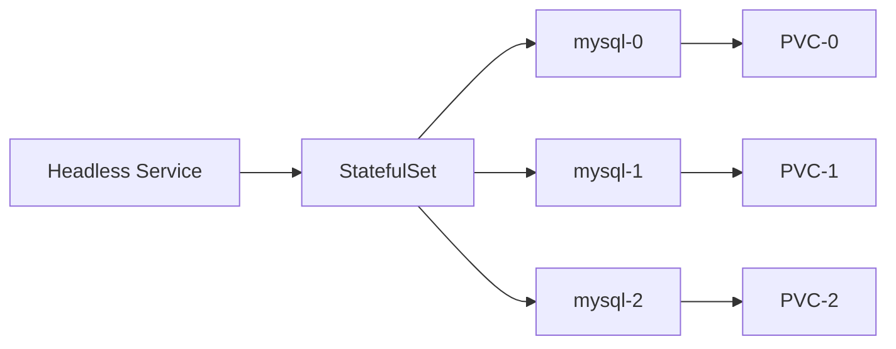

> **대상 독자**: 상태를 유지해야 하는 애플리케이션을 Kubernetes에 배포하고 싶은 개발자
> **선수 지식**: Deployment, Service, PersistentVolume 개념
> **이 문서를 읽으면**: StatefulSet으로 MySQL을 배포하고 데이터 영속성을 검증할 수 있습니다


- StatefulSet으로 MySQL을 배포합니다
- Headless Service로 개별 Pod에 접근합니다
- PersistentVolumeClaim 템플릿으로 데이터를 영속화합니다
- 스케일 업/다운 시 데이터 보존을 확인합니다


## 전체 흐름



## 사전 준비

다음이 필요합니다:

- 로컬 Kubernetes 클러스터 (Minikube 또는 Kind)
- kubectl
- 최소 2GB 가용 메모리

```bash
# 클러스터 상태 확인
kubectl cluster-info

# 네임스페이스 생성
kubectl create namespace statefulset-lab
```

## StatefulSet vs Deployment

StatefulSet은 다음과 같은 특성이 필요한 워크로드에 사용합니다:

| 특성 | Deployment | StatefulSet |
|------|-----------|-------------|
| Pod 이름 | 랜덤 해시 | 순서 인덱스 (0, 1, 2...) |
| 생성/삭제 순서 | 무작위 | 순서 보장 |
| 네트워크 ID | 없음 | 안정적 (Headless Service) |
| 스토리지 | 공유 가능 | Pod별 고유 PVC |

## 실습 1: Headless Service 생성

StatefulSet은 Headless Service가 필요합니다. `clusterIP: None`으로 설정합니다.

```yaml
# mysql-headless-service.yaml
apiVersion: v1
kind: Service
metadata:
  name: mysql
  namespace: statefulset-lab
  labels:
    app: mysql
spec:
  clusterIP: None
  selector:
    app: mysql
  ports:
  - port: 3306
    targetPort: 3306
```

```bash
kubectl apply -f mysql-headless-service.yaml
```

Headless Service를 통해 각 Pod에 `mysql-0.mysql.statefulset-lab.svc.cluster.local` 형태로 접근할 수 있습니다.

## 실습 2: Secret 생성

MySQL 루트 비밀번호를 Secret으로 관리합니다.

```yaml
# mysql-secret.yaml
apiVersion: v1
kind: Secret
metadata:
  name: mysql-secret
  namespace: statefulset-lab
type: Opaque
stringData:
  MYSQL_ROOT_PASSWORD: rootpassword
  MYSQL_DATABASE: testdb
```

```bash
kubectl apply -f mysql-secret.yaml
```

## 실습 3: StatefulSet 배포

### StatefulSet 생성

```yaml
# mysql-statefulset.yaml
apiVersion: apps/v1
kind: StatefulSet
metadata:
  name: mysql
  namespace: statefulset-lab
spec:
  serviceName: mysql
  replicas: 3
  selector:
    matchLabels:
      app: mysql
  template:
    metadata:
      labels:
        app: mysql
    spec:
      containers:
      - name: mysql
        image: mysql:8.0
        ports:
        - containerPort: 3306
        envFrom:
        - secretRef:
            name: mysql-secret
        resources:
          requests:
            memory: "256Mi"
            cpu: "250m"
          limits:
            memory: "512Mi"
            cpu: "500m"
        volumeMounts:
        - name: mysql-data
          mountPath: /var/lib/mysql
        readinessProbe:
          exec:
            command:
            - mysqladmin
            - ping
            - -h
            - localhost
          initialDelaySeconds: 30
          periodSeconds: 10
        livenessProbe:
          exec:
            command:
            - mysqladmin
            - ping
            - -h
            - localhost
          initialDelaySeconds: 60
          periodSeconds: 15
  volumeClaimTemplates:
  - metadata:
      name: mysql-data
    spec:
      accessModes:
      - ReadWriteOnce
      resources:
        requests:
          storage: 1Gi
```

```bash
kubectl apply -f mysql-statefulset.yaml

# Pod가 순서대로 생성되는 것 확인
kubectl get pods -n statefulset-lab -l app=mysql -w
```

**예상 출력:**
```
NAME      READY   STATUS    RESTARTS   AGE
mysql-0   1/1     Running   0          60s
mysql-1   1/1     Running   0          45s
mysql-2   1/1     Running   0          30s
```

### PVC 확인

```bash
# 각 Pod에 고유한 PVC가 생성됨
kubectl get pvc -n statefulset-lab
```

**예상 출력:**
```
NAME                 STATUS   VOLUME       CAPACITY   ACCESS MODES   AGE
mysql-data-mysql-0   Bound    pv-xxx       1Gi        RWO            2m
mysql-data-mysql-1   Bound    pv-yyy       1Gi        RWO            90s
mysql-data-mysql-2   Bound    pv-zzz       1Gi        RWO            60s
```

## 실습 4: 데이터 영속성 검증

### 데이터 삽입

```bash
# mysql-0에 접속하여 데이터 삽입
kubectl exec -n statefulset-lab mysql-0 -it -- mysql -uroot -prootpassword -e "
  USE testdb;
  CREATE TABLE messages (id INT AUTO_INCREMENT PRIMARY KEY, content VARCHAR(255));
  INSERT INTO messages (content) VALUES ('Hello from mysql-0');
  SELECT * FROM messages;
"
```

### Pod 재시작 후 데이터 확인

```bash
# Pod 삭제 (StatefulSet이 자동 재생성)
kubectl delete pod mysql-0 -n statefulset-lab

# Pod가 다시 Running 상태가 될 때까지 대기
kubectl wait --for=condition=ready pod/mysql-0 -n statefulset-lab --timeout=120s

# 데이터가 보존되었는지 확인
kubectl exec -n statefulset-lab mysql-0 -it -- mysql -uroot -prootpassword -e "
  USE testdb;
  SELECT * FROM messages;
"
```

데이터가 그대로 유지되는 것을 확인할 수 있습니다. PVC가 Pod와 독립적으로 존재하기 때문입니다.

## 실습 5: 개별 Pod DNS 접근

```bash
# 임시 Pod에서 각 MySQL 인스턴스에 DNS로 접근
kubectl run dns-test -n statefulset-lab --image=busybox:1.36 --rm -it --restart=Never \
  -- nslookup mysql-0.mysql.statefulset-lab.svc.cluster.local

kubectl run dns-test -n statefulset-lab --image=busybox:1.36 --rm -it --restart=Never \
  -- nslookup mysql-1.mysql.statefulset-lab.svc.cluster.local
```

## 실습 6: 스케일 업/다운

### 스케일 다운

```bash
# 3개에서 2개로 스케일 다운
kubectl scale statefulset mysql -n statefulset-lab --replicas=2

# mysql-2가 가장 먼저 삭제됨 (역순)
kubectl get pods -n statefulset-lab -l app=mysql -w
```


스케일 다운해도 PVC는 삭제되지 않습니다. 다시 스케일 업하면 기존 PVC가 재연결됩니다.


### PVC 확인

```bash
# mysql-2의 PVC가 여전히 존재
kubectl get pvc -n statefulset-lab
```

### 스케일 업

```bash
# 다시 3개로 스케일 업
kubectl scale statefulset mysql -n statefulset-lab --replicas=3

# mysql-2가 기존 PVC를 다시 사용
kubectl get pods -n statefulset-lab -l app=mysql -w
```

## 리소스 정리

```bash
# StatefulSet 삭제
kubectl delete statefulset mysql -n statefulset-lab

# PVC는 수동으로 삭제해야 함
kubectl delete pvc -l app=mysql -n statefulset-lab

# Service, Secret 삭제
kubectl delete service mysql -n statefulset-lab
kubectl delete secret mysql-secret -n statefulset-lab

# 네임스페이스 삭제 (모든 리소스 포함)
kubectl delete namespace statefulset-lab
```

---

## 다음 단계

StatefulSet 실습을 완료했다면 다음 단계로 진행하세요:

| 목표 | 추천 문서 |
|------|----------|
| 접근 제어 | [RBAC 설정 실습](rbac/) |
| 주기적 작업 | [CronJob 실습](cronjob/) |
| 리소스 관리 | [리소스 관리](../concepts/resources/) |
