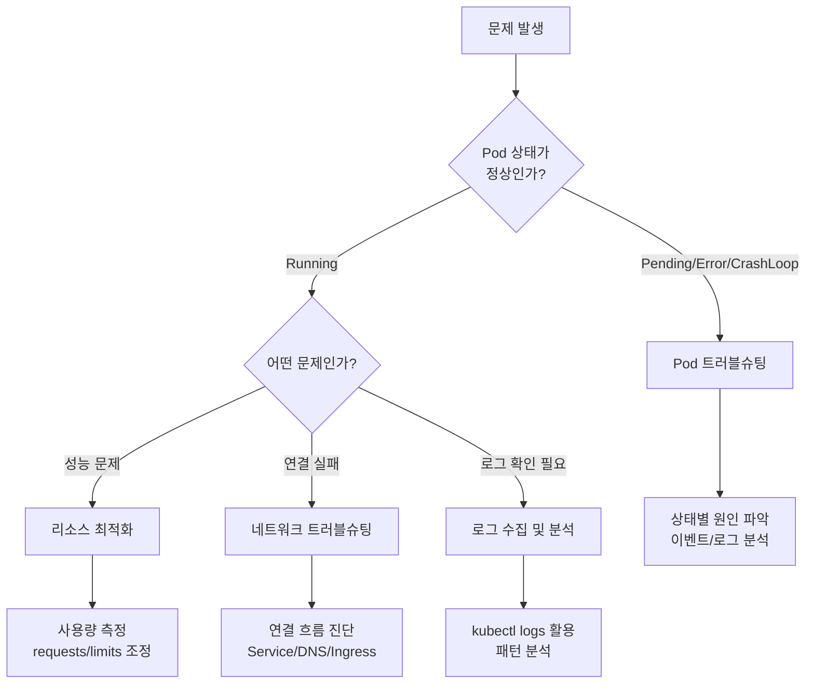

이 섹션에서는 Kubernetes 운영 중 마주치는 특정 문제를 해결하기 위한 단계별 가이드를 제공합니다. 각 가이드는 명확한 목표와 함께 구체적인 해결 방법을 제시합니다.

## 문제 상황별 가이드 선택

어떤 가이드를 봐야 할지 모르겠다면, 아래 플로차트를 따라가세요.

*문제 유형(Pod 상태, 성능, 연결, 로그)에 따라 적합한 트러블슈팅 가이드를 선택하는 흐름을 보여줍니다.*

| 증상 | 추천 가이드 |
|------|------------|
| Pod가 시작 안 됨, CrashLoopBackOff | [Pod 트러블슈팅](pod-troubleshooting/) |
| 느린 응답, OOMKilled, CPU 스로틀링 | [리소스 최적화](resource-optimization/) |
| Service/Ingress 연결 실패, DNS 오류 | [네트워크 트러블슈팅](network-troubleshooting/) |
| 오류 원인 파악, 로그 분석 | [로그 수집 및 분석](logging-guide/) |

## 가이드 목록

| 가이드 | 상황 | 예상 시간 |
|--------|------|----------|
| [Pod 트러블슈팅](pod-troubleshooting/) | Pod가 시작되지 않거나 비정상 종료될 때 | 30분 |
| [리소스 최적화](resource-optimization/) | 적절한 CPU/메모리 설정을 찾고 싶을 때 | 45분 |
| [네트워크 트러블슈팅](network-troubleshooting/) | Service나 Ingress가 연결되지 않을 때 | 30분 |
| [로그 수집 및 분석](logging-guide/) | 효과적으로 로그를 수집하고 분석할 때 | 25분 |
| [ArgoCD 설치 및 설정](argocd-setup/) | ArgoCD를 설치하고 프로덕션 설정을 구성할 때 | 40분 |

## How-To Guide 사용법

1. 현재 겪고 있는 문제와 일치하는 가이드를 선택하세요
2. **시작하기 전에** 섹션에서 전제 조건을 확인하세요
3. 단계별 지침을 순서대로 따라가세요
4. 각 단계의 **성공 확인** 항목으로 진행 상황을 확인하세요
5. 문제가 해결되지 않으면 **자주 발생하는 오류** 섹션을 참조하세요
