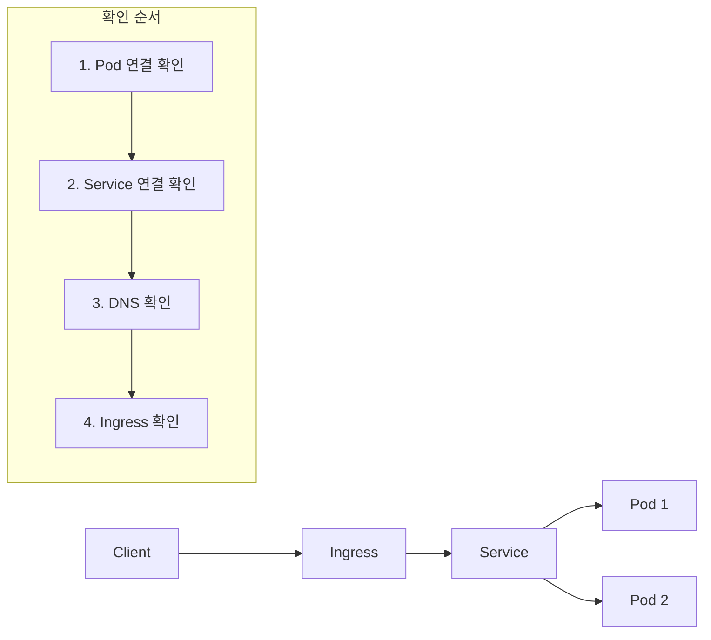

> **목표**: Service나 Ingress가 연결되지 않을 때 원인을 파악하고 해결합니다
> **예상 시간**: 30분


**다루는 내용**: Service 연결 문제, DNS 문제, Ingress 라우팅 문제

**다루지 않는 내용**: Pod 시작 문제([Pod 트러블슈팅](pod-troubleshooting/) 참조), 외부 네트워크 방화벽 설정


## 시작하기 전에

다음 조건을 확인하세요.

### 1. kubectl 설치 및 클러스터 접근 확인

```bash
kubectl cluster-info
```

**성공 시 출력:**
```
Kubernetes control plane is running at https://xxx.xxx.xxx.xxx
CoreDNS is running at https://xxx.xxx.xxx.xxx/api/v1/namespaces/kube-system/services/kube-dns:dns/proxy
```

### 2. Pod 상태 확인

연결하려는 대상 Pod가 Running 상태인지 확인하세요.

```bash
kubectl get pods -l app=<your-app>
```

**성공 시 출력:**
```
NAME                     READY   STATUS    RESTARTS   AGE
my-app-xxx-yyy           1/1     Running   0          5m
```


먼저 [Pod 트러블슈팅](pod-troubleshooting/)을 참조하여 Pod 문제를 해결하세요.


### 3. 테스트 Pod 준비

네트워크 진단을 위한 임시 Pod를 생성하세요.

```bash
kubectl run netshoot --rm -it --image=nicolaka/netshoot -- /bin/bash
```


netshoot은 curl, nslookup, dig, tcpdump 등 네트워크 진단 도구가 포함된 이미지입니다.


---

## 네트워크 연결 흐름 이해

문제 해결 전에 Kubernetes 네트워크 흐름을 이해하세요.



---

## 1단계: Pod 직접 연결 확인

Service를 거치지 않고 Pod에 직접 연결이 가능한지 확인하세요.

### Pod IP 확인

```bash
kubectl get pod <pod-name> -o wide
```

**예상 출력:**
```
NAME           READY   STATUS    IP           NODE
my-app-xxx     1/1     Running   10.244.1.5   node-1
```

### Pod에 직접 연결 테스트

```bash
kubectl exec netshoot -- curl -s http://10.244.1.5:8080/health
```

**성공 시 출력:**
```json
{"status":"UP"}
```

### 연결 실패 시

| 증상 | 가능한 원인 | 해결 방법 |
|------|------------|----------|
| Connection refused | 애플리케이션이 해당 포트에서 리스닝하지 않음 | 컨테이너 포트 설정 확인 |
| Connection timeout | 네트워크 정책이 트래픽 차단 | NetworkPolicy 확인 |
| No route to host | Pod가 다른 노드에 있고 CNI 문제 | CNI 플러그인 상태 확인 |

**성공 확인:** Pod IP로 직접 연결이 성공하면 다음 단계로 진행하세요.

---

## 2단계: Service 연결 확인

### Service 상태 확인

```bash
kubectl get svc <service-name>
```

**예상 출력:**
```
NAME       TYPE        CLUSTER-IP      EXTERNAL-IP   PORT(S)    AGE
my-app     ClusterIP   10.96.123.45    <none>        80/TCP     5m
```

### Endpoints 확인

Service가 Pod와 연결되어 있는지 확인하세요.

```bash
kubectl get endpoints <service-name>
```

**정상 출력:**
```
NAME       ENDPOINTS                       AGE
my-app     10.244.1.5:8080,10.244.2.3:8080 5m
```


```
NAME       ENDPOINTS   AGE
my-app     <none>      5m
```
이 경우 Service selector와 Pod label이 일치하지 않습니다.


### Selector 불일치 해결

**Service selector 확인:**
```bash
kubectl get svc <service-name> -o jsonpath='{.spec.selector}'
```

**예상 출력:**
```json
{"app":"my-app"}
```

**Pod label 확인:**
```bash
kubectl get pods --show-labels | grep my-app
```

selector와 label이 일치하는지 확인하고, 불일치하면 수정하세요.

### Service ClusterIP로 연결 테스트

```bash
kubectl exec netshoot -- curl -s http://10.96.123.45:80/health
```

**성공 확인:** Service ClusterIP로 연결이 성공하면 다음 단계로 진행하세요.

---

## 3단계: DNS 확인

### Service DNS 이름으로 연결 테스트

```bash
kubectl exec netshoot -- curl -s http://<service-name>.<namespace>.svc.cluster.local:80/health
```

또는 같은 네임스페이스에서는 다음과 같이 실행하세요.

```bash
kubectl exec netshoot -- curl -s http://<service-name>:80/health
```

### DNS 해석 확인

```bash
kubectl exec netshoot -- nslookup <service-name>.<namespace>.svc.cluster.local
```

**정상 출력:**
```
Server:    10.96.0.10
Address:   10.96.0.10:53

Name:   my-app.default.svc.cluster.local
Address: 10.96.123.45
```

### DNS 실패 시

**CoreDNS 상태 확인:**
```bash
kubectl get pods -n kube-system -l k8s-app=kube-dns
```

**정상 출력:**
```
NAME                       READY   STATUS    RESTARTS   AGE
coredns-xxx-yyy            1/1     Running   0          1d
coredns-xxx-zzz            1/1     Running   0          1d
```

**CoreDNS 로그 확인:**
```bash
kubectl logs -n kube-system -l k8s-app=kube-dns --tail=50
```

**성공 확인:** DNS 해석이 성공하면 다음 단계로 진행하세요.

---

## 4단계: Ingress 확인

Ingress를 사용하는 경우에만 이 단계를 진행하세요.

### Ingress 상태 확인

```bash
kubectl get ingress <ingress-name>
```

**예상 출력:**
```
NAME       CLASS   HOSTS              ADDRESS        PORTS   AGE
my-app     nginx   my-app.example.com 203.0.113.10   80      5m
```


Ingress Controller가 설치되지 않았거나 정상 작동하지 않습니다.


### Ingress Controller 확인

```bash
kubectl get pods -n ingress-nginx
```

**정상 출력:**
```
NAME                                       READY   STATUS    RESTARTS   AGE
ingress-nginx-controller-xxx-yyy           1/1     Running   0          1d
```

### Ingress 규칙 확인

```bash
kubectl describe ingress <ingress-name>
```

**확인 사항:**
- Host가 올바른지
- Path가 올바른지
- Backend Service와 Port가 올바른지

### Ingress 연결 테스트

클러스터 외부에서 테스트하세요.

```bash
curl -H "Host: my-app.example.com" http://<ingress-address>/health
```

**성공 확인:** Ingress를 통한 연결이 성공하면 문제 해결 완료입니다.

---

## 자주 발생하는 오류

### "Connection refused"

**원인 1:** 애플리케이션이 올바른 포트에서 리스닝하지 않음

**해결:**
```bash
# Pod 내부에서 리스닝 포트 확인
kubectl exec <pod-name> -- netstat -tlnp
# 또는
kubectl exec <pod-name> -- ss -tlnp
```

**원인 2:** containerPort와 Service targetPort 불일치

**해결:**
```bash
# Service targetPort 확인
kubectl get svc <service-name> -o jsonpath='{.spec.ports[0].targetPort}'

# 컨테이너 포트 확인
kubectl get pod <pod-name> -o jsonpath='{.spec.containers[0].ports[0].containerPort}'
```

두 값이 일치하는지 확인하세요.

### "No endpoints available"

**원인:** Service selector와 Pod label 불일치

**해결:**
```bash
# Service selector
kubectl get svc <service-name> -o jsonpath='{.spec.selector}'

# Pod labels
kubectl get pod <pod-name> -o jsonpath='{.metadata.labels}'
```

selector의 모든 키-값이 Pod label에 존재해야 합니다.

### "Name or service not known" (DNS 실패)

**원인:** CoreDNS가 정상 작동하지 않음

**해결:**
```bash
# CoreDNS 재시작
kubectl rollout restart deployment coredns -n kube-system

# 상태 확인
kubectl rollout status deployment coredns -n kube-system
```

### "504 Gateway Timeout" (Ingress)

**원인:** Backend Service로 연결 시간 초과

**해결:**
1. Service와 Pod 연결 상태 확인 (2단계 반복)
2. Ingress annotation에서 timeout 설정 확인

```yaml
metadata:
  annotations:
    nginx.ingress.kubernetes.io/proxy-connect-timeout: "60"
    nginx.ingress.kubernetes.io/proxy-read-timeout: "60"
```

### "503 Service Unavailable" (Ingress)

**원인:** Backend에 healthy한 Pod가 없음

**해결:**
```bash
# Pod Readiness 확인
kubectl get pods -l app=<your-app>

# Endpoints 확인
kubectl get endpoints <service-name>
```

---

## NetworkPolicy 확인

NetworkPolicy가 트래픽을 차단하고 있을 수 있습니다.

### 적용된 NetworkPolicy 확인

```bash
kubectl get networkpolicy -A
```

### 특정 Pod에 영향을 주는 정책 확인

```bash
kubectl describe networkpolicy <policy-name> -n <namespace>
```

### 임시 테스트: 모든 트래픽 허용

```yaml
# allow-all-test.yaml
apiVersion: networking.k8s.io/v1
kind: NetworkPolicy
metadata:
  name: allow-all-test
spec:
  podSelector: {}
  policyTypes:
  - Ingress
  - Egress
  ingress:
  - {}
  egress:
  - {}
```


테스트 후 반드시 삭제하세요.
```bash
kubectl delete networkpolicy allow-all-test
```


---

## 환경별 참고사항



```bash
# Minikube에서 Service 접근
minikube service <service-name> --url

# Ingress addon 활성화
minikube addons enable ingress

# Ingress IP 확인
minikube ip
```


```bash
# LoadBalancer Service의 외부 주소 확인
kubectl get svc <service-name> -o jsonpath='{.status.loadBalancer.ingress[0].hostname}'

# Security Group 확인 필요
# AWS Console에서 노드의 Security Group 규칙 확인
```


```bash
# LoadBalancer Service의 외부 IP
kubectl get svc <service-name> -o jsonpath='{.status.loadBalancer.ingress[0].ip}'

# Firewall 규칙 확인
gcloud compute firewall-rules list
```



---

## 체크리스트

### Pod 연결
- [ ] Pod가 Running 상태인가?
- [ ] Pod IP로 직접 연결이 가능한가?
- [ ] 애플리케이션이 올바른 포트에서 리스닝하는가?

### Service 연결
- [ ] Service의 Endpoints가 존재하는가?
- [ ] Service selector와 Pod label이 일치하는가?
- [ ] Service ClusterIP로 연결이 가능한가?

### DNS
- [ ] CoreDNS Pod가 Running 상태인가?
- [ ] Service DNS 이름으로 해석이 가능한가?

### Ingress (사용 시)
- [ ] Ingress Controller가 Running 상태인가?
- [ ] Ingress에 ADDRESS가 할당되었는가?
- [ ] Host와 Path 설정이 올바른가?

### NetworkPolicy
- [ ] NetworkPolicy가 트래픽을 차단하고 있지 않은가?

---

## 다음 단계

| 목표 | 추천 문서 |
|------|----------|
| Pod 문제 해결 | [Pod 트러블슈팅](pod-troubleshooting/) |
| 네트워킹 개념 | [네트워킹]() |
| Service 개념 | [Service]() |
| 로그 분석 | [로그 수집 및 분석](logging-guide/) |
